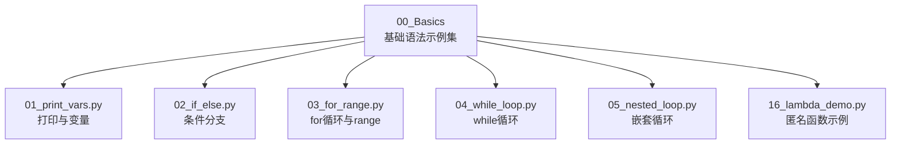
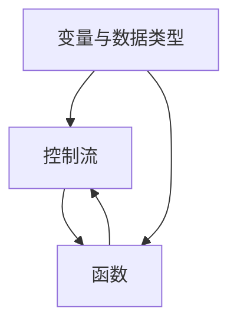
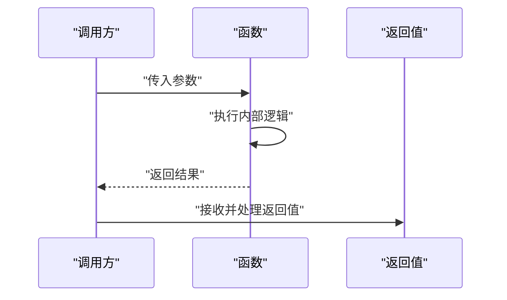
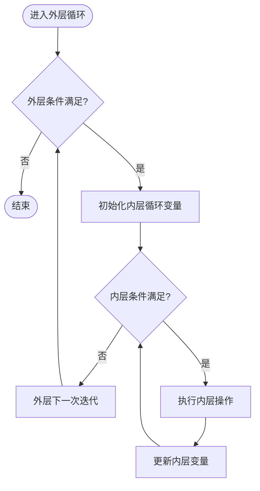
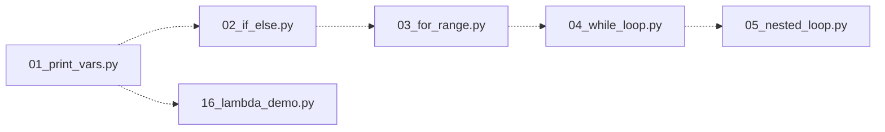

# Python基础语法

<cite>
**本文引用的文件**   
- [01_print_vars.py](file://00_Basics/01_print_vars.py)
- [02_if_else.py](file://00_Basics/02_if_else.py)
- [03_for_range.py](file://00_Basics/03_for_range.py)
- [04_while_loop.py](file://00_Basics/04_while_loop.py)
- [05_nested_loop.py](file://00_Basics/05_nested_loop.py)
- [16_lambda_demo.py](file://00_Basics/16_lambda_demo.py)
</cite>

## 目录
1. [简介](#简介)
2. [项目结构](#项目结构)
3. [核心组件](#核心组件)
4. [架构总览](#架构总览)
5. [详细组件分析](#详细组件分析)
6. [依赖关系分析](#依赖关系分析)
7. [性能与可读性建议](#性能与可读性建议)
8. [故障排查指南](#故障排查指南)
9. [结论](#结论)
10. [附录：练习与最佳实践](#附录练习与最佳实践)

## 简介
本学习文档围绕Python基础语法展开，聚焦变量声明与赋值、基本数据类型（整数、浮点数、字符串、布尔值）、控制流（条件判断、for/while循环、嵌套循环）以及函数（定义、参数传递、返回值）。内容以仓库中的示例脚本为依据，通过“概念—流程—示例路径—常见问题—调试技巧”的结构帮助初学者建立扎实的基础。

## 项目结构
本项目采用按主题划分的示例脚本组织方式，每个脚本演示一个或一组相关语法点，便于循序渐进地学习与对照。

图表来源
- [01_print_vars.py](file://00_Basics/01_print_vars.py)
- [02_if_else.py](file://00_Basics/02_if_else.py)
- [03_for_range.py](file://00_Basics/03_for_range.py)
- [04_while_loop.py](file://00_Basics/04_while_loop.py)
- [05_nested_loop.py](file://00_Basics/05_nested_loop.py)
- [16_lambda_demo.py](file://00_Basics/16_lambda_demo.py)

章节来源
- [01_print_vars.py](file://00_Basics/01_print_vars.py)
- [02_if_else.py](file://00_Basics/02_if_else.py)
- [03_for_range.py](file://00_Basics/03_for_range.py)
- [04_while_loop.py](file://00_Basics/04_while_loop.py)
- [05_nested_loop.py](file://00_Basics/05_nested_loop.py)
- [16_lambda_demo.py](file://00_Basics/16_lambda_demo.py)

## 核心组件
本节从“变量与类型”“控制流”“函数”三个维度梳理基础语法要点，并给出对应示例文件的参考路径，便于快速定位与实践。

- 变量声明与赋值
  - 要点：动态类型、命名规范、多变量赋值、不可变类型的重新绑定。
  - 示例路径：[01_print_vars.py](file://00_Basics/01_print_vars.py)

- 基本数据类型
  - 整数与浮点数：算术运算、整除、取模、幂运算、类型转换。
  - 字符串：拼接、格式化、常用方法（查找、替换、分割等）。
  - 布尔值：逻辑运算、真值表、短路求值。
  - 示例路径：[01_print_vars.py](file://00_Basics/01_print_vars.py)

- 控制流
  - 条件判断：if/elif/else、比较与逻辑运算符组合。
  - for循环：遍历序列、range生成器、break/continue。
  - while循环：基于条件的重复执行、终止条件设计。
  - 嵌套循环：外层与内层变量的作用域与退出策略。
  - 示例路径：
    - [02_if_else.py](file://00_Basics/02_if_else.py)
    - [03_for_range.py](file://00_Basics/03_for_range.py)
    - [04_while_loop.py](file://00_Basics/04_while_loop.py)
    - [05_nested_loop.py](file://00_Basics/05_nested_loop.py)

- 函数
  - 定义与调用：def关键字、形参与实参、默认参数、关键字参数。
  - 返回值：return语句、无返回值的隐式None、多返回值（元组）。
  - 高阶用法：lambda表达式（匿名函数），常用于简单的一次性函数。
  - 示例路径：
    - [16_lambda_demo.py](file://00_Basics/16_lambda_demo.py)

章节来源
- [01_print_vars.py](file://00_Basics/01_print_vars.py)
- [02_if_else.py](file://00_Basics/02_if_else.py)
- [03_for_range.py](file://00_Basics/03_for_range.py)
- [04_while_loop.py](file://00_Basics/04_while_loop.py)
- [05_nested_loop.py](file://00_Basics/05_nested_loop.py)
- [16_lambda_demo.py](file://00_Basics/16_lambda_demo.py)

## 架构总览
下图展示了基础语法的知识模块及其相互关系：变量与类型是数据载体，控制流决定程序走向，函数封装可复用逻辑；三者共同构成Python程序的骨架。

图表来源
- [01_print_vars.py](file://00_Basics/01_print_vars.py)
- [02_if_else.py](file://00_Basics/02_if_else.py)
- [03_for_range.py](file://00_Basics/03_for_range.py)
- [04_while_loop.py](file://00_Basics/04_while_loop.py)
- [05_nested_loop.py](file://00_Basics/05_nested_loop.py)
- [16_lambda_demo.py](file://00_Basics/16_lambda_demo.py)

## 详细组件分析

### 变量与基本数据类型
- 关键概念
  - 动态类型：变量名在运行时绑定到对象，无需显式声明类型。
  - 不可变性：整数、浮点数、字符串、布尔值为不可变类型，修改会创建新对象。
  - 类型转换：int()/float()/str()/bool()用于显式转换。
- 常见错误模式
  - 使用未定义的变量导致NameError。
  - 对不可变类型进行原地修改引发TypeError。
  - 字符串与数字直接拼接导致TypeError。
- 调试技巧
  - 使用print输出中间结果，确认变量当前类型与值。
  - 使用type()检查对象类型，辅助定位类型不匹配问题。
- 示例路径
  - [01_print_vars.py](file://00_Basics/01_print_vars.py)

章节来源
- [01_print_vars.py](file://00_Basics/01_print_vars.py)

### 条件判断（if-elif-else）
- 关键概念
  - 分支结构：根据布尔表达式的真假选择不同执行路径。
  - 比较与逻辑运算符：==、!=、<、<=、>、>=、and、or、not。
  - 短路求值：and/or的惰性求值特性可用于安全访问与快速失败。
- 常见错误模式
  - 误用赋值运算符=代替比较运算符==。
  - 缩进不一致导致IndentationError。
  - 遗漏elif/else分支造成逻辑覆盖不全。
- 调试技巧
  - 将复杂条件拆分为多个布尔变量，提升可读性与可测试性。
  - 打印关键条件表达式，验证分支命中情况。
- 示例路径
  - [02_if_else.py](file://00_Basics/02_if_else.py)

章节来源
- [02_if_else.py](file://00_Basics/02_if_else.py)

### for循环与range
- 关键概念
  - 遍历序列：for item in iterable依次取值。
  - range(start, stop[, step])：生成整数序列，常用于固定次数迭代。
  - 控制关键字：break提前结束循环，continue跳过本次迭代。
- 常见错误模式
  - 忘记设置终止条件或步长，导致无限循环或空迭代。
  - 在遍历过程中修改被遍历的容器，引发索引越界或元素丢失。
- 调试技巧
  - 使用enumerate获取索引与元素，便于定位异常位置。
  - 打印每次迭代的输入与输出，观察边界行为。
- 示例路径
  - [03_for_range.py](file://00_Basics/03_for_range.py)

章节来源
- [03_for_range.py](file://00_Basics/03_for_range.py)

### while循环
- 关键概念
  - 基于条件的重复执行：当条件为真时持续循环。
  - 终止条件设计：确保循环变量更新，避免死循环。
- 常见错误模式
  - 忘记更新循环变量导致无限循环。
  - 条件表达式写错，导致永远为真或永远为假。
- 调试技巧
  - 在循环体内打印循环变量与状态，观察收敛过程。
  - 增加最大迭代次数保护，防止意外死循环。
- 示例路径
  - [04_while_loop.py](file://00_Basics/04_while_loop.py)

章节来源
- [04_while_loop.py](file://00_Basics/04_while_loop.py)

### 嵌套循环
- 关键概念
  - 外层与内层循环：外层控制大粒度，内层处理小粒度。
  - 作用域与变量名：内外层同名变量会互相覆盖，需谨慎命名。
  - 退出策略：break仅跳出当前层循环，需配合标志位或函数返回实现多层退出。
- 常见错误模式
  - 内层循环条件与外层耦合过紧，导致漏项或重复计算。
  - 在多层循环中频繁修改共享状态，难以追踪。
- 调试技巧
  - 将内层逻辑抽取为独立函数，降低嵌套复杂度。
  - 打印外层与内层的关键变量，绘制二维表格辅助理解。
- 示例路径
  - [05_nested_loop.py](file://00_Basics/05_nested_loop.py)

章节来源
- [05_nested_loop.py](file://00_Basics/05_nested_loop.py)

### 函数与lambda表达式
- 关键概念
  - 函数定义：def name(params): ...，支持默认参数、关键字参数、可变参数。
  - 返回值：return返回指定值；无return则返回None；可返回元组实现多返回值。
  - lambda表达式：匿名函数，适合简单的一次性映射或过滤场景。
- 常见错误模式
  - 忘记return导致期望有值却得到None。
  - 参数数量不匹配或顺序错误引发TypeError。
  - 在lambda中使用复杂逻辑，降低可读性。
- 调试技巧
  - 在函数入口与出口打印入参与出参，验证契约。
  - 使用assert断言关键不变量，尽早发现问题。
- 示例路径
  - [16_lambda_demo.py](file://00_Basics/16_lambda_demo.py)

章节来源
- [16_lambda_demo.py](file://00_Basics/16_lambda_demo.py)

#### 函数调用时序图（概念示意）

图表来源
- [16_lambda_demo.py](file://00_Basics/16_lambda_demo.py)

#### 嵌套循环流程图（概念示意）

图表来源
- [05_nested_loop.py](file://00_Basics/05_nested_loop.py)

## 依赖关系分析
各示例脚本彼此独立，分别演示单一语法点，便于按需学习。整体依赖关系如下：

图表来源
- [01_print_vars.py](file://00_Basics/01_print_vars.py)
- [02_if_else.py](file://00_Basics/02_if_else.py)
- [03_for_range.py](file://00_Basics/03_for_range.py)
- [04_while_loop.py](file://00_Basics/04_while_loop.py)
- [05_nested_loop.py](file://00_Basics/05_nested_loop.py)
- [16_lambda_demo.py](file://00_Basics/16_lambda_demo.py)

章节来源
- [01_print_vars.py](file://00_Basics/01_print_vars.py)
- [02_if_else.py](file://00_Basics/02_if_else.py)
- [03_for_range.py](file://00_Basics/03_for_range.py)
- [04_while_loop.py](file://00_Basics/04_while_loop.py)
- [05_nested_loop.py](file://00_Basics/05_nested_loop.py)
- [16_lambda_demo.py](file://00_Basics/16_lambda_demo.py)

## 性能与可读性建议
- 优先使用内置函数与标准库提供的工具，减少手写循环带来的开销与错误。
- 将复杂逻辑拆分为小函数，提高可读性与可测试性。
- 合理使用列表推导与生成器表达式，兼顾简洁与内存效率。
- 避免在热点路径中进行昂贵的字符串拼接，必要时使用join或f-string。
- 对可能产生大量输出的循环，谨慎使用print，必要时改为日志记录或批量输出。

## 故障排查指南
- NameError：检查变量是否已正确定义与作用域范围。
- TypeError：核对操作数类型是否匹配，必要时进行显式类型转换。
- IndentationError：统一使用空格缩进，保持代码块一致。
- 死循环：确认循环变量更新逻辑与终止条件，必要时加入最大迭代次数保护。
- 分支遗漏：补充elif/else分支，确保所有路径都被覆盖。
- 返回值None：确认函数是否包含正确的return语句。

## 结论
通过变量与类型、控制流、函数三大模块的系统学习，并结合仓库中的示例脚本进行对照实践，学习者可以建立起Python基础语法的完整认知框架。建议在掌握基本概念后，逐步过渡到更复杂的结构与数据处理任务，持续提升工程化能力。

## 附录：练习与最佳实践
- 练习建议
  - 变量与类型：编写脚本完成数值与字符串的混合运算与格式化输出。
  - 条件判断：实现成绩等级划分、闰年判断、奇偶分类等小任务。
  - for循环：使用range生成数列并进行求和、筛选、统计等操作。
  - while循环：实现用户输入校验、猜数字游戏等交互场景。
  - 嵌套循环：打印九九乘法表、矩阵转置、杨辉三角等经典题目。
  - 函数与lambda：封装常用工具函数，并用lambda完成简单的映射与过滤。
- 最佳实践
  - 命名清晰：变量与函数名应反映其用途与含义。
  - 单一职责：每个函数只做一件事，保持短小精悍。
  - 防御式编程：对外部输入进行校验与容错处理。
  - 注释与文档：为复杂逻辑添加必要注释，说明意图与约束。
  - 单元测试：为关键函数编写最小可复现的测试用例，保障正确性。