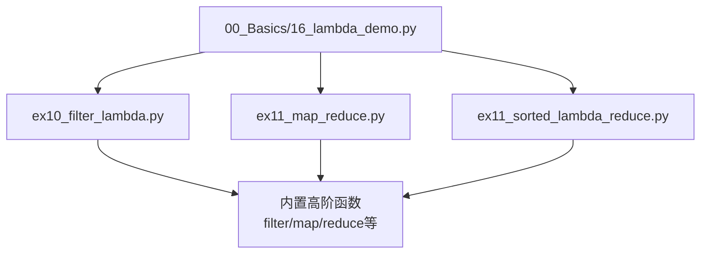
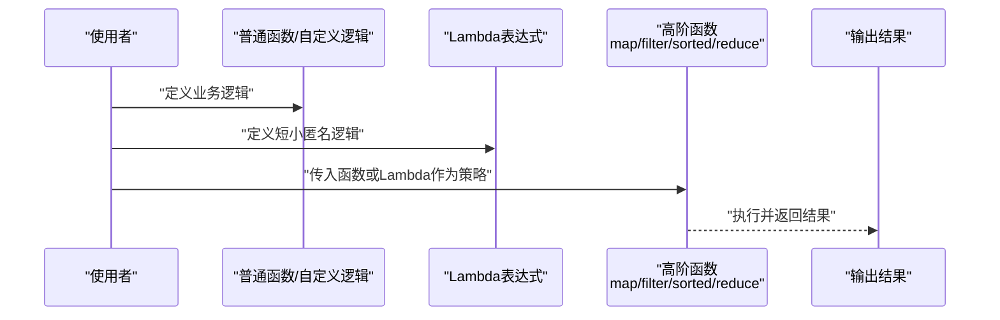
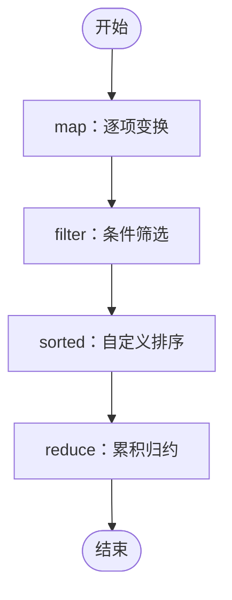
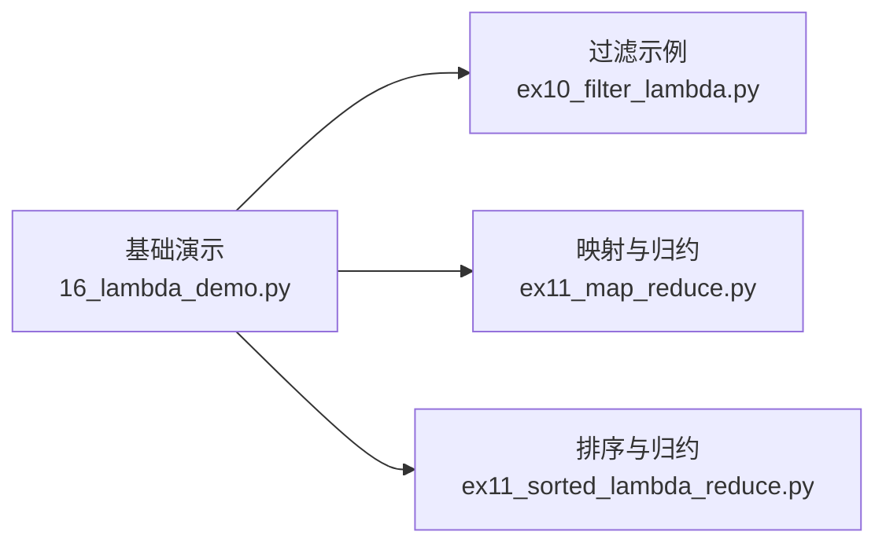

# 函数与Lambda表达式

<cite>
**本文引用的文件**   
- [00_Basics/16_lambda_demo.py](file://00_Basics/16_lambda_demo.py)
- [ex10_filter_lambda.py](file://ex10_filter_lambda.py)
- [ex11_map_reduce.py](file://ex11_map_reduce.py)
- [ex11_sorted_lambda_reduce.py](file://ex11_sorted_lambda_reduce.py)
</cite>

## 目录
1. [简介](#简介)
2. [项目结构](#项目结构)
3. [核心组件](#核心组件)
4. [架构总览](#架构总览)
5. [详细组件分析](#详细组件分析)
6. [依赖关系分析](#依赖关系分析)
7. [性能考量](#性能考量)
8. [故障排查指南](#故障排查指南)
9. [结论](#结论)
10. [附录](#附录)

## 简介
本学习文档围绕Python中的函数与Lambda表达式展开，系统讲解：
- 函数的定义语法、参数传递机制（位置参数、关键字参数、默认参数）与返回值处理
- 作用域规则、局部变量与全局变量的区别
- Lambda表达式的语法特点、使用场景及与普通函数的对比
- 高阶函数的概念与应用（函数作为参数与返回值）
- 函数设计的最佳实践与代码重构技巧，帮助编写模块化、可复用的代码

为便于理解，文档结合仓库中实际示例文件进行说明，并通过图示展示关键流程与关系。

## 项目结构
本项目包含多个演示与练习脚本，其中与“函数与Lambda表达式”直接相关的文件如下：
- 基础演示：00_Basics/16_lambda_demo.py
- 过滤与映射：ex10_filter_lambda.py、ex11_map_reduce.py
- 排序与归约：ex11_sorted_lambda_reduce.py

这些文件展示了如何使用普通函数与Lambda表达式完成常见数据处理任务，并体现了高阶函数的典型用法。

图表来源
- [00_Basics/16_lambda_demo.py](file://00_Basics/16_lambda_demo.py)
- [ex10_filter_lambda.py](file://ex10_filter_lambda.py)
- [ex11_map_reduce.py](file://ex11_map_reduce.py)
- [ex11_sorted_lambda_reduce.py](file://ex11_sorted_lambda_reduce.py)

章节来源
- [00_Basics/16_lambda_demo.py](file://00_Basics/16_lambda_demo.py)
- [ex10_filter_lambda.py](file://ex10_filter_lambda.py)
- [ex11_map_reduce.py](file://ex11_map_reduce.py)
- [ex11_sorted_lambda_reduce.py](file://ex11_sorted_lambda_reduce.py)

## 核心组件
本节聚焦以下主题，并结合示例文件进行说明：
- 函数定义与调用：包括def语句、命名约定、参数列表与返回语句
- 参数传递机制：位置参数、关键字参数、默认参数、可变参数（*args/**kwargs）的使用模式
- 返回值处理：单值返回、多值返回（元组）、None的语义
- 作用域规则：LEGB规则（Local、Enclosing、Global、Built-in），局部变量与全局变量的访问与修改
- Lambda表达式：语法、适用场景、与普通函数的差异
- 高阶函数：将函数作为参数或返回值，配合内置函数如map/filter/sorted/reduce实现简洁的数据处理流水线

章节来源
- [00_Basics/16_lambda_demo.py](file://00_Basics/16_lambda_demo.py)
- [ex10_filter_lambda.py](file://ex10_filter_lambda.py)
- [ex11_map_reduce.py](file://ex11_map_reduce.py)
- [ex11_sorted_lambda_reduce.py](file://ex11_sorted_lambda_reduce.py)

## 架构总览
下图展示了从“函数与Lambda”到“高阶函数应用”的整体流程：用户通过定义普通函数或Lambda表达式，将其作为参数传递给高阶函数，从而构建数据处理的流水线。

图表来源
- [ex10_filter_lambda.py](file://ex10_filter_lambda.py)
- [ex11_map_reduce.py](file://ex11_map_reduce.py)
- [ex11_sorted_lambda_reduce.py](file://ex11_sorted_lambda_reduce.py)

## 详细组件分析

### 函数定义与参数传递
- 定义与调用
  - 使用def语句定义函数，明确形参列表与返回语句
  - 调用时支持位置传参与关键字传参，提高可读性与灵活性
- 参数类型
  - 位置参数：按顺序绑定
  - 关键字参数：显式指定形参名
  - 默认参数：为形参提供默认值，简化调用
  - 可变参数：*args收集位置参数，**kwargs收集关键字参数
- 返回值
  - 单值返回：return后跟表达式
  - 多值返回：返回元组，调用方可解包
  - None：未显式返回时隐式返回None

章节来源
- [00_Basics/16_lambda_demo.py](file://00_Basics/16_lambda_demo.py)

### 作用域与变量可见性
- LEGB规则
  - Local：函数内部局部作用域
  - Enclosing：外层嵌套函数作用域
  - Global：模块级全局作用域
  - Built-in：内置名称空间
- 局部变量与全局变量
  - 在函数内读取全局变量无需声明
  - 在函数内修改全局变量需使用global声明
- 闭包与Lambda捕获
  - Lambda与嵌套函数可捕获外层作用域的变量，形成闭包

章节来源
- [00_Basics/16_lambda_demo.py](file://00_Basics/16_lambda_demo.py)

### Lambda表达式的特点与使用
- 语法特点
  - 一行表达式，自动返回表达式结果
  - 适合简单、一次性使用的逻辑
- 与普通函数的对比
  - 优点：简洁、可读性好（在短逻辑下）
  - 限制：不支持复杂语句、注释与多行逻辑
- 典型场景
  - 作为高阶函数的回调策略（如key、cmp、条件判断）
  - 快速构造小型计算逻辑

章节来源
- [00_Basics/16_lambda_demo.py](file://00_Basics/16_lambda_demo.py)

### 高阶函数与数据处理流水线
- 概念
  - 高阶函数：接受函数为参数或返回函数的函数
  - 常见内置：map、filter、sorted、reduce
- 应用模式
  - map：对序列逐项变换
  - filter：根据条件筛选元素
  - sorted：以自定义键进行排序
  - reduce：累积归约计算
- 组合策略
  - 将多个高阶函数串联，形成清晰的数据处理流水线

图表来源
- [ex10_filter_lambda.py](file://ex10_filter_lambda.py)
- [ex11_map_reduce.py](file://ex11_map_reduce.py)
- [ex11_sorted_lambda_reduce.py](file://ex11_sorted_lambda_reduce.py)

章节来源
- [ex10_filter_lambda.py](file://ex10_filter_lambda.py)
- [ex11_map_reduce.py](file://ex11_map_reduce.py)
- [ex11_sorted_lambda_reduce.py](file://ex11_sorted_lambda_reduce.py)

### 实战示例路径指引
- 基础Lambda演示
  - 参考：[00_Basics/16_lambda_demo.py](file://00_Basics/16_lambda_demo.py)
- 过滤与映射
  - 参考：[ex10_filter_lambda.py](file://ex10_filter_lambda.py)、[ex11_map_reduce.py](file://ex11_map_reduce.py)
- 排序与归约
  - 参考：[ex11_sorted_lambda_reduce.py](file://ex11_sorted_lambda_reduce.py)

章节来源
- [00_Basics/16_lambda_demo.py](file://00_Basics/16_lambda_demo.py)
- [ex10_filter_lambda.py](file://ex10_filter_lambda.py)
- [ex11_map_reduce.py](file://ex11_map_reduce.py)
- [ex11_sorted_lambda_reduce.py](file://ex11_sorted_lambda_reduce.py)

## 依赖关系分析
- 模块间关系
  - 基础演示文件为后续高阶函数示例提供概念铺垫
  - 高阶函数示例复用相同策略（函数/Lambda）在不同场景中的应用
- 外部依赖
  - 主要依赖Python标准库的高阶函数与内置工具
- 耦合与内聚
  - 各示例相对独立，关注点单一，便于学习与迁移

图表来源
- [00_Basics/16_lambda_demo.py](file://00_Basics/16_lambda_demo.py)
- [ex10_filter_lambda.py](file://ex10_filter_lambda.py)
- [ex11_map_reduce.py](file://ex11_map_reduce.py)
- [ex11_sorted_lambda_reduce.py](file://ex11_sorted_lambda_reduce.py)

章节来源
- [00_Basics/16_lambda_demo.py](file://00_Basics/16_lambda_demo.py)
- [ex10_filter_lambda.py](file://ex10_filter_lambda.py)
- [ex11_map_reduce.py](file://ex11_map_reduce.py)
- [ex11_sorted_lambda_reduce.py](file://ex11_sorted_lambda_reduce.py)

## 性能考量
- 选择合适策略
  - 简单逻辑优先使用Lambda，复杂逻辑使用def以提升可读性与可维护性
- 避免过度嵌套
  - 多层高阶函数组合可能降低可读性，必要时拆分为具名函数
- 内存与时间
  - 注意生成器与惰性求值的特性，避免不必要的中间集合
- 调试与日志
  - 在关键步骤添加日志或断点，便于定位问题

## 故障排查指南
- 常见问题
  - 参数不匹配：检查位置与关键字参数的数量与顺序
  - 默认参数陷阱：避免使用可变对象作为默认参数
  - 作用域错误：确认变量是否在正确的作用域内访问或修改
  - Lambda过长：当逻辑复杂时改用def，提升可读性
- 定位方法
  - 打印关键变量与中间结果
  - 逐步拆分高阶函数链，单独验证每个环节
  - 使用IDE调试功能设置断点

## 结论
通过本项目的示例与实践，学习者可以掌握：
- 函数的定义与参数传递机制
- 作用域与变量可见性的规则
- Lambda表达式的语法与适用场景
- 高阶函数的设计与组合，构建清晰的数据处理流水线
- 函数设计最佳实践与重构技巧，提升代码的可读性与可复用性

## 附录
- 术语表
  - 高阶函数：接受函数为参数或返回函数的函数
  - 闭包：函数与其引用环境组成的实体
  - 惰性求值：按需计算，避免不必要的开销
- 进一步阅读
  - Python官方文档关于函数与Lambda的章节
  - 内置高阶函数map、filter、sorted、reduce的使用指南