# 变量与数据类型

<cite>
**本文引用的文件**   
- [01_print_vars.py](file://00_Basics/01_print_vars.py)
- [ex01_calc_safe.py](file://ex01_calc_safe.py)
- [ex02_grade_level.py](file://ex02_grade_level.py)
- [ex04_cart_checkout.py](file://ex04_cart_checkout.py)
- [ex05_log_stats.py](file://ex05_log_stats.py)
- [ex06_student_scores.py](file://ex06_student_scores.py)
- [ex07_user_clean.py](file://ex07_user_clean.py)
- [ex18_data_cleaning_pipeline.py](file://ex18_data_cleaning_pipeline.py)
- [ex30_helper.py](file://ex30_helper.py)
- [ex30_main.py](file://ex30_main.py)
</cite>

## 目录
1. [简介](#简介)
2. [项目结构](#项目结构)
3. [核心组件](#核心组件)
4. [架构总览](#架构总览)
5. [详细组件分析](#详细组件分析)
6. [依赖关系分析](#依赖关系分析)
7. [性能考虑](#性能考虑)
8. [故障排查指南](#故障排查指南)
9. [结论](#结论)
10. [附录](#附录)

## 简介
本学习文档围绕Python的变量与基本数据类型展开，目标是帮助初学者系统掌握：
- 变量的声明与赋值语法、命名规范与最佳实践
- 基本数据类型（整数、浮点数、字符串、布尔值）的特点与使用场景
- 类型创建、操作与转换方法
- Python动态类型系统的工作原理与类型检查技巧
- 常见错误模式与调试方法

为便于理解，文中所有示例均指向仓库中的实际代码文件路径，避免直接粘贴代码内容。

## 项目结构
本项目以“基础练习 + 综合示例”的方式组织，变量与数据类型相关内容主要分布在以下两类文件中：
- 基础演示：在 00_Basics 目录下，通过简单脚本展示变量打印、输入输出、条件判断等
- 实战示例：根目录下的 ex*.py 文件，涵盖安全计算、成绩分级、购物车结算、日志统计、学生成绩处理、数据清洗流水线等

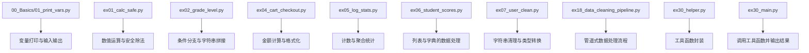

图表来源
- [01_print_vars.py:1-50](file://00_Basics/01_print_vars.py#L1-L50)
- [ex01_calc_safe.py:1-80](file://ex01_calc_safe.py#L1-L80)
- [ex02_grade_level.py:1-60](file://ex02_grade_level.py#L1-L60)
- [ex04_cart_checkout.py:1-100](file://ex04_cart_checkout.py#L1-L100)
- [ex05_log_stats.py:1-80](file://ex05_log_stats.py#L1-L80)
- [ex06_student_scores.py:1-120](file://ex06_student_scores.py#L1-L120)
- [ex07_user_clean.py:1-100](file://ex07_user_clean.py#L1-L100)
- [ex18_data_cleaning_pipeline.py:1-120](file://ex18_data_cleaning_pipeline.py#L1-L120)
- [ex30_helper.py:1-80](file://ex30_helper.py#L1-L80)
- [ex30_main.py:1-60](file://ex30_main.py#L1-L60)

章节来源
- [01_print_vars.py:1-50](file://00_Basics/01_print_vars.py#L1-L50)
- [ex01_calc_safe.py:1-80](file://ex01_calc_safe.py#L1-L80)
- [ex02_grade_level.py:1-60](file://ex02_grade_level.py#L1-L60)
- [ex04_cart_checkout.py:1-100](file://ex04_cart_checkout.py#L1-L100)
- [ex05_log_stats.py:1-80](file://ex05_log_stats.py#L1-L80)
- [ex06_student_scores.py:1-120](file://ex06_student_scores.py#L1-L120)
- [ex07_user_clean.py:1-100](file://ex07_user_clean.py#L1-L100)
- [ex18_data_cleaning_pipeline.py:1-120](file://ex18_data_cleaning_pipeline.py#L1-L120)
- [ex30_helper.py:1-80](file://ex30_helper.py#L1-L80)
- [ex30_main.py:1-60](file://ex30_main.py#L1-L60)

## 核心组件
本节聚焦变量与数据类型的基础能力，结合仓库中的示例文件进行说明。为避免直接粘贴代码，所有示例均以“文件路径+行号范围”的形式给出参考位置。

- 变量声明与赋值
  - 通过赋值运算符将值绑定到名称，名称遵循标识符规则（字母、数字、下划线，且不以数字开头）
  - 推荐采用小写加下划线的命名风格，语义清晰、可读性强
  - 参考示例：
    - [01_print_vars.py:1-50](file://00_Basics/01_print_vars.py#L1-L50)

- 基本数据类型
  - 整数（int）：用于计数、索引、离散值；支持算术与位运算
    - 参考示例：[ex01_calc_safe.py:1-80](file://ex01_calc_safe.py#L1-L80)
  - 浮点数（float）：用于连续量、货币金额近似表示；注意精度问题
    - 参考示例：[ex04_cart_checkout.py:1-100](file://ex04_cart_checkout.py#L1-L100)
  - 字符串（str）：文本信息存储与处理；支持切片、拼接、格式化
    - 参考示例：[ex02_grade_level.py:1-60](file://ex02_grade_level.py#L1-L60)、[ex07_user_clean.py:1-100](file://ex07_user_clean.py#L1-L100)
  - 布尔值（bool）：逻辑判断与条件控制；True/False
    - 参考示例：[ex02_grade_level.py:1-60](file://ex02_grade_level.py#L1-L60)

- 类型转换与类型检查
  - 内置转换函数：int()、float()、str()、bool()
  - 类型检查：isinstance(obj, type)
  - 参考示例：
    - [ex07_user_clean.py:1-100](file://ex07_user_clean.py#L1-L100)
    - [ex30_helper.py:1-80](file://ex30_helper.py#L1-L80)

- 动态类型系统
  - Python是动态类型语言：变量名不绑定具体类型，而是绑定对象；同一变量可在运行时重新绑定不同对象
  - 建议显式进行类型转换与校验，提高健壮性
  - 参考示例：
    - [ex18_data_cleaning_pipeline.py:1-120](file://ex18_data_cleaning_pipeline.py#L1-L120)

章节来源
- [01_print_vars.py:1-50](file://00_Basics/01_print_vars.py#L1-L50)
- [ex01_calc_safe.py:1-80](file://ex01_calc_safe.py#L1-L80)
- [ex02_grade_level.py:1-60](file://ex02_grade_level.py#L1-L60)
- [ex04_cart_checkout.py:1-100](file://ex04_cart_checkout.py#L1-L100)
- [ex07_user_clean.py:1-100](file://ex07_user_clean.py#L1-L100)
- [ex18_data_cleaning_pipeline.py:1-120](file://ex18_data_cleaning_pipeline.py#L1-L120)
- [ex30_helper.py:1-80](file://ex30_helper.py#L1-L80)

## 架构总览
下图展示了从输入到输出的典型数据处理流程，体现变量与数据类型在其中的作用：

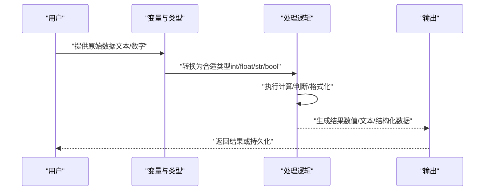

图表来源
- [ex01_calc_safe.py:1-80](file://ex01_calc_safe.py#L1-L80)
- [ex04_cart_checkout.py:1-100](file://ex04_cart_checkout.py#L1-L100)
- [ex07_user_clean.py:1-100](file://ex07_user_clean.py#L1-L100)
- [ex18_data_cleaning_pipeline.py:1-120](file://ex18_data_cleaning_pipeline.py#L1-L120)

## 详细组件分析

### 安全计算与数值类型（ex01_calc_safe.py）
- 目标：演示整型与浮点型的运算、除零保护、类型转换
- 关键点：
  - 输入可能为字符串，需转换为数值类型
  - 除法前检查分母是否为零
  - 结果保留适当精度
- 流程图

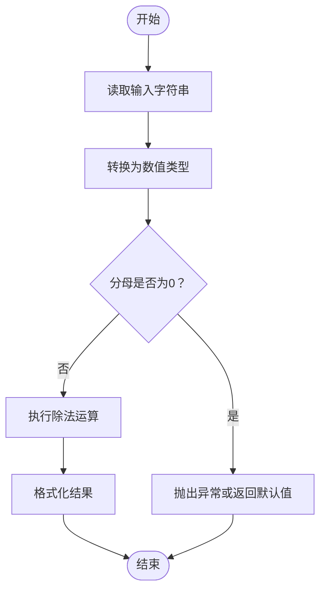

图表来源
- [ex01_calc_safe.py:1-80](file://ex01_calc_safe.py#L1-L80)

章节来源
- [ex01_calc_safe.py:1-80](file://ex01_calc_safe.py#L1-L80)

### 成绩分级与字符串处理（ex02_grade_level.py）
- 目标：演示条件分支、字符串拼接与格式化
- 关键点：
  - 根据分数区间映射等级（如A/B/C/D/F）
  - 使用字符串格式化输出结果
- 流程图

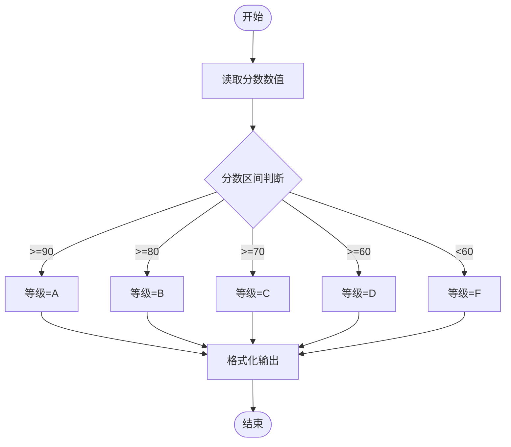

图表来源
- [ex02_grade_level.py:1-60](file://ex02_grade_level.py#L1-L60)

章节来源
- [ex02_grade_level.py:1-60](file://ex02_grade_level.py#L1-L60)

### 购物车结算与金额计算（ex04_cart_checkout.py）
- 目标：演示浮点数运算、金额格式化、四舍五入策略
- 关键点：
  - 单价×数量=小计；汇总得到总价
  - 浮点精度问题可通过Decimal或格式化解决
  - 输出时保留两位小数
- 流程图

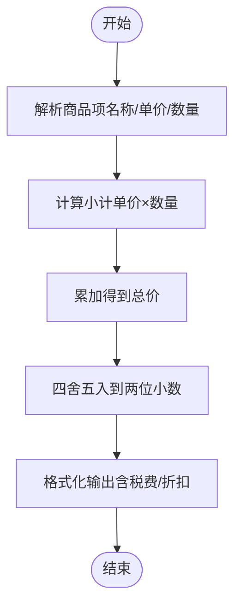

图表来源
- [ex04_cart_checkout.py:1-100](file://ex04_cart_checkout.py#L1-L100)

章节来源
- [ex04_cart_checkout.py:1-100](file://ex04_cart_checkout.py#L1-L100)

### 日志统计与计数（ex05_log_stats.py）
- 目标：演示计数器、字典键值对、字符串匹配
- 关键点：
  - 按日志级别（INFO/WARNING/ERROR）统计出现次数
  - 使用字典作为哈希表进行聚合
- 流程图

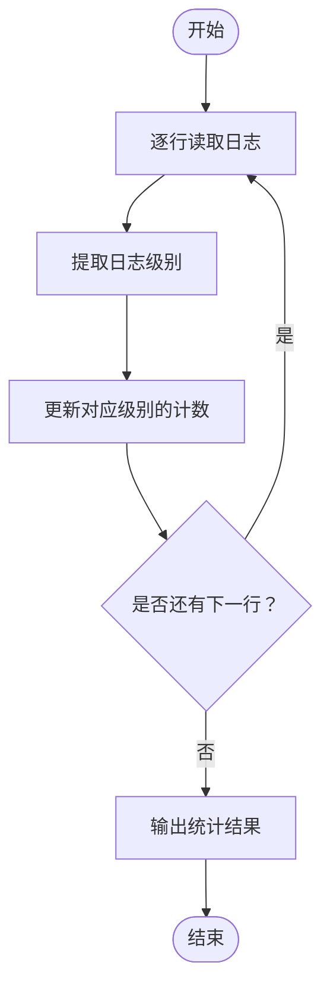

图表来源
- [ex05_log_stats.py:1-80](file://ex05_log_stats.py#L1-L80)

章节来源
- [ex05_log_stats.py:1-80](file://ex05_log_stats.py#L1-L80)

### 学生成绩处理（ex06_student_scores.py）
- 目标：演示列表与字典的组合使用、遍历与聚合
- 关键点：
  - 用字典记录学生姓名与成绩
  - 计算平均分、最高分、最低分
- 流程图

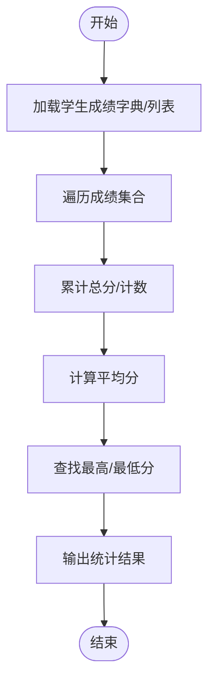

图表来源
- [ex06_student_scores.py:1-120](file://ex06_student_scores.py#L1-L120)

章节来源
- [ex06_student_scores.py:1-120](file://ex06_student_scores.py#L1-L120)

### 用户数据清洗与类型转换（ex07_user_clean.py）
- 目标：演示字符串清理、空值处理、类型转换
- 关键点：
  - 去除空白字符、统一大小写
  - 将字符串年龄转换为整数，失败则设置默认值
- 流程图

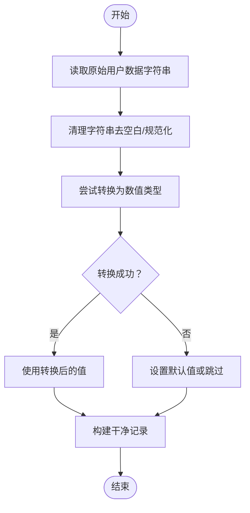

图表来源
- [ex07_user_clean.py:1-100](file://ex07_user_clean.py#L1-L100)

章节来源
- [ex07_user_clean.py:1-100](file://ex07_user_clean.py#L1-L100)

### 数据清洗流水线（ex18_data_cleaning_pipeline.py）
- 目标：演示管道式数据处理，组合多个步骤完成清洗
- 关键点：
  - 定义多个清洗函数（去重、过滤、转换）
  - 将函数组合成流水线，逐步处理数据
- 流程图

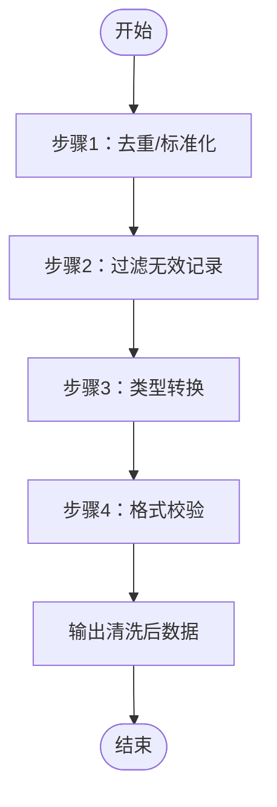

图表来源
- [ex18_data_cleaning_pipeline.py:1-120](file://ex18_data_cleaning_pipeline.py#L1-L120)

章节来源
- [ex18_data_cleaning_pipeline.py:1-120](file://ex18_data_cleaning_pipeline.py#L1-L120)

### 工具函数封装与调用（ex30_helper.py 与 ex30_main.py）
- 目标：演示将常用类型转换与校验逻辑封装为工具函数，并在主程序中调用
- 关键点：
  - helper模块提供安全的类型转换函数
  - main模块负责参数解析、调用工具函数、输出结果
- 序列图

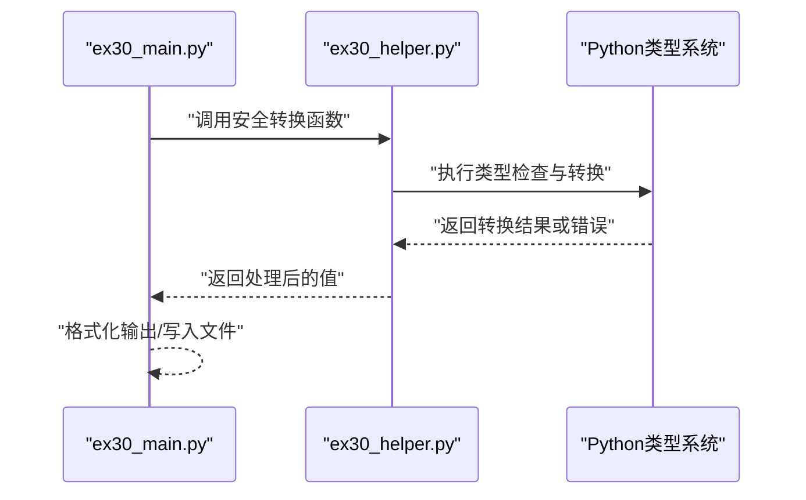

图表来源
- [ex30_helper.py:1-80](file://ex30_helper.py#L1-L80)
- [ex30_main.py:1-60](file://ex30_main.py#L1-L60)

章节来源
- [ex30_helper.py:1-80](file://ex30_helper.py#L1-L80)
- [ex30_main.py:1-60](file://ex30_main.py#L1-L60)

## 依赖关系分析
- 模块内聚与耦合
  - 各示例文件相对独立，职责单一，便于学习与复用
  - ex30_helper.py 与 ex30_main.py 形成清晰的“工具-调用”关系
- 外部依赖
  - 示例主要使用标准库（sys、os、json、csv等），无第三方依赖
- 潜在循环依赖
  - 当前结构未发现循环导入风险

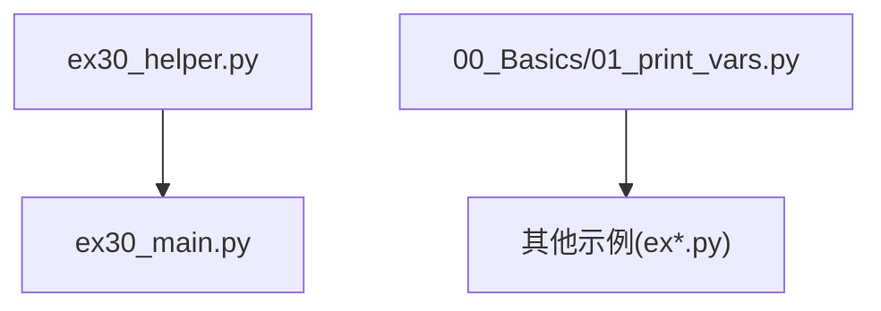

图表来源
- [ex30_helper.py:1-80](file://ex30_helper.py#L1-L80)
- [ex30_main.py:1-60](file://ex30_main.py#L1-L60)
- [01_print_vars.py:1-50](file://00_Basics/01_print_vars.py#L1-L50)

章节来源
- [ex30_helper.py:1-80](file://ex30_helper.py#L1-L80)
- [ex30_main.py:1-60](file://ex30_main.py#L1-L60)
- [01_print_vars.py:1-50](file://00_Basics/01_print_vars.py#L1-L50)

## 性能考虑
- 数值精度
  - 浮点数存在精度误差，涉及金额计算建议使用Decimal或先放大为整数再计算
- 字符串处理
  - 频繁拼接建议使用join或格式化，减少中间对象创建
- 类型转换
  - 批量转换时尽量捕获异常并设置默认值，避免整体流程中断
- 数据结构选择
  - 查找频繁的场景优先使用字典或集合，降低时间复杂度

## 故障排查指南
- 常见错误模式
  - 类型不匹配：字符串与数值混算导致TypeError
    - 参考：[ex01_calc_safe.py:1-80](file://ex01_calc_safe.py#L1-L80)
  - 除零异常：未检查分母导致ZeroDivisionError
    - 参考：[ex01_calc_safe.py:1-80](file://ex01_calc_safe.py#L1-L80)
  - 索引越界：访问列表元素超出范围导致IndexError
    - 参考：[ex06_student_scores.py:1-120](file://ex06_student_scores.py#L1-L120)
  - 键不存在：字典访问不存在的键导致KeyError
    - 参考：[ex06_student_scores.py:1-120](file://ex06_student_scores.py#L1-L120)
  - 转换失败：字符串无法转为数值导致ValueError
    - 参考：[ex07_user_clean.py:1-100](file://ex07_user_clean.py#L1-L100)
- 调试方法
  - 使用print或logging输出关键变量状态
  - 使用try/except捕获异常并记录上下文
  - 使用isinstance进行类型断言，确保输入符合预期
  - 参考：
    - [ex07_user_clean.py:1-100](file://ex07_user_clean.py#L1-L100)
    - [ex30_helper.py:1-80](file://ex30_helper.py#L1-L80)

章节来源
- [ex01_calc_safe.py:1-80](file://ex01_calc_safe.py#L1-L80)
- [ex06_student_scores.py:1-120](file://ex06_student_scores.py#L1-L120)
- [ex07_user_clean.py:1-100](file://ex07_user_clean.py#L1-L100)
- [ex30_helper.py:1-80](file://ex30_helper.py#L1-L80)

## 结论
通过本项目的示例文件，可以系统掌握Python变量与基本数据类型的使用方式与最佳实践。建议在开发中：
- 明确变量命名与类型意图，保持代码可读性
- 显式进行类型转换与校验，提升健壮性
- 针对业务场景选择合适的数值处理方式（如Decimal）
- 建立完善的异常处理与日志记录机制

## 附录
- 快速参考清单
  - 变量命名：小写加下划线，语义清晰
  - 类型转换：int()/float()/str()/bool()
  - 类型检查：isinstance(obj, type)
  - 数值精度：金额计算优先使用Decimal
  - 字符串处理：strip()/replace()/format()/f-string
  - 异常处理：try/except/finally