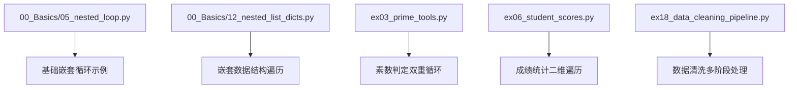
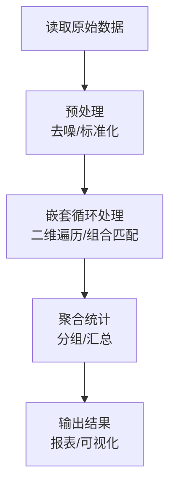
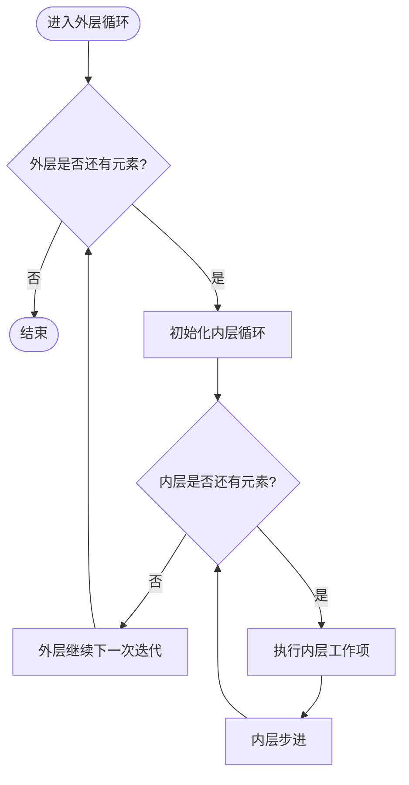
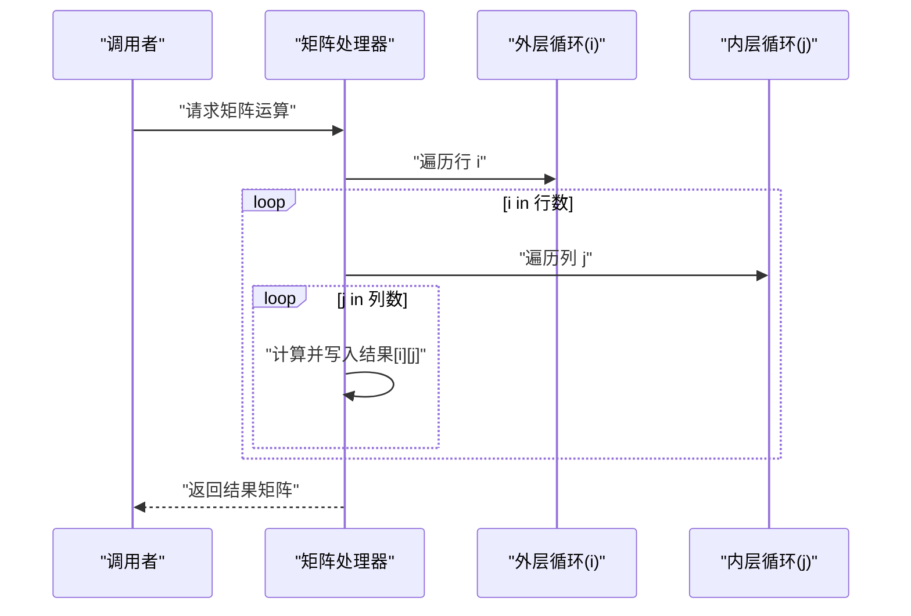
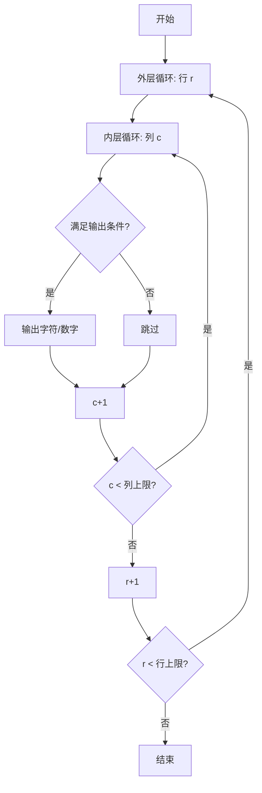
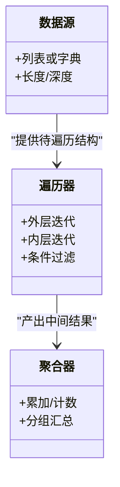
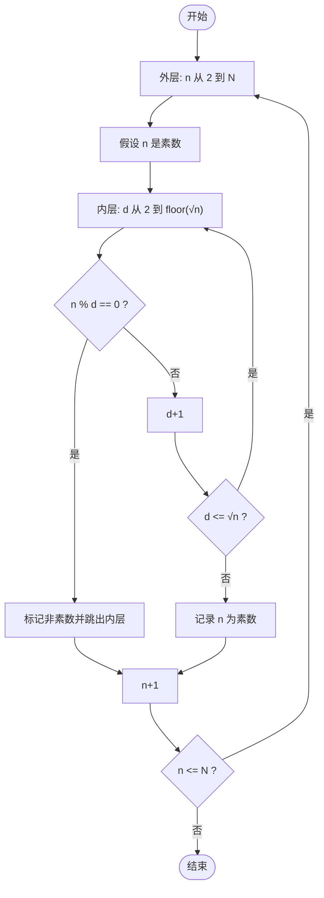
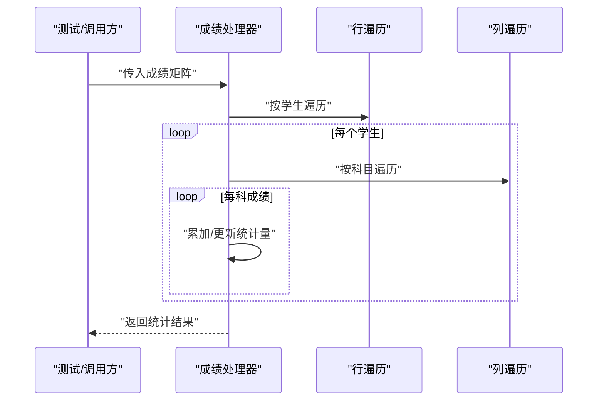
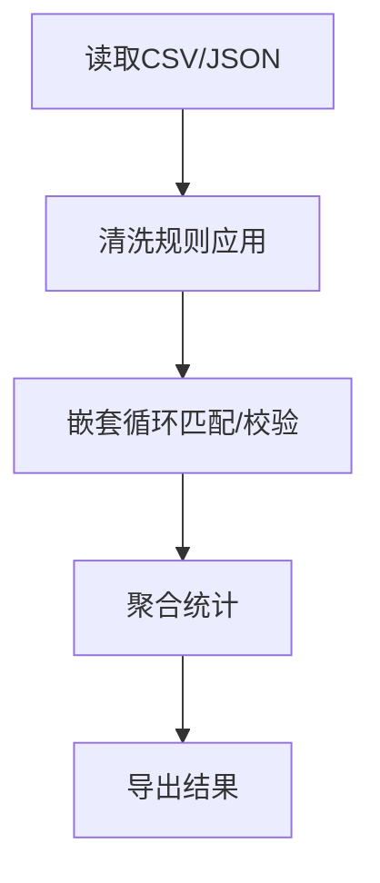
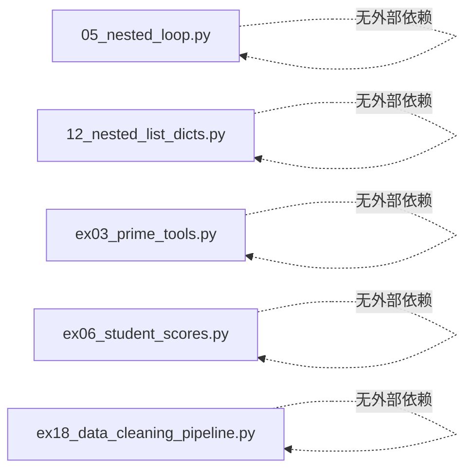

# 嵌套循环

<cite>
**本文引用的文件**   
- [05_nested_loop.py](file://00_Basics/05_nested_loop.py)
- [12_nested_list_dicts.py](file://00_Basics/12_nested_list_dicts.py)
- [ex03_prime_tools.py](file://ex03_prime_tools.py)
- [ex06_student_scores.py](file://ex06_student_scores.py)
- [ex18_data_cleaning_pipeline.py](file://ex18_data_cleaning_pipeline.py)
</cite>

## 目录
1. [简介](#简介)
2. [项目结构](#项目结构)
3. [核心组件](#核心组件)
4. [架构总览](#架构总览)
5. [详细组件分析](#详细组件分析)
6. [依赖分析](#依赖分析)
7. [性能考虑](#性能考虑)
8. [故障排查指南](#故障排查指南)
9. [结论](#结论)
10. [附录](#附录)

## 简介
本章节面向初学者与进阶学习者，系统讲解Python中嵌套循环的执行原理与控制流程，重点阐述外层循环与内层循环的协作机制。文档覆盖二维数据处理、矩阵运算与模式生成等典型应用场景，深入分析时间复杂度与性能特征，并提供优化策略与技巧。通过真实案例（如九九乘法表、图形打印、数据遍历）帮助读者掌握复杂循环逻辑的实现与调试方法。

## 项目结构
本项目包含多个基础示例与练习脚本，其中与“嵌套循环”直接相关的核心文件如下：
- 基础嵌套循环示例：00_Basics/05_nested_loop.py
- 嵌套列表与字典遍历：00_Basics/12_nested_list_dicts.py
- 素数工具（含双重循环判断）：ex03_prime_tools.py
- 学生成绩统计（二维数据遍历）：ex06_student_scores.py
- 数据清洗流水线（多阶段处理，可能包含嵌套遍历）：ex18_data_cleaning_pipeline.py

图表来源
- [05_nested_loop.py](file://00_Basics/05_nested_loop.py)
- [12_nested_list_dicts.py](file://00_Basics/12_nested_list_dicts.py)
- [ex03_prime_tools.py](file://ex03_prime_tools.py)
- [ex06_student_scores.py](file://ex06_student_scores.py)
- [ex18_data_cleaning_pipeline.py](file://ex18_data_cleaning_pipeline.py)

章节来源
- [05_nested_loop.py](file://00_Basics/05_nested_loop.py)
- [12_nested_list_dicts.py](file://00_Basics/12_nested_list_dicts.py)
- [ex03_prime_tools.py](file://ex03_prime_tools.py)
- [ex06_student_scores.py](file://ex06_student_scores.py)
- [ex18_data_cleaning_pipeline.py](file://ex18_data_cleaning_pipeline.py)

## 核心组件
本节聚焦于嵌套循环的关键实现模式与常见用法，结合仓库中的具体脚本进行说明。

- 基础嵌套循环模式
  - 外层控制行，内层控制列；常用于二维网格、表格输出与矩阵计算。
  - 参考路径：[00_Basics/05_nested_loop.py](file://00_Basics/05_nested_loop.py)

- 嵌套数据结构遍历
  - 对嵌套列表或字典进行逐层访问，适合多维数据聚合与汇总。
  - 参考路径：[00_Basics/12_nested_list_dicts.py](file://00_Basics/12_nested_list_dicts.py)

- 双重循环用于判定与筛选
  - 例如素数判定：用外层遍历候选数，内层尝试除数直至平方根。
  - 参考路径：[ex03_prime_tools.py](file://ex03_prime_tools.py)

- 二维数据统计
  - 遍历成绩矩阵，按行/列累计分数、计算均值与排名。
  - 参考路径：[ex06_student_scores.py](file://ex06_student_scores.py)

- 多阶段数据清洗
  - 在流水线中多次遍历数据集，必要时使用嵌套循环完成组合校验或交叉匹配。
  - 参考路径：[ex18_data_cleaning_pipeline.py](file://ex18_data_cleaning_pipeline.py)

章节来源
- [05_nested_loop.py](file://00_Basics/05_nested_loop.py)
- [12_nested_list_dicts.py](file://00_Basics/12_nested_list_dicts.py)
- [ex03_prime_tools.py](file://ex03_prime_tools.py)
- [ex06_student_scores.py](file://ex06_student_scores.py)
- [ex18_data_cleaning_pipeline.py](file://ex18_data_cleaning_pipeline.py)

## 架构总览
从“输入—处理—输出”的角度看，嵌套循环通常作为数据处理管道中的核心环节，负责将原始二维或多维数据转换为结构化结果。下图展示了典型的数据清洗流水线中嵌套循环的位置与作用。

图表来源
- [ex18_data_cleaning_pipeline.py](file://ex18_data_cleaning_pipeline.py)

## 详细组件分析

### 基础嵌套循环执行原理与控制流
- 执行顺序
  - 外层循环每迭代一次，内层循环完整执行一遍。
  - 若外层为m次、内层为n次，则内层体被执行m×n次。
- 控制变量
  - 外层索引决定当前处理的“行”，内层索引决定当前处理的“列”。
- 终止条件
  - 当外层或内层达到边界时，对应循环结束；全部结束后整体退出。
- 常见用途
  - 九九乘法表、图形打印、二维数组扫描、矩阵乘加等。

图表来源
- [05_nested_loop.py](file://00_Basics/05_nested_loop.py)

章节来源
- [05_nested_loop.py](file://00_Basics/05_nested_loop.py)

### 二维数据处理与矩阵运算
- 二维遍历
  - 以行列双索引访问元素，适合累加、求最值、查找目标等。
- 矩阵运算
  - 矩阵加法/减法：同维度逐元素操作。
  - 矩阵乘法：三重循环（i,j,k），时间复杂度O(n^3)。
- 数据聚合
  - 按行/列汇总、分组统计、跨维度比较。

图表来源
- [05_nested_loop.py](file://00_Basics/05_nested_loop.py)

章节来源
- [05_nested_loop.py](file://00_Basics/05_nested_loop.py)

### 模式生成：九九乘法表与图形打印
- 九九乘法表
  - 外层控制被乘数，内层控制乘数，利用行列关系输出上三角或下三角形式。
- 图形打印
  - 通过行列坐标与条件判断绘制三角形、矩形、菱形等图案。

图表来源
- [05_nested_loop.py](file://00_Basics/05_nested_loop.py)

章节来源
- [05_nested_loop.py](file://00_Basics/05_nested_loop.py)

### 嵌套数据结构遍历：嵌套列表与字典
- 嵌套列表
  - 双层for遍历，逐层访问元素，适合表格型数据。
- 嵌套字典
  - 多层键访问与聚合，适合层级化配置或分类统计。
- 注意事项
  - 键不存在需做防御性检查；空集合需提前短路避免无意义遍历。

图表来源
- [12_nested_list_dicts.py](file://00_Basics/12_nested_list_dicts.py)

章节来源
- [12_nested_list_dicts.py](file://00_Basics/12_nested_list_dicts.py)

### 双重循环判定：素数工具
- 算法思路
  - 外层遍历候选数，内层尝试除数至平方根，减少不必要的检查。
- 复杂度
  - 对单个数n的判定为O(√n)，批量判定k个数则为O(k√n)。
- 优化点
  - 仅检查奇数、跳过偶数因子、缓存已判定结果。

图表来源
- [ex03_prime_tools.py](file://ex03_prime_tools.py)

章节来源
- [ex03_prime_tools.py](file://ex03_prime_tools.py)

### 二维数据统计：学生成绩
- 场景
  - 遍历成绩矩阵，计算每位学生的总分、平均分，以及班级各科最高分。
- 关键点
  - 行级累计与列级汇总分离，避免重复计算。
  - 注意边界与缺失值处理。

图表来源
- [ex06_student_scores.py](file://ex06_student_scores.py)

章节来源
- [ex06_student_scores.py](file://ex06_student_scores.py)

### 多阶段数据清洗流水线
- 流程
  - 读取数据→预处理→嵌套循环进行组合校验/交叉匹配→聚合→输出。
- 适用
  - 需要两两比较或跨表关联的场景，如去重、合并、异常检测。

图表来源
- [ex18_data_cleaning_pipeline.py](file://ex18_data_cleaning_pipeline.py)

章节来源
- [ex18_data_cleaning_pipeline.py](file://ex18_data_cleaning_pipeline.py)

## 依赖分析
- 模块耦合
  - 各脚本相对独立，主要依赖标准库与内置数据类型（列表、字典）。
- 外部依赖
  - 未引入第三方库，便于理解嵌套循环本质。
- 潜在循环依赖
  - 脚本间无相互导入，不存在循环依赖风险。

图表来源
- [05_nested_loop.py](file://00_Basics/05_nested_loop.py)
- [12_nested_list_dicts.py](file://00_Basics/12_nested_list_dicts.py)
- [ex03_prime_tools.py](file://ex03_prime_tools.py)
- [ex06_student_scores.py](file://ex06_student_scores.py)
- [ex18_data_cleaning_pipeline.py](file://ex18_data_cleaning_pipeline.py)

章节来源
- [05_nested_loop.py](file://00_Basics/05_nested_loop.py)
- [12_nested_list_dicts.py](file://00_Basics/12_nested_list_dicts.py)
- [ex03_prime_tools.py](file://ex03_prime_tools.py)
- [ex06_student_scores.py](file://ex06_student_scores.py)
- [ex18_data_cleaning_pipeline.py](file://ex18_data_cleaning_pipeline.py)

## 性能考虑
- 时间复杂度
  - 两层循环通常为O(m×n)；矩阵乘法为O(n^3)。
- 空间复杂度
  - 原地计算为O(1)额外空间；构建新矩阵为O(n^2)。
- 优化策略
  - 提前剪枝：在内层尽早break/continue以减少无效计算。
  - 预计算：将不变表达式提到外层循环外。
  - 步长优化：如素数判定只检查到平方根、跳过偶数。
  - 数据结构选择：优先使用列表推导或内置函数替代显式嵌套循环。
  - 并行化：对大规模独立任务可考虑多线程/多进程或NumPy向量化。

## 故障排查指南
- 常见问题
  - 越界访问：索引超出范围导致错误。
  - 死循环：内层步进不正确或缺少终止条件。
  - 逻辑错误：内外层边界混淆、初始值设置不当。
  - 性能问题：重复计算、未剪枝导致超时。
- 调试技巧
  - 打印关键索引与中间结果，逐步缩小范围。
  - 使用小样本数据验证边界情况。
  - 将复杂逻辑拆分为函数，单独测试。
  - 使用断点与日志定位热点路径。

章节来源
- [05_nested_loop.py](file://00_Basics/05_nested_loop.py)
- [ex03_prime_tools.py](file://ex03_prime_tools.py)
- [ex06_student_scores.py](file://ex06_student_scores.py)

## 结论
嵌套循环是处理二维与多维数据的基石。掌握其执行原理、控制流程与复杂度特征，有助于正确建模与高效实现。通过合理剪枝、预计算与数据结构优化，可在保证可读性的同时显著提升性能。建议在学习过程中结合仓库中的示例脚本，循序渐进地实践与调试，逐步提升对复杂循环逻辑的掌控力。

## 附录
- 学习路径建议
  - 先掌握基础嵌套循环与二维遍历，再过渡到矩阵运算与模式生成。
  - 结合素数判定与成绩统计等案例，体会不同场景下的优化点。
  - 在数据清洗流水线中综合应用，形成端到端处理能力。