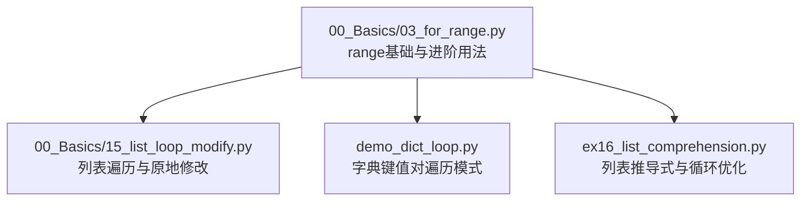
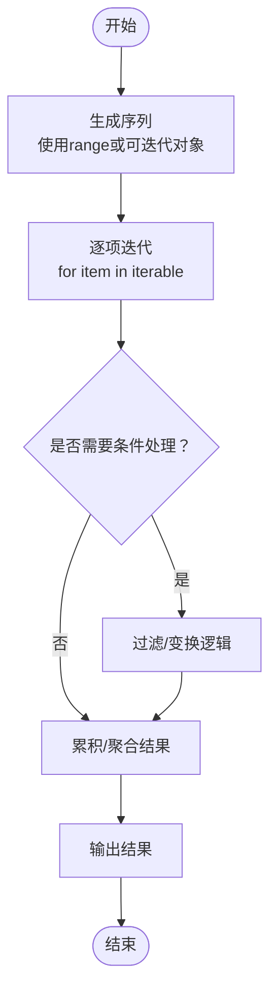
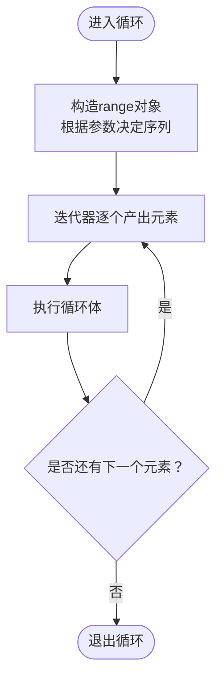
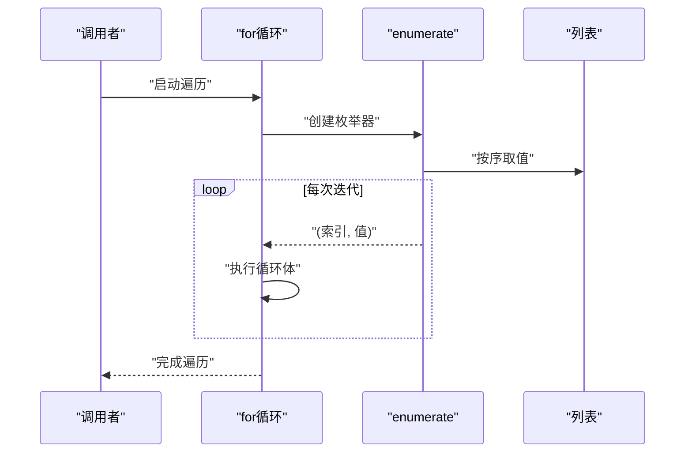
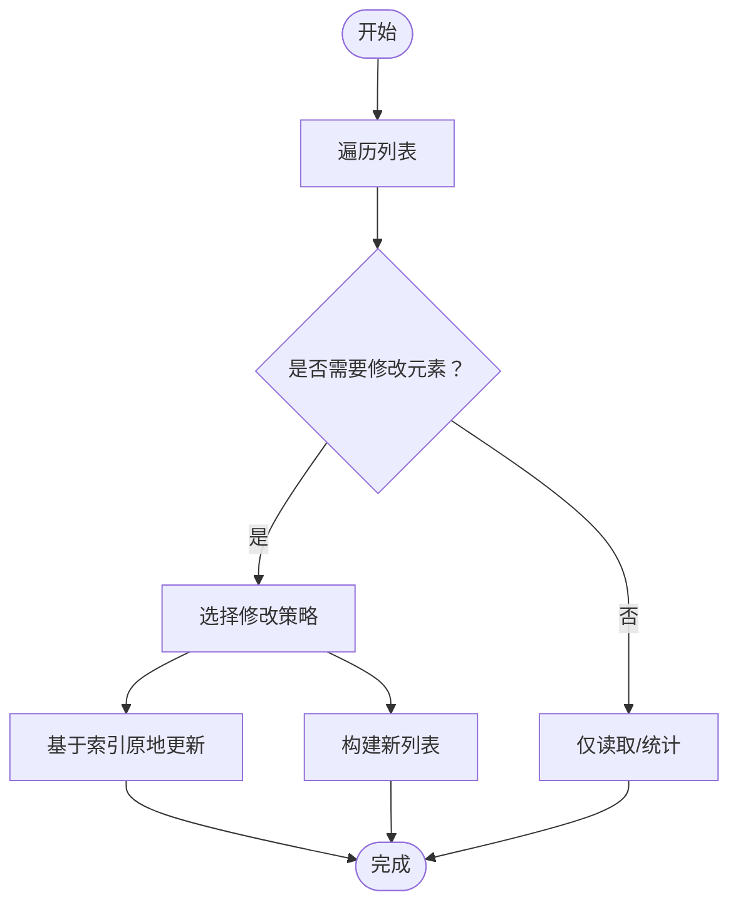
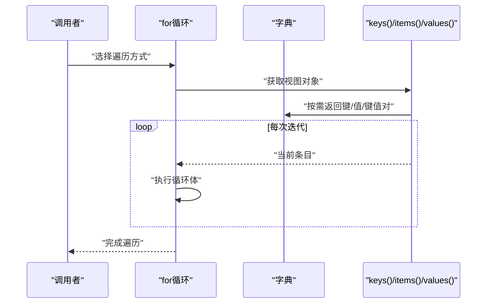
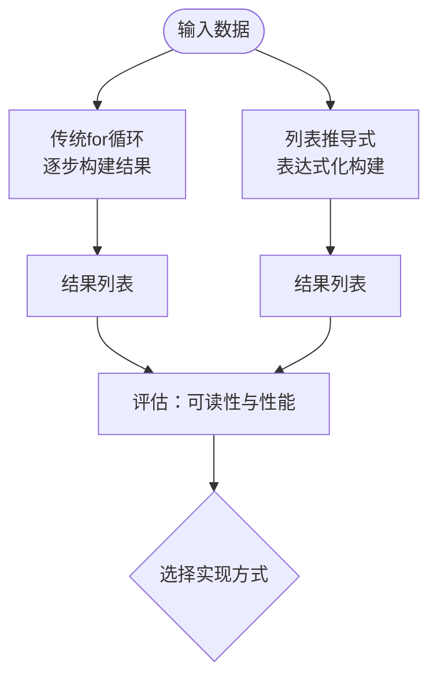
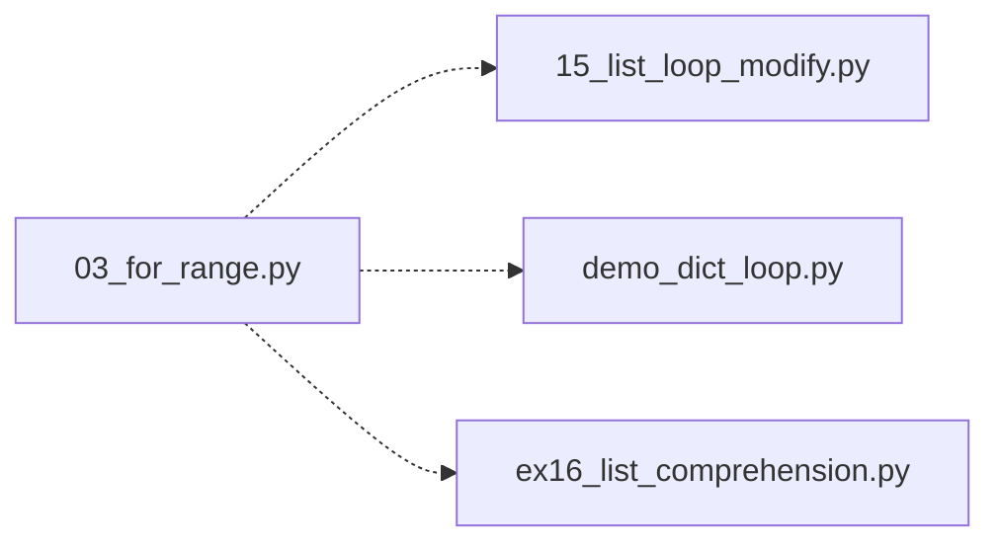

# for循环

<cite>
**本文引用的文件**   
- [03_for_range.py](file://00_Basics/03_for_range.py)
- [15_list_loop_modify.py](file://00_Basics/15_list_loop_modify.py)
- [demo_dict_loop.py](file://demo_dict_loop.py)
- [ex16_list_comprehension.py](file://ex16_list_comprehension.py)
</cite>

## 目录
1. [简介](#简介)
2. [项目结构](#项目结构)
3. [核心组件](#核心组件)
4. [架构总览](#架构总览)
5. [详细组件分析](#详细组件分析)
6. [依赖分析](#依赖分析)
7. [性能考虑](#性能考虑)
8. [故障排查指南](#故障排查指南)
9. [结论](#结论)
10. [附录](#附录)

## 简介
本学习文档围绕Python的for循环展开，系统讲解其基本语法与工作原理，重点覆盖range函数的三种常用形式（单参数、双参数、三参数），并深入演示enumerate的高级用法。通过遍历列表、字符串、字典等数据结构的实际示例，帮助读者建立清晰的迭代思维，并提供循环优化技巧与性能注意事项，形成高效编程实践。

## 项目结构
本项目包含多个与for循环相关的示例文件，涵盖基础range用法、列表遍历与修改、字典遍历以及列表推导式等主题。下图展示了与本主题直接相关的文件及其职责：

**图表来源**
- [03_for_range.py:1-200](file://00_Basics/03_for_range.py#L1-L200)
- [15_list_loop_modify.py:1-200](file://00_Basics/15_list_loop_modify.py#L1-L200)
- [demo_dict_loop.py:1-200](file://demo_dict_loop.py#L1-L200)
- [ex16_list_comprehension.py:1-200](file://ex16_list_comprehension.py#L1-L200)

**章节来源**
- [03_for_range.py:1-200](file://00_Basics/03_for_range.py#L1-L200)
- [15_list_loop_modify.py:1-200](file://00_Basics/15_list_loop_modify.py#L1-L200)
- [demo_dict_loop.py:1-200](file://demo_dict_loop.py#L1-L200)
- [ex16_list_comprehension.py:1-200](file://ex16_list_comprehension.py#L1-L200)

## 核心组件
本节聚焦以下关键知识点与实践要点：
- for循环的基本语法与迭代协议
- range的三种形式：单参数、双参数、三参数
- enumerate的高级应用：索引与值的同步获取
- 遍历不同数据结构：列表、字符串、字典
- 循环优化技巧与性能考量

**章节来源**
- [03_for_range.py:1-200](file://00_Basics/03_for_range.py#L1-L200)
- [15_list_loop_modify.py:1-200](file://00_Basics/15_list_loop_modify.py#L1-L200)
- [demo_dict_loop.py:1-200](file://demo_dict_loop.py#L1-L200)
- [ex16_list_comprehension.py:1-200](file://ex16_list_comprehension.py#L1-L200)

## 架构总览
下图从“概念流程”的角度展示for循环在典型数据处理任务中的工作流，包括生成序列、逐项处理、条件过滤与结果收集等环节：

[此图为概念流程图，不直接映射具体源码文件]

## 详细组件分析

### range函数详解
- 单参数range(n)：生成从0到n-1的整数序列，常用于固定次数的循环。
- 双参数range(start, end)：指定起始与结束位置，不包含end。
- 三参数range(start, end, step)：支持步长控制，step可为正或负，用于间隔访问或反向遍历。

建议结合示例文件查看具体用法与边界行为，理解空序列与越界情况。

**章节来源**
- [03_for_range.py:1-200](file://00_Basics/03_for_range.py#L1-L200)

#### 序列生成与遍历流程

**图表来源**
- [03_for_range.py:1-200](file://00_Basics/03_for_range.py#L1-L200)

### enumerate高级应用
- 同时获取索引与值：适用于需要记录位置的场景，如构建带序号的输出、定位异常项等。
- 自定义起始索引：通过第二个参数调整索引起点，便于与业务编号对齐。
- 与条件判断结合：在筛选过程中保留原始位置信息，有助于后续定位与修复。

**章节来源**
- [03_for_range.py:1-200](file://00_Basics/03_for_range.py#L1-L200)
- [15_list_loop_modify.py:1-200](file://00_Basics/15_list_loop_modify.py#L1-L200)

#### 枚举遍历时序图

**图表来源**
- [03_for_range.py:1-200](file://00_Basics/03_for_range.py#L1-L200)
- [15_list_loop_modify.py:1-200](file://00_Basics/15_list_loop_modify.py#L1-L200)

### 遍历列表与原地修改
- 遍历列表：直接使用for item in list进行只读访问。
- 原地修改：在需要更新元素时，谨慎使用索引或临时容器，避免在遍历中直接删除导致跳过元素的问题。
- 常见模式：条件过滤后重建新列表；或使用切片赋值进行批量替换。

**章节来源**
- [15_list_loop_modify.py:1-200](file://00_Basics/15_list_loop_modify.py#L1-L200)

#### 列表遍历与修改决策流程

**图表来源**
- [15_list_loop_modify.py:1-200](file://00_Basics/15_list_loop_modify.py#L1-L200)

### 遍历字典的模式
- 遍历键：默认行为，适合检查存在性或作为查找依据。
- 遍历键值对：使用items()方法，适合需要同时访问键和值的场景。
- 遍历值：使用values()方法，适合仅关注数据的场景。
- 注意：字典顺序在较新版本中保持插入顺序，但应避免依赖顺序进行强耦合逻辑。

**章节来源**
- [demo_dict_loop.py:1-200](file://demo_dict_loop.py#L1-L200)

#### 字典遍历时序图

**图表来源**
- [demo_dict_loop.py:1-200](file://demo_dict_loop.py#L1-L200)

### 列表推导式与循环优化
- 列表推导式：将简单for循环转换为更紧凑且通常更快的表达式，适合映射与过滤组合的场景。
- 适用性：当循环体逻辑简洁、无副作用时优先使用推导式；复杂逻辑仍建议使用显式for循环以提升可读性。
- 性能：推导式在C层优化，通常比等效的for循环更快，但内存占用可能更高（一次性生成完整列表）。

**章节来源**
- [ex16_list_comprehension.py:1-200](file://ex16_list_comprehension.py#L1-L200)

#### 推导式与for循环对比流程

**图表来源**
- [ex16_list_comprehension.py:1-200](file://ex16_list_comprehension.py#L1-L200)

## 依赖分析
本主题涉及的代码文件之间为并列关系，各自聚焦不同的遍历与优化场景，彼此无直接导入依赖。整体结构以“示例驱动”的方式组织，便于对照学习与快速定位。

**图表来源**
- [03_for_range.py:1-200](file://00_Basics/03_for_range.py#L1-L200)
- [15_list_loop_modify.py:1-200](file://00_Basics/15_list_loop_modify.py#L1-L200)
- [demo_dict_loop.py:1-200](file://demo_dict_loop.py#L1-L200)
- [ex16_list_comprehension.py:1-200](file://ex16_list_comprehension.py#L1-L200)

**章节来源**
- [03_for_range.py:1-200](file://00_Basics/03_for_range.py#L1-L200)
- [15_list_loop_modify.py:1-200](file://00_Basics/15_list_loop_modify.py#L1-L200)
- [demo_dict_loop.py:1-200](file://demo_dict_loop.py#L1-L200)
- [ex16_list_comprehension.py:1-200](file://ex16_list_comprehension.py#L1-L200)

## 性能考虑
- 选择合适的迭代工具：
  - 仅计数：优先使用range而非手动维护索引。
  - 需要索引与值：使用enumerate，避免额外计算索引。
  - 字典遍历：根据需求选择keys()/values()/items()，减少不必要的中间对象。
- 避免在遍历中修改集合大小：如需删除元素，建议先收集待删除项再统一处理，或构建新集合。
- 使用推导式提升简洁性与性能：在逻辑简单且无副作用的情况下优先采用。
- 大对象与惰性求值：对于超大序列，考虑使用生成器表达式替代列表推导式以降低内存峰值。

[本节提供通用指导，不直接分析具体文件]

## 故障排查指南
- 空序列问题：检查range的参数是否正确，尤其是start、end与step的组合，确保不会生成空序列。
- 越界访问：确认索引范围与目标长度一致，避免IndexError。
- 遍历时修改集合：若出现跳过元素或异常，改用构建新集合或在遍历结束后统一修改。
- 字典顺序依赖：避免强依赖字典顺序，必要时转为有序结构（如列表）后再处理。
- 性能瓶颈：识别热点循环，尝试用推导式或内置函数优化，必要时引入生成器降低内存压力。

[本节提供通用指导，不直接分析具体文件]

## 结论
掌握for循环的核心在于理解迭代协议与合适的工具选择。range提供灵活的序列生成能力，enumerate简化索引与值的同步获取，而针对不同数据结构（列表、字符串、字典）的遍历模式各有侧重。通过列表推导式与生成器等优化手段，可以在保证可读性的前提下显著提升性能与表达力。建议结合示例文件反复练习，逐步内化为高效的编程习惯。

[本节为总结性内容，不直接分析具体文件]

## 附录
- 推荐练习路径：
  - 从range的基础用法入手，逐步过渡到步长与反向遍历。
  - 使用enumerate解决需要索引的实际问题。
  - 针对字典的不同遍历方式进行对比实验。
  - 将简单for循环改写为列表推导式，观察性能与可读性变化。

[本节为补充说明，不直接分析具体文件]