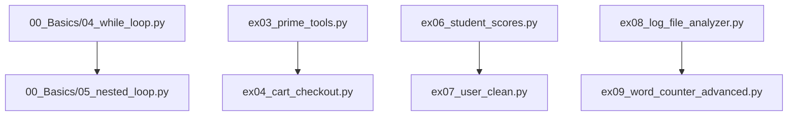
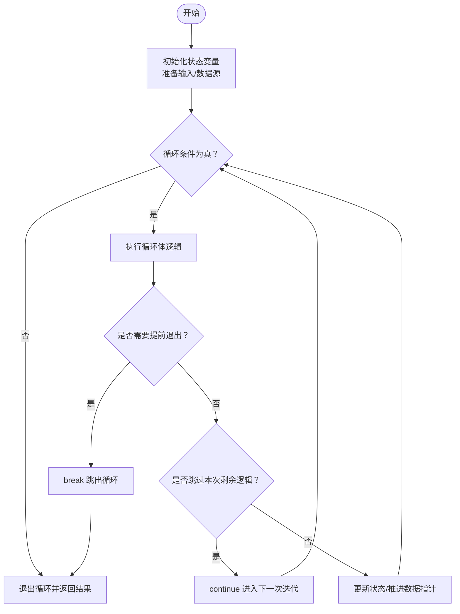
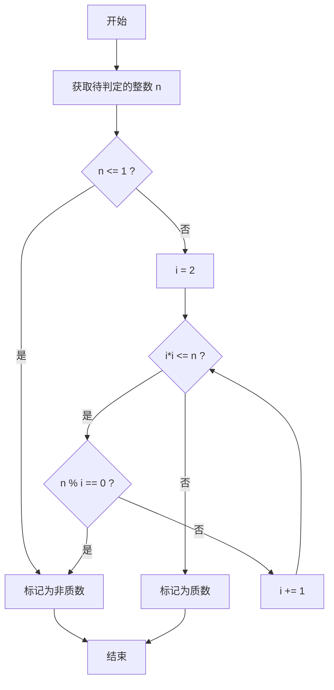
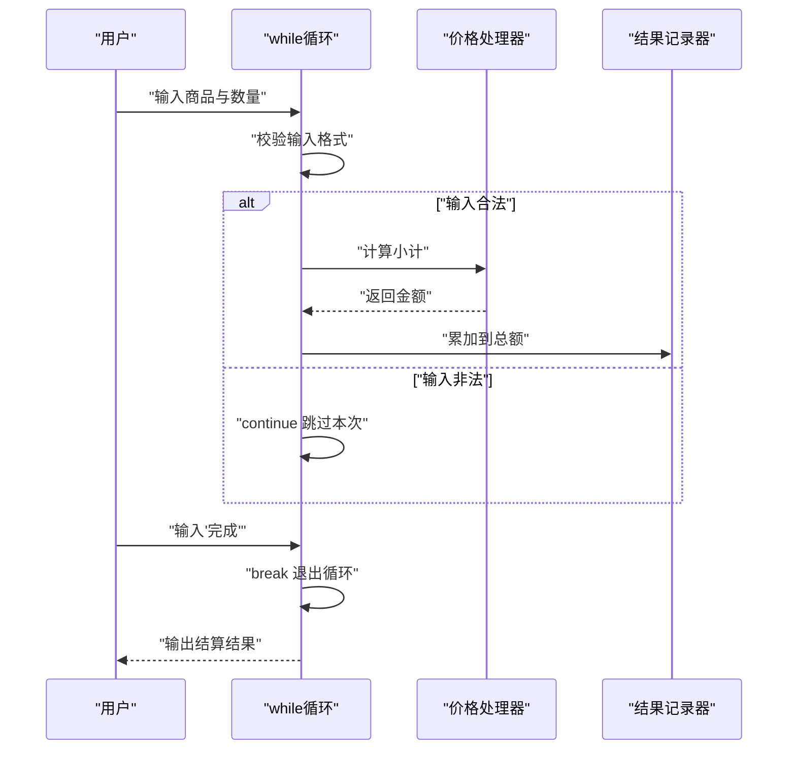
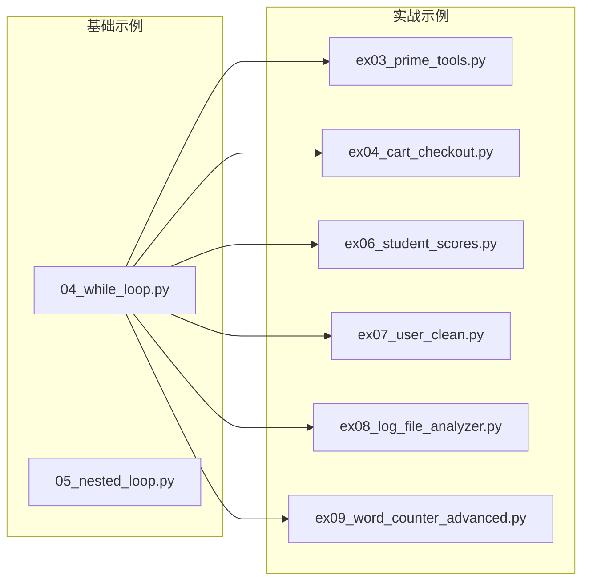

# while循环

<cite>
**本文引用的文件**   
- [04_while_loop.py](file://00_Basics/04_while_loop.py)
- [05_nested_loop.py](file://00_Basics/05_nested_loop.py)
- [ex03_prime_tools.py](file://ex03_prime_tools.py)
- [ex04_cart_checkout.py](file://ex04_cart_checkout.py)
- [ex06_student_scores.py](file://ex06_student_scores.py)
- [ex07_user_clean.py](file://ex07_user_clean.py)
- [ex08_log_file_analyzer.py](file://ex08_log_file_analyzer.py)
- [ex09_word_counter_advanced.py](file://ex09_word_counter_advanced.py)
</cite>

## 目录
1. [简介](#简介)
2. [项目结构](#项目结构)
3. [核心组件](#核心组件)
4. [架构总览](#架构总览)
5. [详细组件分析](#详细组件分析)
6. [依赖关系分析](#依赖关系分析)
7. [性能考虑](#性能考虑)
8. [故障排查指南](#故障排查指南)
9. [结论](#结论)
10. [附录](#附录)

## 简介
本学习文档围绕Python中的while循环展开，系统讲解条件控制机制、终止条件设计策略、break与continue的使用场景与优化技巧，并通过仓库中的实际示例展示其在“不确定次数迭代”任务中的优势。同时提供调试技巧与for/while选择原则，帮助学习者根据需求选择合适的循环结构。

## 项目结构
本项目包含多个基础与实战脚本，其中与while循环直接相关的示例集中在以下文件：
- 基础语法与嵌套循环演示
- 典型业务场景（购物车结算、用户数据清洗、日志分析、词频统计等）

图表来源
- [04_while_loop.py:1-200](file://00_Basics/04_while_loop.py#L1-L200)
- [05_nested_loop.py:1-200](file://00_Basics/05_nested_loop.py#L1-L200)
- [ex03_prime_tools.py:1-200](file://ex03_prime_tools.py#L1-L200)
- [ex04_cart_checkout.py:1-200](file://ex04_cart_checkout.py#L1-L200)
- [ex06_student_scores.py:1-200](file://ex06_student_scores.py#L1-L200)
- [ex07_user_clean.py:1-200](file://ex07_user_clean.py#L1-L200)
- [ex08_log_file_analyzer.py:1-200](file://ex08_log_file_analyzer.py#L1-L200)
- [ex09_word_counter_advanced.py:1-200](file://ex09_word_counter_advanced.py#L1-L200)

章节来源
- [04_while_loop.py:1-200](file://00_Basics/04_while_loop.py#L1-L200)
- [05_nested_loop.py:1-200](file://00_Basics/05_nested_loop.py#L1-L200)
- [ex03_prime_tools.py:1-200](file://ex03_prime_tools.py#L1-L200)
- [ex04_cart_checkout.py:1-200](file://ex04_cart_checkout.py#L1-L200)
- [ex06_student_scores.py:1-200](file://ex06_student_scores.py#L1-L200)
- [ex07_user_clean.py:1-200](file://ex07_user_clean.py#L1-L200)
- [ex08_log_file_analyzer.py:1-200](file://ex08_log_file_analyzer.py#L1-L200)
- [ex09_word_counter_advanced.py:1-200](file://ex09_word_counter_advanced.py#L1-L200)

## 核心组件
本节聚焦while循环的关键要素：
- 循环条件设置原则：明确“何时继续”，避免恒真或恒假；尽量使用可快速收敛的布尔表达式。
- 终止条件设计策略：确保每次迭代向终止靠近；必要时引入安全上限（最大迭代次数）防止死循环。
- break与continue：
  - break：提前结束整个循环，适用于找到目标、异常退出、用户取消等场景。
  - continue：跳过本次剩余逻辑进入下一次迭代，适用于过滤无效数据、跳过边界情况。
- 不确定次数迭代的优势：当迭代次数无法预先确定时（如等待用户输入、读取未知长度数据流），while更自然。

章节来源
- [04_while_loop.py:1-200](file://00_Basics/04_while_loop.py#L1-L200)
- [05_nested_loop.py:1-200](file://00_Basics/05_nested_loop.py#L1-L200)
- [ex03_prime_tools.py:1-200](file://ex03_prime_tools.py#L1-L200)
- [ex04_cart_checkout.py:1-200](file://ex04_cart_checkout.py#L1-L200)
- [ex06_student_scores.py:1-200](file://ex06_student_scores.py#L1-L200)
- [ex07_user_clean.py:1-200](file://ex07_user_clean.py#L1-L200)
- [ex08_log_file_analyzer.py:1-200](file://ex08_log_file_analyzer.py#L1-L200)
- [ex09_word_counter_advanced.py:1-200](file://ex09_word_counter_advanced.py#L1-L200)

## 架构总览
下图展示了基于while循环的典型处理流程，涵盖条件判断、分支控制（break/continue）、状态更新与退出路径。该流程在多个示例中复用，如用户交互、数据清洗、日志解析等。

图表来源
- [04_while_loop.py:1-200](file://00_Basics/04_while_loop.py#L1-L200)
- [ex04_cart_checkout.py:1-200](file://ex04_cart_checkout.py#L1-L200)
- [ex07_user_clean.py:1-200](file://ex07_user_clean.py#L1-L200)
- [ex08_log_file_analyzer.py:1-200](file://ex08_log_file_analyzer.py#L1-L200)

## 详细组件分析

### 基础while循环与嵌套循环
- 重点内容
  - 基本while结构与条件更新
  - 嵌套while在二维数据处理中的应用
  - 常见陷阱：忘记更新循环变量导致无限循环
- 适用场景
  - 需要按步长推进的状态机
  - 多阶段处理且阶段数不固定

章节来源
- [04_while_loop.py:1-200](file://00_Basics/04_while_loop.py#L1-L200)
- [05_nested_loop.py:1-200](file://00_Basics/05_nested_loop.py#L1-L200)

### 质数判定工具（ex03_prime_tools.py）
- 关键流程
  - 外层while遍历候选数字
  - 内层while尝试除数直至平方根或整除
  - 使用break提前结束内层循环以优化性能
- 复杂度与优化
  - 时间复杂度近似O(n√n)，通过平方根上界与提前break显著减少计算量
- 图示：质数判定主流程

图表来源
- [ex03_prime_tools.py:1-200](file://ex03_prime_tools.py#L1-L200)

章节来源
- [ex03_prime_tools.py:1-200](file://ex03_prime_tools.py#L1-L200)

### 购物车结算（ex04_cart_checkout.py）
- 关键流程
  - while循环持续接收用户输入
  - 遇到特定指令（如“完成”）使用break退出
  - 对非法输入使用continue跳过
  - 累计金额并在退出后输出汇总
- 图示：结算交互序列

图表来源
- [ex04_cart_checkout.py:1-200](file://ex04_cart_checkout.py#L1-L200)

章节来源
- [ex04_cart_checkout.py:1-200](file://ex04_cart_checkout.py#L1-L200)

### 学生成绩录入与统计（ex06_student_scores.py）
- 关键流程
  - 使用while循环持续录入成绩直到输入特定终止符
  - 利用continue跳过空输入或越界分数
  - 维护计数与总和，最终计算平均值
- 适用场景
  - 交互式数据收集
  - 动态规模的数据聚合

章节来源
- [ex06_student_scores.py:1-200](file://ex06_student_scores.py#L1-L200)

### 用户数据清洗（ex07_user_clean.py）
- 关键流程
  - 逐条读取用户记录，使用while推进游标
  - 对缺失字段或异常值使用continue跳过
  - 将有效记录写入清洗后的数据集
- 适用场景
  - 批量数据清洗流水线
  - 不规则文本/CSV解析

章节来源
- [ex07_user_clean.py:1-200](file://ex07_user_clean.py#L1-L200)

### 日志文件分析（ex08_log_file_analyzer.py）
- 关键流程
  - 打开日志文件，使用while逐行读取
  - 匹配关键字或正则模式进行统计
  - 遇到EOF或错误时优雅退出
- 适用场景
  - 大文件流式处理
  - 事件驱动型日志解析

章节来源
- [ex08_log_file_analyzer.py:1-200](file://ex08_log_file_analyzer.py#L1-L200)

### 高级词频统计（ex09_word_counter_advanced.py）
- 关键流程
  - 使用while循环分块读取文本
  - 对每块进行分词与计数
  - 支持中断与进度提示
- 适用场景
  - 大规模文本处理
  - 内存受限环境下的流式统计

章节来源
- [ex09_word_counter_advanced.py:1-200](file://ex09_word_counter_advanced.py#L1-L200)

## 依赖关系分析
- 模块内聚性
  - 每个示例文件职责单一，专注于一个while循环应用场景
- 外部依赖
  - 主要依赖标准库（如sys、os、re等），无第三方包耦合
- 潜在循环依赖
  - 各示例相互独立，不存在循环导入

图表来源
- [04_while_loop.py:1-200](file://00_Basics/04_while_loop.py#L1-L200)
- [05_nested_loop.py:1-200](file://00_Basics/05_nested_loop.py#L1-L200)
- [ex03_prime_tools.py:1-200](file://ex03_prime_tools.py#L1-L200)
- [ex04_cart_checkout.py:1-200](file://ex04_cart_checkout.py#L1-L200)
- [ex06_student_scores.py:1-200](file://ex06_student_scores.py#L1-L200)
- [ex07_user_clean.py:1-200](file://ex07_user_clean.py#L1-L200)
- [ex08_log_file_analyzer.py:1-200](file://ex08_log_file_analyzer.py#L1-L200)
- [ex09_word_counter_advanced.py:1-200](file://ex09_word_counter_advanced.py#L1-L200)

章节来源
- [04_while_loop.py:1-200](file://00_Basics/04_while_loop.py#L1-L200)
- [05_nested_loop.py:1-200](file://00_Basics/05_nested_loop.py#L1-L200)
- [ex03_prime_tools.py:1-200](file://ex03_prime_tools.py#L1-L200)
- [ex04_cart_checkout.py:1-200](file://ex04_cart_checkout.py#L1-L200)
- [ex06_student_scores.py:1-200](file://ex06_student_scores.py#L1-L200)
- [ex07_user_clean.py:1-200](file://ex07_user_clean.py#L1-L200)
- [ex08_log_file_analyzer.py:1-200](file://ex08_log_file_analyzer.py#L1-L200)
- [ex09_word_counter_advanced.py:1-200](file://ex09_word_counter_advanced.py#L1-L200)

## 性能考虑
- 合理设置循环上界：对可能长时间运行的任务增加最大迭代次数保护，避免资源耗尽。
- 尽早break：一旦满足目标条件立即退出，减少不必要的计算。
- 谨慎使用continue：仅在确实需要跳过当前项时使用，避免掩盖逻辑缺陷。
- 状态更新必须收敛：确保每次迭代使条件趋近于False，防止死循环。
- 大文件处理：采用分块读取与流式处理，降低内存占用。

[本节为通用指导，无需具体文件引用]

## 故障排查指南
- 常见症状
  - 程序无响应或CPU占用过高：疑似无限循环
  - 结果不完整：可能遗漏必要的状态更新或过早break
- 定位方法
  - 打印关键变量变化轨迹，确认条件收敛
  - 临时加入最大迭代计数器，超过阈值强制退出
  - 使用断点逐步执行，观察break/continue触发时机
- 修复建议
  - 修正循环变量的更新逻辑
  - 完善终止条件，覆盖异常分支
  - 为外部输入添加合法性校验与默认行为

章节来源
- [ex04_cart_checkout.py:1-200](file://ex04_cart_checkout.py#L1-L200)
- [ex07_user_clean.py:1-200](file://ex07_user_clean.py#L1-L200)
- [ex08_log_file_analyzer.py:1-200](file://ex08_log_file_analyzer.py#L1-L200)

## 结论
while循环在处理“不确定次数迭代”的任务中具有天然优势。通过严谨的条件设计与合理的break/continue使用，可以在保证正确性的同时提升效率。结合本仓库中的基础与实战示例，读者可以掌握从入门到进阶的完整技能树，并在实际项目中灵活选用while或for循环。

[本节为总结性内容，无需具体文件引用]

## 附录
- for vs while 选择原则
  - 优先使用for：当可明确知道迭代次数或可枚举集合时
  - 优先使用while：当迭代次数取决于运行时条件（用户输入、文件结束、网络响应等）
- 最佳实践清单
  - 始终确保循环变量或状态会向终止条件收敛
  - 为外部输入设置超时与重试上限
  - 在复杂循环中加入清晰的注释与日志
  - 单元测试覆盖边界与异常路径

[本节为通用指导，无需具体文件引用]