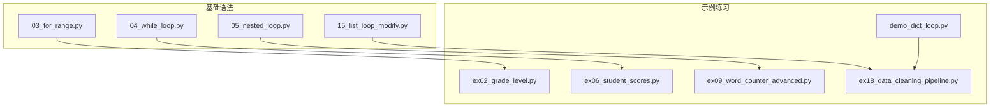
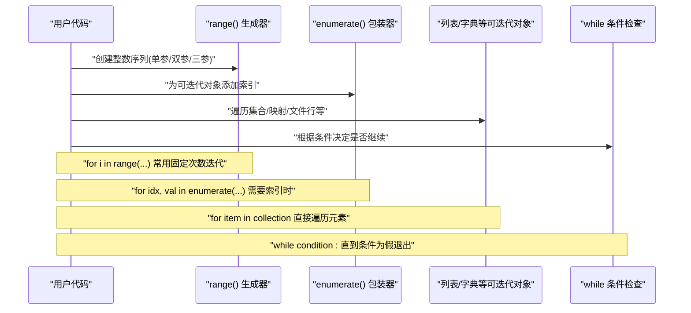
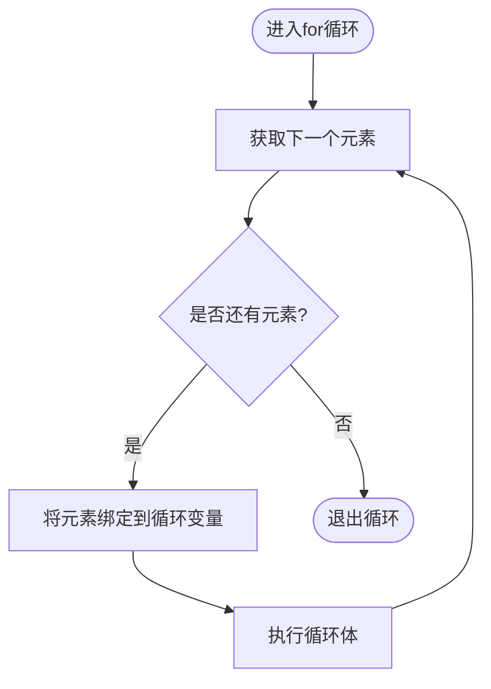
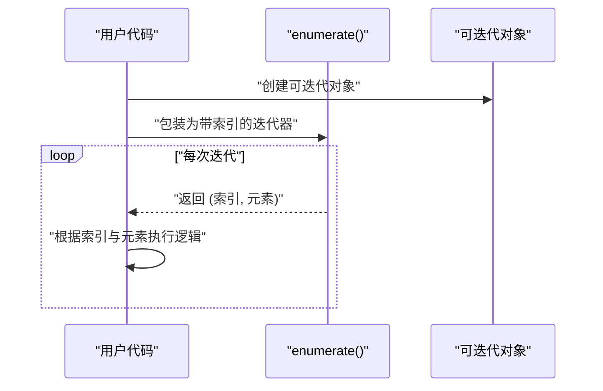
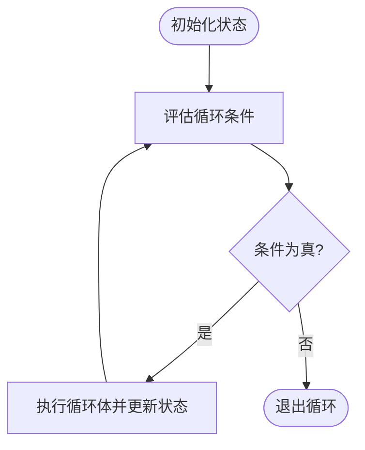
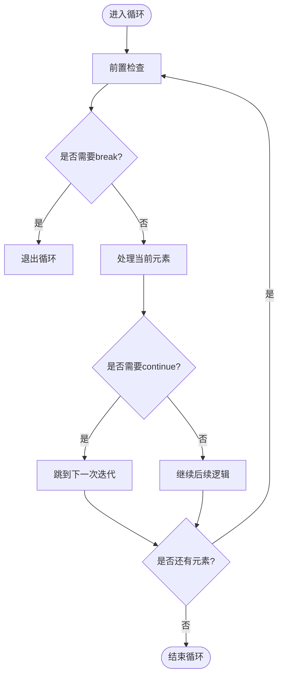
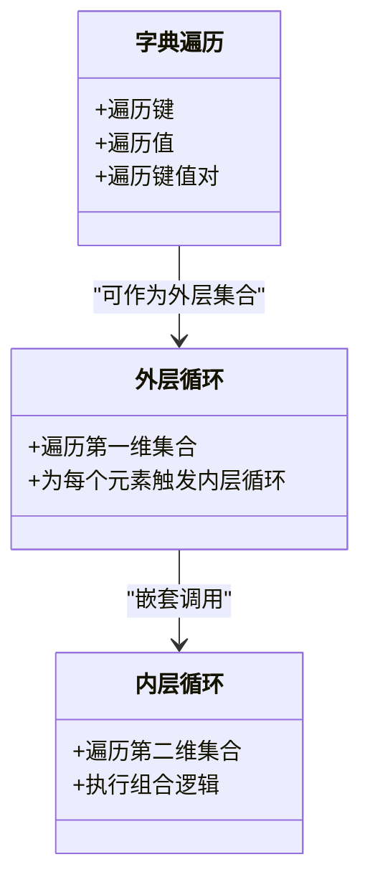
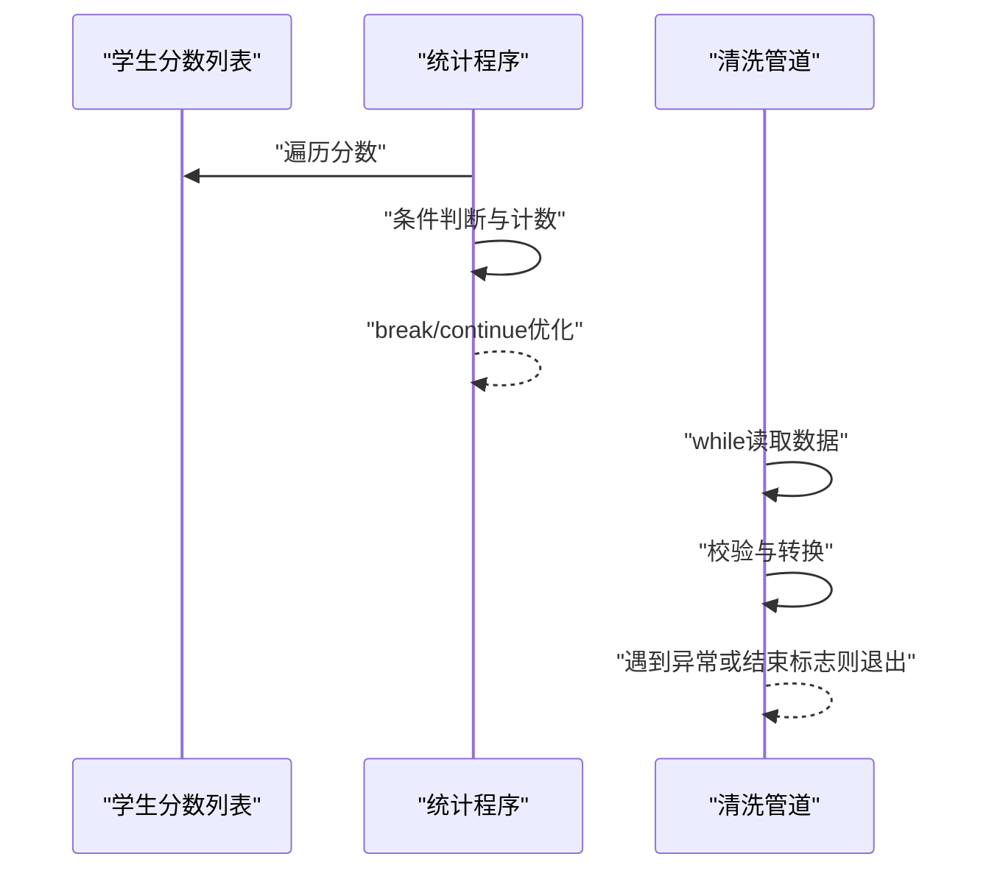
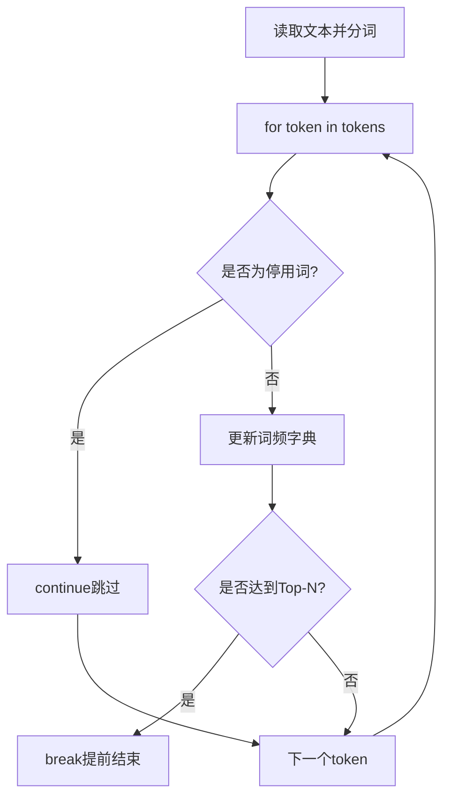
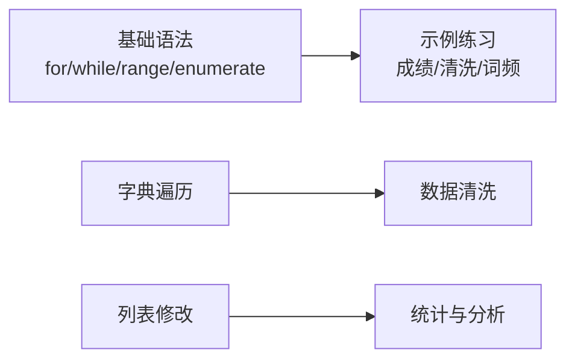

# 循环结构

<cite>
**本文引用的文件**   
- [03_for_range.py](file://00_Basics/03_for_range.py)
- [04_while_loop.py](file://00_Basics/04_while_loop.py)
- [05_nested_loop.py](file://00_Basics/05_nested_loop.py)
- [15_list_loop_modify.py](file://00_Basics/15_list_loop_modify.py)
- [demo_dict_loop.py](file://demo_dict_loop.py)
- [ex02_grade_level.py](file://ex02_grade_level.py)
- [ex06_student_scores.py](file://ex06_student_scores.py)
- [ex09_word_counter_advanced.py](file://ex09_word_counter_advanced.py)
- [ex18_data_cleaning_pipeline.py](file://ex18_data_cleaning_pipeline.py)
</cite>

## 目录
1. [简介](#简介)
2. [项目结构](#项目结构)
3. [核心组件](#核心组件)
4. [架构总览](#架构总览)
5. [详细组件分析](#详细组件分析)
6. [依赖分析](#依赖分析)
7. [性能考虑](#性能考虑)
8. [故障排查指南](#故障排查指南)
9. [结论](#结论)
10. [附录](#附录)

## 简介
本学习文档围绕Python中的循环结构展开，系统讲解for循环与while循环的工作原理、控制流与优化策略。重点包括：
- for循环的迭代机制与常见用法
- range函数的多种参数形式（单参、双参、三参）
- enumerate函数的高级应用
- while循环的条件设计与终止条件
- break与continue的使用场景与优化技巧
- 不同循环结构的性能差异与选择原则
- 调试技巧与常见陷阱规避

## 项目结构
本项目在“基础语法”和“示例练习”两个维度提供了丰富的循环实践材料：
- 基础语法示例位于 00_Basics 目录，涵盖for、while、嵌套循环以及列表遍历修改等典型模式
- 示例练习分布在根目录多个文件中，覆盖成绩统计、数据清洗、词频统计等真实场景

图表来源
- [03_for_range.py:1-200](file://00_Basics/03_for_range.py#L1-L200)
- [04_while_loop.py:1-200](file://00_Basics/04_while_loop.py#L1-L200)
- [05_nested_loop.py:1-200](file://00_Basics/05_nested_loop.py#L1-L200)
- [15_list_loop_modify.py:1-200](file://00_Basics/15_list_loop_modify.py#L1-L200)
- [ex02_grade_level.py:1-200](file://ex02_grade_level.py#L1-L200)
- [ex06_student_scores.py:1-200](file://ex06_student_scores.py#L1-L200)
- [ex09_word_counter_advanced.py:1-200](file://ex09_word_counter_advanced.py#L1-L200)
- [ex18_data_cleaning_pipeline.py:1-200](file://ex18_data_cleaning_pipeline.py#L1-L200)
- [demo_dict_loop.py:1-200](file://demo_dict_loop.py#L1-L200)

章节来源
- [03_for_range.py:1-200](file://00_Basics/03_for_range.py#L1-L200)
- [04_while_loop.py:1-200](file://00_Basics/04_while_loop.py#L1-L200)
- [05_nested_loop.py:1-200](file://00_Basics/05_nested_loop.py#L1-L200)
- [15_list_loop_modify.py:1-200](file://00_Basics/15_list_loop_modify.py#L1-L200)
- [ex02_grade_level.py:1-200](file://ex02_grade_level.py#L1-L200)
- [ex06_student_scores.py:1-200](file://ex06_student_scores.py#L1-L200)
- [ex09_word_counter_advanced.py:1-200](file://ex09_word_counter_advanced.py#L1-L200)
- [ex18_data_cleaning_pipeline.py:1-200](file://ex18_data_cleaning_pipeline.py#L1-L200)
- [demo_dict_loop.py:1-200](file://demo_dict_loop.py#L1-L200)

## 核心组件
本节聚焦循环相关的关键知识点与实践要点：
- for循环：基于可迭代对象的元素逐一访问；适合已知集合或序列的场景
- range函数：生成整数序列，支持单参、双参、三参三种形式，常用于固定次数迭代与索引访问
- enumerate函数：同时获取索引与元素，便于需要位置信息的处理逻辑
- while循环：基于布尔条件的重复执行；适合未知次数、事件驱动或等待型场景
- break与continue：用于提前退出当前循环或跳过本次迭代，提升效率与控制流清晰度

章节来源
- [03_for_range.py:1-200](file://00_Basics/03_for_range.py#L1-L200)
- [04_while_loop.py:1-200](file://00_Basics/04_while_loop.py#L1-L200)
- [05_nested_loop.py:1-200](file://00_Basics/05_nested_loop.py#L1-L200)
- [15_list_loop_modify.py:1-200](file://00_Basics/15_list_loop_modify.py#L1-L200)
- [ex02_grade_level.py:1-200](file://ex02_grade_level.py#L1-L200)
- [ex06_student_scores.py:1-200](file://ex06_student_scores.py#L1-L200)
- [ex09_word_counter_advanced.py:1-200](file://ex09_word_counter_advanced.py#L1-L200)
- [ex18_data_cleaning_pipeline.py:1-200](file://ex18_data_cleaning_pipeline.py#L1-L200)
- [demo_dict_loop.py:1-200](file://demo_dict_loop.py#L1-L200)

## 架构总览
下图展示了循环在不同任务中的调用关系与数据流向，体现for/while、range/enumerate的组合使用方式。

图表来源
- [03_for_range.py:1-200](file://00_Basics/03_for_range.py#L1-L200)
- [04_while_loop.py:1-200](file://00_Basics/04_while_loop.py#L1-L200)
- [05_nested_loop.py:1-200](file://00_Basics/05_nested_loop.py#L1-L200)
- [15_list_loop_modify.py:1-200](file://00_Basics/15_list_loop_modify.py#L1-L200)
- [demo_dict_loop.py:1-200](file://demo_dict_loop.py#L1-L200)

## 详细组件分析

### for循环与range函数
- 工作原理：for循环通过迭代协议从可迭代对象中逐个取出元素并绑定到目标变量
- range函数：
  - 单参：生成从0开始到指定上限的整数序列
  - 双参：指定起始与结束（不含），步长为1
  - 三参：指定起始、结束（不含）、步长
- 适用场景：固定次数迭代、按索引访问、生成坐标或时间片等

图表来源
- [03_for_range.py:1-200](file://00_Basics/03_for_range.py#L1-L200)

章节来源
- [03_for_range.py:1-200](file://00_Basics/03_for_range.py#L1-L200)

### enumerate函数的高级应用
- 作用：在遍历时同时提供索引与元素，避免手动维护计数器
- 高级用法：
  - 指定起始索引，便于与业务编号对齐
  - 结合条件判断进行分组、分段或窗口化处理
  - 与切片或过滤组合，实现高效的数据筛选

图表来源
- [03_for_range.py:1-200](file://00_Basics/03_for_range.py#L1-L200)
- [15_list_loop_modify.py:1-200](file://00_Basics/15_list_loop_modify.py#L1-L200)

章节来源
- [03_for_range.py:1-200](file://00_Basics/03_for_range.py#L1-L200)
- [15_list_loop_modify.py:1-200](file://00_Basics/15_list_loop_modify.py#L1-L200)

### while循环的条件控制
- 设计要点：
  - 明确初始状态与终止条件，确保循环最终能收敛
  - 在循环体内更新状态变量，避免死循环
  - 对异常输入或边界情况做防御性检查
- 适用场景：
  - 事件驱动（如等待用户输入、网络响应）
  - 数值逼近算法（如牛顿法求根）
  - 资源读取（如逐行读取直到EOF）

图表来源
- [04_while_loop.py:1-200](file://00_Basics/04_while_loop.py#L1-L200)

章节来源
- [04_while_loop.py:1-200](file://00_Basics/04_while_loop.py#L1-L200)

### break与continue语句
- break：立即终止当前循环，跳出最内层循环体
- continue：跳过本次迭代剩余逻辑，直接进入下一次迭代
- 优化场景：
  - 提前发现满足条件的结果，减少不必要的计算
  - 过滤无效数据，避免深层嵌套分支
  - 在大规模数据处理中显著降低时间复杂度

图表来源
- [05_nested_loop.py:1-200](file://00_Basics/05_nested_loop.py#L1-L200)
- [ex02_grade_level.py:1-200](file://ex02_grade_level.py#L1-L200)
- [ex06_student_scores.py:1-200](file://ex06_student_scores.py#L1-L200)

章节来源
- [05_nested_loop.py:1-200](file://00_Basics/05_nested_loop.py#L1-L200)
- [ex02_grade_level.py:1-200](file://ex02_grade_level.py#L1-L200)
- [ex06_student_scores.py:1-200](file://ex06_student_scores.py#L1-L200)

### 嵌套循环与字典遍历
- 嵌套循环：适用于二维矩阵、多表关联、组合枚举等场景
- 字典遍历：
  - 遍历键、值或键值对
  - 结合条件聚合与分组统计
  - 注意可变字典在遍历时的安全操作

图表来源
- [05_nested_loop.py:1-200](file://00_Basics/05_nested_loop.py#L1-L200)
- [demo_dict_loop.py:1-200](file://demo_dict_loop.py#L1-L200)

章节来源
- [05_nested_loop.py:1-200](file://00_Basics/05_nested_loop.py#L1-L200)
- [demo_dict_loop.py:1-200](file://demo_dict_loop.py#L1-L200)

### 实战案例：成绩统计与数据清洗
- 成绩统计：
  - 使用for循环遍历学生分数，结合条件判断统计等级
  - 利用break快速定位最高分或最低分
  - 使用continue跳过缺失或异常分数
- 数据清洗：
  - 使用while循环读取数据直到结束标志
  - 使用enumerate记录行号，便于错误定位
  - 使用break提前终止无效数据的处理

图表来源
- [ex06_student_scores.py:1-200](file://ex06_student_scores.py#L1-L200)
- [ex02_grade_level.py:1-200](file://ex02_grade_level.py#L1-L200)
- [ex18_data_cleaning_pipeline.py:1-200](file://ex18_data_cleaning_pipeline.py#L1-L200)

章节来源
- [ex06_student_scores.py:1-200](file://ex06_student_scores.py#L1-L200)
- [ex02_grade_level.py:1-200](file://ex02_grade_level.py#L1-L200)
- [ex18_data_cleaning_pipeline.py:1-200](file://ex18_data_cleaning_pipeline.py#L1-L200)

### 实战案例：词频统计与复杂逻辑
- 词频统计：
  - 使用for循环遍历文本分词结果
  - 使用字典累计词频，结合continue跳过停用词
  - 使用break在达到Top-N后提前停止
- 复杂逻辑：
  - 多层嵌套循环处理多维数据
  - 使用enumerate辅助定位上下文信息
  - 使用while循环实现滑动窗口或动态阈值

图表来源
- [ex09_word_counter_advanced.py:1-200](file://ex09_word_counter_advanced.py#L1-L200)

章节来源
- [ex09_word_counter_advanced.py:1-200](file://ex09_word_counter_advanced.py#L1-L200)

## 依赖分析
循环结构在不同模块间的依赖主要体现在数据流转与控制流上：
- 基础语法模块提供for/while、range/enumerate的基本用法
- 示例练习模块将这些能力应用于具体业务场景
- 字典遍历与列表修改涉及可变对象的安全操作

图表来源
- [03_for_range.py:1-200](file://00_Basics/03_for_range.py#L1-L200)
- [04_while_loop.py:1-200](file://00_Basics/04_while_loop.py#L1-L200)
- [demo_dict_loop.py:1-200](file://demo_dict_loop.py#L1-L200)
- [15_list_loop_modify.py:1-200](file://00_Basics/15_list_loop_modify.py#L1-L200)
- [ex18_data_cleaning_pipeline.py:1-200](file://ex18_data_cleaning_pipeline.py#L1-L200)
- [ex06_student_scores.py:1-200](file://ex06_student_scores.py#L1-L200)

章节来源
- [03_for_range.py:1-200](file://00_Basics/03_for_range.py#L1-L200)
- [04_while_loop.py:1-200](file://00_Basics/04_while_loop.py#L1-L200)
- [demo_dict_loop.py:1-200](file://demo_dict_loop.py#L1-L200)
- [15_list_loop_modify.py:1-200](file://00_Basics/15_list_loop_modify.py#L1-L200)
- [ex18_data_cleaning_pipeline.py:1-200](file://ex18_data_cleaning_pipeline.py#L1-L200)
- [ex06_student_scores.py:1-200](file://ex06_student_scores.py#L1-L200)

## 性能考虑
- 选择合适循环结构：
  - 已知集合或序列优先用for，避免手动索引管理
  - 未知次数或事件驱动场景用while，但需确保终止条件可靠
- 合理使用range与enumerate：
  - range生成的是惰性序列，内存友好
  - enumerate避免额外计数器，提高可读性与性能
- 使用break与continue优化：
  - 提前退出可减少不必要计算
  - 跳过无效数据可降低分支复杂度
- 避免在循环中频繁创建大对象：
  - 尽量复用中间结果
  - 使用生成器或流式处理替代全量加载

[本节为通用指导，不直接分析具体文件]

## 故障排查指南
- 死循环问题：
  - 检查while条件是否可能永远为真
  - 确认循环体内是否正确更新状态变量
- 索引越界：
  - 使用len或迭代协议避免手动索引错误
  - 谨慎修改正在遍历的列表长度
- 字典遍历异常：
  - 不要在遍历过程中增删键
  - 如需修改，先收集变更再批量应用
- 性能瓶颈：
  - 使用break/continue减少冗余计算
  - 避免在循环内进行昂贵的I/O或重复查询

章节来源
- [04_while_loop.py:1-200](file://00_Basics/04_while_loop.py#L1-L200)
- [15_list_loop_modify.py:1-200](file://00_Basics/15_list_loop_modify.py#L1-L200)
- [demo_dict_loop.py:1-200](file://demo_dict_loop.py#L1-L200)

## 结论
掌握Python循环结构的关键在于理解其控制流与适用场景：
- for循环适合遍历已知集合，配合range与enumerate提升表达力
- while循环适合事件驱动与未知次数场景，需严谨设计终止条件
- break与continue是优化控制流的重要工具，应合理运用
- 在实际项目中，结合数据结构特性与业务需求选择最优循环模式，并通过调试与测试确保正确性与性能

[本节为总结性内容，不直接分析具体文件]

## 附录
- 推荐实践：
  - 优先使用for+enumerate替代手动索引
  - 使用range(start, stop, step)精确控制迭代范围
  - 在大型数据集上使用生成器与惰性求值
  - 对关键路径进行性能剖析与基准测试
- 参考文件路径：
  - [03_for_range.py](file://00_Basics/03_for_range.py)
  - [04_while_loop.py](file://00_Basics/04_while_loop.py)
  - [05_nested_loop.py](file://00_Basics/05_nested_loop.py)
  - [15_list_loop_modify.py](file://00_Basics/15_list_loop_modify.py)
  - [ex02_grade_level.py](file://ex02_grade_level.py)
  - [ex06_student_scores.py](file://ex06_student_scores.py)
  - [ex09_word_counter_advanced.py](file://ex09_word_counter_advanced.py)
  - [ex18_data_cleaning_pipeline.py](file://ex18_data_cleaning_pipeline.py)
  - [demo_dict_loop.py](file://demo_dict_loop.py)