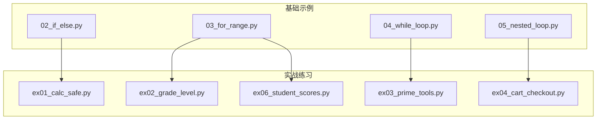
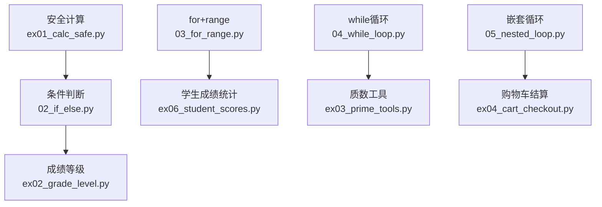
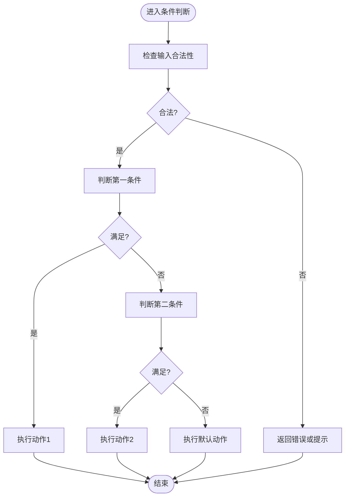
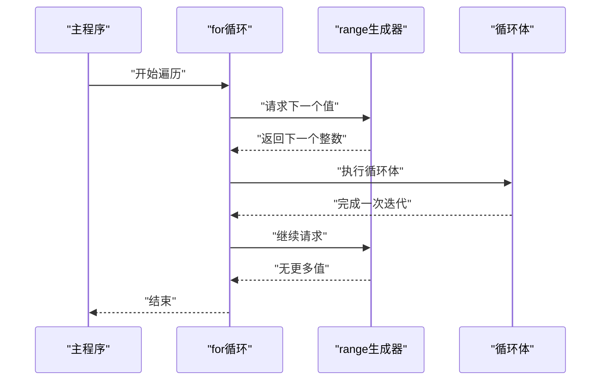
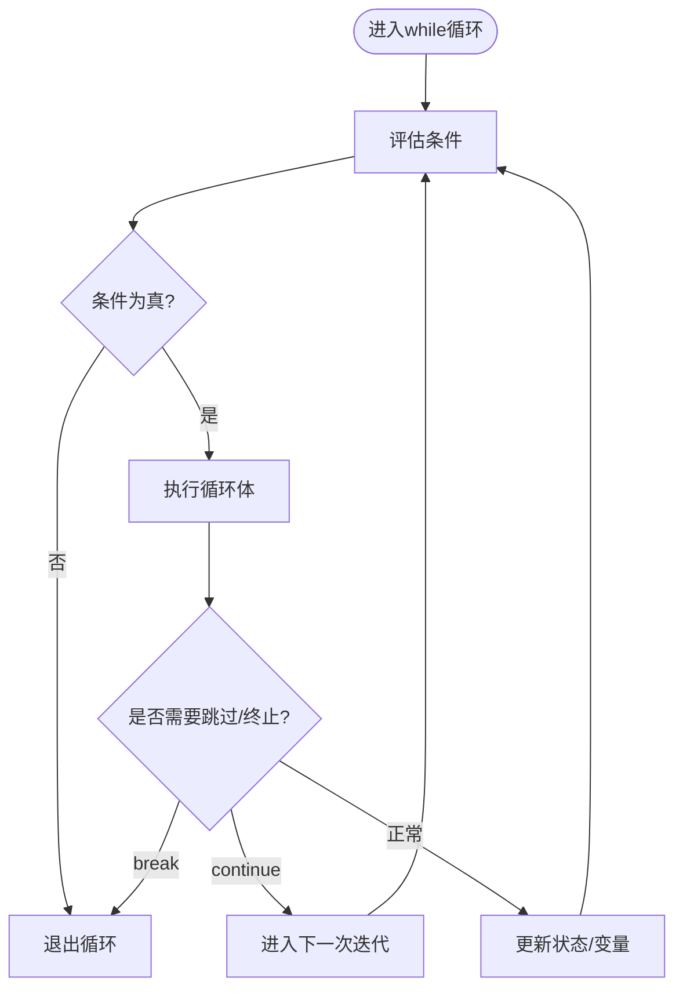
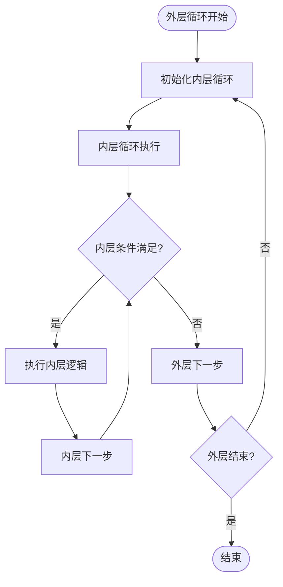
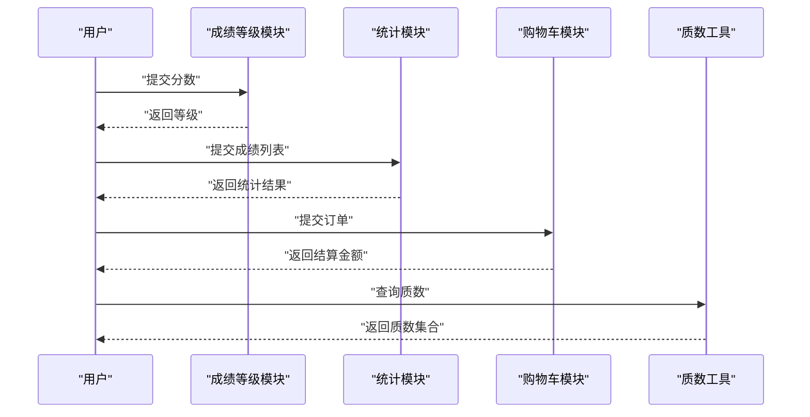
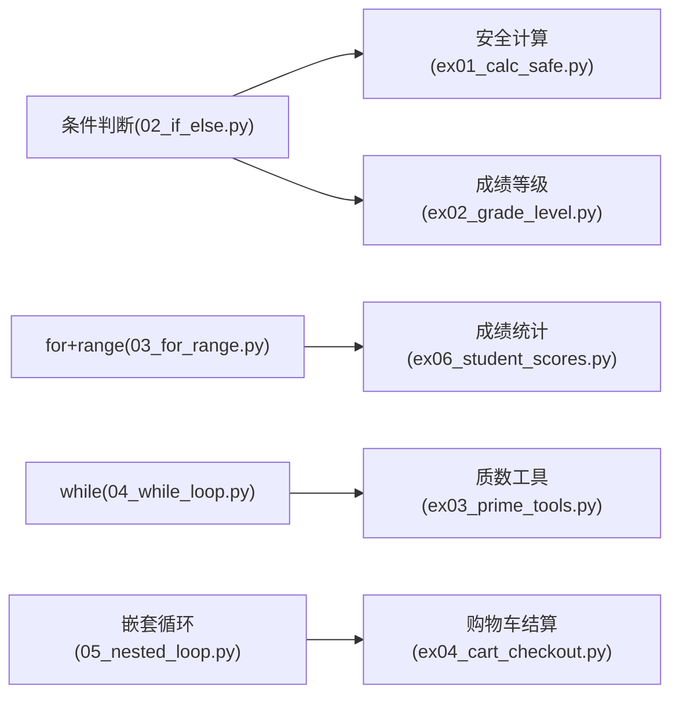

# 控制流语句

<cite>
**本文引用的文件**   
- [02_if_else.py](file://00_Basics/02_if_else.py)
- [03_for_range.py](file://00_Basics/03_for_range.py)
- [04_while_loop.py](file://00_Basics/04_while_loop.py)
- [05_nested_loop.py](file://00_Basics/05_nested_loop.py)
- [ex01_calc_safe.py](file://ex01_calc_safe.py)
- [ex02_grade_level.py](file://ex02_grade_level.py)
- [ex03_prime_tools.py](file://ex03_prime_tools.py)
- [ex04_cart_checkout.py](file://ex04_cart_checkout.py)
- [ex06_student_scores.py](file://ex06_student_scores.py)
</cite>

## 目录
1. [简介](#简介)
2. [项目结构](#项目结构)
3. [核心组件](#核心组件)
4. [架构总览](#架构总览)
5. [详细组件分析](#详细组件分析)
6. [依赖分析](#依赖分析)
7. [性能考虑](#性能考虑)
8. [故障排查指南](#故障排查指南)
9. [结论](#结论)
10. [附录：练习题与参考答案路径](#附录练习题与参考答案路径)

## 简介
本学习文档围绕Python控制流语句展开，系统讲解条件判断（if-elif-else）、循环结构（for、while）以及流程控制关键字（break、continue），并结合嵌套循环的实现原理、性能考量与常见陷阱。通过实际案例展示不同控制流语句的组合使用，提供优化技巧与调试方法，并配套练习题帮助巩固理解。

## 项目结构
本项目以“基础示例 + 实战练习”的方式组织内容。与控制流相关的核心文件位于00_Basics目录，辅以多个综合练习文件用于组合应用。

图表来源
- [02_if_else.py:1-200](file://00_Basics/02_if_else.py#L1-L200)
- [03_for_range.py:1-200](file://00_Basics/03_for_range.py#L1-L200)
- [04_while_loop.py:1-200](file://00_Basics/04_while_loop.py#L1-L200)
- [05_nested_loop.py:1-200](file://00_Basics/05_nested_loop.py#L1-L200)
- [ex01_calc_safe.py:1-200](file://ex01_calc_safe.py#L1-L200)
- [ex02_grade_level.py:1-200](file://ex02_grade_level.py#L1-L200)
- [ex03_prime_tools.py:1-200](file://ex03_prime_tools.py#L1-L200)
- [ex04_cart_checkout.py:1-200](file://ex04_cart_checkout.py#L1-L200)
- [ex06_student_scores.py:1-200](file://ex06_student_scores.py#L1-L200)

章节来源
- [02_if_else.py:1-200](file://00_Basics/02_if_else.py#L1-L200)
- [03_for_range.py:1-200](file://00_Basics/03_for_range.py#L1-L200)
- [04_while_loop.py:1-200](file://00_Basics/04_while_loop.py#L1-L200)
- [05_nested_loop.py:1-200](file://00_Basics/05_nested_loop.py#L1-L200)
- [ex01_calc_safe.py:1-200](file://ex01_calc_safe.py#L1-L200)
- [ex02_grade_level.py:1-200](file://ex02_grade_level.py#L1-L200)
- [ex03_prime_tools.py:1-200](file://ex03_prime_tools.py#L1-L200)
- [ex04_cart_checkout.py:1-200](file://ex04_cart_checkout.py#L1-L200)
- [ex06_student_scores.py:1-200](file://ex06_student_scores.py#L1-L200)

## 核心组件
- 条件判断（if-elif-else）
  - 多重条件判断：通过elif分支处理多区间或多规则场景。
  - 嵌套条件：在分支内部再次进行条件判断，适用于复杂业务规则。
  - 典型应用：成绩等级划分、安全计算中的除零保护等。
- 循环结构
  - for循环与range函数：遍历固定次数或序列，常用于索引访问、批量处理。
  - while循环：基于布尔条件的重复执行，适合不确定次数的迭代。
  - break与continue：提前终止当前循环或跳过本次迭代。
- 嵌套循环
  - 外层循环驱动主流程，内层循环处理子任务；注意时间复杂度与内存占用。
  - 常见陷阱：变量覆盖、边界错误、过早退出、重复计算。

章节来源
- [02_if_else.py:1-200](file://00_Basics/02_if_else.py#L1-L200)
- [03_for_range.py:1-200](file://00_Basics/03_for_range.py#L1-L200)
- [04_while_loop.py:1-200](file://00_Basics/04_while_loop.py#L1-L200)
- [05_nested_loop.py:1-200](file://00_Basics/05_nested_loop.py#L1-L200)
- [ex01_calc_safe.py:1-200](file://ex01_calc_safe.py#L1-L200)
- [ex02_grade_level.py:1-200](file://ex02_grade_level.py#L1-L200)
- [ex03_prime_tools.py:1-200](file://ex03_prime_tools.py#L1-L200)
- [ex04_cart_checkout.py:1-200](file://ex04_cart_checkout.py#L1-L200)
- [ex06_student_scores.py:1-200](file://ex06_student_scores.py#L1-L200)

## 架构总览
下图展示了控制流相关的基础示例与练习之间的调用关系与数据流向。基础示例提供语法与模式，练习文件将这些模式应用于具体业务场景。

图表来源
- [02_if_else.py:1-200](file://00_Basics/02_if_else.py#L1-L200)
- [03_for_range.py:1-200](file://00_Basics/03_for_range.py#L1-L200)
- [04_while_loop.py:1-200](file://00_Basics/04_while_loop.py#L1-L200)
- [05_nested_loop.py:1-200](file://00_Basics/05_nested_loop.py#L1-L200)
- [ex01_calc_safe.py:1-200](file://ex01_calc_safe.py#L1-L200)
- [ex02_grade_level.py:1-200](file://ex02_grade_level.py#L1-L200)
- [ex03_prime_tools.py:1-200](file://ex03_prime_tools.py#L1-L200)
- [ex04_cart_checkout.py:1-200](file://ex04_cart_checkout.py#L1-L200)
- [ex06_student_scores.py:1-200](file://ex06_student_scores.py#L1-L200)

## 详细组件分析

### 条件判断（if-elif-else）
- 逻辑结构
  - 单分支：满足条件时执行特定逻辑。
  - 多分支：使用elif处理多个互斥条件。
  - 默认分支：else兜底处理未覆盖的情况。
- 应用场景
  - 成绩等级划分：根据分数区间映射到A/B/C/D/E等级。
  - 安全计算：在除法前检查除数是否为零，避免异常。
- 嵌套条件
  - 在分支内部再次判断，适用于复合规则（如先判断输入合法性，再判断业务规则）。
- 最佳实践
  - 将最可能命中或最简单的条件放在前面，减少不必要的判断。
  - 对边界值进行显式测试，确保区间不重叠且全覆盖。

图表来源
- [02_if_else.py:1-200](file://00_Basics/02_if_else.py#L1-L200)
- [ex01_calc_safe.py:1-200](file://ex01_calc_safe.py#L1-L200)
- [ex02_grade_level.py:1-200](file://ex02_grade_level.py#L1-L200)

章节来源
- [02_if_else.py:1-200](file://00_Basics/02_if_else.py#L1-L200)
- [ex01_calc_safe.py:1-200](file://ex01_calc_safe.py#L1-L200)
- [ex02_grade_level.py:1-200](file://ex02_grade_level.py#L1-L200)

### for循环与range函数
- range用法要点
  - 生成整数序列，支持start、stop、step参数。
  - 常用于索引遍历、固定次数循环、步长控制。
- 典型场景
  - 遍历列表索引：结合len与range实现按索引修改元素。
  - 批量数据处理：对每个元素执行相同操作。
- 注意事项
  - 避免在循环中频繁创建大对象，尽量复用中间结果。
  - 当需要反向遍历时，可使用负步长或反转序列。

图表来源
- [03_for_range.py:1-200](file://00_Basics/03_for_range.py#L1-L200)
- [ex06_student_scores.py:1-200](file://ex06_student_scores.py#L1-L200)

章节来源
- [03_for_range.py:1-200](file://00_Basics/03_for_range.py#L1-L200)
- [ex06_student_scores.py:1-200](file://ex06_student_scores.py#L1-L200)

### while循环与流程控制（break/continue）
- while循环
  - 基于条件表达式持续执行，直到条件为假。
  - 适合等待外部事件、用户输入校验、重试机制等。
- break
  - 立即终止当前循环，跳出到循环外。
- continue
  - 跳过本次迭代剩余代码，直接进入下一次迭代。
- 常见陷阱
  - 忘记更新循环变量导致死循环。
  - 条件过于宽松或过严导致逻辑偏差。

图表来源
- [04_while_loop.py:1-200](file://00_Basics/04_while_loop.py#L1-L200)
- [ex03_prime_tools.py:1-200](file://ex03_prime_tools.py#L1-L200)

章节来源
- [04_while_loop.py:1-200](file://00_Basics/04_while_loop.py#L1-L200)
- [ex03_prime_tools.py:1-200](file://ex03_prime_tools.py#L1-L200)

### 嵌套循环
- 实现原理
  - 外层循环每迭代一次，内层循环完整执行一遍。
  - 常用于矩阵运算、配对比较、多层过滤等。
- 性能考虑
  - 时间复杂度通常为O(n×m)，需警惕大数据量下的性能瓶颈。
  - 可尝试提前剪枝、缓存中间结果、减少重复计算。
- 常见陷阱
  - 变量名冲突或覆盖。
  - 边界条件错误（如索引越界）。
  - 过早break导致结果不完整。

图表来源
- [05_nested_loop.py:1-200](file://00_Basics/05_nested_loop.py#L1-L200)
- [ex04_cart_checkout.py:1-200](file://ex04_cart_checkout.py#L1-L200)

章节来源
- [05_nested_loop.py:1-200](file://00_Basics/05_nested_loop.py#L1-L200)
- [ex04_cart_checkout.py:1-200](file://ex04_cart_checkout.py#L1-L200)

### 实战组合案例
- 成绩等级与统计
  - 使用if-elif-else进行等级判定，再用for循环遍历成绩列表进行统计。
- 购物车结算
  - 使用嵌套循环遍历商品与折扣规则，结合break/continue优化结算流程。
- 质数工具
  - 使用while循环与break实现高效质数检测，配合range进行范围筛选。

图表来源
- [ex02_grade_level.py:1-200](file://ex02_grade_level.py#L1-L200)
- [ex06_student_scores.py:1-200](file://ex06_student_scores.py#L1-L200)
- [ex04_cart_checkout.py:1-200](file://ex04_cart_checkout.py#L1-L200)
- [ex03_prime_tools.py:1-200](file://ex03_prime_tools.py#L1-L200)

章节来源
- [ex02_grade_level.py:1-200](file://ex02_grade_level.py#L1-L200)
- [ex06_student_scores.py:1-200](file://ex06_student_scores.py#L1-L200)
- [ex04_cart_checkout.py:1-200](file://ex04_cart_checkout.py#L1-L200)
- [ex03_prime_tools.py:1-200](file://ex03_prime_tools.py#L1-L200)

## 依赖分析
- 基础示例与练习的耦合关系
  - 基础示例提供通用模式（条件、循环、嵌套），练习文件将其应用到具体领域。
  - 通过模块化拆分，降低耦合度，便于复用与测试。
- 潜在循环依赖
  - 当前结构清晰，未见直接循环导入；若后续引入跨模块调用，需注意分层与接口设计。

图表来源
- [02_if_else.py:1-200](file://00_Basics/02_if_else.py#L1-L200)
- [03_for_range.py:1-200](file://00_Basics/03_for_range.py#L1-L200)
- [04_while_loop.py:1-200](file://00_Basics/04_while_loop.py#L1-L200)
- [05_nested_loop.py:1-200](file://00_Basics/05_nested_loop.py#L1-L200)
- [ex01_calc_safe.py:1-200](file://ex01_calc_safe.py#L1-L200)
- [ex02_grade_level.py:1-200](file://ex02_grade_level.py#L1-L200)
- [ex03_prime_tools.py:1-200](file://ex03_prime_tools.py#L1-L200)
- [ex04_cart_checkout.py:1-200](file://ex04_cart_checkout.py#L1-L200)
- [ex06_student_scores.py:1-200](file://ex06_student_scores.py#L1-L200)

章节来源
- [02_if_else.py:1-200](file://00_Basics/02_if_else.py#L1-L200)
- [03_for_range.py:1-200](file://00_Basics/03_for_range.py#L1-L200)
- [04_while_loop.py:1-200](file://00_Basics/04_while_loop.py#L1-L200)
- [05_nested_loop.py:1-200](file://00_Basics/05_nested_loop.py#L1-L200)
- [ex01_calc_safe.py:1-200](file://ex01_calc_safe.py#L1-L200)
- [ex02_grade_level.py:1-200](file://ex02_grade_level.py#L1-L200)
- [ex03_prime_tools.py:1-200](file://ex03_prime_tools.py#L1-L200)
- [ex04_cart_checkout.py:1-200](file://ex04_cart_checkout.py#L1-L200)
- [ex06_student_scores.py:1-200](file://ex06_student_scores.py#L1-L200)

## 性能考虑
- 条件判断
  - 将高频命中条件前置，减少平均判断次数。
  - 使用字典映射替代多层if-elif，提升可读性与性能。
- for循环
  - 避免在循环体内进行昂贵操作（如I/O、复杂计算），可预先计算或缓存。
  - 合理使用range步长，减少迭代次数。
- while循环
  - 确保每次迭代都有进展，防止死循环。
  - 设置最大迭代上限作为安全网。
- 嵌套循环
  - 优先剪枝：在内层循环开始前进行快速过滤。
  - 合并计算：将多次扫描合并为一次遍历。
  - 使用数据结构优化：如哈希表、排序后双指针等。

[本节为通用指导，无需列出具体文件来源]

## 故障排查指南
- 常见问题
  - 条件分支遗漏：补充else或增加边界测试用例。
  - 循环变量未更新：确认while循环体内有推进逻辑。
  - break/continue误用：检查是否在正确位置中断或跳过。
  - 嵌套循环边界错误：打印关键变量或使用断点定位。
- 调试方法
  - 插入日志输出关键变量与分支命中情况。
  - 使用最小数据集复现问题，逐步放大验证。
  - 编写单元测试覆盖典型与异常路径。

章节来源
- [ex01_calc_safe.py:1-200](file://ex01_calc_safe.py#L1-L200)
- [ex02_grade_level.py:1-200](file://ex02_grade_level.py#L1-L200)
- [ex03_prime_tools.py:1-200](file://ex03_prime_tools.py#L1-L200)
- [ex04_cart_checkout.py:1-200](file://ex04_cart_checkout.py#L1-L200)
- [ex06_student_scores.py:1-200](file://ex06_student_scores.py#L1-L200)

## 结论
掌握条件判断与循环结构是理解程序流程控制的关键。通过合理组织分支与循环、善用break/continue、谨慎处理嵌套循环，可以显著提升代码的可读性与性能。建议结合实战练习反复演练，形成稳定的编程直觉。

[本节为总结性内容，无需列出具体文件来源]

## 附录：练习题与参考答案路径
- 条件判断
  - 题目：实现一个安全计算器，处理除零与非法输入。
  - 参考路径：[ex01_calc_safe.py](file://ex01_calc_safe.py)
- 成绩等级
  - 题目：根据分数区间输出等级，并统计各等级人数。
  - 参考路径：[ex02_grade_level.py](file://ex02_grade_level.py)、[ex06_student_scores.py](file://ex06_student_scores.py)
- 质数工具
  - 题目：使用while循环与break实现质数检测与范围筛选。
  - 参考路径：[ex03_prime_tools.py](file://ex03_prime_tools.py)
- 购物车结算
  - 题目：使用嵌套循环遍历商品与折扣规则，计算最终金额。
  - 参考路径：[ex04_cart_checkout.py](file://ex04_cart_checkout.py)
- 基础语法
  - 条件判断示例：[02_if_else.py](file://00_Basics/02_if_else.py)
  - for与range示例：[03_for_range.py](file://00_Basics/03_for_range.py)
  - while循环示例：[04_while_loop.py](file://00_Basics/04_while_loop.py)
  - 嵌套循环示例：[05_nested_loop.py](file://00_Basics/05_nested_loop.py)