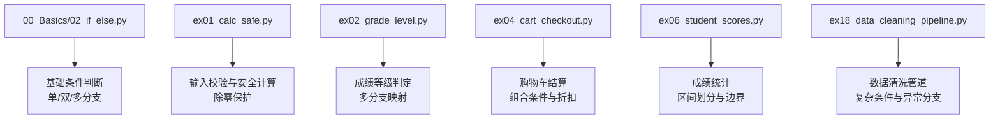
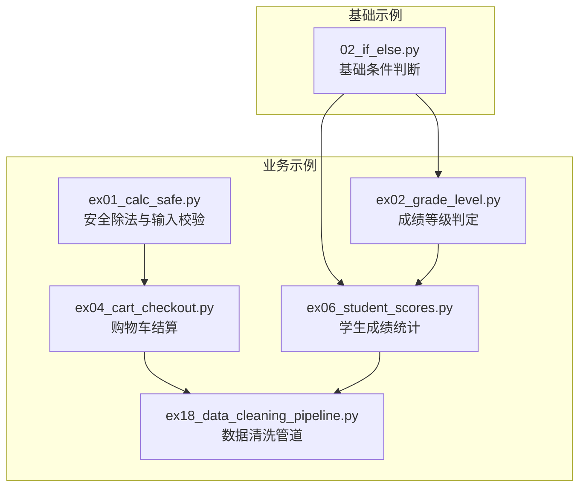
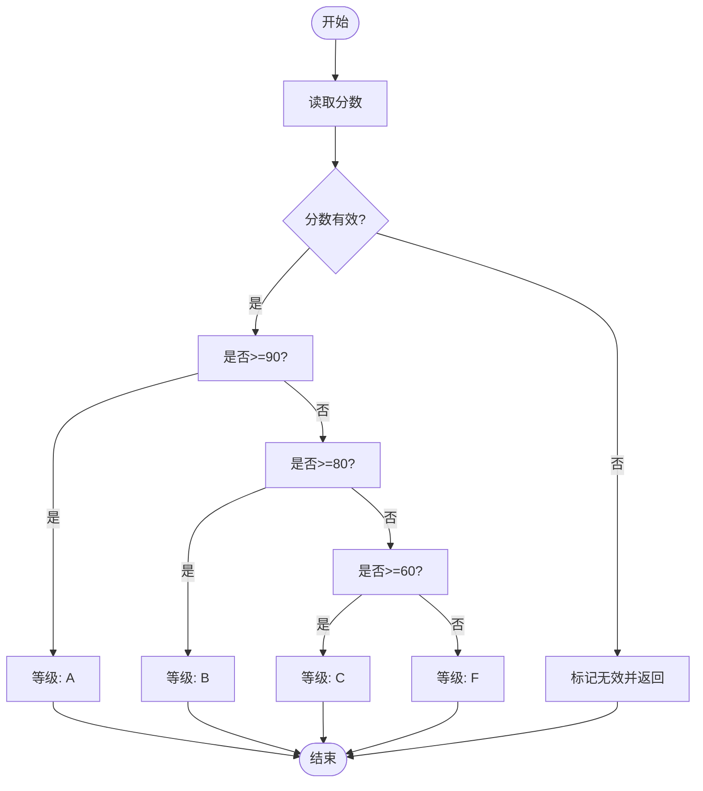
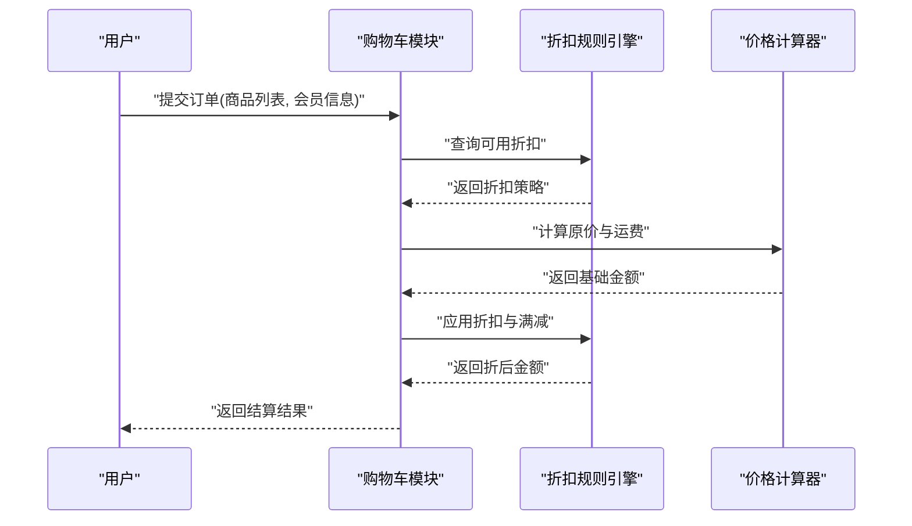
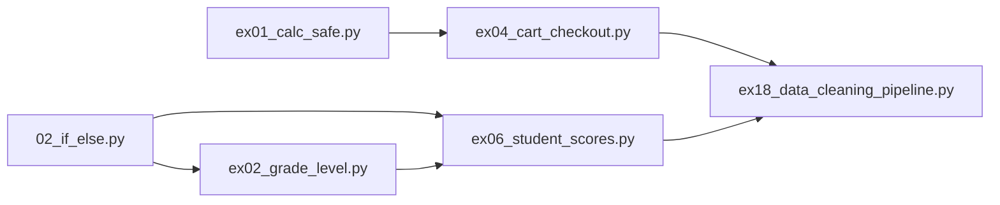

# 条件判断语句

<cite>
**本文引用的文件**   
- [02_if_else.py](file://00_Basics/02_if_else.py)
- [ex01_calc_safe.py](file://ex01_calc_safe.py)
- [ex02_grade_level.py](file://ex02_grade_level.py)
- [ex04_cart_checkout.py](file://ex04_cart_checkout.py)
- [ex06_student_scores.py](file://ex06_student_scores.py)
- [ex18_data_cleaning_pipeline.py](file://ex18_data_cleaning_pipeline.py)
</cite>

## 目录
1. [简介](#简介)
2. [项目结构](#项目结构)
3. [核心组件](#核心组件)
4. [架构总览](#架构总览)
5. [详细组件分析](#详细组件分析)
6. [依赖分析](#依赖分析)
7. [性能考虑](#性能考虑)
8. [故障排查指南](#故障排查指南)
9. [结论](#结论)
10. [附录：练习题与参考答案路径](#附录练习题与参考答案路径)

## 简介
本学习文档围绕Python的条件判断语句展开，系统讲解if、elif、else的语法结构与使用场景，覆盖单分支、双分支与多分支条件判断；深入介绍布尔表达式、比较运算符与逻辑运算符的组合用法；通过仓库中的实际案例展示复杂条件判断的实现方法与嵌套条件判断的最佳实践；并提供常见错误与调试技巧以及配套练习，帮助学习者掌握程序流程控制中的条件分支逻辑。

## 项目结构
本项目包含多个以“示例”命名的脚本，其中多处使用了条件判断语句来演示不同场景下的分支逻辑。与条件判断直接相关的示例文件包括：
- 基础条件判断示例：00_Basics/02_if_else.py
- 安全除法与输入校验：ex01_calc_safe.py
- 成绩等级判定（多分支）：ex02_grade_level.py
- 购物车结算（组合条件）：ex04_cart_checkout.py
- 学生成绩统计（多分支与边界处理）：ex06_student_scores.py
- 数据清洗管道（复杂条件与异常分支）：ex18_data_cleaning_pipeline.py

图表来源
- [02_if_else.py](file://00_Basics/02_if_else.py)
- [ex01_calc_safe.py](file://ex01_calc_safe.py)
- [ex02_grade_level.py](file://ex02_grade_level.py)
- [ex04_cart_checkout.py](file://ex04_cart_checkout.py)
- [ex06_student_scores.py](file://ex06_student_scores.py)
- [ex18_data_cleaning_pipeline.py](file://ex18_data_cleaning_pipeline.py)

章节来源
- [02_if_else.py](file://00_Basics/02_if_else.py)
- [ex01_calc_safe.py](file://ex01_calc_safe.py)
- [ex02_grade_level.py](file://ex02_grade_level.py)
- [ex04_cart_checkout.py](file://ex04_cart_checkout.py)
- [ex06_student_scores.py](file://ex06_student_scores.py)
- [ex18_data_cleaning_pipeline.py](file://ex18_data_cleaning_pipeline.py)

## 核心组件
本节从概念层面梳理条件判断的核心要素，并结合仓库中的示例进行说明。

- 单分支（if）
  - 适用场景：满足特定条件时执行某段逻辑，不满足则跳过。
  - 典型用例：输入合法性检查、可选功能开关。
  - 参考实现位置：[ex01_calc_safe.py](file://ex01_calc_safe.py)、[ex06_student_scores.py](file://ex06_student_scores.py)

- 双分支（if-else）
  - 适用场景：二选一逻辑，如成功/失败、是/否。
  - 典型用例：登录结果反馈、是否达到阈值。
  - 参考实现位置：[02_if_else.py](file://00_Basics/02_if_else.py)、[ex04_cart_checkout.py](file://ex04_cart_checkout.py)

- 多分支（if-elif-else）
  - 适用场景：多区间或多类别判定，如成绩等级、会员级别。
  - 典型用例：分数段到等级的映射、订单状态分类。
  - 参考实现位置：[ex02_grade_level.py](file://ex02_grade_level.py)、[ex06_student_scores.py](file://ex06_student_scores.py)

- 布尔表达式与运算符
  - 比较运算符：等于、不等于、大于、小于、大于等于、小于等于等。
  - 逻辑运算符：与、或、非，用于组合多个条件。
  - 短路求值：and、or在特定条件下可提前终止求值，提升效率。
  - 参考实现位置：[ex04_cart_checkout.py](file://ex04_cart_checkout.py)、[ex18_data_cleaning_pipeline.py](file://ex18_data_cleaning_pipeline.py)

- 嵌套条件判断
  - 适用场景：外层条件筛选后，内层进一步细化判断。
  - 最佳实践：优先扁平化（减少嵌套层级），必要时用提前返回或函数拆分。
  - 参考实现位置：[ex04_cart_checkout.py](file://ex04_cart_checkout.py)、[ex18_data_cleaning_pipeline.py](file://ex18_data_cleaning_pipeline.py)

章节来源
- [02_if_else.py](file://00_Basics/02_if_else.py)
- [ex01_calc_safe.py](file://ex01_calc_safe.py)
- [ex02_grade_level.py](file://ex02_grade_level.py)
- [ex04_cart_checkout.py](file://ex04_cart_checkout.py)
- [ex06_student_scores.py](file://ex06_student_scores.py)
- [ex18_data_cleaning_pipeline.py](file://ex18_data_cleaning_pipeline.py)

## 架构总览
下图展示了条件判断在不同示例中的调用关系与职责分工，便于理解整体流程与控制流。

图表来源
- [02_if_else.py](file://00_Basics/02_if_else.py)
- [ex01_calc_safe.py](file://ex01_calc_safe.py)
- [ex02_grade_level.py](file://ex02_grade_level.py)
- [ex04_cart_checkout.py](file://ex04_cart_checkout.py)
- [ex06_student_scores.py](file://ex06_student_scores.py)
- [ex18_data_cleaning_pipeline.py](file://ex18_data_cleaning_pipeline.py)

## 详细组件分析

### 基础条件判断（02_if_else.py）
- 目标：演示单分支、双分支与多分支的基本语法与缩进规则。
- 关键点：
  - if/elif/else的并列顺序决定匹配优先级。
  - 缩进一致性是Python语法要求。
  - 布尔表达式的可读性优于过度复杂的复合条件。
- 建议：
  - 将复杂条件拆分为命名良好的中间变量，提高可读性与可测试性。
  - 对边界值（如0、负数、空字符串）进行显式检查。

章节来源
- [02_if_else.py](file://00_Basics/02_if_else.py)

### 安全除法与输入校验（ex01_calc_safe.py）
- 目标：在用户输入与除数为0的情况下保证程序健壮性。
- 关键点：
  - 输入类型与范围校验（例如是否为数字、是否大于0）。
  - 异常分支处理（除零保护）。
  - 使用if-else明确成功与失败路径。
- 建议：
  - 对用户输入进行规范化（去空白、默认值）。
  - 对异常情况进行日志记录与友好提示。

章节来源
- [ex01_calc_safe.py](file://ex01_calc_safe.py)

### 成绩等级判定（ex02_grade_level.py）
- 目标：根据分数区间映射到等级（如A/B/C/D/F）。
- 关键点：
  - 多分支if-elif-else的顺序应从高到低或从低到高保持一致。
  - 边界值（如刚好等于阈值）的处理需明确。
  - 非法输入（负数、超过满分）应进入兜底分支。
- 建议：
  - 将等级映射表与判定逻辑分离，便于扩展与维护。
  - 为每个等级添加注释，明确区间定义。

章节来源
- [ex02_grade_level.py](file://ex02_grade_level.py)

### 购物车结算（ex04_cart_checkout.py）
- 目标：结合多种条件（会员等级、商品数量、促销规则）计算最终价格。
- 关键点：
  - 组合条件（与、或、非）的正确使用。
  - 条件优先级与短路求值的利用。
  - 嵌套条件的合理组织与避免过深嵌套。
- 建议：
  - 将折扣策略封装为独立函数或策略对象，降低主流程复杂度。
  - 对关键中间结果（原价、折扣额、运费）进行断言或日志输出以便调试。

章节来源
- [ex04_cart_checkout.py](file://ex04_cart_checkout.py)

### 学生成绩统计（ex06_student_scores.py）
- 目标：对一组成绩进行统计与分级汇总。
- 关键点：
  - 遍历数据并应用条件判断进行分类计数。
  - 区间划分与边界处理的一致性。
  - 对缺失值或异常数据的容错处理。
- 建议：
  - 使用字典或计数器聚合结果，便于后续导出与分析。
  - 对统计过程增加单元测试，确保边界情况正确。

章节来源
- [ex06_student_scores.py](file://ex06_student_scores.py)

### 数据清洗管道（ex18_data_cleaning_pipeline.py）
- 目标：在数据处理流水线中应用复杂条件判断进行过滤、转换与异常分支处理。
- 关键点：
  - 多阶段条件判断（读取→校验→清洗→输出）。
  - 使用布尔表达式组合多个字段规则。
  - 异常分支的降级策略（如保留原始值、标记脏数据）。
- 建议：
  - 将每条清洗规则抽象为可复用的函数，便于组合与测试。
  - 对清洗前后数据进行快照对比，便于审计与回溯。

章节来源
- [ex18_data_cleaning_pipeline.py](file://ex18_data_cleaning_pipeline.py)

#### 流程图：成绩等级判定（概念示意）

图表来源
- [ex02_grade_level.py](file://ex02_grade_level.py)

#### 序列图：购物车结算流程（概念示意）

图表来源
- [ex04_cart_checkout.py](file://ex04_cart_checkout.py)

## 依赖分析
条件判断在各示例中的依赖关系如下：
- 基础示例提供通用模式，被更复杂的业务示例复用。
- 业务示例之间通过相似的模式（输入校验、区间判定、组合条件）形成间接耦合。
- 数据清洗管道作为综合示例，整合了前述模式的组合使用。

图表来源
- [02_if_else.py](file://00_Basics/02_if_else.py)
- [ex01_calc_safe.py](file://ex01_calc_safe.py)
- [ex02_grade_level.py](file://ex02_grade_level.py)
- [ex04_cart_checkout.py](file://ex04_cart_checkout.py)
- [ex06_student_scores.py](file://ex06_student_scores.py)
- [ex18_data_cleaning_pipeline.py](file://ex18_data_cleaning_pipeline.py)

## 性能考虑
- 条件顺序优化：将最可能命中或代价最低的条件放在前面，减少不必要的计算。
- 短路求值：合理使用and/or，避免昂贵操作在不需要时执行。
- 避免重复计算：将复杂表达式缓存到变量中，提升可读性与性能。
- 分支合并：当多个分支执行相同逻辑时，合并以减少代码冗余。
- 复杂条件拆分：将长条件拆分为命名良好的子表达式，便于测试与优化。

## 故障排查指南
- 常见错误
  - 缩进不一致导致语法错误。
  - 遗漏else分支导致未覆盖的输入路径。
  - 比较运算符误用（=与==混淆）。
  - 逻辑运算符优先级误解（缺少括号导致意外结果）。
  - 边界值未处理（等于阈值、空值、负数）。
- 调试技巧
  - 打印关键中间变量与条件结果，确认分支走向。
  - 使用最小可复现用例验证边界情况。
  - 将复杂条件拆分为小函数，单独测试其布尔返回值。
  - 对异常分支增加日志与告警，便于定位问题。

## 结论
条件判断是程序流程控制的基础能力。通过单分支、双分支与多分支的组合，配合布尔表达式与逻辑运算符，可以构建灵活且健壮的业务逻辑。在实际项目中，应注重条件顺序、可读性与可维护性，并通过合理的拆分与测试保障质量。

## 附录：练习题与参考答案路径
- 练习1：编写一个函数，接收用户年龄，若小于18输出“未成年”，否则输出“成年”。
  - 参考路径：[02_if_else.py](file://00_Basics/02_if_else.py)
- 练习2：实现成绩等级映射（>=90为A，>=80为B，>=60为C，其余为F），并处理非法输入。
  - 参考路径：[ex02_grade_level.py](file://ex02_grade_level.py)
- 练习3：实现购物车折扣计算，考虑会员等级与满减免规则，输出最终价格。
  - 参考路径：[ex04_cart_checkout.py](file://ex04_cart_checkout.py)
- 练习4：对一组成绩进行统计，分别计算各等级人数与平均分，并输出报告。
  - 参考路径：[ex06_student_scores.py](file://ex06_student_scores.py)
- 练习5：在数据清洗管道中加入新的过滤规则（如去除空值与异常值），并记录清洗日志。
  - 参考路径：[ex18_data_cleaning_pipeline.py](file://ex18_data_cleaning_pipeline.py)