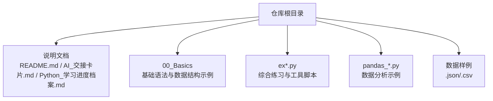
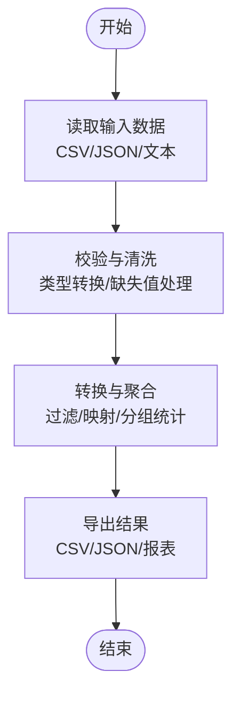
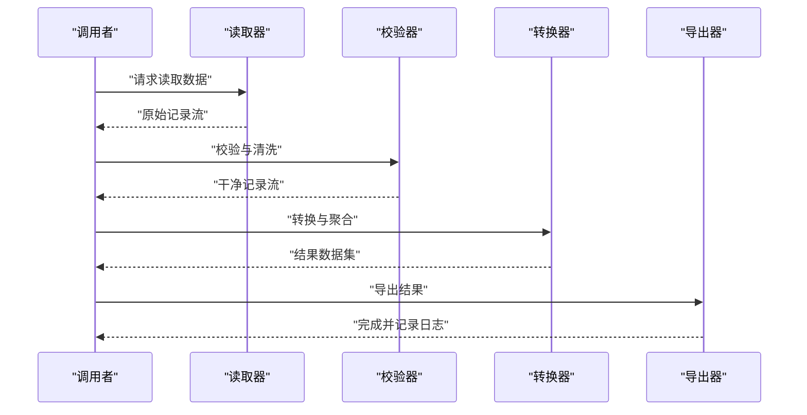
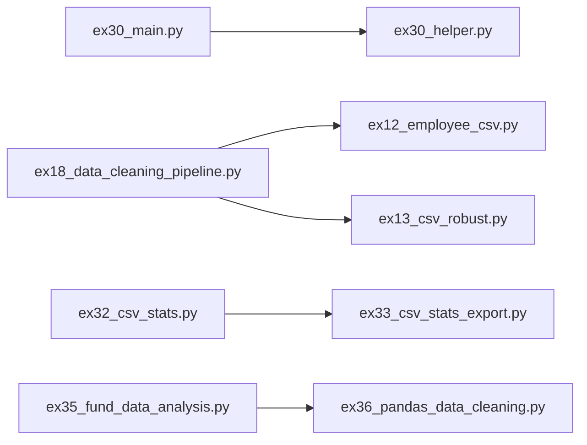

# 代码规范与最佳实践

<cite>
**本文引用的文件**   
- [README.md](file://README.md)
- [AI_交接卡片.md](file://AI_交接卡片.md)
- [Python_学习进度档案.md](file://Python_学习进度档案.md)
- [00_Basics/01_print_vars.py](file://00_Basics/01_print_vars.py)
- [00_Basics/02_if_else.py](file://00_Basics/02_if_else.py)
- [00_Basics/03_for_range.py](file://00_Basics/03_for_range.py)
- [00_Basics/04_while_loop.py](file://00_Basics/04_while_loop.py)
- [00_Basics/05_nested_loop.py](file://00_Basics/05_nested_loop.py)
- [00_Basics/06_list_ops.py](file://00_Basics/06_list_ops.py)
- [00_Basics/07_tuple_set.py](file://00_Basics/07_tuple_set.py)
- [00_Basics/08_dict_basics.py](file://00_Basics/08_dict_basics.py)
- [00_Basics/09_nested_dict_access.py](file://00_Basics/09_nested_dict_access.py)
- [00_Basics/10_file_write_read.py](file://00_Basics/10_file_write_read.py)
- [00_Basics/11_list_comprehension.py](file://00_Basics/11_list_comprehension.py)
- [00_Basics/12_nested_list_dicts.py](file://00_Basics/12_nested_list_dicts.py)
- [00_Basics/14_list_map_filter.py](file://00_Basics/14_list_map_filter.py)
- [00_Basics/15_list_loop_modify.py](file://00_Basics/15_list_loop_modify.py)
- [00_Basics/16_lambda_demo.py](file://00_Basics/16_lambda_demo.py)
- [ex01_calc_safe.py](file://ex01_calc_safe.py)
- [ex02_grade_level.py](file://ex02_grade_level.py)
- [ex03_prime_tools.py](file://ex03_prime_tools.py)
- [ex04_cart_checkout.py](file://ex04_cart_checkout.py)
- [ex05_log_stats.py](file://ex05_log_stats.py)
- [ex06_student_scores.py](file://ex06_student_scores.py)
- [ex07_user_clean.py](file://ex07_user_clean.py)
- [ex08_log_file_analyzer.py](file://ex08_log_file_analyzer.py)
- [ex09_word_counter_advanced.py](file://ex09_word_counter_advanced.py)
- [ex10_filter_lambda.py](file://ex10_filter_lambda.py)
- [ex11_map_reduce.py](file://ex11_map_reduce.py)
- [ex11_sorted_lambda_reduce.py](file://ex11_sorted_lambda_reduce.py)
- [ex12_employee_csv.py](file://ex12_employee_csv.py)
- [ex13_csv_robust.py](file://ex13_csv_robust.py)
- [ex14_json_basics.py](file://ex14_json_basics.py)
- [ex15_student_scores.json](file://ex15_student_scores.json)
- [ex15_student_scores_pro.py](file://ex15_student_scores_pro.py)
- [ex16_list_comprehension.py](file://ex16_list_comprehension.py)
- [ex17_dict_comprehension.py](file://ex17_dict_comprehension.py)
- [ex18_data_cleaning_pipeline.py](file://ex18_data_cleaning_pipeline.py)
- [ex19_student_class.py](file://ex19_student_class.py)
- [ex20_magic_methods.py](file://ex20_magic_methods.py)
- [ex21_student_manager_oop.py](file://ex21_student_manager_oop.py)
- [ex22_understanding_self.py](file://ex22_understanding_self.py)
- [ex23_book_manager.py](file://ex23_book_manager.py)
- [ex24_student_manager_container.py](file://ex24_student_manager_container.py)
- [ex25_inheritance.py](file://ex25_inheritance.py)
- [ex27_file_io.py](file://ex27_file_io.py)
- [ex30_helper.py](file://ex30_helper.py)
- [ex30_main.py](file://ex30_main.py)
- [ex32_csv_stats.py](file://ex32_csv_stats.py)
- [ex33_csv_stats_export.py](file://ex33_csv_stats_export.py)
- [ex34_department_top_earner.py](file://ex34_department_top_earner.py)
- [ex35_fund_data_analysis.py](file://ex35_fund_data_analysis.py)
- [ex36_pandas_data_cleaning.py](file://ex36_pandas_data_cleaning.py)
- [pandas_1_read.py](file://pandas_1_read.py)
- [pandas_2_select_filter.py](file://pandas_2_select_filter.py)
- [pandas_4_groupby.py](file://pandas_4_groupby.py)
- [pandas_df_vs_series.py](file://pandas_df_vs_series.py)
- [pandas_dict_list_connection.py](file://pandas_dict_list_connection.py)
- [pandas_manual_create.py](file://pandas_manual_create.py)
- [pandas_why_flexible.py](file://pandas_why_flexible.py)
</cite>

## 目录
1. [简介](#简介)
2. [项目结构](#项目结构)
3. [核心组件](#核心组件)
4. [架构总览](#架构总览)
5. [详细组件分析](#详细组件分析)
6. [依赖关系分析](#依赖关系分析)
7. [性能考虑](#性能考虑)
8. [故障排查指南](#故障排查指南)
9. [结论](#结论)
10. [附录](#附录)

## 简介
本指南面向使用本仓库进行Python学习与工程实践的开发者，目标是建立一套可落地的代码规范与PEP8实践方法。内容覆盖：
- 命名约定（变量、函数、类）
- 注释与文档字符串规范
- 代码格式化与自动化工具（black、flake8）
- 良好组织结构（函数设计、错误处理、资源管理）
- 代码审查清单与自动化检查配置
- 团队协作中的规范落地

本仓库包含大量示例脚本，涵盖基础语法、数据处理、面向对象、文件IO、CSV/JSON处理、Pandas数据分析等主题，适合作为规范实践与对照的素材库。

## 项目结构
仓库采用“按主题/练习编号”组织的方式，便于循序渐进地学习与实践。根目录包含说明文档与数据样例；00_Basics为入门示例；其余ex*与pandas_*为进阶练习与工具脚本。

**图表来源** 
- [README.md](file://README.md)
- [AI_交接卡片.md](file://AI_交接卡片.md)
- [Python_学习进度档案.md](file://Python_学习进度档案.md)

**章节来源**
- [README.md](file://README.md)
- [AI_交接卡片.md](file://AI_交接卡片.md)
- [Python_学习进度档案.md](file://Python_学习进度档案.md)

## 核心组件
从规范视角，将仓库划分为以下“组件”以便统一约束：
- 基础语法与数据结构示例（00_Basics）
- 数据处理与清洗流程（ex12~ex18、ex32~ex36）
- 面向对象与容器封装（ex19~ex25）
- 文件与I/O操作（ex10、ex27、ex08、ex13）
- 数据分析与可视化准备（pandas_*）

这些组件在后续章节中会结合具体文件给出命名、注释、格式化和错误处理的实践建议。

**章节来源**
- [00_Basics/01_print_vars.py](file://00_Basics/01_print_vars.py)
- [00_Basics/08_dict_basics.py](file://00_Basics/08_dict_basics.py)
- [ex12_employee_csv.py](file://ex12_employee_csv.py)
- [ex18_data_cleaning_pipeline.py](file://ex18_data_cleaning_pipeline.py)
- [ex21_student_manager_oop.py](file://ex21_student_manager_oop.py)
- [ex27_file_io.py](file://ex27_file_io.py)
- [pandas_1_read.py](file://pandas_1_read.py)

## 架构总览
以“输入→处理→输出”为主线，典型的数据处理流水线如下：

该流程贯穿ex12~ex18、ex32~ex36以及pandas_*系列脚本，是制定统一规范的重点场景。

**图表来源** 
- [ex12_employee_csv.py](file://ex12_employee_csv.py)
- [ex18_data_cleaning_pipeline.py](file://ex18_data_cleaning_pipeline.py)
- [ex32_csv_stats.py](file://ex32_csv_stats.py)
- [ex33_csv_stats_export.py](file://ex33_csv_stats_export.py)
- [ex34_department_top_earner.py](file://ex34_department_top_earner.py)
- [ex35_fund_data_analysis.py](file://ex35_fund_data_analysis.py)
- [ex36_pandas_data_cleaning.py](file://ex36_pandas_data_cleaning.py)
- [pandas_1_read.py](file://pandas_1_read.py)

## 详细组件分析

### 命名约定（变量、函数、类）
- 变量与函数名：使用小写+下划线分隔（snake_case），语义清晰、避免缩写歧义。
- 常量：全大写+下划线（UPPER_SNAKE_CASE）。
- 类名：大驼峰（PascalCase），模块级私有类可用单下划线前缀。
- 模块名：短小、全小写，必要时用下划线分隔。
- 避免使用保留字与内置名作为标识符。

参考路径（仅用于定位风格，不展示代码）：
- [00_Basics/01_print_vars.py](file://00_Basics/01_print_vars.py)
- [00_Basics/08_dict_basics.py](file://00_Basics/08_dict_basics.py)
- [ex19_student_class.py](file://ex19_student_class.py)
- [ex21_student_manager_oop.py](file://ex21_student_manager_oop.py)
- [ex23_book_manager.py](file://ex23_book_manager.py)

**章节来源**
- [00_Basics/01_print_vars.py](file://00_Basics/01_print_vars.py)
- [00_Basics/08_dict_basics.py](file://00_Basics/08_dict_basics.py)
- [ex19_student_class.py](file://ex19_student_class.py)
- [ex21_student_manager_oop.py](file://ex21_student_manager_oop.py)
- [ex23_book_manager.py](file://ex23_book_manager.py)

### 注释与文档字符串
- 单行注释：行内简短说明，置于语句上方或右侧，保持对齐。
- 多行注释：复杂逻辑块使用段落式说明。
- 文档字符串（docstring）：模块、类、函数首行提供用途、参数、返回值、异常说明。
- 推荐风格：Google或NumPy风格保持一致性。

参考路径：
- [ex05_log_stats.py](file://ex05_log_stats.py)
- [ex08_log_file_analyzer.py](file://ex08_log_file_analyzer.py)
- [ex18_data_cleaning_pipeline.py](file://ex18_data_cleaning_pipeline.py)
- [ex30_helper.py](file://ex30_helper.py)
- [ex30_main.py](file://ex30_main.py)

**章节来源**
- [ex05_log_stats.py](file://ex05_log_stats.py)
- [ex08_log_file_analyzer.py](file://ex08_log_file_analyzer.py)
- [ex18_data_cleaning_pipeline.py](file://ex18_data_cleaning_pipeline.py)
- [ex30_helper.py](file://ex30_helper.py)
- [ex30_main.py](file://ex30_main.py)

### 代码格式化与自动化工具
- black：统一缩进、空格、换行与引号风格，保证团队一致。
- flake8：检查PEP8违规、未使用导入、过长行等。
- isort：排序import，提升可读性与一致性。
- pre-commit：在提交前自动执行上述工具，保障质量门禁。

建议配置要点（概念性说明）：
- .flake8：设置最大行长、忽略规则、扩展插件。
- pyproject.toml：集中声明black、isort、mypy等工具配置。
- 编辑器集成：VS Code/PyCharm保存时自动格式化与lint。

参考路径（用于理解脚本结构与潜在lint点）：
- [ex13_csv_robust.py](file://ex13_csv_robust.py)
- [ex18_data_cleaning_pipeline.py](file://ex18_data_cleaning_pipeline.py)
- [ex36_pandas_data_cleaning.py](file://ex36_pandas_data_cleaning.py)

**章节来源**
- [ex13_csv_robust.py](file://ex13_csv_robust.py)
- [ex18_data_cleaning_pipeline.py](file://ex18_data_cleaning_pipeline.py)
- [ex36_pandas_data_cleaning.py](file://ex36_pandas_data_cleaning.py)

### 良好的代码组织结构
- 函数设计：单一职责、参数最小化、返回明确、避免副作用。
- 模块化：将通用能力抽离到helper模块，主程序聚焦编排。
- 错误处理：区分业务异常与系统异常，记录上下文信息。
- 资源管理：优先使用with语句管理文件、连接等资源。

参考路径：
- [ex30_helper.py](file://ex30_helper.py)
- [ex30_main.py](file://ex30_main.py)
- [ex10_file_write_read.py](file://00_Basics/10_file_write_read.py)
- [ex27_file_io.py](file://ex27_file_io.py)
- [ex08_log_file_analyzer.py](file://ex08_log_file_analyzer.py)

**章节来源**
- [ex30_helper.py](file://ex30_helper.py)
- [ex30_main.py](file://ex30_main.py)
- [00_Basics/10_file_write_read.py](file://00_Basics/10_file_write_read.py)
- [ex27_file_io.py](file://ex27_file_io.py)
- [ex08_log_file_analyzer.py](file://ex08_log_file_analyzer.py)

### 面向对象与容器封装
- 类职责清晰，属性与方法围绕领域模型展开。
- 合理使用魔法方法与协议接口，简化容器行为。
- 继承与组合权衡：优先组合，谨慎继承。

参考路径：
- [ex19_student_class.py](file://ex19_student_class.py)
- [ex20_magic_methods.py](file://ex20_magic_methods.py)
- [ex21_student_manager_oop.py](file://ex21_student_manager_oop.py)
- [ex22_understanding_self.py](file://ex22_understanding_self.py)
- [ex23_book_manager.py](file://ex23_book_manager.py)
- [ex24_student_manager_container.py](file://ex24_student_manager_container.py)
- [ex25_inheritance.py](file://ex25_inheritance.py)

**章节来源**
- [ex19_student_class.py](file://ex19_student_class.py)
- [ex20_magic_methods.py](file://ex20_magic_methods.py)
- [ex21_student_manager_oop.py](file://ex21_student_manager_oop.py)
- [ex22_understanding_self.py](file://ex22_understanding_self.py)
- [ex23_book_manager.py](file://ex23_book_manager.py)
- [ex24_student_manager_container.py](file://ex24_student_manager_container.py)
- [ex25_inheritance.py](file://ex25_inheritance.py)

### 数据处理与清洗流水线
- 输入层：稳健读取CSV/JSON，处理编码与缺失字段。
- 校验层：类型转换、范围检查、去重与标准化。
- 转换层：过滤、映射、分组聚合、窗口计算。
- 输出层：结构化导出与日志记录。

**图表来源** 
- [ex12_employee_csv.py](file://ex12_employee_csv.py)
- [ex13_csv_robust.py](file://ex13_csv_robust.py)
- [ex18_data_cleaning_pipeline.py](file://ex18_data_cleaning_pipeline.py)
- [ex32_csv_stats.py](file://ex32_csv_stats.py)
- [ex33_csv_stats_export.py](file://ex33_csv_stats_export.py)
- [ex34_department_top_earner.py](file://ex34_department_top_earner.py)
- [ex35_fund_data_analysis.py](file://ex35_fund_data_analysis.py)
- [ex36_pandas_data_cleaning.py](file://ex36_pandas_data_cleaning.py)
- [pandas_1_read.py](file://pandas_1_read.py)

**章节来源**
- [ex12_employee_csv.py](file://ex12_employee_csv.py)
- [ex13_csv_robust.py](file://ex13_csv_robust.py)
- [ex18_data_cleaning_pipeline.py](file://ex18_data_cleaning_pipeline.py)
- [ex32_csv_stats.py](file://ex32_csv_stats.py)
- [ex33_csv_stats_export.py](file://ex33_csv_stats_export.py)
- [ex34_department_top_earner.py](file://ex34_department_top_earner.py)
- [ex35_fund_data_analysis.py](file://ex35_fund_data_analysis.py)
- [ex36_pandas_data_cleaning.py](file://ex36_pandas_data_cleaning.py)
- [pandas_1_read.py](file://pandas_1_read.py)

### 条件与循环的可读性
- 分支清晰：if/elif/else对齐，避免深层嵌套。
- 循环简洁：优先列表推导与生成器表达式，必要时显式循环更易读。
- 控制流辅助：提前返回、守卫子句减少嵌套。

参考路径：
- [00_Basics/02_if_else.py](file://00_Basics/02_if_else.py)
- [00_Basics/03_for_range.py](file://00_Basics/03_for_range.py)
- [00_Basics/04_while_loop.py](file://00_Basics/04_while_loop.py)
- [00_Basics/05_nested_loop.py](file://00_Basics/05_nested_loop.py)
- [00_Basics/11_list_comprehension.py](file://00_Basics/11_list_comprehension.py)
- [00_Basics/14_list_map_filter.py](file://00_Basics/14_list_map_filter.py)
- [00_Basics/15_list_loop_modify.py](file://00_Basics/15_list_loop_modify.py)
- [00_Basics/16_lambda_demo.py](file://00_Basics/16_lambda_demo.py)
- [ex10_filter_lambda.py](file://ex10_filter_lambda.py)
- [ex11_map_reduce.py](file://ex11_map_reduce.py)
- [ex11_sorted_lambda_reduce.py](file://ex11_sorted_lambda_reduce.py)
- [ex16_list_comprehension.py](file://ex16_list_comprehension.py)
- [ex17_dict_comprehension.py](file://ex17_dict_comprehension.py)

**章节来源**
- [00_Basics/02_if_else.py](file://00_Basics/02_if_else.py)
- [00_Basics/03_for_range.py](file://00_Basics/03_for_range.py)
- [00_Basics/04_while_loop.py](file://00_Basics/04_while_loop.py)
- [00_Basics/05_nested_loop.py](file://00_Basics/05_nested_loop.py)
- [00_Basics/11_list_comprehension.py](file://00_Basics/11_list_comprehension.py)
- [00_Basics/14_list_map_filter.py](file://00_Basics/14_list_map_filter.py)
- [00_Basics/15_list_loop_modify.py](file://00_Basics/15_list_loop_modify.py)
- [00_Basics/16_lambda_demo.py](file://00_Basics/16_lambda_demo.py)
- [ex10_filter_lambda.py](file://ex10_filter_lambda.py)
- [ex11_map_reduce.py](file://ex11_map_reduce.py)
- [ex11_sorted_lambda_reduce.py](file://ex11_sorted_lambda_reduce.py)
- [ex16_list_comprehension.py](file://ex16_list_comprehension.py)
- [ex17_dict_comprehension.py](file://ex17_dict_comprehension.py)

### 数据结构与集合操作
- 列表、元组、集合、字典的选择依据：可变性、有序性、唯一性、查找复杂度。
- 字典访问安全：get/defaultdict/setdefault避免KeyError。
- 嵌套结构遍历：分层解析与扁平化处理。

参考路径：
- [00_Basics/06_list_ops.py](file://00_Basics/06_list_ops.py)
- [00_Basics/07_tuple_set.py](file://00_Basics/07_tuple_set.py)
- [00_Basics/08_dict_basics.py](file://00_Basics/08_dict_basics.py)
- [00_Basics/09_nested_dict_access.py](file://00_Basics/09_nested_dict_access.py)
- [00_Basics/12_nested_list_dicts.py](file://00_Basics/12_nested_list_dicts.py)

**章节来源**
- [00_Basics/06_list_ops.py](file://00_Basics/06_list_ops.py)
- [00_Basics/07_tuple_set.py](file://00_Basics/07_tuple_set.py)
- [00_Basics/08_dict_basics.py](file://00_Basics/08_dict_basics.py)
- [00_Basics/09_nested_dict_access.py](file://00_Basics/09_nested_dict_access.py)
- [00_Basics/12_nested_list_dicts.py](file://00_Basics/12_nested_list_dicts.py)

### 算法与工具函数
- 质数判断与筛选：合理边界与提前终止。
- 成绩分级与区间判定：区间顺序与边界处理。
- 购物车结算：折扣策略与价格精度。

参考路径：
- [ex01_calc_safe.py](file://ex01_calc_safe.py)
- [ex02_grade_level.py](file://ex02_grade_level.py)
- [ex03_prime_tools.py](file://ex03_prime_tools.py)
- [ex04_cart_checkout.py](file://ex04_cart_checkout.py)

**章节来源**
- [ex01_calc_safe.py](file://ex01_calc_safe.py)
- [ex02_grade_level.py](file://ex02_grade_level.py)
- [ex03_prime_tools.py](file://ex03_prime_tools.py)
- [ex04_cart_checkout.py](file://ex04_cart_checkout.py)

### 文件与I/O操作
- 文本读写：编码、换行、缓冲策略。
- CSV/JSON：字段映射、健壮解析、异常恢复。
- 日志与分析：追加写入、轮转与清理。

参考路径：
- [00_Basics/10_file_write_read.py](file://00_Basics/10_file_write_read.py)
- [ex08_log_file_analyzer.py](file://ex08_log_file_analyzer.py)
- [ex13_csv_robust.py](file://ex13_csv_robust.py)
- [ex14_json_basics.py](file://ex14_json_basics.py)
- [ex15_student_scores.json](file://ex15_student_scores.json)
- [ex15_student_scores_pro.py](file://ex15_student_scores_pro.py)
- [ex27_file_io.py](file://ex27_file_io.py)

**章节来源**
- [00_Basics/10_file_write_read.py](file://00_Basics/10_file_write_read.py)
- [ex08_log_file_analyzer.py](file://ex08_log_file_analyzer.py)
- [ex13_csv_robust.py](file://ex13_csv_robust.py)
- [ex14_json_basics.py](file://ex14_json_basics.py)
- [ex15_student_scores.json](file://ex15_student_scores.json)
- [ex15_student_scores_pro.py](file://ex15_student_scores_pro.py)
- [ex27_file_io.py](file://ex27_file_io.py)

### Pandas数据分析示例
- 读取与选择：列选择、过滤、索引。
- 分组与聚合：groupby、agg、透视表。
- 数据清洗：缺失值、重复值、类型转换。

参考路径：
- [pandas_1_read.py](file://pandas_1_read.py)
- [pandas_2_select_filter.py](file://pandas_2_select_filter.py)
- [pandas_4_groupby.py](file://pandas_4_groupby.py)
- [pandas_df_vs_series.py](file://pandas_df_vs_series.py)
- [pandas_dict_list_connection.py](file://pandas_dict_list_connection.py)
- [pandas_manual_create.py](file://pandas_manual_create.py)
- [pandas_why_flexible.py](file://pandas_why_flexible.py)

**章节来源**
- [pandas_1_read.py](file://pandas_1_read.py)
- [pandas_2_select_filter.py](file://pandas_2_select_filter.py)
- [pandas_4_groupby.py](file://pandas_4_groupby.py)
- [pandas_df_vs_series.py](file://pandas_df_vs_series.py)
- [pandas_dict_list_connection.py](file://pandas_dict_list_connection.py)
- [pandas_manual_create.py](file://pandas_manual_create.py)
- [pandas_why_flexible.py](file://pandas_why_flexible.py)

## 依赖关系分析
仓库以脚本为主，模块间耦合度低，适合通过pre-commit与CI进行统一质量门禁。

**图表来源** 
- [ex30_main.py](file://ex30_main.py)
- [ex30_helper.py](file://ex30_helper.py)
- [ex18_data_cleaning_pipeline.py](file://ex18_data_cleaning_pipeline.py)
- [ex12_employee_csv.py](file://ex12_employee_csv.py)
- [ex13_csv_robust.py](file://ex13_csv_robust.py)
- [ex32_csv_stats.py](file://ex32_csv_stats.py)
- [ex33_csv_stats_export.py](file://ex33_csv_stats_export.py)
- [ex35_fund_data_analysis.py](file://ex35_fund_data_analysis.py)
- [ex36_pandas_data_cleaning.py](file://ex36_pandas_data_cleaning.py)

**章节来源**
- [ex30_main.py](file://ex30_main.py)
- [ex30_helper.py](file://ex30_helper.py)
- [ex18_data_cleaning_pipeline.py](file://ex18_data_cleaning_pipeline.py)
- [ex12_employee_csv.py](file://ex12_employee_csv.py)
- [ex13_csv_robust.py](file://ex13_csv_robust.py)
- [ex32_csv_stats.py](file://ex32_csv_stats.py)
- [ex33_csv_stats_export.py](file://ex33_csv_stats_export.py)
- [ex35_fund_data_analysis.py](file://ex35_fund_data_analysis.py)
- [ex36_pandas_data_cleaning.py](file://ex36_pandas_data_cleaning.py)

## 性能考虑
- 避免在热点路径创建不必要的中间对象，优先使用生成器与惰性求值。
- 对大数据集采用分块读取与增量聚合，降低内存峰值。
- 合理使用向量化操作（如Pandas）替代逐行循环。
- 对I/O密集任务使用缓冲与批量写入，减少系统调用次数。

[本节为通用指导，无需特定文件引用]

## 故障排查指南
- 常见错误分类：
  - 输入异常：编码错误、字段缺失、类型不匹配。
  - 业务异常：非法状态、越界、重复键。
  - 系统异常：权限不足、磁盘空间不足、网络超时。
- 排查步骤：
  - 定位最近一次变更与相关日志。
  - 复现最小用例，隔离问题域。
  - 增加断言与日志上下文，逐步缩小范围。
  - 回归测试验证修复效果。

参考路径（关注健壮性与异常处理）：
- [ex01_calc_safe.py](file://ex01_calc_safe.py)
- [ex13_csv_robust.py](file://ex13_csv_robust.py)
- [ex08_log_file_analyzer.py](file://ex08_log_file_analyzer.py)
- [ex15_student_scores_pro.py](file://ex15_student_scores_pro.py)

**章节来源**
- [ex01_calc_safe.py](file://ex01_calc_safe.py)
- [ex13_csv_robust.py](file://ex13_csv_robust.py)
- [ex08_log_file_analyzer.py](file://ex08_log_file_analyzer.py)
- [ex15_student_scores_pro.py](file://ex15_student_scores_pro.py)

## 结论
通过统一的命名、注释、格式化与错误处理规范，配合black、flake8、isort与pre-commit等工具链，可在本仓库的学习与实践中显著提升代码可读性与可维护性。建议在团队内固化规范并在CI中强制执行，持续改进。

[本节为总结性内容，无需特定文件引用]

## 附录

### 代码审查检查清单
- 命名是否遵循snake_case/PascalCase/UPPER_SNAKE_CASE约定
- 是否提供必要的docstring与关键注释
- 是否存在过长行、多余空行、不一致缩进
- 是否有未使用的导入或变量
- 分支与循环是否过度嵌套
- 错误处理是否充分且具备上下文信息
- 资源是否通过with或上下文管理器管理
- 是否添加单元测试或最小复现用例

### 自动化检查工具配置建议
- black：统一格式化，建议固定版本与行宽
- flake8：启用常用规则，选择性忽略第三方库
- isort：按标准库、第三方、本地模块分组排序
- pre-commit：在commit前运行上述工具，失败则阻止提交
- CI：在拉取请求阶段执行相同检查，确保合并质量

[本节为通用指导，无需特定文件引用]