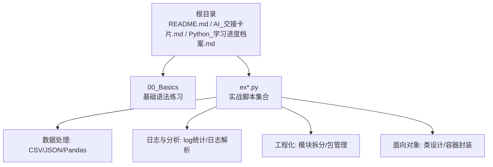
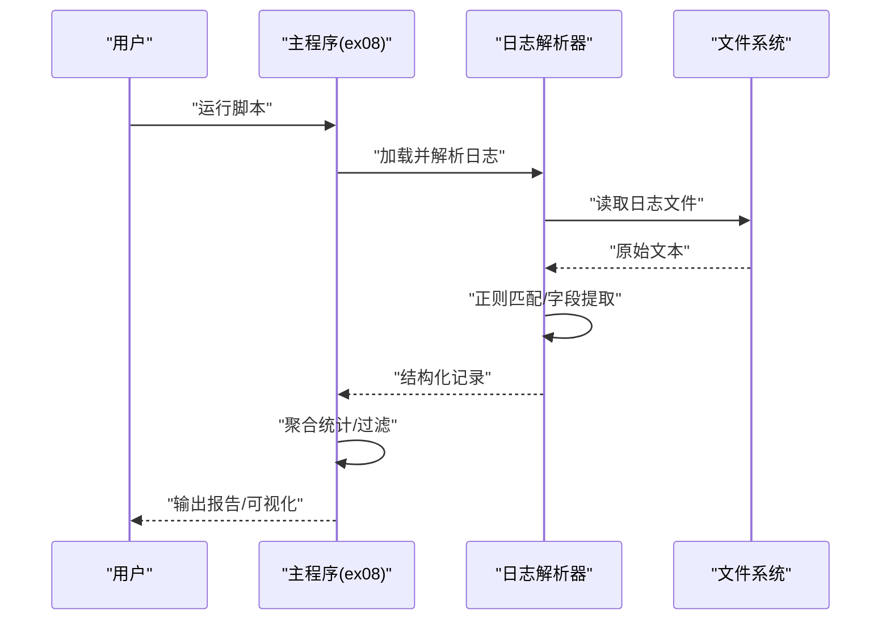
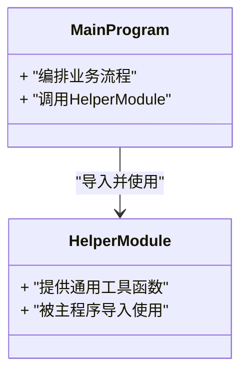
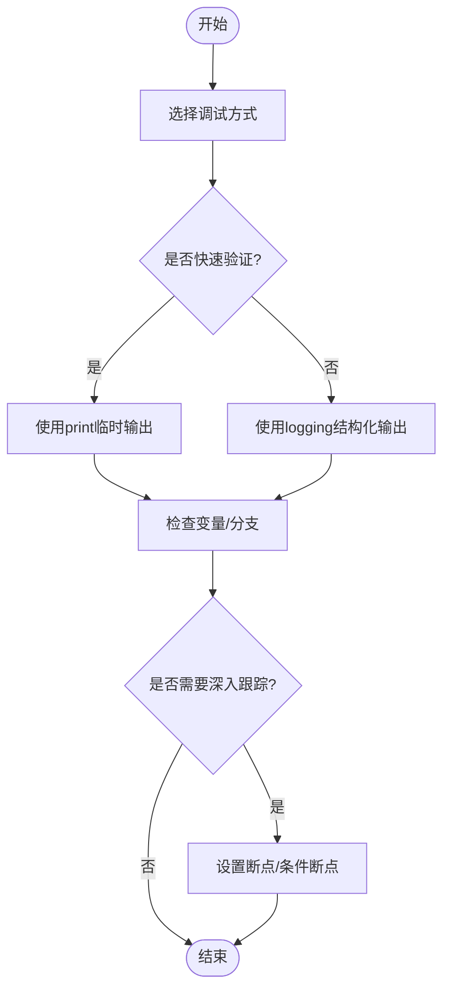
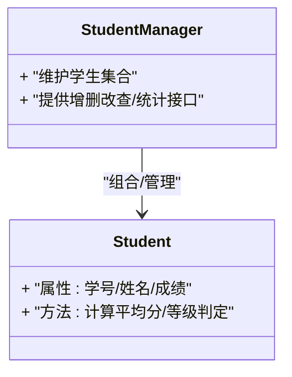
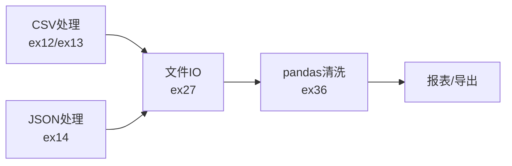
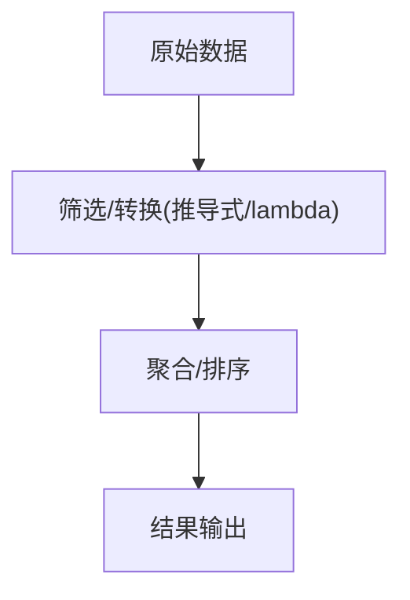
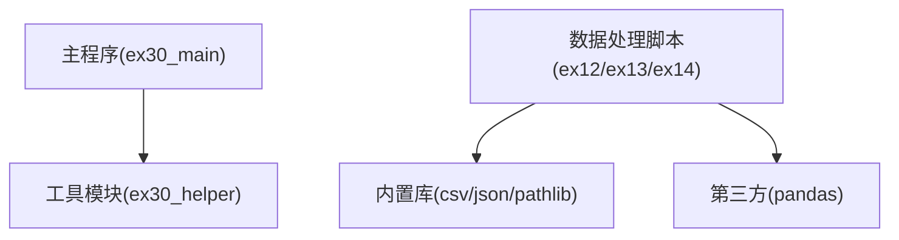

# 实用工具与技巧

<cite>
**本文引用的文件**   
- [README.md](file://README.md)
- [AI_交接卡片.md](file://AI_交接卡片.md)
- [Python_学习进度档案.md](file://Python_学习进度档案.md)
- [00_Basics/01_print_vars.py](file://00_Basics/01_print_vars.py)
- [00_Basics/16_lambda_demo.py](file://00_Basics/16_lambda_demo.py)
- [ex30_helper.py](file://ex30_helper.py)
- [ex30_main.py](file://ex30_main.py)
- [ex05_log_stats.py](file://ex05_log_stats.py)
- [ex08_log_file_analyzer.py](file://ex08_log_file_analyzer.py)
- [ex12_employee_csv.py](file://ex12_employee_csv.py)
- [ex13_csv_robust.py](file://ex13_csv_robust.py)
- [ex14_json_basics.py](file://ex14_json_basics.py)
- [ex19_student_class.py](file://ex19_student_class.py)
- [ex21_student_manager_oop.py](file://ex21_student_manager_oop.py)
- [ex27_file_io.py](file://ex27_file_io.py)
- [ex36_pandas_data_cleaning.py](file://ex36_pandas_data_cleaning.py)
</cite>

## 目录
1. [简介](#简介)
2. [项目结构](#项目结构)
3. [核心组件](#核心组件)
4. [架构总览](#架构总览)
5. [详细组件分析](#详细组件分析)
6. [依赖关系分析](#依赖关系分析)
7. [性能考虑](#性能考虑)
8. [故障排除指南](#故障排除指南)
9. [结论](#结论)
10. [附录](#附录)

## 简介
本文件面向希望提升Python开发效率的工程师，围绕模块化编程、调试技巧、代码规范、常用内置模块与第三方工具、性能优化以及常见问题排查进行系统化整理。文档结合仓库中的示例脚本，提炼可复用的最佳实践与操作清单，帮助读者快速落地到日常开发中。

## 项目结构
仓库以“基础语法练习 + 实战示例”为主，组织方式清晰：
- 00_Basics：基础语法与数据结构的小练习，便于快速回顾与对照
- ex*.py：按主题划分的实战脚本（CSV/JSON处理、日志分析、面向对象、Pandas数据清洗等）
- 根目录：说明文档与数据样例

**图表来源** 
- [README.md](file://README.md)
- [AI_交接卡片.md](file://AI_交接卡片.md)
- [Python_学习进度档案.md](file://Python_学习进度档案.md)

**章节来源**
- [README.md](file://README.md)
- [AI_交接卡片.md](file://AI_交接卡片.md)
- [Python_学习进度档案.md](file://Python_学习进度档案.md)

## 核心组件
- 模块化与包管理
  - 将通用逻辑抽离为独立模块，主程序通过导入使用，避免重复实现
  - 参考路径：[ex30_helper.py](file://ex30_helper.py)、[ex30_main.py](file://ex30_main.py)
- 调试技巧
  - print调试：在关键分支打印变量快照，快速定位问题
  - logging：结构化输出，支持级别控制与持久化
  - 断点调试：IDE断点、条件断点、异常断点
  - 参考路径：[00_Basics/01_print_vars.py](file://00_Basics/01_print_vars.py)、[ex05_log_stats.py](file://ex05_log_stats.py)、[ex08_log_file_analyzer.py](file://ex08_log_file_analyzer.py)
- 代码规范与PEP8
  - 命名约定、注释风格、格式化建议
  - 参考路径：[ex19_student_class.py](file://ex19_student_class.py)、[ex21_student_manager_oop.py](file://ex21_student_manager_oop.py)
- 常用内置模块
  - csv、json、logging、collections、itertools、functools、pathlib、re、datetime等
  - 参考路径：[ex12_employee_csv.py](file://ex12_employee_csv.py)、[ex13_csv_robust.py](file://ex13_csv_robust.py)、[ex14_json_basics.py](file://ex14_json_basics.py)、[ex27_file_io.py](file://ex27_file_io.py)
- 第三方工具
  - pandas用于数据清洗与分析
  - 参考路径：[ex36_pandas_data_cleaning.py](file://ex36_pandas_data_cleaning.py)

**章节来源**
- [ex30_helper.py](file://ex30_helper.py)
- [ex30_main.py](file://ex30_main.py)
- [00_Basics/01_print_vars.py](file://00_Basics/01_print_vars.py)
- [ex05_log_stats.py](file://ex05_log_stats.py)
- [ex08_log_file_analyzer.py](file://ex08_log_file_analyzer.py)
- [ex19_student_class.py](file://ex19_student_class.py)
- [ex21_student_manager_oop.py](file://ex21_student_manager_oop.py)
- [ex12_employee_csv.py](file://ex12_employee_csv.py)
- [ex13_csv_robust.py](file://ex13_csv_robust.py)
- [ex14_json_basics.py](file://ex14_json_basics.py)
- [ex27_file_io.py](file://ex27_file_io.py)
- [ex36_pandas_data_cleaning.py](file://ex36_pandas_data_cleaning.py)

## 架构总览
从“输入数据 → 处理逻辑 → 输出结果”的角度，仓库中的脚本体现了常见的数据处理流水线模式。下面以“日志文件分析”为例展示调用链与数据流。

**图表来源** 
- [ex08_log_file_analyzer.py](file://ex08_log_file_analyzer.py)

**章节来源**
- [ex08_log_file_analyzer.py](file://ex08_log_file_analyzer.py)

## 详细组件分析

### 模块化与包管理
- 设计原则
  - 单一职责：每个模块聚焦一个能力（如“辅助函数”、“业务入口”）
  - 低耦合高内聚：通过明确接口减少相互依赖
  - 可测试性：将纯逻辑与I/O分离，便于单元测试
- 导入策略
  - 标准库优先，再引入第三方库
  - 相对导入与绝对导入保持一致
  - 按需导入，避免循环导入
- 包管理
  - 使用虚拟环境隔离依赖
  - 用requirements或pyproject.toml锁定版本
- 参考路径
  - [ex30_helper.py](file://ex30_helper.py)
  - [ex30_main.py](file://ex30_main.py)

**图表来源** 
- [ex30_helper.py](file://ex30_helper.py)
- [ex30_main.py](file://ex30_main.py)

**章节来源**
- [ex30_helper.py](file://ex30_helper.py)
- [ex30_main.py](file://ex30_main.py)

### 调试技巧
- print调试
  - 适合快速验证分支与中间状态
  - 注意清理冗余输出，避免污染日志
  - 参考路径：[00_Basics/01_print_vars.py](file://00_Basics/01_print_vars.py)
- logging模块
  - 分级输出（DEBUG/INFO/WARNING/ERROR/CRITICAL）
  - 统一格式、输出到控制台或文件
  - 参考路径：[ex05_log_stats.py](file://ex05_log_stats.py)
- 断点调试
  - IDE断点、条件断点、异常断点
  - 配合日志与变量监视，提高定位效率
- 日志文件分析
  - 使用正则与字典结构解析非结构化日志
  - 参考路径：[ex08_log_file_analyzer.py](file://ex08_log_file_analyzer.py)

**图表来源** 
- [00_Basics/01_print_vars.py](file://00_Basics/01_print_vars.py)
- [ex05_log_stats.py](file://ex05_log_stats.py)
- [ex08_log_file_analyzer.py](file://ex08_log_file_analyzer.py)

**章节来源**
- [00_Basics/01_print_vars.py](file://00_Basics/01_print_vars.py)
- [ex05_log_stats.py](file://ex05_log_stats.py)
- [ex08_log_file_analyzer.py](file://ex08_log_file_analyzer.py)

### 代码规范与PEP8
- 命名约定
  - 模块/包名小写+下划线；类名大驼峰；函数/变量小写+下划线；常量全大写
- 注释与文档字符串
  - 模块级docstring说明用途与用法；函数级docstring描述参数、返回值与异常
- 格式化
  - 行宽限制、空格与缩进、空行分隔逻辑块
- 面向对象示例
  - 参考路径：[ex19_student_class.py](file://ex19_student_class.py)、[ex21_student_manager_oop.py](file://ex21_student_manager_oop.py)

**图表来源** 
- [ex19_student_class.py](file://ex19_student_class.py)
- [ex21_student_manager_oop.py](file://ex21_student_manager_oop.py)

**章节来源**
- [ex19_student_class.py](file://ex19_student_class.py)
- [ex21_student_manager_oop.py](file://ex21_student_manager_oop.py)

### 常用内置模块与第三方工具
- 内置模块
  - csv：读写表格数据，处理缺失值与编码
    - 参考路径：[ex12_employee_csv.py](file://ex12_employee_csv.py)、[ex13_csv_robust.py](file://ex13_csv_robust.py)
  - json：序列化/反序列化，处理嵌套结构与类型映射
    - 参考路径：[ex14_json_basics.py](file://ex14_json_basics.py)
  - pathlib：跨平台路径操作，简化文件遍历与拼接
    - 参考路径：[ex27_file_io.py](file://ex27_file_io.py)
  - 其他：collections、itertools、functools、re、datetime等
- 第三方工具
  - pandas：高效数据清洗、分组聚合、透视表
    - 参考路径：[ex36_pandas_data_cleaning.py](file://ex36_pandas_data_cleaning.py)

**图表来源** 
- [ex12_employee_csv.py](file://ex12_employee_csv.py)
- [ex13_csv_robust.py](file://ex13_csv_robust.py)
- [ex14_json_basics.py](file://ex14_json_basics.py)
- [ex27_file_io.py](file://ex27_file_io.py)
- [ex36_pandas_data_cleaning.py](file://ex36_pandas_data_cleaning.py)

**章节来源**
- [ex12_employee_csv.py](file://ex12_employee_csv.py)
- [ex13_csv_robust.py](file://ex13_csv_robust.py)
- [ex14_json_basics.py](file://ex14_json_basics.py)
- [ex27_file_io.py](file://ex27_file_io.py)
- [ex36_pandas_data_cleaning.py](file://ex36_pandas_data_cleaning.py)

### 高阶技巧与函数式编程
- lambda与高阶函数
  - 使用lambda简化匿名函数，配合map/filter/reduce构建简洁管道
  - 参考路径：[00_Basics/16_lambda_demo.py](file://00_Basics/16_lambda_demo.py)
- 列表/字典推导式
  - 替代冗长循环，提升可读性与性能
  - 参考路径：[00_Basics/11_list_comprehension.py](file://00_Basics/11_list_comprehension.py)

**图表来源** 
- [00_Basics/16_lambda_demo.py](file://00_Basics/16_lambda_demo.py)
- [00_Basics/11_list_comprehension.py](file://00_Basics/11_list_comprehension.py)

**章节来源**
- [00_Basics/16_lambda_demo.py](file://00_Basics/16_lambda_demo.py)
- [00_Basics/11_list_comprehension.py](file://00_Basics/11_list_comprehension.py)

## 依赖关系分析
- 模块间依赖
  - 主程序依赖工具模块，降低耦合度
  - 数据处理脚本依赖csv/json/pandas等库
- 外部依赖
  - pandas作为第三方库，需通过pip安装并锁定版本
- 潜在风险
  - 循环导入、未捕获异常、硬编码路径

**图表来源** 
- [ex30_main.py](file://ex30_main.py)
- [ex30_helper.py](file://ex30_helper.py)
- [ex12_employee_csv.py](file://ex12_employee_csv.py)
- [ex13_csv_robust.py](file://ex13_csv_robust.py)
- [ex14_json_basics.py](file://ex14_json_basics.py)
- [ex36_pandas_data_cleaning.py](file://ex36_pandas_data_cleaning.py)

**章节来源**
- [ex30_main.py](file://ex30_main.py)
- [ex30_helper.py](file://ex30_helper.py)
- [ex12_employee_csv.py](file://ex12_employee_csv.py)
- [ex13_csv_robust.py](file://ex13_csv_robust.py)
- [ex14_json_basics.py](file://ex14_json_basics.py)
- [ex36_pandas_data_cleaning.py](file://ex36_pandas_data_cleaning.py)

## 性能考虑
- 算法优化
  - 使用合适的数据结构（dict/set）降低查找复杂度
  - 避免在循环中进行昂贵的I/O或重复计算
- 内存管理
  - 对大数据集采用生成器/迭代器，减少峰值内存占用
  - 及时释放不再使用的对象引用
- 并发编程基础
  - I/O密集型任务优先考虑多线程；CPU密集型任务使用多进程
  - 合理使用线程池/进程池，避免过度创建线程/进程
- 参考路径
  - [ex36_pandas_data_cleaning.py](file://ex36_pandas_data_cleaning.py)

[本节为通用指导，不直接分析具体文件]

## 故障排除指南
- 常见错误
  - 文件路径/编码问题：确认路径存在、编码一致
  - CSV/JSON解析失败：检查分隔符、键名、数据类型
  - 权限不足：确保读写权限正确
- 定位方法
  - 使用logging记录上下文信息（输入、中间状态、异常堆栈）
  - 使用断点逐步执行，观察变量变化
  - 最小化复现：剥离无关逻辑，构造最小用例
- 参考路径
  - [ex05_log_stats.py](file://ex05_log_stats.py)
  - [ex08_log_file_analyzer.py](file://ex08_log_file_analyzer.py)
  - [ex13_csv_robust.py](file://ex13_csv_robust.py)
  - [ex27_file_io.py](file://ex27_file_io.py)

**章节来源**
- [ex05_log_stats.py](file://ex05_log_stats.py)
- [ex08_log_file_analyzer.py](file://ex08_log_file_analyzer.py)
- [ex13_csv_robust.py](file://ex13_csv_robust.py)
- [ex27_file_io.py](file://ex27_file_io.py)

## 结论
通过模块化拆分、规范的代码风格、系统化的调试手段与合适的工具链，可以显著提升Python项目的可维护性与开发效率。建议在团队内推广统一的导入策略、日志规范与格式化规则，并结合CI自动化检查，持续保障代码质量。

[本节为总结性内容，不直接分析具体文件]

## 附录
- 快速清单
  - 模块化：拆分为工具模块与主程序，明确接口
  - 调试：print快速验证，logging持久化，断点深入跟踪
  - 规范：遵循PEP8，统一命名与注释风格
  - 工具：善用内置模块与pandas，减少重复造轮子
  - 性能：数据结构选择、内存与并发策略
  - 排障：最小复现、日志与断点结合
- 参考路径
  - [README.md](file://README.md)
  - [AI_交接卡片.md](file://AI_交接卡片.md)
  - [Python_学习进度档案.md](file://Python_学习进度档案.md)

**章节来源**
- [README.md](file://README.md)
- [AI_交接卡片.md](file://AI_交接卡片.md)
- [Python_学习进度档案.md](file://Python_学习进度档案.md)