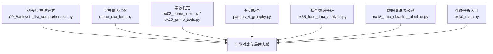
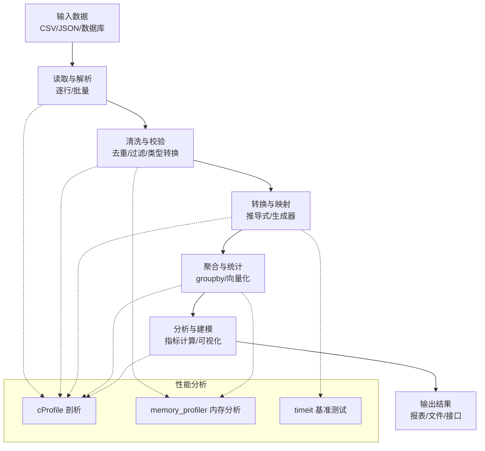
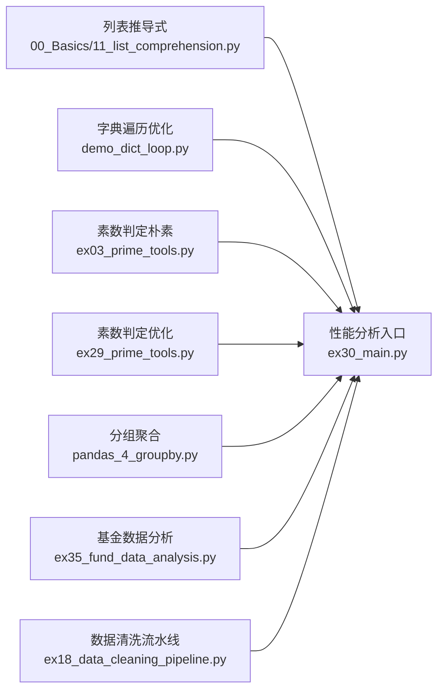

# 性能优化技巧

<cite>
**本文引用的文件**   
- [00_Basics/11_list_comprehension.py](file://00_Basics/11_list_comprehension.py)
- [ex16_list_comprehension.py](file://ex16_list_comprehension.py)
- [ex17_dict_comprehension.py](file://ex17_dict_comprehension.py)
- [demo_dict_loop.py](file://demo_dict_loop.py)
- [ex35_fund_data_analysis.py](file://ex35_fund_data_analysis.py)
- [pandas_4_groupby.py](file://pandas_4_groupby.py)
- [ex29_prime_tools.py](file://ex29_prime_tools.py)
- [ex03_prime_tools.py](file://ex03_prime_tools.py)
- [ex18_data_cleaning_pipeline.py](file://ex18_data_cleaning_pipeline.py)
- [ex30_main.py](file://ex30_main.py)
</cite>

## 目录
1. [简介](#简介)
2. [项目结构](#项目结构)
3. [核心组件](#核心组件)
4. [架构总览](#架构总览)
5. [详细组件分析](#详细组件分析)
6. [依赖关系分析](#依赖关系分析)
7. [性能考量](#性能考量)
8. [故障排查指南](#故障排查指南)
9. [结论](#结论)
10. [附录](#附录)

## 简介
本文件面向希望提升Python程序性能的开发者，围绕算法与数据结构优化、内存管理与垃圾回收、并发编程基础、常见实现方式的性能对比，以及性能分析工具的使用进行系统化讲解。文档中的实践案例均来源于仓库中现有脚本，通过“代码片段路径”的方式定位到具体实现，便于读者对照源码进行验证与复现。

## 项目结构
仓库包含大量基础示例与数据处理脚本，适合用于演示不同数据结构的访问模式、列表/字典推导式、分组聚合、数据清洗流水线等典型场景。为聚焦性能主题，本节仅列出与性能优化密切相关的文件与用途：
- 列表/字典推导式与循环对比：00_Basics/11_list_comprehension.py、ex16_list_comprehension.py、ex17_dict_comprehension.py、demo_dict_loop.py
- 数值计算与素数判定（时间复杂度对比）：ex03_prime_tools.py、ex29_prime_tools.py
- 数据分析与分组聚合（Pandas vs 原生）：ex35_fund_data_analysis.py、pandas_4_groupby.py
- 数据清洗流水线（I/O与中间对象管理）：ex18_data_cleaning_pipeline.py
- 性能分析入口与示例：ex30_main.py

**图表来源**
- [00_Basics/11_list_comprehension.py](file://00_Basics/11_list_comprehension.py)
- [ex16_list_comprehension.py](file://ex16_list_comprehension.py)
- [ex17_dict_comprehension.py](file://ex17_dict_comprehension.py)
- [demo_dict_loop.py](file://demo_dict_loop.py)
- [ex03_prime_tools.py](file://ex03_prime_tools.py)
- [ex29_prime_tools.py](file://ex29_prime_tools.py)
- [pandas_4_groupby.py](file://pandas_4_groupby.py)
- [ex35_fund_data_analysis.py](file://ex35_fund_data_analysis.py)
- [ex18_data_cleaning_pipeline.py](file://ex18_data_cleaning_pipeline.py)
- [ex30_main.py](file://ex30_main.py)

**章节来源**
- [00_Basics/11_list_comprehension.py](file://00_Basics/11_list_comprehension.py)
- [ex16_list_comprehension.py](file://ex16_list_comprehension.py)
- [ex17_dict_comprehension.py](file://ex17_dict_comprehension.py)
- [demo_dict_loop.py](file://demo_dict_loop.py)
- [ex03_prime_tools.py](file://ex03_prime_tools.py)
- [ex29_prime_tools.py](file://ex29_prime_tools.py)
- [pandas_4_groupby.py](file://pandas_4_groupby.py)
- [ex35_fund_data_analysis.py](file://ex35_fund_data_analysis.py)
- [ex18_data_cleaning_pipeline.py](file://ex18_data_cleaning_pipeline.py)
- [ex30_main.py](file://ex30_main.py)

## 核心组件
- 列表推导式与生成器表达式：在构建序列时优先使用推导式或生成器，减少临时对象与函数调用开销。
  - 参考路径：[00_Basics/11_list_comprehension.py](file://00_Basics/11_list_comprehension.py)、[ex16_list_comprehension.py](file://ex16_list_comprehension.py)
- 字典操作与遍历优化：避免重复查找键值，利用内置方法减少解释器开销。
  - 参考路径：[demo_dict_loop.py](file://demo_dict_loop.py)、[ex17_dict_comprehension.py](file://ex17_dict_comprehension.py)
- 数值算法的时间复杂度优化：以素数判定为例，展示从朴素O(n)到O(√n)的改进思路。
  - 参考路径：[ex03_prime_tools.py](file://ex03_prime_tools.py)、[ex29_prime_tools.py](file://ex29_prime_tools.py)
- 分组聚合与向量化：在大数据集上优先使用Pandas的groupby与向量化操作，降低Python层循环成本。
  - 参考路径：[pandas_4_groupby.py](file://pandas_4_groupby.py)、[ex35_fund_data_analysis.py](file://ex35_fund_data_analysis.py)
- 数据清洗流水线：控制中间结果大小，采用流式处理与惰性求值，降低峰值内存占用。
  - 参考路径：[ex18_data_cleaning_pipeline.py](file://ex18_data_cleaning_pipeline.py)
- 性能分析入口：使用cProfile等工具对热点函数进行剖析，定位瓶颈。
  - 参考路径：[ex30_main.py](file://ex30_main.py)

**章节来源**
- [00_Basics/11_list_comprehension.py](file://00_Basics/11_list_comprehension.py)
- [ex16_list_comprehension.py](file://ex16_list_comprehension.py)
- [ex17_dict_comprehension.py](file://ex17_dict_comprehension.py)
- [demo_dict_loop.py](file://demo_dict_loop.py)
- [ex03_prime_tools.py](file://ex03_prime_tools.py)
- [ex29_prime_tools.py](file://ex29_prime_tools.py)
- [pandas_4_groupby.py](file://pandas_4_groupby.py)
- [ex35_fund_data_analysis.py](file://ex35_fund_data_analysis.py)
- [ex18_data_cleaning_pipeline.py](file://ex18_data_cleaning_pipeline.py)
- [ex30_main.py](file://ex30_main.py)

## 架构总览
下图展示了从“输入数据”到“输出结果”的典型性能敏感流程，包括数据读取、清洗、转换、聚合与分析，并标注了关键优化点与可插拔的分析工具。

[此图为概念性流程图，不直接对应具体源文件，故无图表来源]

## 详细组件分析

### 列表推导式与普通循环的性能差异
- 要点
  - 列表推导式在C层迭代，减少Python字节码执行次数，通常比显式for循环更快。
  - 当只需逐个消费元素且不需要完整列表时，优先使用生成器表达式以降低内存占用。
- 参考路径
  - [00_Basics/11_list_comprehension.py](file://00_Basics/11_list_comprehension.py)
  - [ex16_list_comprehension.py](file://ex16_list_comprehension.py)
- 建议
  - 小数据集：列表推导式更简洁高效。
  - 大数据集：生成器表达式+流式处理，避免一次性构建大列表。

**章节来源**
- [00_Basics/11_list_comprehension.py](file://00_Basics/11_list_comprehension.py)
- [ex16_list_comprehension.py](file://ex16_list_comprehension.py)

### 字典操作优化与遍历策略
- 要点
  - 避免在循环内重复查找键；使用get/defaultdict减少分支判断。
  - 使用items()/values()/keys()按需选择，避免不必要的元组创建。
  - 字典推导式适用于批量构造新字典的场景。
- 参考路径
  - [demo_dict_loop.py](file://demo_dict_loop.py)
  - [ex17_dict_comprehension.py](file://ex17_dict_comprehension.py)
- 建议
  - 频繁更新计数/分组：defaultdict或Counter。
  - 批量映射：字典推导式替代多次赋值。

**章节来源**
- [demo_dict_loop.py](file://demo_dict_loop.py)
- [ex17_dict_comprehension.py](file://ex17_dict_comprehension.py)

### 素数判定的时间复杂度优化
- 要点
  - 朴素判定需检查所有小于n的整数，时间复杂度O(n)。
  - 优化至仅需检查到√n，时间复杂度O(√n)，显著降低大数判定耗时。
- 参考路径
  - [ex03_prime_tools.py](file://ex03_prime_tools.py)
  - [ex29_prime_tools.py](file://ex29_prime_tools.py)
- 建议
  - 批量判定：结合缓存（如lru_cache）或筛法（埃拉托色尼筛）进一步优化。

**章节来源**
- [ex03_prime_tools.py](file://ex03_prime_tools.py)
- [ex29_prime_tools.py](file://ex29_prime_tools.py)

### 分组聚合：Pandas groupby与向量化
- 要点
  - Pandas的groupby在C/Cython层实现，相比Python层循环更高效。
  - 向量化运算避免逐元素Python循环，显著提升吞吐。
- 参考路径
  - [pandas_4_groupby.py](file://pandas_4_groupby.py)
  - [ex35_fund_data_analysis.py](file://ex35_fund_data_analysis.py)
- 建议
  - 大数据集优先使用groupby与向量化；必要时结合分块读取与增量聚合。

**章节来源**
- [pandas_4_groupby.py](file://pandas_4_groupby.py)
- [ex35_fund_data_analysis.py](file://ex35_fund_data_analysis.py)

### 数据清洗流水线与内存管理
- 要点
  - 使用生成器/迭代器实现惰性处理，避免中间大对象。
  - 及时释放不再使用的变量，减少峰值内存。
  - 合理设置批大小，平衡吞吐与内存占用。
- 参考路径
  - [ex18_data_cleaning_pipeline.py](file://ex18_data_cleaning_pipeline.py)
- 建议
  - 将清洗步骤拆分为可组合的生成器阶段，便于复用与调试。

**章节来源**
- [ex18_data_cleaning_pipeline.py](file://ex18_data_cleaning_pipeline.py)

### 性能分析工具使用与入口
- cProfile
  - 用法：对目标函数或模块进行剖析，输出各函数调用次数与耗时占比。
  - 入口参考：[ex30_main.py](file://ex30_main.py)
- memory_profiler
  - 用法：逐行分析内存增长，识别内存泄漏与峰值占用点。
  - 适用场景：大型对象、嵌套容器、未释放引用。
- timeit
  - 用法：微基准测试，比较不同实现的运行时间。
- 建议
  - 先宏观（cProfile）定位热点，再微观（timeit）验证优化效果；结合memory_profiler观察内存变化。

**章节来源**
- [ex30_main.py](file://ex30_main.py)

## 依赖关系分析
下图展示与性能优化相关的关键脚本之间的依赖与交互关系，帮助理解在不同阶段的优化侧重点。

**图表来源**
- [00_Basics/11_list_comprehension.py](file://00_Basics/11_list_comprehension.py)
- [demo_dict_loop.py](file://demo_dict_loop.py)
- [ex03_prime_tools.py](file://ex03_prime_tools.py)
- [ex29_prime_tools.py](file://ex29_prime_tools.py)
- [pandas_4_groupby.py](file://pandas_4_groupby.py)
- [ex35_fund_data_analysis.py](file://ex35_fund_data_analysis.py)
- [ex18_data_cleaning_pipeline.py](file://ex18_data_cleaning_pipeline.py)
- [ex30_main.py](file://ex30_main.py)

**章节来源**
- [00_Basics/11_list_comprehension.py](file://00_Basics/11_list_comprehension.py)
- [demo_dict_loop.py](file://demo_dict_loop.py)
- [ex03_prime_tools.py](file://ex03_prime_tools.py)
- [ex29_prime_tools.py](file://ex29_prime_tools.py)
- [pandas_4_groupby.py](file://pandas_4_groupby.py)
- [ex35_fund_data_analysis.py](file://ex35_fund_data_analysis.py)
- [ex18_data_cleaning_pipeline.py](file://ex18_data_cleaning_pipeline.py)
- [ex30_main.py](file://ex30_main.py)

## 性能考量
- 算法与数据结构
  - 选择合适的数据结构：集合去重、字典快速查找、双端队列高效两端操作。
  - 控制时间复杂度：尽量将O(n^2)降为O(n log n)或O(n)，例如排序+二分、哈希表。
- 内存管理
  - 避免循环引用：谨慎在对象间建立双向引用，必要时使用弱引用。
  - 大对象处理：分块读写、流式处理、及时del释放引用。
  - 垃圾回收机制：了解CPython的引用计数与分代GC，避免触发频繁回收。
- 并发编程
  - 多线程：适合I/O密集型任务（网络请求、文件读写）。
  - 多进程：适合CPU密集型任务（数值计算、图像处理），注意GIL限制。
  - 异步编程：高并发I/O场景下用asyncio，配合aiohttp/aiomysql等库。
- 常见实现方式对比
  - 列表推导式 vs 普通循环：前者更快更简洁，后者更易扩展复杂逻辑。
  - 字典操作：使用get/defaultdict/Counter减少分支与重复查找。
  - 字符串拼接：使用join而非多次+=。
  - 数值计算：优先NumPy/Pandas向量化，避免Python层循环。

[本节提供通用指导，不直接分析具体文件，故无章节来源]

## 故障排查指南
- 定位热点函数
  - 使用cProfile输出Top-N耗时函数，优先优化占比最高的部分。
  - 参考入口：[ex30_main.py](file://ex30_main.py)
- 内存问题诊断
  - 使用memory_profiler逐行查看内存增长，定位异常分配点。
  - 关注大对象生命周期与循环引用。
- 基准测试
  - 使用timeit进行微基准测试，确保优化有效且不引入回归。
- 常见问题
  - I/O瓶颈：改用缓冲读取、批量写入、连接池。
  - CPU瓶颈：向量化、并行化、算法优化。
  - 内存泄漏：及时释放引用、避免全局缓存过大、使用弱引用。

**章节来源**
- [ex30_main.py](file://ex30_main.py)

## 结论
性能优化应从“正确性”出发，遵循“先度量、后优化”的原则。通过选择合适的算法与数据结构、合理使用推导式与生成器、利用Pandas向量化与groupby、并结合cProfile与memory_profiler进行系统剖析，可以在保证可读性与可维护性的前提下获得显著的性能提升。对于大规模数据与高并发场景，进一步考虑分块处理、流式计算与合适的并发模型，是持续优化的关键。

[本节为总结性内容，不直接分析具体文件，故无章节来源]

## 附录
- 常用工具与命令
  - cProfile：python -m cProfile -s cumtime your_script.py
  - memory_profiler：pip install memory_profiler；@profile装饰器或mprof run
  - timeit：python -m timeit -n 1000 -r 5 'your_code'
- 参考路径汇总
  - 列表推导式：[00_Basics/11_list_comprehension.py](file://00_Basics/11_list_comprehension.py)、[ex16_list_comprehension.py](file://ex16_list_comprehension.py)
  - 字典优化：[demo_dict_loop.py](file://demo_dict_loop.py)、[ex17_dict_comprehension.py](file://ex17_dict_comprehension.py)
  - 素数判定：[ex03_prime_tools.py](file://ex03_prime_tools.py)、[ex29_prime_tools.py](file://ex29_prime_tools.py)
  - 分组聚合：[pandas_4_groupby.py](file://pandas_4_groupby.py)、[ex35_fund_data_analysis.py](file://ex35_fund_data_analysis.py)
  - 数据清洗流水线：[ex18_data_cleaning_pipeline.py](file://ex18_data_cleaning_pipeline.py)
  - 性能分析入口：[ex30_main.py](file://ex30_main.py)