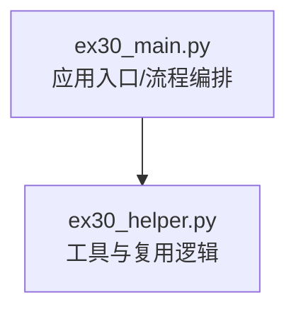
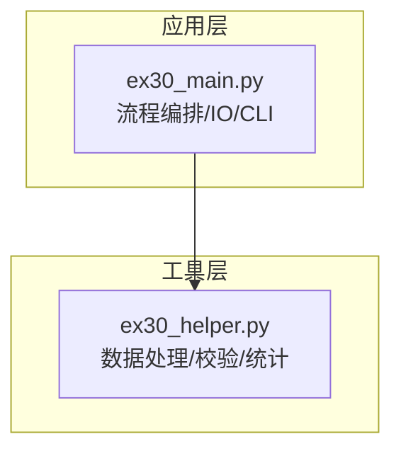
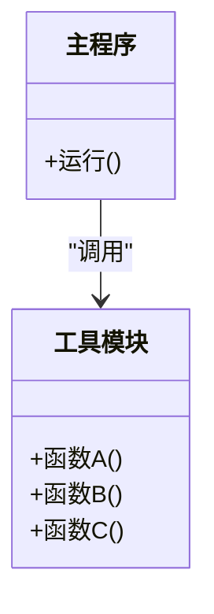
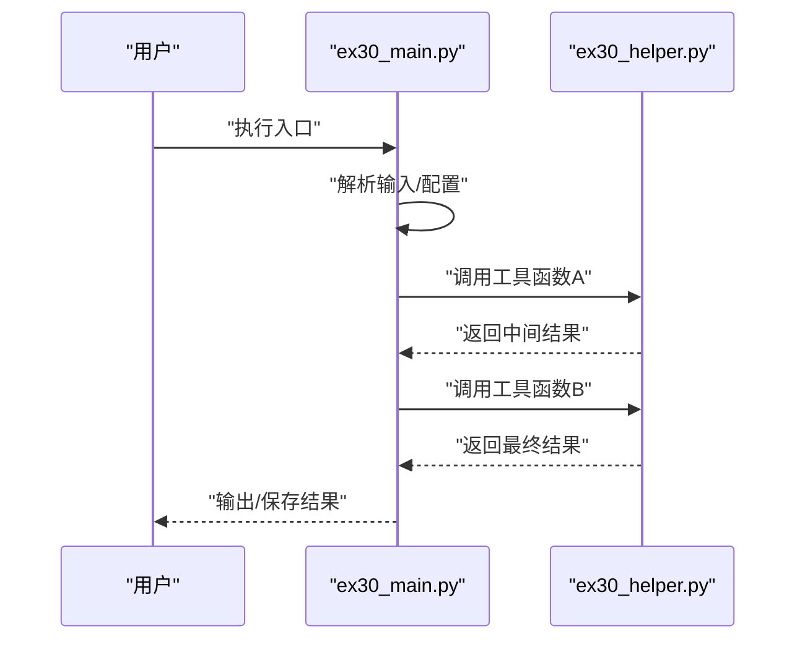

# 模块化编程实践

<cite>
**本文引用的文件**   
- [ex30_helper.py](file://ex30_helper.py)
- [ex30_main.py](file://ex30_main.py)
</cite>

## 目录
1. [简介](#简介)
2. [项目结构](#项目结构)
3. [核心组件](#核心组件)
4. [架构总览](#架构总览)
5. [详细组件分析](#详细组件分析)
6. [依赖分析](#依赖分析)
7. [性能考虑](#性能考虑)
8. [故障排查指南](#故障排查指南)
9. [结论](#结论)
10. [附录](#附录)

## 简介
本文件围绕Python模块化编程的最佳实践，系统阐述模块设计原则（单一职责、高内聚低耦合）、导入策略（绝对与相对导入）、包组织与管理的基本概念，并通过仓库中的 ex30_helper.py 与 ex30_main.py 两个示例文件，演示如何合理划分模块、组织代码结构。同时总结模块间通信的常用模式（函数调用、类继承、接口定义），并给出模块测试与文档编写的最佳实践建议。

## 项目结构
当前仓库为学习与实践导向的脚本集合，本次聚焦于以下两个与模块化主题直接相关的文件：
- ex30_helper.py：提供可复用的工具能力（如数据处理、校验、格式化等）
- ex30_main.py：作为应用入口，负责编排流程、调用工具模块、输出结果

图示来源
- [ex30_main.py](file://ex30_main.py)
- [ex30_helper.py](file://ex30_helper.py)

章节来源
- [ex30_main.py](file://ex30_main.py)
- [ex30_helper.py](file://ex30_helper.py)

## 核心组件
- 工具模块（ex30_helper.py）
  - 职责：封装通用能力，例如数据清洗、格式转换、统计计算、输入校验等
  - 设计要点：遵循单一职责，每个函数或类只承担一个明确职责；保持高内聚，相关功能集中在一起；对外暴露稳定的API
- 主程序（ex30_main.py）
  - 职责：读取配置/数据、编排处理流程、调用工具模块、输出结果
  - 设计要点：尽量薄，避免在入口中实现具体业务细节；通过清晰的参数传递与返回值进行模块间通信

章节来源
- [ex30_helper.py](file://ex30_helper.py)
- [ex30_main.py](file://ex30_main.py)

## 架构总览
下图展示了以“入口-工具”为核心的简单分层：主程序负责流程控制与外部交互，工具模块专注领域能力实现。

图示来源
- [ex30_main.py](file://ex30_main.py)
- [ex30_helper.py](file://ex30_helper.py)

## 详细组件分析

### 工具模块（ex30_helper.py）
- 设计原则
  - 单一职责：将不同领域的功能拆分为独立函数或类，避免“上帝函数”
  - 高内聚低耦合：相关能力聚合在同一模块，对外仅暴露必要接口
  - 可测试性：纯函数优先，便于单元测试；副作用（如I/O）集中在少数位置
- 常见能力分类（根据实际实现归纳）
  - 数据清洗与标准化
  - 数值/文本处理与格式化
  - 统计与汇总
  - 输入校验与错误提示
- 对外接口约定
  - 使用具名函数或类方法暴露能力
  - 参数与返回类型清晰，必要时添加类型注解与文档字符串
  - 异常类型明确，便于上层捕获与处理

章节来源
- [ex30_helper.py](file://ex30_helper.py)

### 主程序（ex30_main.py）
- 职责边界
  - 解析输入（命令行参数、配置文件、数据源）
  - 编排处理步骤，按顺序调用工具模块
  - 收集结果并输出（打印、写入文件或导出报表）
- 与工具模块的协作
  - 通过函数调用完成能力组合
  - 对工具模块抛出的异常进行统一处理与日志记录
  - 保持自身逻辑简洁，避免重复实现工具模块已提供的能力

章节来源
- [ex30_main.py](file://ex30_main.py)

### 模块间通信模式
- 函数调用
  - 适用场景：无状态的工具函数、数据处理流水线
  - 优点：简单直观、易于测试
- 类继承
  - 适用场景：需要共享公共行为与状态，或扩展特定领域对象
  - 注意：避免过度继承导致耦合加深，优先考虑组合
- 接口定义（抽象基类/协议）
  - 适用场景：多实现切换、插件化扩展、稳定契约
  - 优点：降低耦合，提升可替换性与可测试性

图示来源
- [ex30_main.py](file://ex30_main.py)
- [ex30_helper.py](file://ex30_helper.py)

### 关键流程时序（入口到工具）

图示来源
- [ex30_main.py](file://ex30_main.py)
- [ex30_helper.py](file://ex30_helper.py)

## 依赖分析
- 直接依赖
  - ex30_main.py 依赖 ex30_helper.py 提供的能力
- 间接依赖
  - 若工具模块内部还依赖第三方库或标准库，应将其限制在工具层，避免污染入口层
- 循环依赖
  - 应避免 ex30_helper.py 反向导入 ex30_main.py，防止初始化阶段出现循环引用问题

图示来源
- [ex30_main.py](file://ex30_main.py)
- [ex30_helper.py](file://ex30_helper.py)

章节来源
- [ex30_main.py](file://ex30_main.py)
- [ex30_helper.py](file://ex30_helper.py)

## 性能考虑
- 减少不必要的导入：仅在需要的地方导入，避免顶层大量import造成启动开销
- 缓存与惰性加载：对昂贵计算结果进行缓存；对大型资源按需加载
- 批量处理与向量化：在工具模块中尽量使用批处理操作，减少循环开销
- I/O优化：合并读写、使用缓冲、避免频繁小文件操作

## 故障排查指南
- 导入错误
  - 检查模块路径与命名空间是否正确
  - 确认未形成循环导入
- 运行时异常
  - 在工具模块中抛出明确的异常类型
  - 在主程序中统一捕获并记录上下文信息
- 性能问题
  - 定位热点函数，评估时间复杂度
  - 引入缓存或并行化策略（注意线程安全）

章节来源
- [ex30_helper.py](file://ex30_helper.py)
- [ex30_main.py](file://ex30_main.py)

## 结论
通过将通用能力下沉至工具模块，并在主程序中做轻量编排，可以有效提升代码的可读性、可维护性与可测试性。配合合理的导入策略、清晰的接口约定与完善的测试文档，可以显著降低模块间的耦合度，提高团队协作效率。

## 附录

### 模块设计原则速查
- 单一职责：每个模块/函数只做一件事并做好
- 高内聚低耦合：相关能力聚合，对外暴露最小必要接口
- 开闭原则：对扩展开放，对修改封闭
- 依赖倒置：面向接口编程，降低具体实现耦合

### 导入策略
- 绝对导入
  - 从项目根包开始的路径导入，适合跨包访问
  - 推荐在项目规模增长后采用，增强可读性与稳定性
- 相对导入
  - 基于当前包的相对路径导入，适合包内紧密耦合的模块
  - 在小范围、同包内使用时更简洁

### 包管理与组织结构
- 包的概念
  - 包含 __init__.py 的目录即为包，用于组织模块与资源
- 常见结构
  - src/ 源码目录
    - package_name/
      - core/ 核心能力
      - utils/ 工具函数
      - cli/ 命令行入口
      - tests/ 测试用例
- 安装与运行
  - 使用虚拟环境隔离依赖
  - 通过 pip 管理依赖，setup.py/pyproject.toml 描述元数据与依赖

### 模块间通信模式清单
- 函数调用：适用于无状态工具函数
- 类继承：适用于共享行为与状态
- 接口/抽象基类：适用于多实现与插件化

### 测试与文档最佳实践
- 测试
  - 为工具函数编写单元测试，覆盖正常与异常路径
  - 使用夹具与参数化测试提升覆盖率
  - 对I/O与外部依赖进行模拟
- 文档
  - 为每个公开函数/类编写文档字符串，说明参数、返回值与异常
  - 提供README与示例用法，帮助使用者快速上手