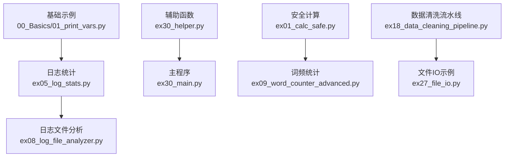
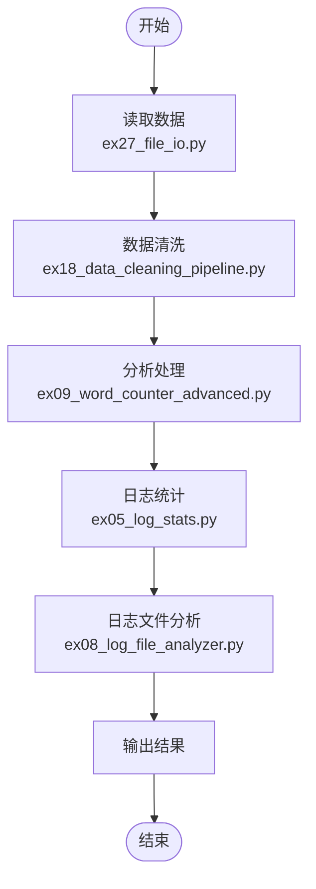
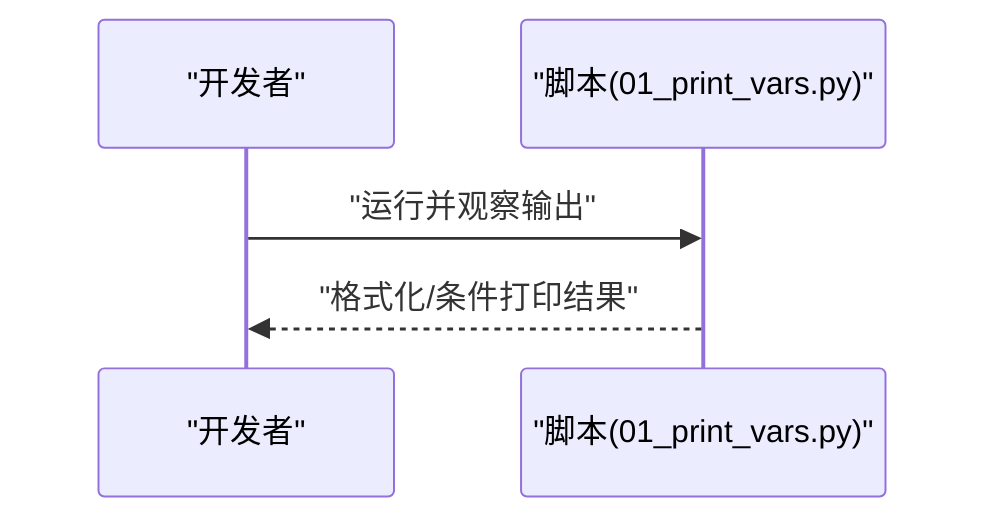
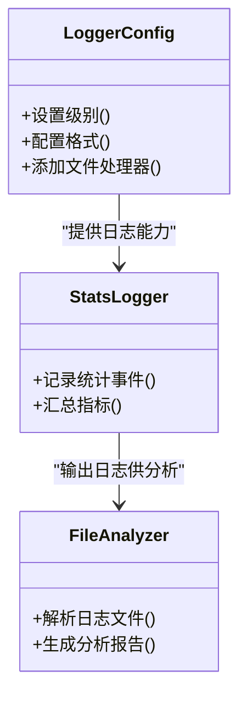
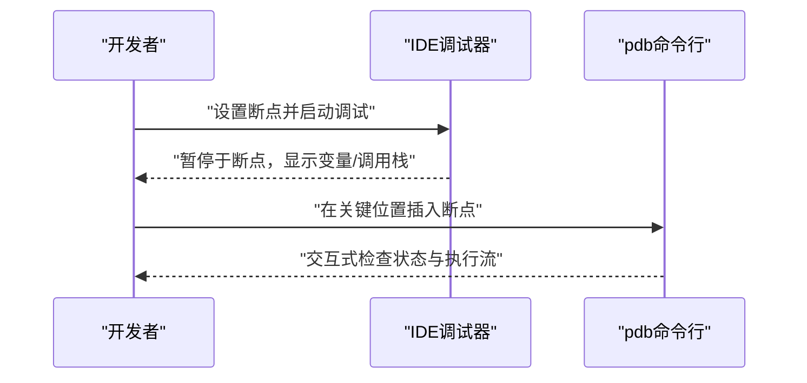
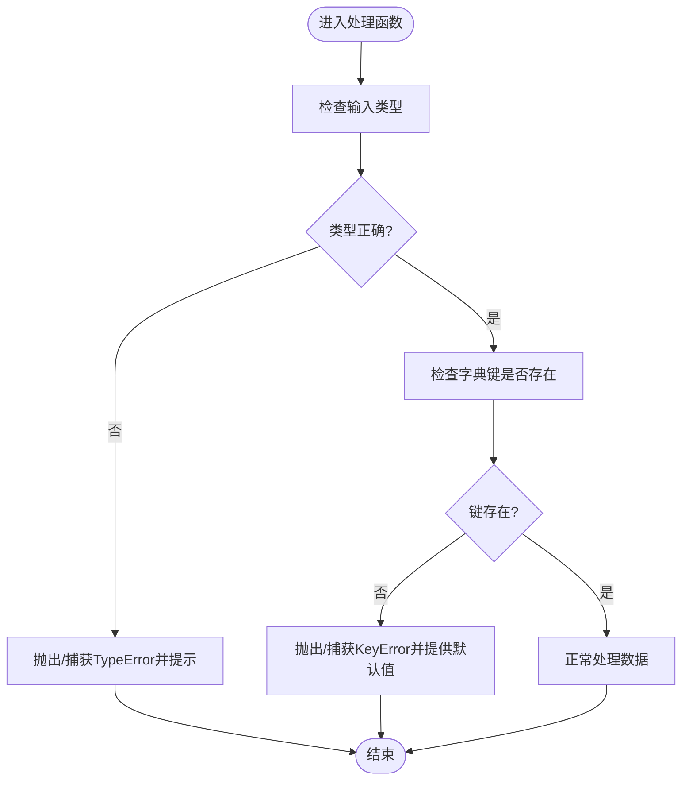
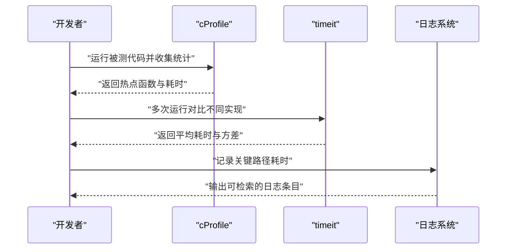
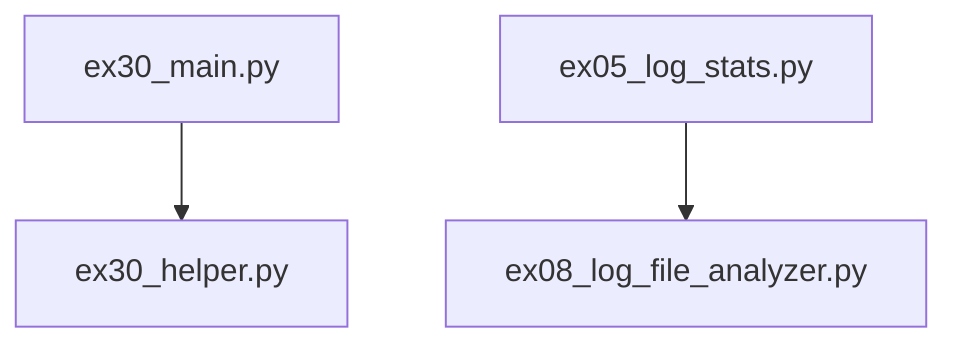

# 调试技巧与工具

<cite>
**本文引用的文件**   
- [01_print_vars.py](file://00_Basics/01_print_vars.py)
- [ex05_log_stats.py](file://ex05_log_stats.py)
- [ex08_log_file_analyzer.py](file://ex08_log_file_analyzer.py)
- [ex30_helper.py](file://ex30_helper.py)
- [ex30_main.py](file://ex30_main.py)
- [ex01_calc_safe.py](file://ex01_calc_safe.py)
- [ex09_word_counter_advanced.py](file://ex09_word_counter_advanced.py)
- [ex18_data_cleaning_pipeline.py](file://ex18_data_cleaning_pipeline.py)
- [ex27_file_io.py](file://ex27_file_io.py)
</cite>

## 目录
1. [简介](#简介)
2. [项目结构](#项目结构)
3. [核心组件](#核心组件)
4. [架构总览](#架构总览)
5. [详细组件分析](#详细组件分析)
6. [依赖关系分析](#依赖关系分析)
7. [性能考虑](#性能考虑)
8. [故障排查指南](#故障排查指南)
9. [结论](#结论)
10. [附录](#附录)

## 简介
本文件面向Python开发者，系统化梳理调试技巧与工具使用。内容覆盖：
- print调试的高级用法（格式化输出、条件打印）
- logging模块的配置与使用（日志级别、输出格式、文件记录）
- 断点调试（IDE集成调试器与pdb命令行调试器）
- 常见异常定位与处理（KeyError、TypeError等）
- 性能分析工具定位瓶颈
- 调试最佳实践与常见问题解决方案

## 项目结构
仓库包含大量示例脚本，涵盖基础语法、数据处理、日志与文件IO等主题。为便于调试学习，以下文件与“调试”主题直接相关：
- 基础print演示：00_Basics/01_print_vars.py
- 日志统计与分析：ex05_log_stats.py、ex08_log_file_analyzer.py
- 辅助函数与主程序：ex30_helper.py、ex30_main.py
- 安全计算与异常处理：ex01_calc_safe.py
- 复杂数据处理与清洗：ex09_word_counter_advanced.py、ex18_data_cleaning_pipeline.py、ex27_file_io.py

图表来源
- [01_print_vars.py:1-200](file://00_Basics/01_print_vars.py#L1-L200)
- [ex05_log_stats.py:1-200](file://ex05_log_stats.py#L1-L200)
- [ex08_log_file_analyzer.py:1-200](file://ex08_log_file_analyzer.py#L1-L200)
- [ex30_helper.py:1-200](file://ex30_helper.py#L1-L200)
- [ex30_main.py:1-200](file://ex30_main.py#L1-L200)
- [ex01_calc_safe.py:1-200](file://ex01_calc_safe.py#L1-L200)
- [ex09_word_counter_advanced.py:1-200](file://ex09_word_counter_advanced.py#L1-L200)
- [ex18_data_cleaning_pipeline.py:1-200](file://ex18_data_cleaning_pipeline.py#L1-L200)
- [ex27_file_io.py:1-200](file://ex27_file_io.py#L1-L200)

章节来源
- [01_print_vars.py:1-200](file://00_Basics/01_print_vars.py#L1-L200)
- [ex05_log_stats.py:1-200](file://ex05_log_stats.py#L1-L200)
- [ex08_log_file_analyzer.py:1-200](file://ex08_log_file_analyzer.py#L1-L200)
- [ex30_helper.py:1-200](file://ex30_helper.py#L1-L200)
- [ex30_main.py:1-200](file://ex30_main.py#L1-L200)
- [ex01_calc_safe.py:1-200](file://ex01_calc_safe.py#L1-L200)
- [ex09_word_counter_advanced.py:1-200](file://ex09_word_counter_advanced.py#L1-L200)
- [ex18_data_cleaning_pipeline.py:1-200](file://ex18_data_cleaning_pipeline.py#L1-L200)
- [ex27_file_io.py:1-200](file://ex27_file_io.py#L1-L200)

## 核心组件
- print调试高级用法
  - 格式化输出：通过字符串格式化与f-string进行结构化输出，便于快速观察变量状态与中间结果。
  - 条件打印：结合布尔表达式或阈值判断，仅在关键路径或异常分支打印，避免噪声。
- logging模块配置与使用
  - 日志级别：DEBUG/INFO/WARNING/ERROR/CRITICAL，用于区分信息粒度与严重性。
  - 输出格式：时间戳、级别、模块名、行号、消息体，统一规范便于检索。
  - 文件记录：将日志写入文件，支持按大小或时间轮转，便于离线分析与审计。
- 断点调试
  - IDE集成调试器：设置断点、单步执行、查看调用栈与变量快照。
  - pdb命令行调试器：在代码中插入断点，交互式检查上下文。
- 异常处理与错误定位
  - KeyError：字典键不存在时的防护与提示。
  - TypeError：类型不匹配时的校验与转换。
- 性能分析
  - cProfile/timeit：定位热点函数与耗时操作。
  - 内存与I/O瓶颈：结合日志与采样定位慢查询、大对象与频繁读写。

章节来源
- [01_print_vars.py:1-200](file://00_Basics/01_print_vars.py#L1-L200)
- [ex05_log_stats.py:1-200](file://ex05_log_stats.py#L1-L200)
- [ex08_log_file_analyzer.py:1-200](file://ex08_log_file_analyzer.py#L1-L200)
- [ex30_helper.py:1-200](file://ex30_helper.py#L1-L200)
- [ex30_main.py:1-200](file://ex30_main.py#L1-L200)
- [ex01_calc_safe.py:1-200](file://ex01_calc_safe.py#L1-L200)
- [ex09_word_counter_advanced.py:1-200](file://ex09_word_counter_advanced.py#L1-L200)
- [ex18_data_cleaning_pipeline.py:1-200](file://ex18_data_cleaning_pipeline.py#L1-L200)
- [ex27_file_io.py:1-200](file://ex27_file_io.py#L1-L200)

## 架构总览
下图展示从输入到输出的典型数据处理流程，并标注调试与日志注入点，帮助理解何时使用何种调试手段。

图表来源
- [ex27_file_io.py:1-200](file://ex27_file_io.py#L1-L200)
- [ex18_data_cleaning_pipeline.py:1-200](file://ex18_data_cleaning_pipeline.py#L1-L200)
- [ex09_word_counter_advanced.py:1-200](file://ex09_word_counter_advanced.py#L1-L200)
- [ex05_log_stats.py:1-200](file://ex05_log_stats.py#L1-L200)
- [ex08_log_file_analyzer.py:1-200](file://ex08_log_file_analyzer.py#L1-L200)

## 详细组件分析

### 组件A：print调试高级用法
- 目标
  - 以最小成本获取运行时信息，快速验证假设。
- 关键点
  - 使用格式化输出对齐字段，提升可读性。
  - 条件打印减少无关信息，聚焦关键路径。
- 适用场景
  - 快速原型验证、临时诊断、轻量级脚本。

图表来源
- [01_print_vars.py:1-200](file://00_Basics/01_print_vars.py#L1-L200)

章节来源
- [01_print_vars.py:1-200](file://00_Basics/01_print_vars.py#L1-L200)

### 组件B：logging模块配置与使用
- 目标
  - 建立稳定、可检索的日志体系，支撑问题定位与审计。
- 关键点
  - 日志级别分级：不同阶段使用不同级别，避免信息过载。
  - 输出格式统一：包含时间、级别、模块、行号等元数据。
  - 文件记录：持久化日志，支持后续分析与监控。
- 适用场景
  - 生产环境、长期运行的服务、批处理任务。

图表来源
- [ex05_log_stats.py:1-200](file://ex05_log_stats.py#L1-L200)
- [ex08_log_file_analyzer.py:1-200](file://ex08_log_file_analyzer.py#L1-L200)

章节来源
- [ex05_log_stats.py:1-200](file://ex05_log_stats.py#L1-L200)
- [ex08_log_file_analyzer.py:1-200](file://ex08_log_file_analyzer.py#L1-L200)

### 组件C：断点调试（IDE与pdb）
- 目标
  - 精准定位问题根因，观察变量状态与调用栈。
- 关键点
  - IDE断点：可视化设置断点，逐步执行，检查上下文。
  - pdb命令行：在关键位置插入断点，交互式探索。
- 适用场景
  - 复杂逻辑分支、难以复现的问题、需要深入上下文时。

[此图为概念流程图，无需图表来源]

章节来源
- [ex30_main.py:1-200](file://ex30_main.py#L1-L200)
- [ex30_helper.py:1-200](file://ex30_helper.py#L1-L200)

### 组件D：异常处理与错误定位（KeyError、TypeError）
- 目标
  - 提高健壮性，明确错误原因，给出可操作的修复建议。
- 关键点
  - KeyError：访问字典键前进行存在性检查或使用默认值。
  - TypeError：对输入进行类型校验与转换，避免隐式失败。
- 适用场景
  - 外部数据接入、用户输入处理、第三方库交互。

图表来源
- [ex01_calc_safe.py:1-200](file://ex01_calc_safe.py#L1-L200)
- [ex09_word_counter_advanced.py:1-200](file://ex09_word_counter_advanced.py#L1-L200)

章节来源
- [ex01_calc_safe.py:1-200](file://ex01_calc_safe.py#L1-L200)
- [ex09_word_counter_advanced.py:1-200](file://ex09_word_counter_advanced.py#L1-L200)

### 组件E：性能分析与瓶颈定位
- 目标
  - 识别热点函数与慢路径，优化资源消耗。
- 关键点
  - cProfile：统计函数调用次数与耗时，定位热点。
  - timeit：微基准测试，对比不同实现的性能差异。
  - 结合日志：在关键路径记录耗时与中间结果，辅助分析。
- 适用场景
  - 大数据处理、循环密集、I/O阻塞场景。

[此图为概念流程图，无需图表来源]

章节来源
- [ex18_data_cleaning_pipeline.py:1-200](file://ex18_data_cleaning_pipeline.py#L1-L200)
- [ex27_file_io.py:1-200](file://ex27_file_io.py#L1-L200)

## 依赖关系分析
- 模块耦合
  - ex30_main.py依赖ex30_helper.py提供的辅助函数，形成清晰的主从关系。
  - ex05_log_stats.py与ex08_log_file_analyzer.py通过日志文件解耦，前者产生日志，后者消费日志进行分析。
- 潜在风险
  - 若日志格式变更，可能导致分析器解析失败；应定义稳定的日志契约。
  - 主程序与辅助函数之间接口需保持稳定，避免破坏性变更。

图表来源
- [ex30_main.py:1-200](file://ex30_main.py#L1-L200)
- [ex30_helper.py:1-200](file://ex30_helper.py#L1-L200)
- [ex05_log_stats.py:1-200](file://ex05_log_stats.py#L1-L200)
- [ex08_log_file_analyzer.py:1-200](file://ex08_log_file_analyzer.py#L1-L200)

章节来源
- [ex30_main.py:1-200](file://ex30_main.py#L1-L200)
- [ex30_helper.py:1-200](file://ex30_helper.py#L1-L200)
- [ex05_log_stats.py:1-200](file://ex05_log_stats.py#L1-L200)
- [ex08_log_file_analyzer.py:1-200](file://ex08_log_file_analyzer.py#L1-L200)

## 性能考虑
- 日志开销控制
  - 在生产环境中谨慎使用DEBUG级别，避免过多I/O影响吞吐。
  - 采用异步或缓冲策略降低日志写入延迟。
- 热点优化
  - 优先优化被频繁调用的函数，关注CPU与I/O占比。
  - 使用向量化或批量处理减少循环开销。
- 内存管理
  - 避免创建不必要的大对象，及时释放引用。
  - 使用生成器与迭代器处理大规模数据。

[本节为通用指导，无需章节来源]

## 故障排查指南
- 常见问题
  - KeyError：键缺失导致崩溃。解决思路：先检查键存在性，或提供默认值。
  - TypeError：类型不匹配。解决思路：增加类型校验与转换，明确输入契约。
  - 日志缺失或格式不一致：确认日志初始化与格式配置是否正确。
- 定位步骤
  - 使用断点缩小范围，观察变量与调用栈。
  - 在关键路径添加条件打印或INFO级别日志，记录必要上下文。
  - 使用cProfile/timeit对比不同实现，定位性能退化点。
- 恢复策略
  - 对不可信输入进行防御性编程，提供降级方案。
  - 对关键操作进行幂等设计，避免重复执行造成副作用。

章节来源
- [ex01_calc_safe.py:1-200](file://ex01_calc_safe.py#L1-L200)
- [ex09_word_counter_advanced.py:1-200](file://ex09_word_counter_advanced.py#L1-L200)
- [ex05_log_stats.py:1-200](file://ex05_log_stats.py#L1-L200)
- [ex08_log_file_analyzer.py:1-200](file://ex08_log_file_analyzer.py#L1-L200)

## 结论
- 选择合适的调试手段：print适合快速验证，logging适合持久化与审计，断点适合深度定位。
- 建立稳定的日志契约与格式，确保前后端一致性与可检索性。
- 在性能敏感场景中，结合cProfile与timeit进行持续优化。
- 强化异常处理与输入校验，提升系统健壮性。

[本节为总结，无需章节来源]

## 附录
- 调试清单
  - 是否设置了合适的日志级别？
  - 是否在关键路径添加了必要的上下文信息？
  - 是否对异常进行了捕获与提示？
  - 是否使用断点或pdb验证了假设？
  - 是否通过性能工具定位了热点？
- 最佳实践
  - 保持日志格式稳定，避免破坏下游分析。
  - 使用条件打印减少噪声，聚焦关键信息。
  - 对输入进行严格校验，尽早失败并给出明确提示。
  - 定期复盘日志与性能报告，持续改进。

[本节为补充说明，无需章节来源]