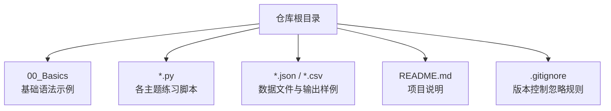
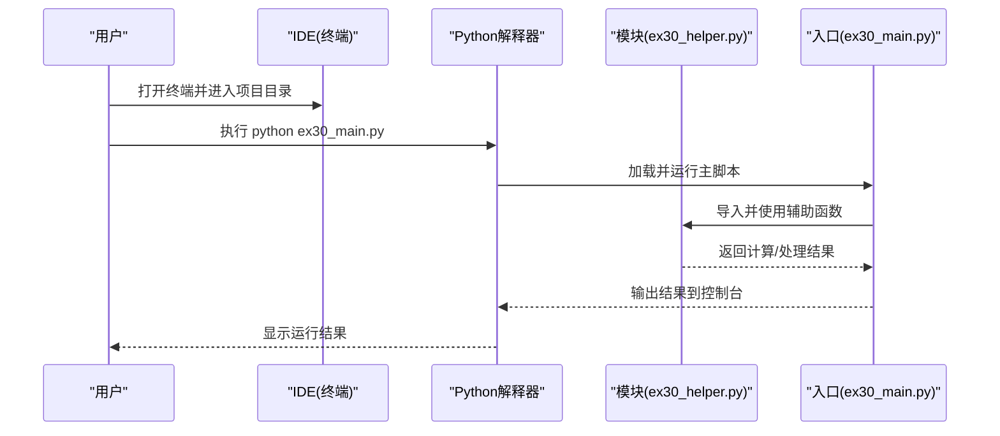
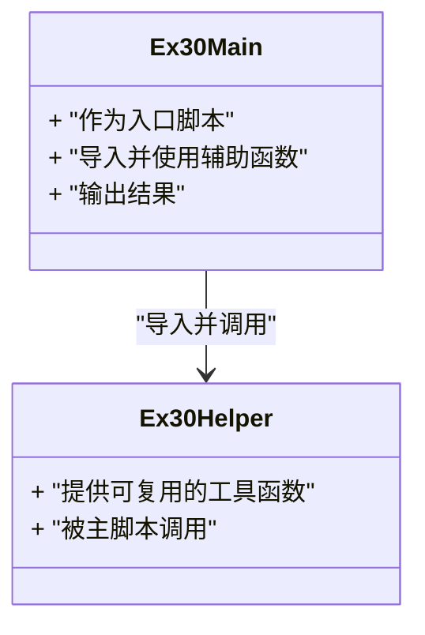
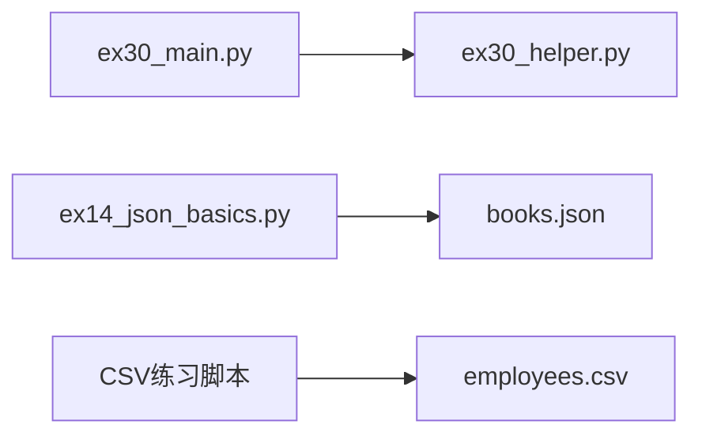

# 快速开始

<cite>
**本文引用的文件**   
- [README.md](file://README.md)
- [.gitignore](file://.gitignore)
- [00_Basics/01_print_vars.py](file://00_Basics/01_print_vars.py)
- [ex30_main.py](file://ex30_main.py)
- [ex30_helper.py](file://ex30_helper.py)
- [ex14_json_basics.py](file://ex14_json_basics.py)
- [books.json](file://books.json)
- [employees.csv](file://employees.csv)
</cite>

## 目录
1. [简介](#简介)
2. [项目结构](#项目结构)
3. [核心组件](#核心组件)
4. [架构总览](#架构总览)
5. [详细组件分析](#详细组件分析)
6. [依赖分析](#依赖分析)
7. [性能考虑](#性能考虑)
8. [故障排查指南](#故障排查指南)
9. [结论](#结论)
10. [附录](#附录)

## 简介
本指南面向Python初学者，目标是在30分钟内完成环境搭建、IDE配置、项目克隆与运行第一个程序。你将学会：
- 安装Python并验证版本
- 使用PyCharm或VS Code创建/打开项目
- 克隆仓库并运行示例脚本
- 理解项目目录结构与关键文件作用
- 查看输出结果并进行常见问题排查

## 项目结构
本项目为Python学习仓库，包含基础语法示例、数据处理练习、面向对象示例以及CSV/JSON读写演示等。根目录下的说明文件与忽略规则有助于你了解项目范围与注意事项。

图表来源
- [README.md](file://README.md)
- [.gitignore](file://.gitignore)

章节来源
- [README.md](file://README.md)
- [.gitignore](file://.gitignore)

## 核心组件
- 基础语法示例：位于“00_Basics”目录，涵盖打印变量、条件分支、循环、列表/元组/集合/字典操作、文件读写、推导式、高阶函数等。
- 主题练习脚本：根目录下以“ex”开头的脚本，覆盖CSV/JSON处理、数据分析、面向对象编程、模块组织等。
- 数据文件：提供CSV与JSON样例，便于直接运行脚本进行读取、清洗与分析。

章节来源
- [00_Basics/01_print_vars.py](file://00_Basics/01_print_vars.py)
- [ex14_json_basics.py](file://ex14_json_basics.py)
- [books.json](file://books.json)
- [employees.csv](file://employees.csv)

## 架构总览
从“运行第一个程序”的角度，整体流程如下：

图表来源
- [ex30_main.py](file://ex30_main.py)
- [ex30_helper.py](file://ex30_helper.py)

## 详细组件分析

### 基础语法入门（00_Basics）
- 推荐从“00_Basics/01_print_vars.py”开始，熟悉打印与变量。
- 随后依次尝试条件、循环、数据结构与文件读写等示例，逐步建立对Python语法的直观认识。

章节来源
- [00_Basics/01_print_vars.py](file://00_Basics/01_print_vars.py)

### 模块组织与调用（ex30）
- “ex30_main.py”作为入口脚本，负责调用“ex30_helper.py”中的工具函数，体现最小化的模块拆分与复用。
- 通过该示例理解如何在一个项目中组织多个脚本，并通过命令行运行入口脚本。

图表来源
- [ex30_main.py](file://ex30_main.py)
- [ex30_helper.py](file://ex30_helper.py)

章节来源
- [ex30_main.py](file://ex30_main.py)
- [ex30_helper.py](file://ex30_helper.py)

### JSON读写示例（ex14）
- “ex14_json_basics.py”演示如何读取与写入JSON数据，配合“books.json”进行练习。
- 适合在掌握基础语法后，进一步学习数据序列化与反序列化的常用方式。

章节来源
- [ex14_json_basics.py](file://ex14_json_basics.py)
- [books.json](file://books.json)

### CSV处理示例（ex12/ex13）
- 根目录下的“employees.csv”可作为CSV处理的输入样例，结合相关练习脚本进行读取、过滤与统计。
- 建议先运行最基础的CSV读取脚本，再逐步尝试更复杂的清洗与导出逻辑。

章节来源
- [employees.csv](file://employees.csv)

## 依赖分析
- 标准库优先：示例主要使用Python内置模块（如os、sys、json、csv等），无需额外安装第三方包即可运行。
- 可选扩展：若后续引入pandas等第三方库，请在虚拟环境中安装对应依赖。

图表来源
- [ex30_main.py](file://ex30_main.py)
- [ex30_helper.py](file://ex30_helper.py)
- [ex14_json_basics.py](file://ex14_json_basics.py)
- [books.json](file://books.json)
- [employees.csv](file://employees.csv)

章节来源
- [ex30_main.py](file://ex30_main.py)
- [ex30_helper.py](file://ex30_helper.py)
- [ex14_json_basics.py](file://ex14_json_basics.py)
- [books.json](file://books.json)
- [employees.csv](file://employees.csv)

## 性能考虑
- 示例脚本规模较小，重点在于理解语法与流程，而非性能优化。
- 当数据量增大时，建议关注I/O路径与内存占用，必要时采用流式读取或分块处理。

## 故障排查指南
- Python未安装或未加入PATH
  - 现象：终端输入python或python3提示找不到命令
  - 解决：重新安装Python并确保勾选“添加到PATH”，重启终端后重试
- 编码问题（中文乱码）
  - 现象：控制台输出中文显示异常
  - 解决：确保终端编码为UTF-8；在Windows上可在系统区域设置中调整
- 文件路径错误
  - 现象：运行脚本时报“文件不存在”
  - 解决：确认当前工作目录与脚本所在目录一致，或使用绝对路径
- 权限不足
  - 现象：无法写入文件或目录
  - 解决：以管理员身份运行终端，或将输出目录改为有写入权限的路径
- 虚拟环境与依赖缺失
  - 现象：导入第三方库失败
  - 解决：创建并激活虚拟环境，安装所需依赖后再运行脚本

章节来源
- [README.md](file://README.md)
- [.gitignore](file://.gitignore)

## 结论
通过以上步骤，你可以在30分钟内完成Python环境搭建、IDE配置、项目克隆与运行第一个程序。建议从“00_Basics”开始循序渐进，再过渡到根目录的主题练习，逐步掌握Python的核心能力与工程化实践。

## 附录

### 环境搭建与运行清单（建议用时约30分钟）
- 安装Python
  - 下载并安装最新稳定版Python
  - 安装时勾选“添加到PATH”
  - 在终端执行版本检查命令，确认安装成功
- 选择IDE
  - PyCharm：新建项目或打开现有文件夹，配置解释器指向已安装的Python
  - VS Code：安装Python扩展，选择解释器，打开终端运行脚本
- 克隆项目
  - 使用Git克隆仓库到本地
  - 或在IDE中选择“从版本控制获取项目”
- 运行第一个程序
  - 打开终端，进入项目根目录
  - 执行入口脚本：python ex30_main.py
  - 观察控制台输出，确认运行成功
- 探索更多示例
  - 运行“00_Basics/01_print_vars.py”体验基础语法
  - 运行“ex14_json_basics.py”并结合“books.json”练习JSON读写
  - 使用“employees.csv”进行CSV读取与简单分析

章节来源
- [ex30_main.py](file://ex30_main.py)
- [ex30_helper.py](file://ex30_helper.py)
- [00_Basics/01_print_vars.py](file://00_Basics/01_print_vars.py)
- [ex14_json_basics.py](file://ex14_json_basics.py)
- [books.json](file://books.json)
- [employees.csv](file://employees.csv)