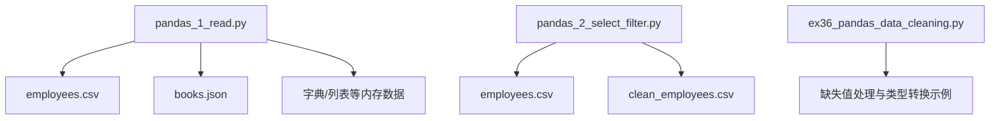
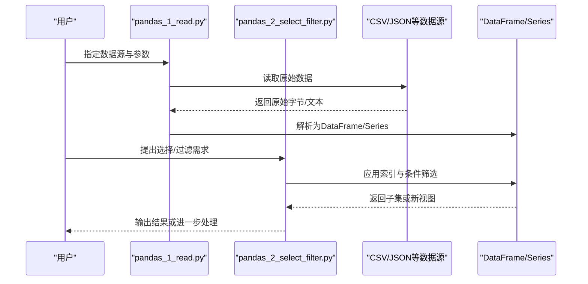
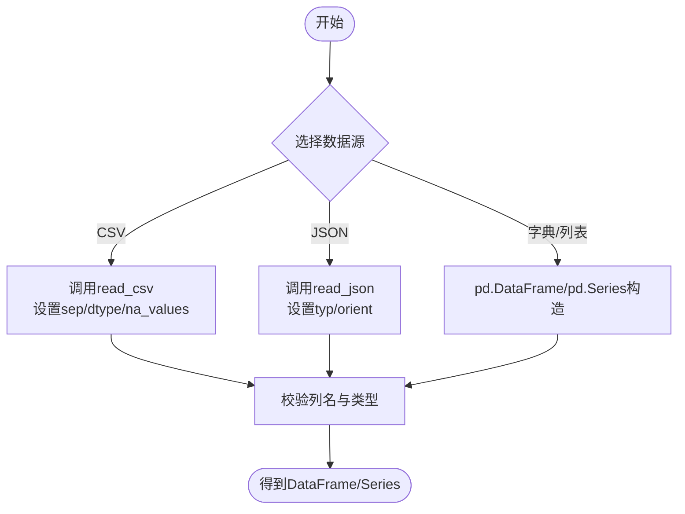
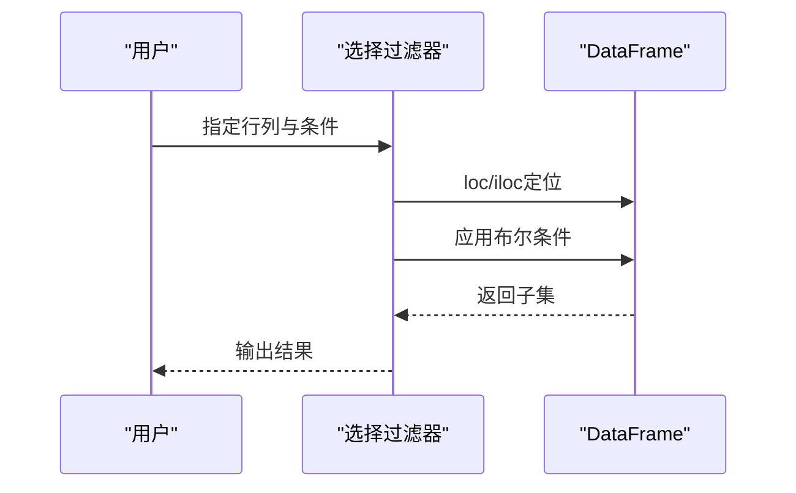
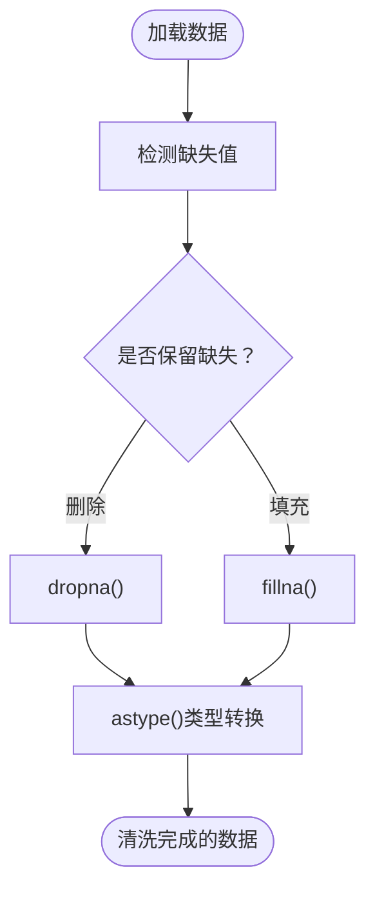
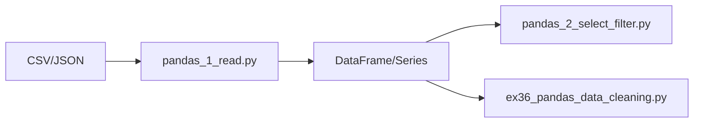

# Pandas基础操作

<cite>
**本文引用的文件**   
- [pandas_1_read.py](file://pandas_1_read.py)
- [pandas_2_select_filter.py](file://pandas_2_select_filter.py)
- [employees.csv](file://employees.csv)
- [books.json](file://books.json)
- [clean_employees.csv](file://clean_employees.csv)
- [department_stats.csv](file://department_stats.csv)
- [department_top_earners.csv](file://department_top_earners.csv)
- [ex36_pandas_data_cleaning.py](file://ex36_pandas_data_cleaning.py)
</cite>

## 目录
1. [简介](#简介)
2. [项目结构](#项目结构)
3. [核心组件](#核心组件)
4. [架构总览](#架构总览)
5. [详细组件分析](#详细组件分析)
6. [依赖关系分析](#依赖关系分析)
7. [性能考虑](#性能考虑)
8. [故障排查指南](#故障排查指南)
9. [结论](#结论)
10. [附录](#附录)

## 简介
本文件面向初学者与进阶用户，系统化讲解Pandas在数据读取、选择与过滤方面的基础操作。重点围绕DataFrame与Series两大核心数据结构，覆盖从CSV、JSON、字典、列表等多种来源的创建方式；深入讲解索引与选择技巧、条件筛选与布尔索引；并通过仓库中的示例脚本展示实际用法。同时提供数据类型转换、缺失值处理与基本统计计算的实用技巧，以及性能优化建议与常见陷阱规避方法。

## 项目结构
本项目包含多个与Pandas相关的示例脚本与数据文件，其中与本主题直接相关的关键文件如下：
- pandas_1_read.py：演示从多种数据源（CSV、JSON、字典、列表等）构建DataFrame/Series的方法
- pandas_2_select_filter.py：演示基于标签与位置的索引、条件筛选、布尔索引与高级选择
- employees.csv / clean_employees.csv / department_stats.csv / department_top_earners.csv：用于读取与筛选的示例数据
- books.json：用于演示JSON数据读取
- ex36_pandas_data_cleaning.py：补充缺失值处理与类型转换的实践

图表来源
- [pandas_1_read.py:1-200](file://pandas_1_read.py#L1-L200)
- [pandas_2_select_filter.py:1-200](file://pandas_2_select_filter.py#L1-L200)
- [ex36_pandas_data_cleaning.py:1-200](file://ex36_pandas_data_cleaning.py#L1-L200)

章节来源
- [pandas_1_read.py:1-200](file://pandas_1_read.py#L1-L200)
- [pandas_2_select_filter.py:1-200](file://pandas_2_select_filter.py#L1-L200)
- [ex36_pandas_data_cleaning.py:1-200](file://ex36_pandas_data_cleaning.py#L1-L200)

## 核心组件
- DataFrame：二维表格型数据结构，适合结构化数据的存储与分析
- Series：一维带标签数组，是构成DataFrame的基础单元

关键能力概览
- 数据创建：从CSV、JSON、字典、列表、元组、NumPy数组等构造
- 索引与选择：基于标签loc、基于位置iloc、布尔索引、条件查询
- 数据清洗：类型转换、缺失值检测与填充/删除
- 统计计算：描述性统计、分组聚合（后续章节会扩展）

章节来源
- [pandas_1_read.py:1-200](file://pandas_1_read.py#L1-L200)
- [pandas_2_select_filter.py:1-200](file://pandas_2_select_filter.py#L1-L200)

## 架构总览
下图展示了“数据读取—选择过滤—清洗统计”的基础流程，对应仓库中两个主要脚本的职责分工。

图表来源
- [pandas_1_read.py:1-200](file://pandas_1_read.py#L1-L200)
- [pandas_2_select_filter.py:1-200](file://pandas_2_select_filter.py#L1-L200)

## 详细组件分析

### 组件A：数据读取与对象创建（pandas_1_read.py）
该脚本演示了多种数据源的读取与对象创建方式，包括：
- 从CSV读取：使用read_csv加载表格数据，可指定分隔符、列名、数据类型等
- 从JSON读取：使用read_json加载结构化JSON数据
- 从字典/列表创建：将Python原生容器转换为DataFrame/Series
- 从其他CSV文件读取：如clean_employees.csv、department_stats.csv等

要点与建议
- 明确dtype：在读取时显式指定列类型，避免后续类型推断带来的开销与错误
- 处理缺失值：结合na_values、keep_default_na等参数控制空值识别
- 大文件策略：chunksize分块读取，减少内存占用

图表来源
- [pandas_1_read.py:1-200](file://pandas_1_read.py#L1-L200)

章节来源
- [pandas_1_read.py:1-200](file://pandas_1_read.py#L1-L200)
- [employees.csv:1-200](file://employees.csv#L1-L200)
- [books.json:1-200](file://books.json#L1-L200)
- [clean_employees.csv:1-200](file://clean_employees.csv#L1-L200)
- [department_stats.csv:1-200](file://department_stats.csv#L1-L200)

### 组件B：选择、过滤与索引（pandas_2_select_filter.py）
该脚本聚焦于DataFrame/Series的选择与过滤，涵盖：
- 基于标签的索引：loc
- 基于位置的索引：iloc
- 布尔索引与条件查询：组合多个条件、使用逻辑运算符
- 高级选择：isin、query、between等

典型流程
- 先通过loc/iloc定位行/列
- 再叠加布尔条件进行筛选
- 对结果进行切片、重排或导出

图表来源
- [pandas_2_select_filter.py:1-200](file://pandas_2_select_filter.py#L1-L200)

章节来源
- [pandas_2_select_filter.py:1-200](file://pandas_2_select_filter.py#L1-L200)
- [employees.csv:1-200](file://employees.csv#L1-L200)
- [clean_employees.csv:1-200](file://clean_employees.csv#L1-L200)

### 组件C：缺失值处理与类型转换（ex36_pandas_data_cleaning.py）
该脚本提供了缺失值与类型转换的实战示例，常用模式包括：
- isnull()/isna()检测缺失值
- dropna()删除含缺失值的行/列
- fillna()按列或全局填充缺失值
- astype()进行类型转换（如字符串转数值、日期解析）
- replace()替换异常值或特定标记

图表来源
- [ex36_pandas_data_cleaning.py:1-200](file://ex36_pandas_data_cleaning.py#L1-L200)

章节来源
- [ex36_pandas_data_cleaning.py:1-200](file://ex36_pandas_data_cleaning.py#L1-L200)

## 依赖关系分析
- pandas_1_read.py依赖外部数据文件（CSV/JSON），负责将原始数据解析为DataFrame/Series
- pandas_2_select_filter.py依赖已构建好的DataFrame/Series，执行选择与过滤
- ex36_pandas_data_cleaning.py作为清洗辅助脚本，可与前两者配合形成完整流水线

图表来源
- [pandas_1_read.py:1-200](file://pandas_1_read.py#L1-L200)
- [pandas_2_select_filter.py:1-200](file://pandas_2_select_filter.py#L1-L200)
- [ex36_pandas_data_cleaning.py:1-200](file://ex36_pandas_data_cleaning.py#L1-L200)

章节来源
- [pandas_1_read.py:1-200](file://pandas_1_read.py#L1-L200)
- [pandas_2_select_filter.py:1-200](file://pandas_2_select_filter.py#L1-L200)
- [ex36_pandas_data_cleaning.py:1-200](file://ex36_pandas_data_cleaning.py#L1-L200)

## 性能考虑
- 优先向量化操作：尽量使用内置函数与向量化表达式，避免逐行循环
- 合理选择索引器：loc/iloc比通用选择更高效；复杂条件可用query提升可读性与一定性能
- 控制数据类型：读取时显式指定dtype，减少二次转换成本
- 分块与大文件：使用chunksize分块处理，降低峰值内存
- 避免链式赋值警告：使用.loc/.at/.iat或直接赋值到副本，避免SettingWithCopyWarning
- 缓存中间结果：对重复使用的子集进行变量保存，避免重复计算

[本节为通用指导，不直接分析具体文件]

## 故障排查指南
常见问题与定位思路
- SettingWithCopyWarning：检查是否在视图上修改数据，改用.loc直接赋值或显式.copy()
- 类型不一致导致计算失败：确认列类型，必要时用astype()统一
- 缺失值干扰统计：先用isna()查看分布，再用dropna()/fillna()处理
- JSON结构嵌套：确保orient/typ参数正确，必要时先展开层级
- 编码问题：读取CSV时指定encoding（如utf-8-sig）

章节来源
- [ex36_pandas_data_cleaning.py:1-200](file://ex36_pandas_data_cleaning.py#L1-L200)

## 结论
通过本项目的示例脚本与数据文件，可以系统掌握Pandas在数据读取、选择与过滤方面的核心技能。建议在实际项目中遵循“明确类型—向量化—分块—清洗—验证”的流程，以获得稳定且高效的分析体验。

[本节为总结性内容，不直接分析具体文件]

## 附录
- 示例数据文件说明
  - employees.csv：员工基本信息，常用于筛选与统计练习
  - clean_employees.csv：清洗后的员工数据，便于直接进行后续分析
  - department_stats.csv：部门级统计数据，可用于分组与汇总练习
  - department_top_earners.csv：各部门高收入者信息，适合条件筛选与排序
  - books.json：书籍信息，用于演示JSON读取与结构解析

章节来源
- [employees.csv:1-200](file://employees.csv#L1-L200)
- [clean_employees.csv:1-200](file://clean_employees.csv#L1-L200)
- [department_stats.csv:1-200](file://department_stats.csv#L1-L200)
- [department_top_earners.csv:1-200](file://department_top_earners.csv#L1-L200)
- [books.json:1-200](file://books.json#L1-L200)