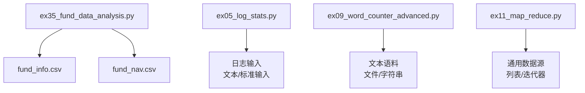
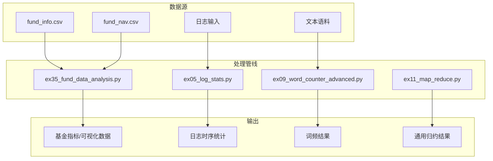
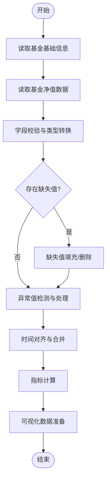
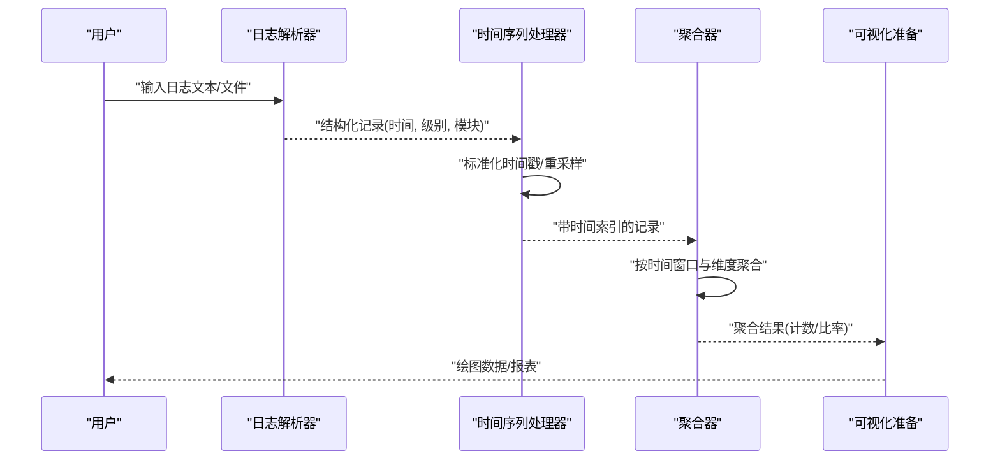
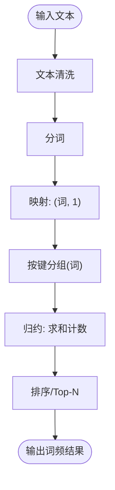
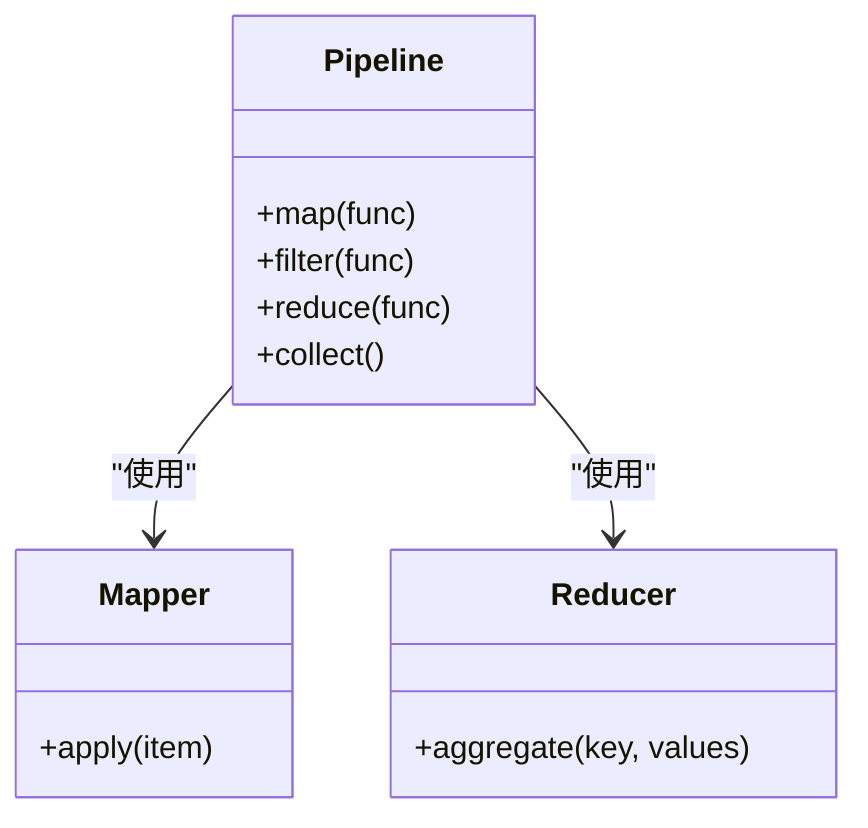
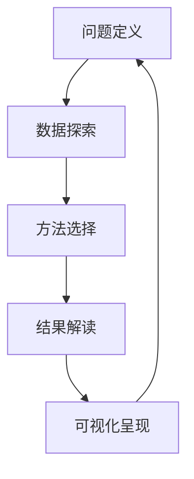
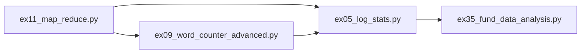

# 实战案例分析

<cite>
**本文引用的文件**   
- [ex35_fund_data_analysis.py](file://ex35_fund_data_analysis.py)
- [ex05_log_stats.py](file://ex05_log_stats.py)
- [ex09_word_counter_advanced.py](file://ex09_word_counter_advanced.py)
- [ex11_map_reduce.py](file://ex11_map_reduce.py)
- [fund_info.csv](file://fund_info.csv)
- [fund_nav.csv](file://fund_nav.csv)
</cite>

## 目录
1. [引言](#引言)
2. [项目结构](#项目结构)
3. [核心组件](#核心组件)
4. [架构总览](#架构总览)
5. [详细组件分析](#详细组件分析)
6. [依赖关系分析](#依赖关系分析)
7. [性能考虑](#性能考虑)
8. [故障排查指南](#故障排查指南)
9. [结论](#结论)
10. [附录](#附录)

## 引言
本案例文档围绕四个代表性脚本，构建一套端到端的数据分析实战方法论：从真实金融数据导入、清洗与可视化准备，到日志时间序列统计、文本词频统计与MapReduce模式，再到函数式编程在数据处理中的应用。通过“问题定义—数据探索—方法选择—结果解读”的闭环流程，帮助读者掌握可复用的数据分析套路，并给出性能调优与可视化的实用技巧。

## 项目结构
本项目以单文件示例为主，每个脚本聚焦一个主题：
- ex35_fund_data_analysis.py：基金数据导入、清洗、分析与可视化准备（CSV）
- ex05_log_stats.py：日志统计分析（时间序列与趋势）
- ex09_word_counter_advanced.py：高级词频统计（文本处理与MapReduce思想）
- ex11_map_reduce.py：MapReduce范式与函数式编程实践
- fund_info.csv / fund_nav.csv：基金基础信息与净值数据

图表来源
- [ex35_fund_data_analysis.py:1-200](file://ex35_fund_data_analysis.py#L1-L200)
- [ex05_log_stats.py:1-200](file://ex05_log_stats.py#L1-L200)
- [ex09_word_counter_advanced.py:1-200](file://ex09_word_counter_advanced.py#L1-L200)
- [ex11_map_reduce.py:1-200](file://ex11_map_reduce.py#L1-L200)

章节来源
- [ex35_fund_data_analysis.py:1-200](file://ex35_fund_data_analysis.py#L1-L200)
- [ex05_log_stats.py:1-200](file://ex05_log_stats.py#L1-L200)
- [ex09_word_counter_advanced.py:1-200](file://ex09_word_counter_advanced.py#L1-L200)
- [ex11_map_reduce.py:1-200](file://ex11_map_reduce.py#L1-L200)

## 核心组件
- 基金数据分析流水线（ex35_fund_data_analysis.py）
  - 目标：完成基金基础信息与净值数据的读取、对齐、清洗、指标计算与可视化准备
  - 关键步骤：数据导入→字段校验→缺失值处理→异常值检测→时间对齐→指标计算→输出中间表/绘图数据
- 日志统计分析（ex05_log_stats.py）
  - 目标：对结构化或半结构化日志进行解析、聚合与时间序列分析
  - 关键步骤：行级解析→时间戳提取→分组聚合→趋势统计→可视化准备
- 高级词频统计（ex09_word_counter_advanced.py）
  - 目标：演示文本预处理、分词、计数与MapReduce风格的分阶段处理
  - 关键步骤：文本清洗→分词→映射计数→归约汇总→排序输出
- MapReduce范式（ex11_map_reduce.py）
  - 目标：用函数式编程实现通用的map/reduce流程，支撑多种数据处理任务
  - 关键步骤：定义映射函数→分区/洗牌（可选）→归约函数→结果组装

章节来源
- [ex35_fund_data_analysis.py:1-200](file://ex35_fund_data_analysis.py#L1-L200)
- [ex05_log_stats.py:1-200](file://ex05_log_stats.py#L1-L200)
- [ex09_word_counter_advanced.py:1-200](file://ex09_word_counter_advanced.py#L1-L200)
- [ex11_map_reduce.py:1-200](file://ex11_map_reduce.py#L1-L200)

## 架构总览
下图展示了四个案例之间的职责划分与数据流向，便于理解整体分析方法论。

图表来源
- [ex35_fund_data_analysis.py:1-200](file://ex35_fund_data_analysis.py#L1-L200)
- [ex05_log_stats.py:1-200](file://ex05_log_stats.py#L1-L200)
- [ex09_word_counter_advanced.py:1-200](file://ex09_word_counter_advanced.py#L1-L200)
- [ex11_map_reduce.py:1-200](file://ex11_map_reduce.py#L1-L200)

## 详细组件分析

### 组件A：基金数据分析流水线（ex35_fund_data_analysis.py）
- 业务目标
  - 基于基金基础信息与净值数据，完成数据质量检查、缺失与异常处理、时间对齐与指标计算，为后续回测或可视化提供干净数据集。
- 数据流与处理逻辑
  - 数据导入：分别读取基金基本信息与净值序列
  - 字段校验：检查必要列是否存在、类型是否合理
  - 缺失值处理：按策略填充或删除
  - 异常值检测：基于阈值或分布方法识别并处理
  - 时间对齐：统一时间粒度，合并多表
  - 指标计算：收益率、波动率等常用指标
  - 可视化准备：生成绘图所需的时间序列与分类数据
- 复杂度与优化
  - 主要瓶颈在I/O与大规模数值计算；可通过向量化计算、增量读取与缓存减少重复计算
- 错误处理
  - 针对缺失列、空值、非法日期、重复键等进行明确报错与降级策略

图表来源
- [ex35_fund_data_analysis.py:1-200](file://ex35_fund_data_analysis.py#L1-L200)

章节来源
- [ex35_fund_data_analysis.py:1-200](file://ex35_fund_data_analysis.py#L1-L200)
- [fund_info.csv:1-200](file://fund_info.csv#L1-L200)
- [fund_nav.csv:1-200](file://fund_nav.csv#L1-L200)

### 组件B：日志统计分析（ex05_log_stats.py）
- 业务目标
  - 对应用日志进行解析、聚合与时间序列分析，定位峰值时段、错误率变化与趋势拐点。
- 处理要点
  - 行级解析：正则或分隔符提取关键字段（时间、级别、模块等）
  - 时间序列化：统一时区与频率，重采样到分钟/小时/日
  - 分组聚合：按时间窗口与维度（如错误级别）聚合计数
  - 趋势分析：移动平均、差分、季节性分解（概念性说明）
- 可视化准备
  - 输出时序折线、柱状图与热力图所需的数据格式

图表来源
- [ex05_log_stats.py:1-200](file://ex05_log_stats.py#L1-L200)

章节来源
- [ex05_log_stats.py:1-200](file://ex05_log_stats.py#L1-L200)

### 组件C：高级词频统计（ex09_word_counter_advanced.py）
- 业务目标
  - 演示文本清洗、分词、计数与MapReduce风格的分布式处理思想。
- 处理要点
  - 文本清洗：去噪、大小写统一、标点处理
  - 分词：按规则或词典切分
  - 映射阶段：将词映射为(词, 1)
  - 归约阶段：按词聚合计数
  - 排序输出：Top-N词频
- 可扩展性
  - 天然支持并行与分布式扩展（Map阶段独立，Reduce阶段聚合）

图表来源
- [ex09_word_counter_advanced.py:1-200](file://ex09_word_counter_advanced.py#L1-L200)

章节来源
- [ex09_word_counter_advanced.py:1-200](file://ex09_word_counter_advanced.py#L1-L200)

### 组件D：MapReduce范式与函数式编程（ex11_map_reduce.py）
- 业务目标
  - 抽象出通用的map/reduce流程，用于多种数据处理任务（计数、过滤、变换、聚合）。
- 设计要点
  - 映射函数：对每个元素执行变换/筛选
  - 归约函数：对分组后的数据进行聚合
  - 组合式管道：链式调用提高可读性与复用性
- 适用场景
  - 批处理、离线分析、可并行化的数据流水线

图表来源
- [ex11_map_reduce.py:1-200](file://ex11_map_reduce.py#L1-L200)

章节来源
- [ex11_map_reduce.py:1-200](file://ex11_map_reduce.py#L1-L200)

### 概念总览：数据分析方法论
- 问题定义：明确业务目标与评估指标
- 数据探索：了解分布、缺失、异常与相关性
- 方法选择：根据数据类型与目标选择合适的统计/机器学习方法
- 结果解读：结合业务背景解释指标与趋势
- 可视化呈现：选择合适图表传达洞察

[此图为概念流程图，不直接对应具体源码文件]

## 依赖关系分析
- 外部库依赖
  - CSV/JSON读写、正则表达式、时间序列处理、数值计算与可视化库（由脚本实际导入决定）
- 内部耦合
  - ex11_map_reduce.py可作为通用工具被其他脚本复用
  - ex09_word_counter_advanced.py体现的MapReduce思想可迁移至ex05_log_stats.py的聚合阶段
  - ex35_fund_data_analysis.py作为完整流水线的集成点，串联数据导入、清洗与分析

图表来源
- [ex11_map_reduce.py:1-200](file://ex11_map_reduce.py#L1-L200)
- [ex09_word_counter_advanced.py:1-200](file://ex09_word_counter_advanced.py#L1-L200)
- [ex05_log_stats.py:1-200](file://ex05_log_stats.py#L1-L200)
- [ex35_fund_data_analysis.py:1-200](file://ex35_fund_data_analysis.py#L1-L200)

章节来源
- [ex11_map_reduce.py:1-200](file://ex11_map_reduce.py#L1-L200)
- [ex09_word_counter_advanced.py:1-200](file://ex09_word_counter_advanced.py#L1-L200)
- [ex05_log_stats.py:1-200](file://ex05_log_stats.py#L1-L200)
- [ex35_fund_data_analysis.py:1-200](file://ex35_fund_data_analysis.py#L1-L200)

## 性能考虑
- I/O优化
  - 批量读取、延迟加载、只读必要列、避免重复解析
- 内存管理
  - 分块处理、惰性计算、及时释放中间对象
- 计算加速
  - 向量化运算、避免Python层循环、利用C扩展库
- 并行与分布式
  - Map阶段天然并行；Reduce阶段注意负载均衡与序列化开销
- 可视化效率
  - 预聚合后再绘图、按需渲染、降采样大数据集

[本节为通用指导，无需特定文件引用]

## 故障排查指南
- 常见错误
  - 列名不一致或缺失：在导入后增加字段白名单校验
  - 时间格式不统一：统一解析格式与时区，失败行记录日志
  - 重复键导致合并失败：去重策略与冲突处理
  - 内存溢出：改用分块/流式处理与增量聚合
- 调试建议
  - 打印关键阶段的样本数据与统计摘要
  - 对异常值进行抽样检查与可视化确认
  - 将中间结果落盘以便断点续跑

章节来源
- [ex35_fund_data_analysis.py:1-200](file://ex35_fund_data_analysis.py#L1-L200)
- [ex05_log_stats.py:1-200](file://ex05_log_stats.py#L1-L200)
- [ex09_word_counter_advanced.py:1-200](file://ex09_word_counter_advanced.py#L1-L200)
- [ex11_map_reduce.py:1-200](file://ex11_map_reduce.py#L1-L200)

## 结论
通过四个案例，我们构建了从数据导入、清洗、分析到可视化的完整链路，并展示了MapReduce与函数式编程在数据处理中的强大能力。建议在工程实践中将通用能力（如map/reduce、时间序列处理、文本清洗）沉淀为可复用模块，以提升开发效率与系统稳定性。

[本节为总结性内容，无需特定文件引用]

## 附录
- 术语
  - MapReduce：一种将数据处理分为映射与归约两阶段的编程模型
  - 时间序列：按时间顺序排列的数据点集合
  - 可视化准备：为满足绘图需求而进行的聚合、格式化与降采样
- 参考数据
  - fund_info.csv：基金基础信息
  - fund_nav.csv：基金净值数据

章节来源
- [fund_info.csv:1-200](file://fund_info.csv#L1-L200)
- [fund_nav.csv:1-200](file://fund_nav.csv#L1-L200)