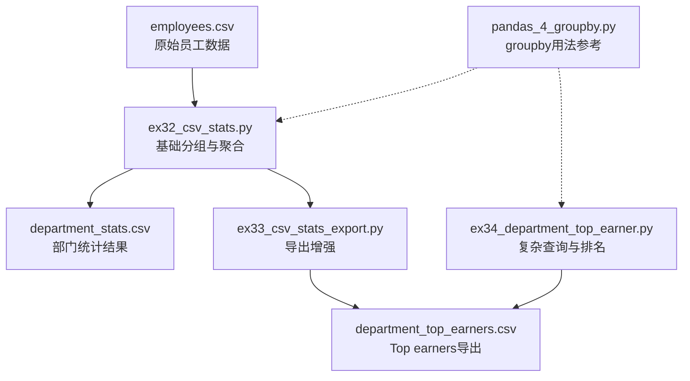
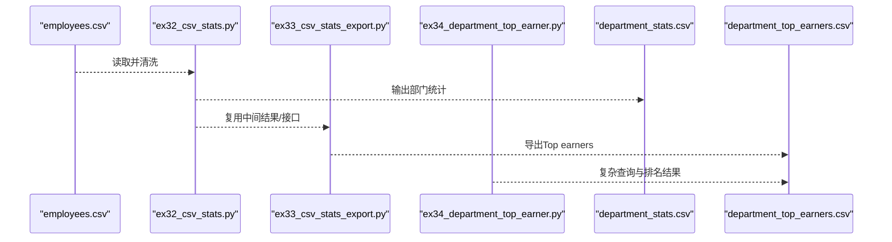
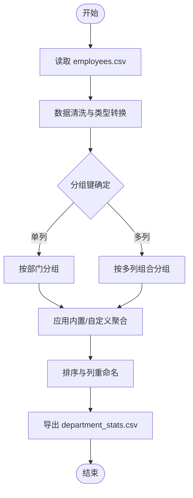
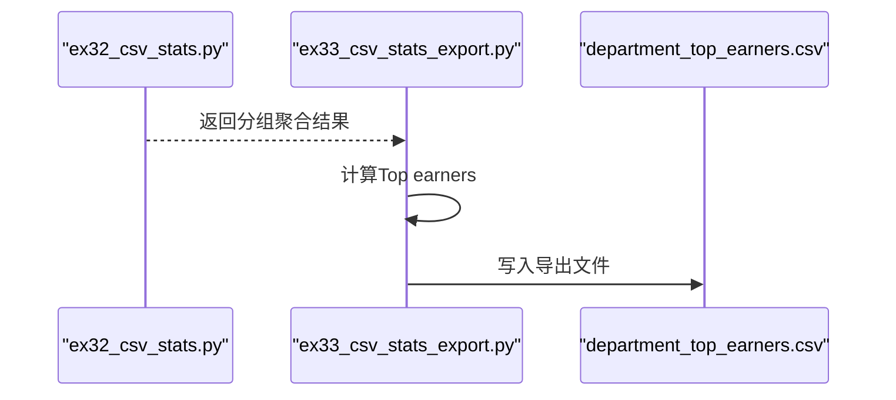
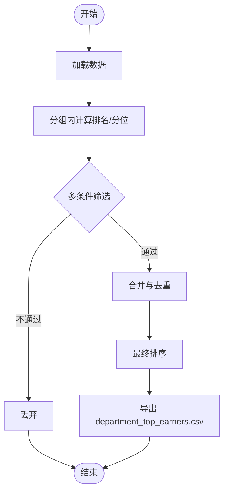
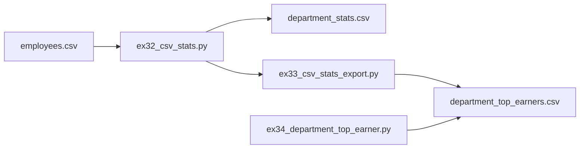

# 数据分组与统计分析

<cite>
**本文引用的文件**   
- [ex32_csv_stats.py](file://ex32_csv_stats.py)
- [ex33_csv_stats_export.py](file://ex33_csv_stats_export.py)
- [ex34_department_top_earner.py](file://ex34_department_top_earner.py)
- [pandas_4_groupby.py](file://pandas_4_groupby.py)
- [employees.csv](file://employees.csv)
- [department_stats.csv](file://department_stats.csv)
- [department_top_earners.csv](file://department_top_earners.csv)
</cite>

## 目录
1. [简介](#简介)
2. [项目结构](#项目结构)
3. [核心组件](#核心组件)
4. [架构总览](#架构总览)
5. [详细组件分析](#详细组件分析)
6. [依赖关系分析](#依赖关系分析)
7. [性能考虑](#性能考虑)
8. [故障排查指南](#故障排查指南)
9. [结论](#结论)
10. [附录](#附录)

## 简介
本文件围绕Pandas的数据分组与统计分析展开，聚焦groupby的核心概念、常用聚合函数与自定义聚合函数的编写方法。通过仓库中的实际案例：
- ex32_csv_stats.py：演示员工部门统计（单列/多列分组、常用聚合）
- ex33_csv_stats_export.py：在ex32基础上增加结果导出功能
- ex34_department_top_earner.py：实现复杂查询逻辑（排名计算、多条件筛选）
并结合pandas_4_groupby.py的示例进行系统化讲解。文末提供大数据集分组优化与内存管理建议，帮助读者在实际工程中高效落地。

## 项目结构
与本次主题相关的核心文件如下：
- 示例脚本：ex32_csv_stats.py、ex33_csv_stats_export.py、ex34_department_top_earner.py、pandas_4_groupby.py
- 数据文件：employees.csv、department_stats.csv、department_top_earners.csv

图表来源
- [ex32_csv_stats.py](file://ex32_csv_stats.py)
- [ex33_csv_stats_export.py](file://ex33_csv_stats_export.py)
- [ex34_department_top_earner.py](file://ex34_department_top_earner.py)
- [pandas_4_groupby.py](file://pandas_4_groupby.py)
- [employees.csv](file://employees.csv)
- [department_stats.csv](file://department_stats.csv)
- [department_top_earners.csv](file://department_top_earners.csv)

章节来源
- [ex32_csv_stats.py](file://ex32_csv_stats.py)
- [ex33_csv_stats_export.py](file://ex33_csv_stats_export.py)
- [ex34_department_top_earner.py](file://ex34_department_top_earner.py)
- [pandas_4_groupby.py](file://pandas_4_groupby.py)
- [employees.csv](file://employees.csv)
- [department_stats.csv](file://department_stats.csv)
- [department_top_earners.csv](file://department_top_earners.csv)

## 核心组件
- 数据读取与清洗
  - 从CSV加载数据，处理缺失值、类型转换与字段标准化，为后续分组做准备。
- 分组与聚合
  - 单列分组：按“部门”等维度进行汇总
  - 多列分组：按“部门+岗位/地区”等多维组合进行汇总
  - 动态分组策略：根据配置或运行时参数决定分组键集合
- 内置聚合函数
  - sum、mean、count、max、min、std、var、first、last、nunique等
- 自定义聚合
  - 使用agg传入自定义函数或命名元组，实现业务特定的统计口径
- 排序与排名
  - 基于数值字段进行降序/升序排序
  - 使用rank/nth/top_n模式获取各组内Top N
- 结果导出
  - 将分组结果写入CSV，便于下游系统消费或归档

章节来源
- [ex32_csv_stats.py](file://ex32_csv_stats.py)
- [ex33_csv_stats_export.py](file://ex33_csv_stats_export.py)
- [ex34_department_top_earner.py](file://ex34_department_top_earner.py)
- [pandas_4_groupby.py](file://pandas_4_groupby.py)

## 架构总览
整体流程分为“数据准备—分组聚合—后处理—导出”四个阶段，各阶段由独立脚本承担职责，便于复用与扩展。

图表来源
- [ex32_csv_stats.py](file://ex32_csv_stats.py)
- [ex33_csv_stats_export.py](file://ex33_csv_stats_export.py)
- [ex34_department_top_earner.py](file://ex34_department_top_earner.py)
- [employees.csv](file://employees.csv)
- [department_stats.csv](file://department_stats.csv)
- [department_top_earners.csv](file://department_top_earners.csv)

## 详细组件分析

### 组件A：ex32_csv_stats.py（基础分组与聚合）
- 目标
  - 从employees.csv读取数据，完成必要清洗后，按部门维度进行统计汇总，生成department_stats.csv。
- 关键能力
  - 单列分组：按“部门”聚合薪资、人数等指标
  - 多列分组：可按“部门+岗位/地区”等组合维度聚合
  - 动态分组键：支持以列表形式传入分组键，便于统一入口
  - 内置聚合：sum、mean、count、max、min等
  - 自定义聚合：通过agg传入自定义函数，满足特定口径
- 典型流程
  - 读取CSV → 清洗（缺失值、类型）→ 选择分组键 → 执行聚合 → 排序/重命名列 → 导出CSV

图表来源
- [ex32_csv_stats.py](file://ex32_csv_stats.py)
- [employees.csv](file://employees.csv)
- [department_stats.csv](file://department_stats.csv)

章节来源
- [ex32_csv_stats.py](file://ex32_csv_stats.py)
- [department_stats.csv](file://department_stats.csv)

### 组件B：ex33_csv_stats_export.py（结果导出增强）
- 目标
  - 在ex32的基础上，增加对Top earners结果的导出，输出至department_top_earners.csv。
- 关键能力
  - 复用ex32的分组与聚合逻辑
  - 新增导出模块：将Top earners明细或汇总写入CSV
  - 可选：追加时间戳、版本信息到导出文件名或表头
- 典型流程
  - 调用ex32的聚合结果 → 计算Top earners → 格式化输出 → 写入CSV

图表来源
- [ex32_csv_stats.py](file://ex32_csv_stats.py)
- [ex33_csv_stats_export.py](file://ex33_csv_stats_export.py)
- [department_top_earners.csv](file://department_top_earners.csv)

章节来源
- [ex33_csv_stats_export.py](file://ex33_csv_stats_export.py)
- [department_top_earners.csv](file://department_top_earners.csv)

### 组件C：ex34_department_top_earner.py（复杂查询与排名）
- 目标
  - 针对每个部门，计算员工薪资排名，并按多条件筛选出Top earners（如前N名、高于均值一定比例等）。
- 关键能力
  - 分组内排名：使用rank或nth/top_n模式
  - 多条件筛选：结合阈值、百分比、业务规则过滤
  - 结果合并与去重：确保同一员工不重复出现在多个部门Top名单中
- 典型流程
  - 读取数据 → 按部门分组 → 计算排名/分位 → 多条件筛选 → 排序与去重 → 导出

图表来源
- [ex34_department_top_earner.py](file://ex34_department_top_earner.py)
- [department_top_earners.csv](file://department_top_earners.csv)

章节来源
- [ex34_department_top_earner.py](file://ex34_department_top_earner.py)
- [department_top_earners.csv](file://department_top_earners.csv)

### 参考：pandas_4_groupby.py（groupby用法参考）
- 作用
  - 作为groupby操作的基础参考，展示单列/多列分组、内置聚合、自定义聚合、链式操作等常见用法。
- 建议
  - 对照ex32/ex33/ex34的实际场景，理解如何把通用用法迁移到业务脚本中。

章节来源
- [pandas_4_groupby.py](file://pandas_4_groupby.py)

## 依赖关系分析
- 内部依赖
  - ex33_csv_stats_export.py 依赖 ex32_csv_stats.py 的聚合结果或封装接口
  - ex34_department_top_earner.py 可复用ex32的清洗与分组逻辑
- 外部依赖
  - pandas：数据处理与分组聚合
  - csv/io：读写CSV文件
- 数据依赖
  - employees.csv 为输入源
  - department_stats.csv、department_top_earners.csv 为输出产物

图表来源
- [ex32_csv_stats.py](file://ex32_csv_stats.py)
- [ex33_csv_stats_export.py](file://ex33_csv_stats_export.py)
- [ex34_department_top_earner.py](file://ex34_department_top_earner.py)
- [employees.csv](file://employees.csv)
- [department_stats.csv](file://department_stats.csv)
- [department_top_earners.csv](file://department_top_earners.csv)

章节来源
- [ex32_csv_stats.py](file://ex32_csv_stats.py)
- [ex33_csv_stats_export.py](file://ex33_csv_stats_export.py)
- [ex34_department_top_earner.py](file://ex34_department_top_earner.py)
- [employees.csv](file://employees.csv)
- [department_stats.csv](file://department_stats.csv)
- [department_top_earners.csv](file://department_top_earners.csv)

## 性能考虑
- 数据类型优化
  - 将分类列转换为category类型，减少内存占用并提升groupby速度
  - 数值列使用更紧凑的dtype（如float32/int16），避免不必要的精度损失
- 向量化优先
  - 尽量使用内置聚合与向量化操作，避免逐行apply；必要时再考虑自定义聚合
- 分块与流式处理
  - 超大CSV可使用chunksize分块读取，逐步聚合后再合并
- 索引与排序
  - 对频繁用于分组的列建立索引或在分组前sort_values，可减少内部开销
- 内存管理
  - 及时释放中间变量（del）、使用inplace谨慎评估收益与可读性
  - 导出时按需选择列，避免冗余列写入磁盘
- 并行化
  - 对于极大数据集，可考虑dask/polars等替代方案，或与数据库侧SQL聚合结合

[本节为通用指导，无需具体文件引用]

## 故障排查指南
- 常见问题
  - 列名不一致或大小写差异导致KeyError：统一列名规范，读取后进行标准化
  - 缺失值影响聚合：在分组前填充或删除缺失值，明确业务口径
  - 类型错误：确保数值列为数值类型，字符串列去除空白字符
  - 导出失败：检查路径权限、文件名冲突、编码格式
- 定位步骤
  - 打印分组键的唯一值，确认分组维度正确
  - 检查聚合后的列名与顺序，确保下游消费一致
  - 对Top earners结果做抽样校验，核对排名与筛选条件

章节来源
- [ex32_csv_stats.py](file://ex32_csv_stats.py)
- [ex33_csv_stats_export.py](file://ex33_csv_stats_export.py)
- [ex34_department_top_earner.py](file://ex34_department_top_earner.py)

## 结论
通过ex32/ex33/ex34三个脚本，我们系统展示了Pandas分组与统计分析的典型实践：从基础的单列/多列分组与内置聚合，到自定义聚合与复杂排名筛选，再到结果导出与工程化组织。配合性能优化与内存管理建议，可在真实业务场景中稳定、高效地落地数据分析任务。

[本节为总结性内容，无需具体文件引用]

## 附录
- 术语
  - 分组键：用于划分数据的列或列组合
  - 聚合函数：对每组数据进行归约计算的函数
  - Top N：每组内排名前N的记录
- 建议的最佳实践
  - 将清洗、分组、聚合、导出拆分为独立函数或模块，提高可测试性与可维护性
  - 为关键脚本添加日志与异常捕获，记录关键步骤耗时与错误堆栈
  - 对导出文件增加元数据（生成时间、版本、数据来源），便于追溯

[本节为补充说明，无需具体文件引用]