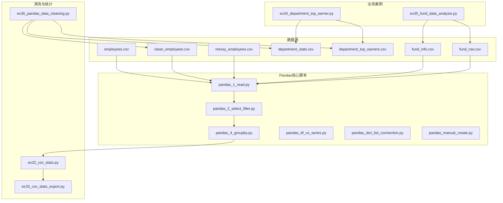
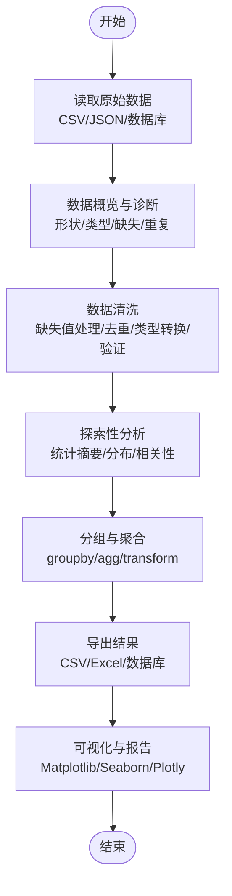
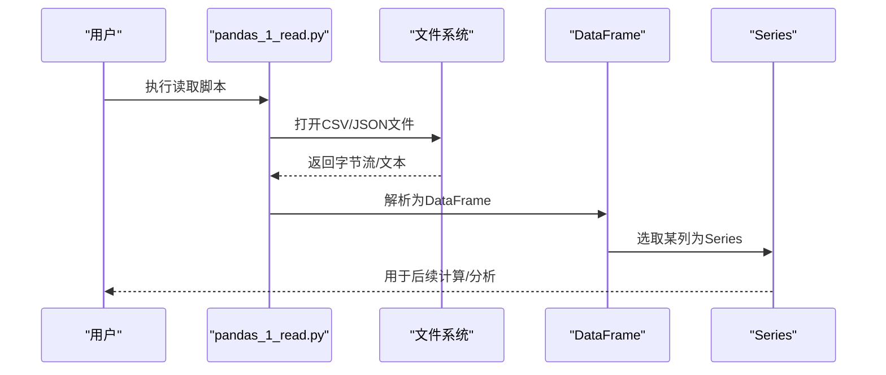
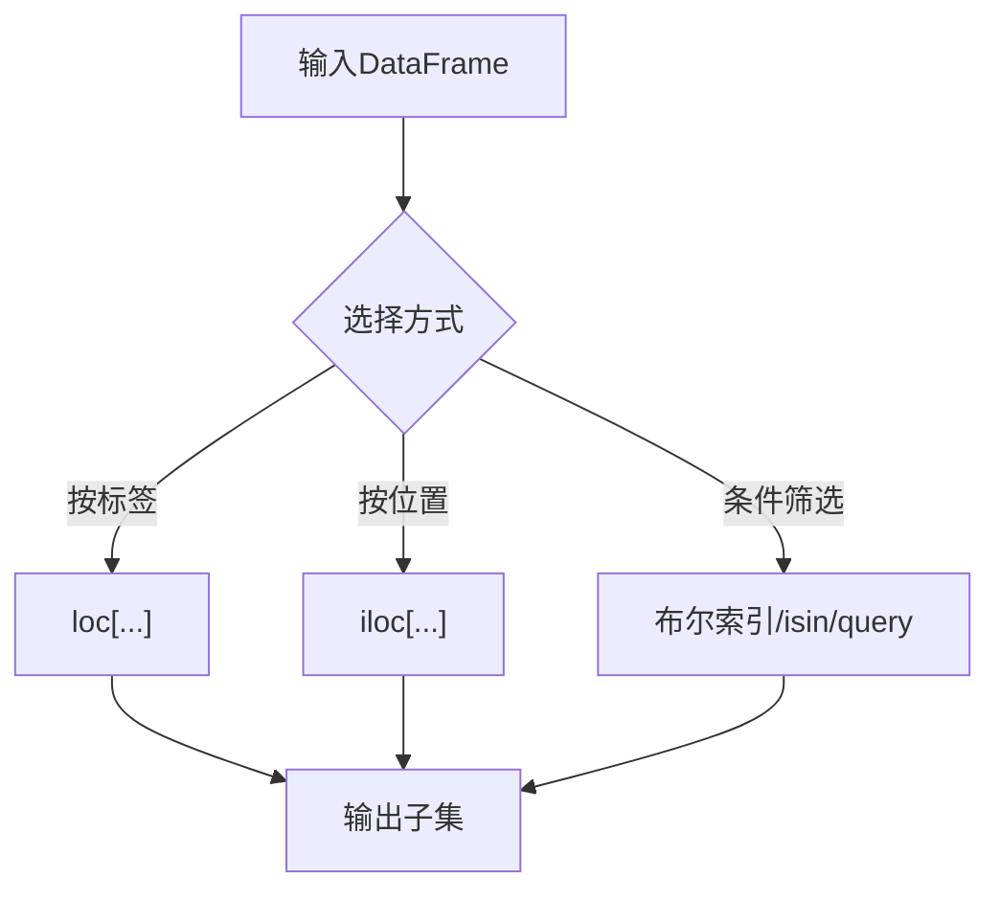
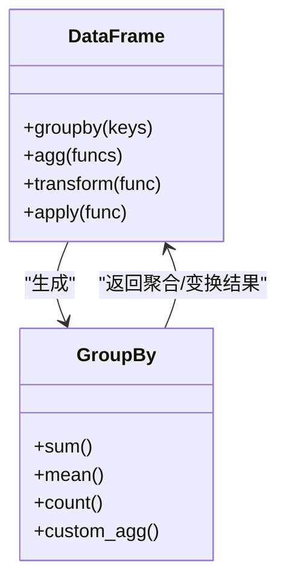
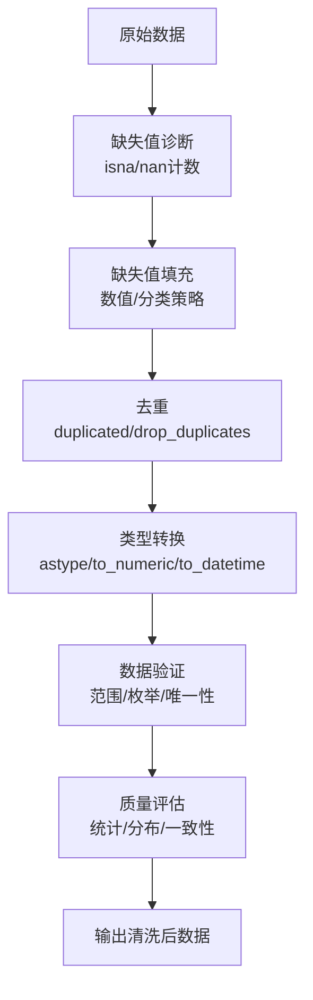
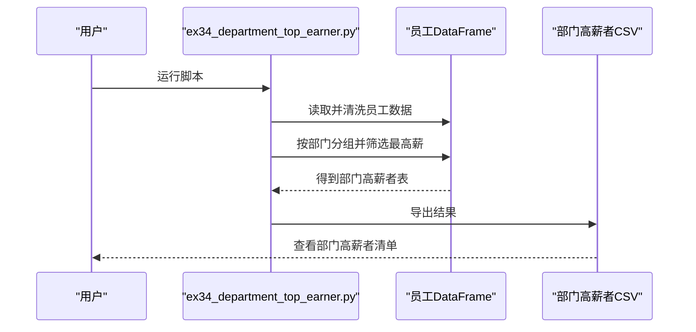
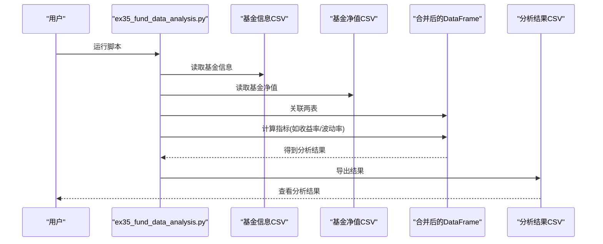
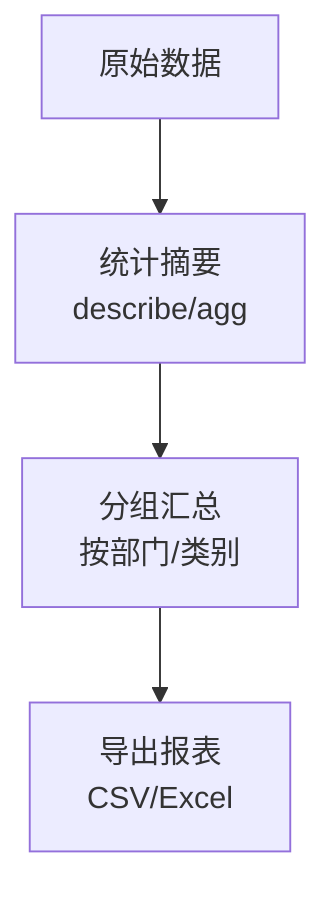
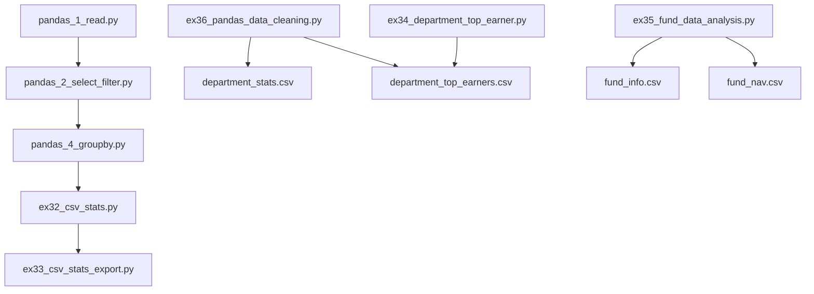

# 数据处理与分析

<cite>
**本文引用的文件**   
- [pandas_1_read.py](file://pandas_1_read.py)
- [pandas_2_select_filter.py](file://pandas_2_select_filter.py)
- [pandas_4_groupby.py](file://pandas_4_groupby.py)
- [pandas_df_vs_series.py](file://pandas_df_vs_series.py)
- [pandas_dict_list_connection.py](file://pandas_dict_list_connection.py)
- [pandas_manual_create.py](file://pandas_manual_create.py)
- [ex36_pandas_data_cleaning.py](file://ex36_pandas_data_cleaning.py)
- [ex35_fund_data_analysis.py](file://ex35_fund_data_analysis.py)
- [ex34_department_top_earner.py](file://ex34_department_top_earner.py)
- [ex33_csv_stats_export.py](file://ex33_csv_stats_export.py)
- [ex32_csv_stats.py](file://ex32_csv_stats.py)
- [employees.csv](file://employees.csv)
- [clean_employees.csv](file://clean_employees.csv)
- [messy_employees.csv](file://messy_employees.csv)
- [department_stats.csv](file://department_stats.csv)
- [department_top_earners.csv](file://department_top_earners.csv)
- [fund_info.csv](file://fund_info.csv)
- [fund_nav.csv](file://fund_nav.csv)
</cite>

## 目录
1. [简介](#简介)
2. [项目结构](#项目结构)
3. [核心组件](#核心组件)
4. [架构总览](#架构总览)
5. [详细组件分析](#详细组件分析)
6. [依赖关系分析](#依赖关系分析)
7. [性能考虑](#性能考虑)
8. [故障排查指南](#故障排查指南)
9. [结论](#结论)
10. [附录](#附录)

## 简介
本文件面向希望系统掌握Python数据处理与分析的读者，围绕Pandas库的核心概念与实战流程展开。内容覆盖：
- DataFrame与Series的创建、索引与筛选
- groupby分组与聚合、统计分析
- 数据清洗（缺失值处理、重复数据清理、类型转换、数据验证）
- 以“员工数据分析”和“基金数据分析”为案例，构建端到端的数据处理管道
- 性能优化技巧与大数据集处理最佳实践
- 可视化基础与与其他工具的集成方法

## 项目结构
仓库包含大量示例脚本与CSV数据文件，重点围绕Pandas的数据读取、选择过滤、分组聚合、清洗与导出等能力进行组织。关键路径说明：
- Pandas入门与核心操作：pandas_*.py
- 数据清洗与统计：ex32_csv_stats.py、ex33_csv_stats_export.py、ex36_pandas_data_cleaning.py
- 业务案例：ex34_department_top_earner.py（员工部门高薪者）、ex35_fund_data_analysis.py（基金数据）
- 数据文件：employees.csv、clean_employees.csv、messy_employees.csv、fund_info.csv、fund_nav.csv、department_stats.csv、department_top_earners.csv

图表来源
- [pandas_1_read.py:1-200](file://pandas_1_read.py#L1-L200)
- [pandas_2_select_filter.py:1-200](file://pandas_2_select_filter.py#L1-L200)
- [pandas_4_groupby.py:1-200](file://pandas_4_groupby.py#L1-L200)
- [ex36_pandas_data_cleaning.py:1-200](file://ex36_pandas_data_cleaning.py#L1-L200)
- [ex34_department_top_earner.py:1-200](file://ex34_department_top_earner.py#L1-L200)
- [ex35_fund_data_analysis.py:1-200](file://ex35_fund_data_analysis.py#L1-L200)

章节来源
- [pandas_1_read.py:1-200](file://pandas_1_read.py#L1-L200)
- [pandas_2_select_filter.py:1-200](file://pandas_2_select_filter.py#L1-L200)
- [pandas_4_groupby.py:1-200](file://pandas_4_groupby.py#L1-L200)
- [ex36_pandas_data_cleaning.py:1-200](file://ex36_pandas_data_cleaning.py#L1-L200)
- [ex34_department_top_earner.py:1-200](file://ex34_department_top_earner.py#L1-L200)
- [ex35_fund_data_analysis.py:1-200](file://ex35_fund_data_analysis.py#L1-L200)

## 核心组件
本节聚焦Pandas两大核心数据结构及其常用操作模式：
- Series：一维带标签数组，适合表示单列数据或向量运算
- DataFrame：二维表格型数据结构，支持行列索引、多类型列、分组聚合与I/O

常见能力映射到仓库中的示例脚本：
- 创建与连接：手动创建、从字典/列表构造、与外部数据源连接
- 读取与写入：CSV/JSON等格式读写
- 选择与过滤：基于条件表达式、布尔索引、位置/标签索引
- 分组与聚合：groupby + agg/transform/apply
- 清洗与验证：缺失值检测与填充、去重、类型转换、约束校验
- 统计与导出：描述性统计、汇总指标、结果导出

章节来源
- [pandas_df_vs_series.py:1-200](file://pandas_df_vs_series.py#L1-L200)
- [pandas_dict_list_connection.py:1-200](file://pandas_dict_list_connection.py#L1-L200)
- [pandas_manual_create.py:1-200](file://pandas_manual_create.py#L1-L200)
- [pandas_1_read.py:1-200](file://pandas_1_read.py#L1-L200)
- [pandas_2_select_filter.py:1-200](file://pandas_2_select_filter.py#L1-L200)
- [pandas_4_groupby.py:1-200](file://pandas_4_groupby.py#L1-L200)

## 架构总览
下图展示一个典型的数据处理流水线：从原始数据读取、清洗、探索分析、分组聚合，到结果导出与可视化。

[此图为概念流程图，不直接对应具体源码文件]

## 详细组件分析

### 组件A：数据读取与基础结构
- 目标：演示如何从CSV/JSON等数据源读取数据，并理解DataFrame与Series的关系
- 关键点：
  - 使用read_csv/read_json等函数加载数据
  - 通过head/tail/info/describe快速了解数据
  - 将列转换为Series进行向量化计算
- 相关脚本：
  - [pandas_1_read.py](file://pandas_1_read.py)
  - [pandas_df_vs_series.py](file://pandas_df_vs_series.py)
  - [pandas_dict_list_connection.py](file://pandas_dict_list_connection.py)
  - [pandas_manual_create.py](file://pandas_manual_create.py)

图表来源
- [pandas_1_read.py:1-200](file://pandas_1_read.py#L1-L200)
- [pandas_df_vs_series.py:1-200](file://pandas_df_vs_series.py#L1-L200)
- [pandas_dict_list_connection.py:1-200](file://pandas_dict_list_connection.py#L1-L200)
- [pandas_manual_create.py:1-200](file://pandas_manual_create.py#L1-L200)

章节来源
- [pandas_1_read.py:1-200](file://pandas_1_read.py#L1-L200)
- [pandas_df_vs_series.py:1-200](file://pandas_df_vs_series.py#L1-L200)
- [pandas_dict_list_connection.py:1-200](file://pandas_dict_list_connection.py#L1-L200)
- [pandas_manual_create.py:1-200](file://pandas_manual_create.py#L1-L200)

### 组件B：选择、过滤与索引
- 目标：掌握基于标签与位置的索引、布尔条件筛选、切片与查询
- 关键点：
  - loc/iloc用于标签与位置访问
  - 布尔索引实现复杂条件组合
  - query/isin/isna/isnull等便捷方法
- 相关脚本：
  - [pandas_2_select_filter.py](file://pandas_2_select_filter.py)

图表来源
- [pandas_2_select_filter.py:1-200](file://pandas_2_select_filter.py#L1-L200)

章节来源
- [pandas_2_select_filter.py:1-200](file://pandas_2_select_filter.py#L1-L200)

### 组件C：分组(groupby)、聚合与变换
- 目标：理解groupby语义，掌握聚合、变换与应用
- 关键点：
  - groupby + agg实现多指标聚合
  - transform保持原长度，便于特征工程
  - apply用于自定义逻辑
- 相关脚本：
  - [pandas_4_groupby.py](file://pandas_4_groupby.py)

图表来源
- [pandas_4_groupby.py:1-200](file://pandas_4_groupby.py#L1-L200)

章节来源
- [pandas_4_groupby.py:1-200](file://pandas_4_groupby.py#L1-L200)

### 组件D：数据清洗流程
- 目标：构建稳健的数据清洗管道，确保数据质量
- 关键点：
  - 缺失值检测与填充策略（均值/中位数/众数/前向/后向）
  - 重复行识别与去重
  - 数据类型转换与范围校验
  - 异常值与一致性检查
- 相关脚本与数据：
  - [ex36_pandas_data_cleaning.py](file://ex36_pandas_data_cleaning.py)
  - [employees.csv](file://employees.csv)
  - [clean_employees.csv](file://clean_employees.csv)
  - [messy_employees.csv](file://messy_employees.csv)
  - [department_stats.csv](file://department_stats.csv)
  - [department_top_earners.csv](file://department_top_earners.csv)

图表来源
- [ex36_pandas_data_cleaning.py:1-200](file://ex36_pandas_data_cleaning.py#L1-L200)

章节来源
- [ex36_pandas_data_cleaning.py:1-200](file://ex36_pandas_data_cleaning.py#L1-L200)
- [employees.csv:1-200](file://employees.csv#L1-L200)
- [clean_employees.csv:1-200](file://clean_employees.csv#L1-L200)
- [messy_employees.csv:1-200](file://messy_employees.csv#L1-L200)
- [department_stats.csv:1-200](file://department_stats.csv#L1-L200)
- [department_top_earners.csv:1-200](file://department_top_earners.csv#L1-L200)

### 组件E：员工数据分析案例（部门高薪者）
- 目标：从员工数据中筛选各部门薪资最高者，并导出结果
- 关键点：
  - 读取与清洗员工数据
  - 按部门分组，取每组最高薪记录
  - 导出部门高薪者清单
- 相关脚本与数据：
  - [ex34_department_top_earner.py](file://ex34_department_top_earner.py)
  - [department_top_earners.csv](file://department_top_earners.csv)

图表来源
- [ex34_department_top_earner.py:1-200](file://ex34_department_top_earner.py#L1-L200)
- [department_top_earners.csv:1-200](file://department_top_earners.csv#L1-L200)

章节来源
- [ex34_department_top_earner.py:1-200](file://ex34_department_top_earner.py#L1-L200)
- [department_top_earners.csv:1-200](file://department_top_earners.csv#L1-L200)

### 组件F：基金数据分析案例
- 目标：整合基金信息与净值数据，完成基础分析与导出
- 关键点：
  - 多表关联（基金信息+净值）
  - 时间序列视角下的收益/波动分析
  - 导出分析结果供进一步可视化
- 相关脚本与数据：
  - [ex35_fund_data_analysis.py](file://ex35_fund_data_analysis.py)
  - [fund_info.csv](file://fund_info.csv)
  - [fund_nav.csv](file://fund_nav.csv)

图表来源
- [ex35_fund_data_analysis.py:1-200](file://ex35_fund_data_analysis.py#L1-L200)
- [fund_info.csv:1-200](file://fund_info.csv#L1-L200)
- [fund_nav.csv:1-200](file://fund_nav.csv#L1-L200)

章节来源
- [ex35_fund_data_analysis.py:1-200](file://ex35_fund_data_analysis.py#L1-L200)
- [fund_info.csv:1-200](file://fund_info.csv#L1-L200)
- [fund_nav.csv:1-200](file://fund_nav.csv#L1-L200)

### 组件G：统计与导出
- 目标：对数据进行描述性统计与汇总，并导出报表
- 关键点：
  - 基本统计量（均值/标准差/分位数）
  - 按维度汇总（部门/类别）
  - 导出CSV/Excel
- 相关脚本与数据：
  - [ex32_csv_stats.py](file://ex32_csv_stats.py)
  - [ex33_csv_stats_export.py](file://ex33_csv_stats_export.py)
  - [department_stats.csv](file://department_stats.csv)

图表来源
- [ex32_csv_stats.py:1-200](file://ex32_csv_stats.py#L1-L200)
- [ex33_csv_stats_export.py:1-200](file://ex33_csv_stats_export.py#L1-L200)
- [department_stats.csv:1-200](file://department_stats.csv#L1-L200)

章节来源
- [ex32_csv_stats.py:1-200](file://ex32_csv_stats.py#L1-L200)
- [ex33_csv_stats_export.py:1-200](file://ex33_csv_stats_export.py#L1-L200)
- [department_stats.csv:1-200](file://department_stats.csv#L1-L200)

## 依赖关系分析
- 模块内聚与耦合：
  - pandas_*.py系列侧重基础能力演示，彼此之间通过共享的DataFrame/Series概念形成松耦合
  - ex32/ex33/ex36构成“清洗-统计-导出”的流水线，依赖中间CSV产物
  - ex34/ex35为业务案例，分别依赖各自的数据文件
- 外部依赖：
  - Pandas为核心依赖；可选依赖包括Matplotlib/Seaborn/Plotly用于可视化
- 潜在循环依赖：
  - 当前脚本均为独立可执行单元，未见循环导入

图表来源
- [pandas_1_read.py:1-200](file://pandas_1_read.py#L1-L200)
- [pandas_2_select_filter.py:1-200](file://pandas_2_select_filter.py#L1-L200)
- [pandas_4_groupby.py:1-200](file://pandas_4_groupby.py#L1-L200)
- [ex32_csv_stats.py:1-200](file://ex32_csv_stats.py#L1-L200)
- [ex33_csv_stats_export.py:1-200](file://ex33_csv_stats_export.py#L1-L200)
- [ex36_pandas_data_cleaning.py:1-200](file://ex36_pandas_data_cleaning.py#L1-L200)
- [ex34_department_top_earner.py:1-200](file://ex34_department_top_earner.py#L1-L200)
- [ex35_fund_data_analysis.py:1-200](file://ex35_fund_data_analysis.py#L1-L200)
- [department_stats.csv:1-200](file://department_stats.csv#L1-L200)
- [department_top_earners.csv:1-200](file://department_top_earners.csv#L1-L200)
- [fund_info.csv:1-200](file://fund_info.csv#L1-L200)
- [fund_nav.csv:1-200](file://fund_nav.csv#L1-L200)

章节来源
- [pandas_1_read.py:1-200](file://pandas_1_read.py#L1-L200)
- [pandas_2_select_filter.py:1-200](file://pandas_2_select_filter.py#L1-L200)
- [pandas_4_groupby.py:1-200](file://pandas_4_groupby.py#L1-L200)
- [ex32_csv_stats.py:1-200](file://ex32_csv_stats.py#L1-L200)
- [ex33_csv_stats_export.py:1-200](file://ex33_csv_stats_export.py#L1-L200)
- [ex36_pandas_data_cleaning.py:1-200](file://ex36_pandas_data_cleaning.py#L1-L200)
- [ex34_department_top_earner.py:1-200](file://ex34_department_top_earner.py#L1-L200)
- [ex35_fund_data_analysis.py:1-200](file://ex35_fund_data_analysis.py#L1-L200)

## 性能考虑
- 内存与速度优化
  - 合理设置dtype（如category、int8/16/32、float32）降低内存占用
  - 避免链式赋值，尽量原地操作或使用assign/pipe
  - 使用向量化操作替代逐行循环
- 大文件处理
  - 分块读取（chunksize）与增量聚合
  - 仅读取必要列（usecols）
  - 使用Parquet/Feather等列式存储提升I/O效率
- 分组与聚合
  - 优先使用内置聚合函数（sum/mean/count等），必要时用agg
  - 对大数据集采用transform减少多次遍历
- I/O与缓存
  - 批量写入时关闭不必要的元数据
  - 对频繁访问的小表使用内存缓存

[本节提供通用指导，不直接分析具体文件]

## 故障排查指南
- 常见问题定位
  - 读取失败：检查编码、分隔符、列名与空值占位符
  - 类型错误：确认to_numeric/astype参数与缺失值处理
  - 索引错位：核对loc/iloc用法与索引是否已重置
  - 分组结果异常：检查分组键是否存在缺失或类型不一致
- 建议步骤
  - 使用info/describe/head/tail快速诊断
  - 打印关键中间结果，逐步缩小问题范围
  - 对异常样本抽样查看上下文

[本节提供通用指导，不直接分析具体文件]

## 结论
通过本仓库的示例与数据，可以系统地掌握Pandas在数据读取、清洗、探索、分组聚合与导出方面的核心能力。结合员工与基金两个真实场景，能够构建稳健的数据处理管道，并在性能与可维护性上达到工程化要求。建议在后续实践中引入可视化与自动化调度，进一步提升交付价值。

[本节为总结性内容，不直接分析具体文件]

## 附录
- 可视化基础
  - Matplotlib：灵活但需较多配置
  - Seaborn：基于Matplotlib，强调统计图形
  - Plotly：交互式图表，适合Web展示
- 与其他工具集成
  - 数据库：SQLAlchemy + pandas.read_sql/write_sql
  - 大数据：PySpark + pandas-on-Spark
  - 任务编排：Airflow/Prefect调度清洗与分析脚本

[本节为概念性内容，不直接分析具体文件]