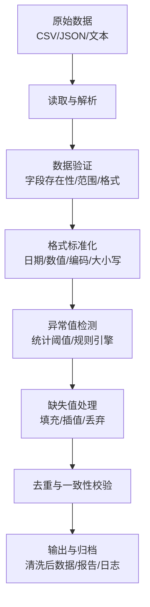
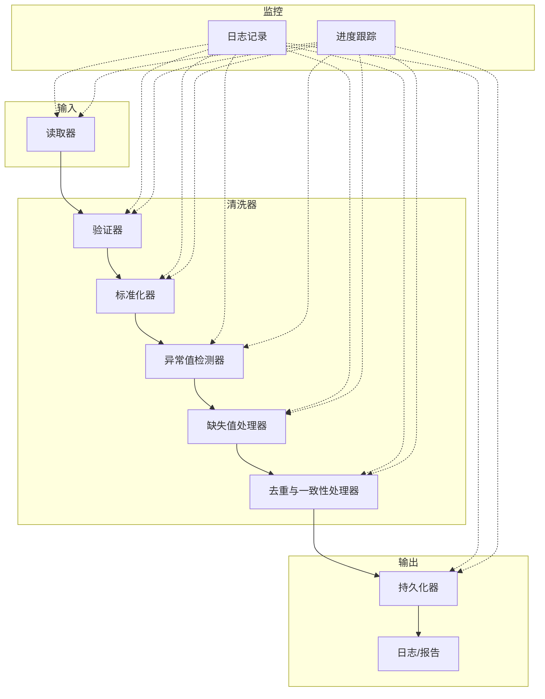
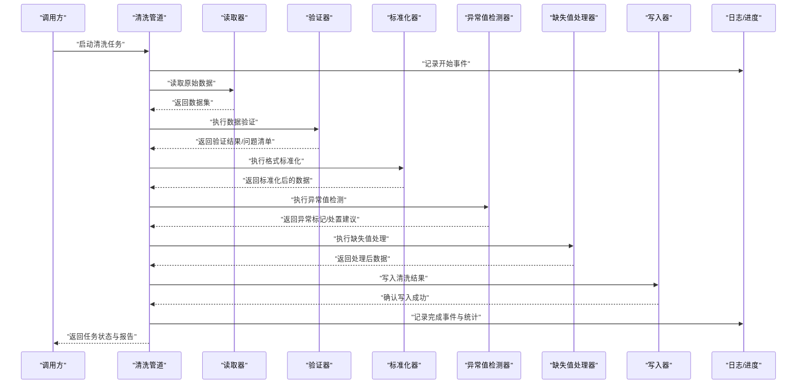
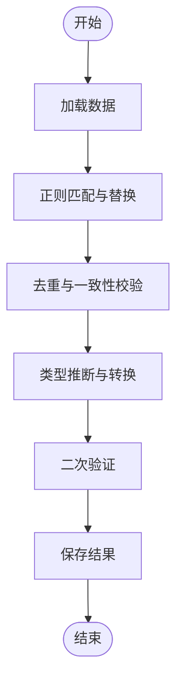
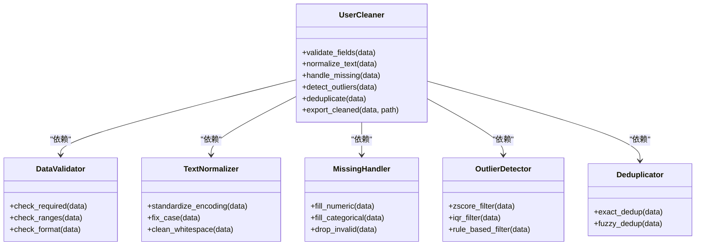
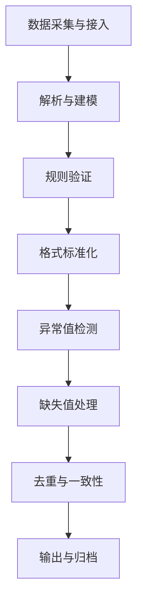
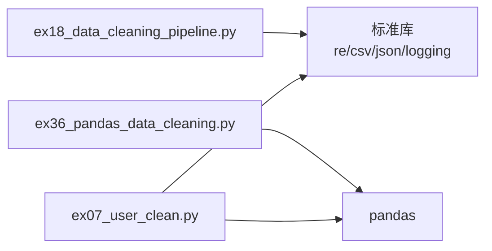

# 数据清洗管道

<cite>
**本文引用的文件**   
- [ex18_data_cleaning_pipeline.py](file://ex18_data_cleaning_pipeline.py)
- [ex36_pandas_data_cleaning.py](file://ex36_pandas_data_cleaning.py)
- [ex07_user_clean.py](file://ex07_user_clean.py)
- [README.md](file://README.md)
</cite>

## 目录
1. [简介](#简介)
2. [项目结构](#项目结构)
3. [核心组件](#核心组件)
4. [架构总览](#架构总览)
5. [详细组件分析](#详细组件分析)
6. [依赖关系分析](#依赖关系分析)
7. [性能考虑](#性能考虑)
8. [故障排查指南](#故障排查指南)
9. [结论](#结论)
10. [附录](#附录)

## 简介
本文件围绕“数据清洗管道”的主题，系统化梳理从原始数据到高质量可用数据的完整流程。内容覆盖：
- 数据验证、格式标准化、异常值检测与缺失值处理策略
- 构建健壮数据处理管道的最佳实践（错误处理、日志记录、进度跟踪）
- 高级清洗技术（正则表达式匹配、去重、类型推断）
- 面向业务场景的用户数据清洗案例
- 大规模数据处理与性能优化建议

## 项目结构
仓库中包含多个与数据清洗相关的示例脚本，重点涉及以下三个文件：
- ex18_data_cleaning_pipeline.py：展示通用数据清洗管道的构建方式，强调错误处理、日志与进度跟踪
- ex36_pandas_data_cleaning.py：基于 pandas 的高级清洗技术，包括正则匹配、去重、类型推断等
- ex07_user_clean.py：面向用户数据的业务清洗案例，体现质量提升方法

[本节为概念性说明，不直接分析具体文件，故无章节来源]

## 核心组件
- 数据验证层：负责检查必填字段、数据类型、取值范围、枚举约束等，确保输入满足基本质量要求
- 格式标准化层：统一日期时间、数值精度、字符串编码与大小写、单位换算等，减少下游歧义
- 异常值检测层：基于统计方法或业务规则识别离群点，支持标记、修正或剔除
- 缺失值处理层：根据业务语义选择填充策略（均值/中位数/众数/前向/后向/模型预测），或安全丢弃
- 去重与一致性层：基于主键或复合键进行去重，保证实体唯一性与跨表一致性
- 错误处理与可观测性：结构化日志、异常捕获、进度回调、指标收集，保障管道稳健运行

**章节来源**
- [ex18_data_cleaning_pipeline.py](file://ex18_data_cleaning_pipeline.py)
- [ex36_pandas_data_cleaning.py](file://ex36_pandas_data_cleaning.py)
- [ex07_user_clean.py](file://ex07_user_clean.py)

## 架构总览
下图展示了典型的数据清洗管道在代码层面的交互关系：读取器将原始数据转换为中间表示；清洗器按阶段执行验证、标准化、异常值检测与缺失值处理；处理器负责去重与一致性校验；输出器负责持久化与报告生成；监控器贯穿全程提供日志与进度反馈。

**图表来源**
- [ex18_data_cleaning_pipeline.py](file://ex18_data_cleaning_pipeline.py)
- [ex36_pandas_data_cleaning.py](file://ex36_pandas_data_cleaning.py)
- [ex07_user_clean.py](file://ex07_user_clean.py)

## 详细组件分析

### 通用数据清洗管道（ex18_data_cleaning_pipeline.py）
该文件演示了如何构建一个健壮的数据清洗管道，重点包括：
- 错误处理：对读取、转换、写入各阶段进行异常捕获与降级策略
- 日志记录：结构化日志输出关键事件与诊断信息
- 进度跟踪：通过回调或计数器实现阶段性进度上报
- 模块化设计：将验证、标准化、异常值检测、缺失值处理拆分为独立步骤，便于复用与测试

**图表来源**
- [ex18_data_cleaning_pipeline.py](file://ex18_data_cleaning_pipeline.py)

**章节来源**
- [ex18_data_cleaning_pipeline.py](file://ex18_data_cleaning_pipeline.py)

### 基于 pandas 的高级清洗技术（ex36_pandas_data_cleaning.py）
该文件聚焦于使用 pandas 进行高效清洗，涵盖：
- 正则表达式匹配：用于提取、替换与规范化复杂文本模式
- 数据去重：基于单列或多列组合进行精确或模糊去重
- 类型推断与转换：自动推断并强制转换数据类型，提升后续计算效率
- 批量操作与向量化：利用 pandas 的向量化能力加速清洗流程

**图表来源**
- [ex36_pandas_data_cleaning.py](file://ex36_pandas_data_cleaning.py)

**章节来源**
- [ex36_pandas_data_cleaning.py](file://ex36_pandas_data_cleaning.py)

### 用户数据清洗案例（ex07_user_clean.py）
该文件以用户数据为例，展示业务场景下的数据质量提升方法：
- 字段级校验：邮箱格式、手机号规范、年龄范围等
- 文本规范化：姓名大小写、地址标准化、编码统一
- 缺失值策略：根据业务重要性选择填充或剔除
- 异常值处理：识别并修正不合理记录（如负年龄、重复注册）

**图表来源**
- [ex07_user_clean.py](file://ex07_user_clean.py)

**章节来源**
- [ex07_user_clean.py](file://ex07_user_clean.py)

### 概念性概览
下图给出一个通用的数据清洗工作流，适用于多种业务场景与数据源。它帮助读者建立整体认知，再结合具体脚本深入理解实现细节。

[本节为概念性说明，不直接分析具体文件，故无章节来源]

## 依赖关系分析
- 模块内聚与耦合
  - ex18_data_cleaning_pipeline.py 强调模块化与低耦合，便于扩展新的清洗步骤
  - ex36_pandas_data_cleaning.py 依赖 pandas 生态，充分利用其向量化与函数式 API
  - ex07_user_clean.py 聚焦用户领域规则，体现业务驱动的设计思路
- 外部依赖
  - pandas：高性能数据分析与清洗的核心库
  - 标准库（如 re、csv、json、logging）：用于文本处理、文件读写与日志记录
- 潜在循环依赖
  - 当前脚本均为独立示例，未见循环导入；建议在大型项目中采用分层架构避免循环

**图表来源**
- [ex18_data_cleaning_pipeline.py](file://ex18_data_cleaning_pipeline.py)
- [ex36_pandas_data_cleaning.py](file://ex36_pandas_data_cleaning.py)
- [ex07_user_clean.py](file://ex07_user_clean.py)

**章节来源**
- [ex18_data_cleaning_pipeline.py](file://ex18_data_cleaning_pipeline.py)
- [ex36_pandas_data_cleaning.py](file://ex36_pandas_data_cleaning.py)
- [ex07_user_clean.py](file://ex07_user_clean.py)

## 性能考虑
- 向量化优先：尽量使用 pandas 的向量化操作替代逐行循环，显著提升速度
- 内存管理：分块读取大文件、及时释放中间变量、避免不必要的副本
- 索引与筛选：合理使用索引与布尔掩码，减少全表扫描
- 正则优化：预编译正则表达式、避免回溯灾难、限定匹配范围
- 并行与批处理：对独立任务进行并行处理，合理设置批次大小
- I/O 优化：使用高效的序列化格式（如 parquet）、压缩存储、增量更新

[本节提供通用指导，不直接分析具体文件，故无章节来源]

## 故障排查指南
- 常见错误定位
  - 读取失败：检查路径权限、编码、分隔符与表头
  - 类型不一致：查看类型推断结果，必要时显式转换
  - 正则匹配异常：验证模式语法与边界条件
  - 去重误删：核对主键定义与模糊匹配阈值
- 日志与调试
  - 启用结构化日志，记录关键步骤与异常堆栈
  - 增加进度回调，定位耗时瓶颈
  - 导出问题样本与统计摘要，辅助根因分析
- 恢复与回滚
  - 保留原始数据快照与清洗中间产物
  - 支持幂等执行与断点续跑

**章节来源**
- [ex18_data_cleaning_pipeline.py](file://ex18_data_cleaning_pipeline.py)

## 结论
通过模块化设计与严谨的错误处理、日志与进度跟踪，可以构建稳定可靠的数据清洗管道。结合 pandas 的高级特性与正则表达式、去重与类型推断等技术，能够高效应对复杂清洗需求。面向业务的用户数据清洗案例进一步验证了规则驱动与质量度量在实际工程中的价值。对于大规模数据，应重视性能优化与资源管理，确保管道在高吞吐场景下依然稳健。

[本节为总结性内容，不直接分析具体文件，故无章节来源]

## 附录
- 参考与背景
  - README.md：项目总体说明与使用说明，有助于理解示例脚本的使用上下文

**章节来源**
- [README.md](file://README.md)