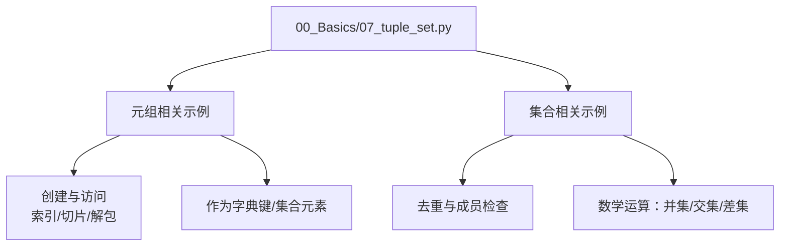
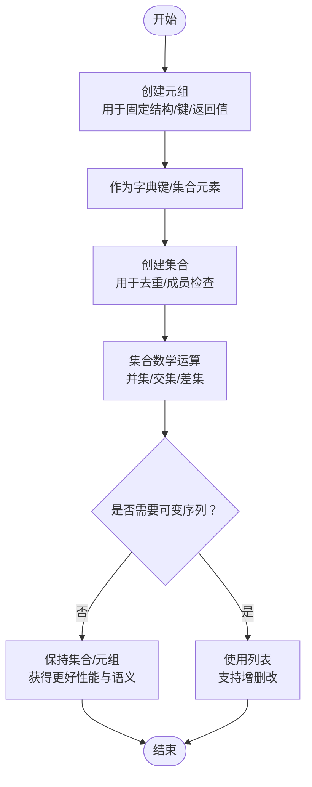
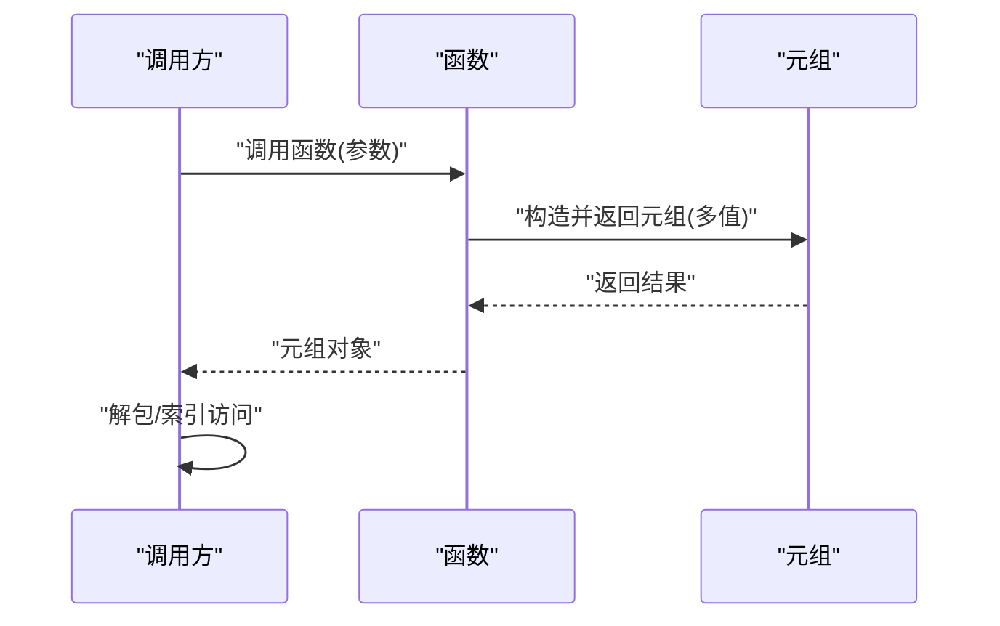
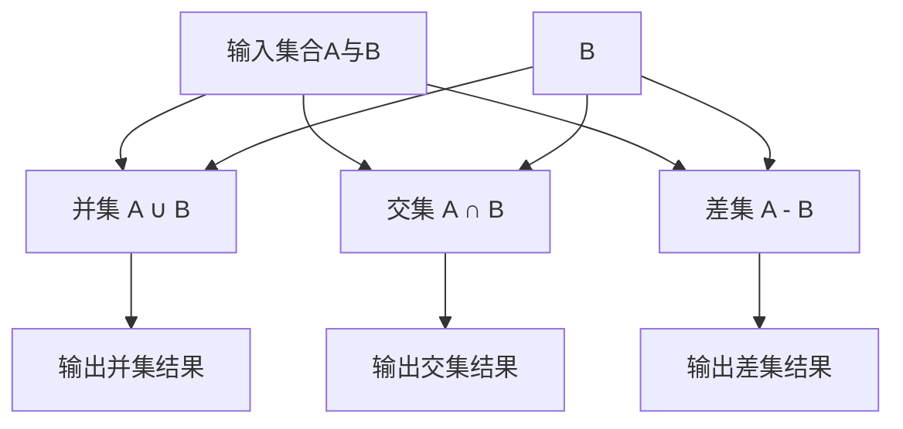
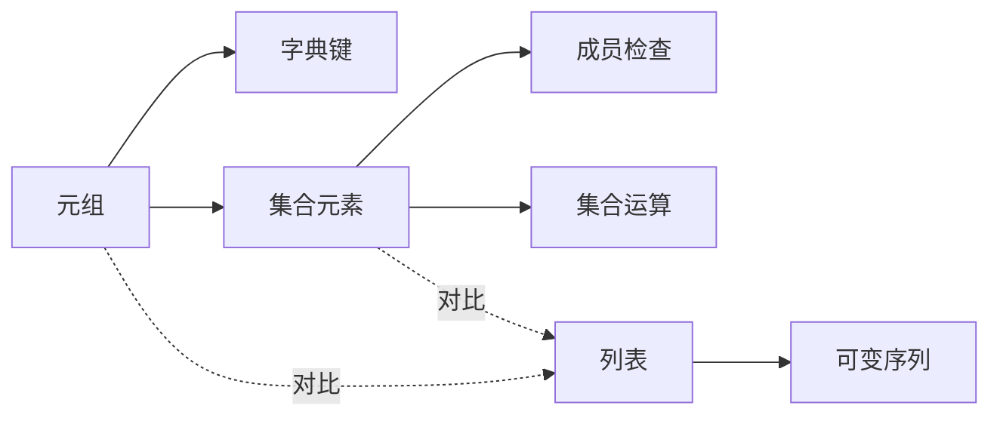

# 元组与集合操作

<cite>
**本文引用的文件**   
- [07_tuple_set.py](file://00_Basics/07_tuple_set.py)
</cite>

## 目录
1. [简介](#简介)
2. [项目结构](#项目结构)
3. [核心组件](#核心组件)
4. [架构总览](#架构总览)
5. [详细组件分析](#详细组件分析)
6. [依赖关系分析](#依赖关系分析)
7. [性能考量](#性能考量)
8. [故障排查指南](#故障排查指南)
9. [结论](#结论)
10. [附录](#附录)

## 简介
本文件聚焦于 Python 中元组与集合的专门用法与实践，围绕以下目标展开：
- 元组的不可变特性、创建方式与适用场景（函数多返回值、字典键等）
- 集合的数学运算（并集、交集、差集）、去重能力与成员检查的高效性
- 与列表的性能差异与选择建议
- 实际案例与最佳实践，帮助在程序性能与内存使用上做出更优决策

## 项目结构
仓库包含大量基础示例与练习。与“元组与集合”主题直接相关的示例位于基础模块中，便于快速定位与学习。

图表来源
- [07_tuple_set.py:1-200](file://00_Basics/07_tuple_set.py#L1-L200)

章节来源
- [07_tuple_set.py:1-200](file://00_Basics/07_tuple_set.py#L1-L200)

## 核心组件
本节从概念与代码路径两个层面梳理元组与集合的关键点，并结合示例文件中的典型用法进行说明。

- 元组
  - 不可变性：一旦创建，元素不可替换、删除或新增；适合表示固定结构的记录或配置项。
  - 创建方式：小括号包裹、逗号分隔；单元素需尾随逗号；支持嵌套。
  - 常用操作：索引访问、切片、迭代、解包赋值、拼接与重复。
  - 适用场景：函数多返回值、字典键、集合元素、需要哈希与稳定标识的数据。
  - 参考实现位置：[07_tuple_set.py](file://00_Basics/07_tuple_set.py)

- 集合
  - 无序且唯一：自动去重，适合维护不重复元素集合。
  - 数学运算：并集、交集、差集、对称差集；成员检查高效。
  - 常用方法：添加、移除、清空、拷贝、判断子集/超集等。
  - 适用场景：去重、快速成员判定、集合运算。
  - 参考实现位置：[00_Basics/07_tuple_set.py](file://00_Basics/07_tuple_set.py)

章节来源
- [07_tuple_set.py:1-200](file://00_Basics/07_tuple_set.py#L1-L200)

## 架构总览
下图展示元组与集合在数据处理流程中的常见角色与交互关系。

图表来源
- [07_tuple_set.py:1-200](file://00_Basics/07_tuple_set.py#L1-L200)

## 详细组件分析

### 元组：不可变性与典型用法
- 不可变性带来的优势
  - 可作为字典键与集合元素（可哈希）
  - 语义上表达“不变数据”，提高可读性与安全性
- 创建与访问
  - 通过小括号与逗号创建；支持索引、切片与迭代
  - 解包赋值简化多值返回的处理
- 作为函数返回值
  - 多返回值天然映射为元组，调用方可按位置或解包接收
- 作为字典键
  - 组合多个字段构成复合键，保证键的稳定性和唯一性
- 与其他类型的对比
  - 与列表相比：元组更轻量、不可变，适合只读场景与键类型
  - 与字符串相比：元组可混合类型，更适合结构化数据

图表来源
- [07_tuple_set.py:1-200](file://00_Basics/07_tuple_set.py#L1-L200)

章节来源
- [07_tuple_set.py:1-200](file://00_Basics/07_tuple_set.py#L1-L200)

### 集合：数学运算与高效成员检查
- 去重与成员检查
  - 基于哈希表实现，成员检查平均时间复杂度接近 O(1)
  - 适合大规模数据的存在性判定与去重
- 数学运算
  - 并集：合并两个集合的元素
  - 交集：取共同元素
  - 差集：在一个集合但不在另一个集合的元素
  - 对称差集：仅出现在其中一个集合的元素
- 常用方法
  - 添加、移除、清空、拷贝、判断子集/超集等
- 与列表的对比
  - 集合不支持索引与切片，但成员检查更快、去重更自然
  - 当需要顺序与可变性时，优先选择列表

图表来源
- [07_tuple_set.py:1-200](file://00_Basics/07_tuple_set.py#L1-L200)

章节来源
- [07_tuple_set.py:1-200](file://00_Basics/07_tuple_set.py#L1-L200)

### 元组 vs 列表：何时选择
- 选择元组的信号
  - 数据不应被修改（如坐标、日期、配置项）
  - 需要作为字典键或集合元素
  - 函数多返回值，语义清晰
- 选择列表的信号
  - 需要频繁增删改
  - 需要索引与切片
  - 需要可变序列的算法处理
- 性能与内存
  - 元组通常比列表更节省内存
  - 元组在哈希场景中可用，列表不可

章节来源
- [07_tuple_set.py:1-200](file://00_Basics/07_tuple_set.py#L1-L200)

### 集合 vs 列表：何时选择
- 选择集合的信号
  - 需要去重
  - 需要高效的成员检查
  - 需要进行集合数学运算
- 选择列表的信号
  - 需要保持顺序
  - 需要索引与切片
  - 需要频繁插入/删除中间元素
- 性能与内存
  - 集合的成员检查通常优于列表
  - 集合占用空间与哈希冲突有关，但一般对大规模数据更高效

章节来源
- [07_tuple_set.py:1-200](file://00_Basics/07_tuple_set.py#L1-L200)

## 依赖关系分析
本主题主要围绕内置类型与标准库操作，无外部第三方依赖。示例文件内部组织以功能为导向，便于对照学习。

图表来源
- [07_tuple_set.py:1-200](file://00_Basics/07_tuple_set.py#L1-L200)

章节来源
- [07_tuple_set.py:1-200](file://00_Basics/07_tuple_set.py#L1-L200)

## 性能考量
- 元组
  - 不可变带来更小的内存开销与更快的哈希计算
  - 适合作为字典键与缓存键
- 集合
  - 成员检查平均 O(1)，远快于列表的 O(n)
  - 去重与集合运算在大数据量下显著优于手动循环
- 列表
  - 可变性带来灵活性，但在成员检查与去重方面不如集合高效
- 选择建议
  - 只读与键化：优先元组
  - 去重与存在性：优先集合
  - 可变序列与顺序：优先列表

章节来源
- [07_tuple_set.py:1-200](file://00_Basics/07_tuple_set.py#L1-L200)

## 故障排查指南
- 将可变对象放入集合或作为字典键会报错
  - 现象：TypeError
  - 排查：确保集合元素与字典键为不可变类型（如元组、字符串、数字）
- 误用集合导致顺序丢失
  - 现象：遍历顺序不稳定
  - 排查：如需顺序，改用列表或排序后的元组
- 过度使用集合造成内存增长
  - 现象：内存占用偏高
  - 排查：评估是否真的需要去重或成员检查；必要时分批处理或使用生成器
- 元组解包数量不匹配
  - 现象：ValueError
  - 排查：确认解包变量个数与元组长度一致

章节来源
- [07_tuple_set.py:1-200](file://00_Basics/07_tuple_set.py#L1-L200)

## 结论
- 元组强调不可变与稳定性，适合做键、返回值与只读记录
- 集合强调去重与高效成员检查，适合集合运算与存在性判定
- 列表强调可变与顺序，适合需要频繁修改的场景
- 根据数据特征与操作需求选择合适的容器，可在性能与内存上取得良好平衡

## 附录
- 常见操作速查
  - 元组：创建、索引、切片、拼接、重复、解包、作为字典键
  - 集合：创建、添加、移除、并集、交集、差集、子集/超集判断
- 最佳实践
  - 用元组表达固定结构，避免意外修改
  - 用集合做去重与成员检查，避免低效的列表扫描
  - 在需要顺序与可变性时使用列表，并在必要时排序后转为元组以稳定顺序

章节来源
- [07_tuple_set.py:1-200](file://00_Basics/07_tuple_set.py#L1-L200)