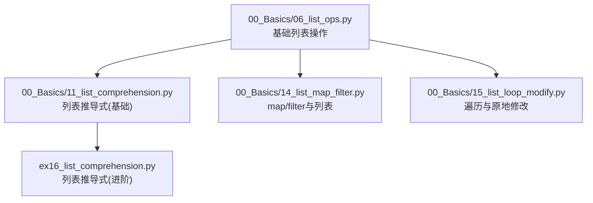
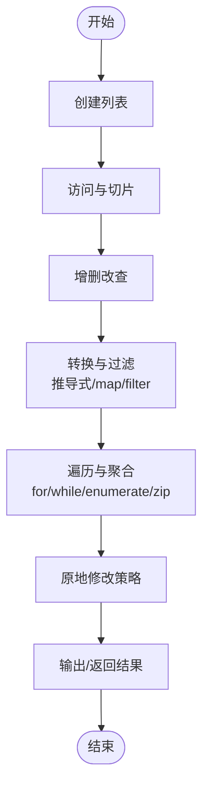
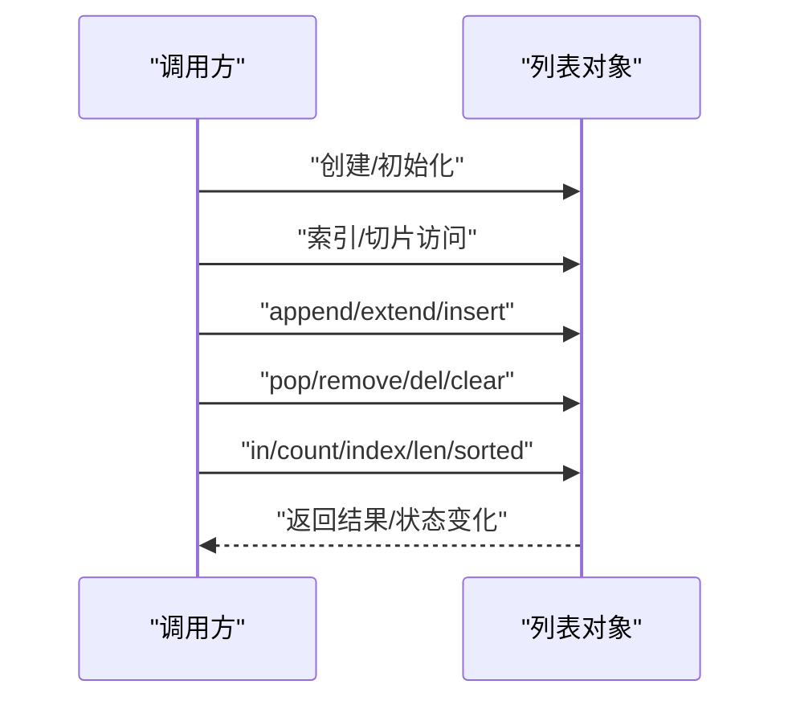
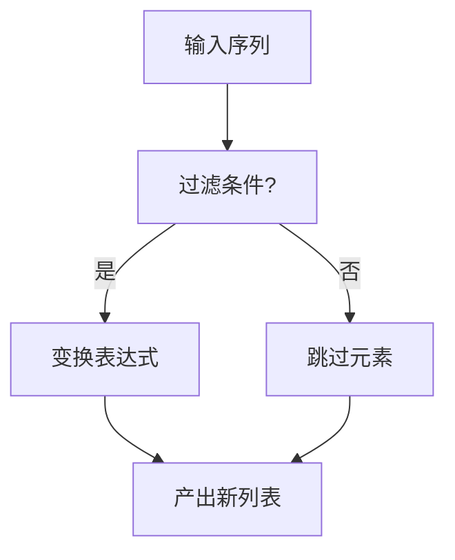
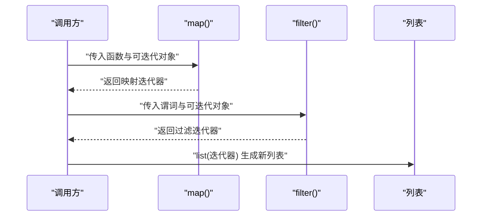
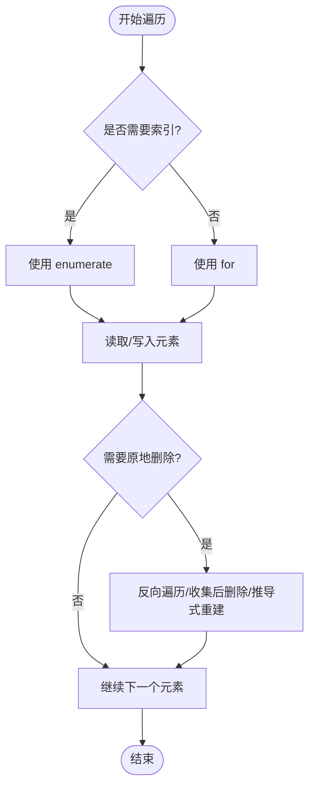
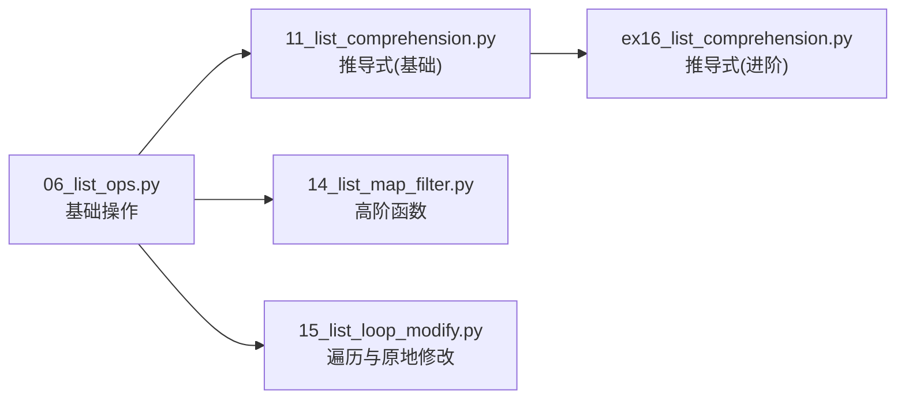

# 列表操作

<cite>
**本文引用的文件**   
- [06_list_ops.py](file://00_Basics/06_list_ops.py)
- [11_list_comprehension.py](file://00_Basics/11_list_comprehension.py)
- [14_list_map_filter.py](file://00_Basics/14_list_map_filter.py)
- [15_list_loop_modify.py](file://00_Basics/15_list_loop_modify.py)
- [ex16_list_comprehension.py](file://ex16_list_comprehension.py)
</cite>

## 目录
1. [简介](#简介)
2. [项目结构](#项目结构)
3. [核心组件](#核心组件)
4. [架构总览](#架构总览)
5. [详细组件分析](#详细组件分析)
6. [依赖关系分析](#依赖关系分析)
7. [性能考量](#性能考量)
8. [故障排查指南](#故障排查指南)
9. [结论](#结论)
10. [附录](#附录)

## 简介
本文件围绕Python列表的创建、访问、修改与删除，系统讲解索引与切片、增删改查方法、列表推导式、高阶函数（map/filter）以及多种遍历方式。文档结合仓库中的示例文件，提供可追溯的代码片段路径，帮助读者在不同场景下选择合适的方法并理解其性能特征。

## 项目结构
本项目将基础语法与实战练习分门别类组织。与“列表操作”直接相关的核心文件如下：
- 基础操作与常用方法：00_Basics/06_list_ops.py
- 列表推导式：00_Basics/11_list_comprehension.py、ex16_list_comprehension.py
- 高阶函数与列表：00_Basics/14_list_map_filter.py
- 遍历与原地修改：00_Basics/15_list_loop_modify.py

图表来源
- [06_list_ops.py](file://00_Basics/06_list_ops.py)
- [11_list_comprehension.py](file://00_Basics/11_list_comprehension.py)
- [14_list_map_filter.py](file://00_Basics/14_list_map_filter.py)
- [15_list_loop_modify.py](file://00_Basics/15_list_loop_modify.py)
- [ex16_list_comprehension.py](file://ex16_list_comprehension.py)

章节来源
- [06_list_ops.py](file://00_Basics/06_list_ops.py)
- [11_list_comprehension.py](file://00_Basics/11_list_comprehension.py)
- [14_list_map_filter.py](file://00_Basics/14_list_map_filter.py)
- [15_list_loop_modify.py](file://00_Basics/15_list_loop_modify.py)
- [ex16_list_comprehension.py](file://ex16_list_comprehension.py)

## 核心组件
本节聚焦以下能力点，并在后续章节给出更深入的实现分析与图示：
- 创建与访问：索引、负索引、切片
- 修改与删除：append、extend、insert、pop、remove、del、clear、切片赋值
- 查询与统计：in、count、index、len、sorted
- 列表推导式：语法糖、条件过滤、嵌套推导
- 高阶函数：map、filter、lambda组合
- 遍历方式：for、while、enumerate、zip、迭代器
- 原地修改最佳实践：避免边遍历边删除、使用切片或反向遍历

章节来源
- [06_list_ops.py](file://00_Basics/06_list_ops.py)
- [11_list_comprehension.py](file://00_Basics/11_list_comprehension.py)
- [14_list_map_filter.py](file://00_Basics/14_list_map_filter.py)
- [15_list_loop_modify.py](file://00_Basics/15_list_loop_modify.py)
- [ex16_list_comprehension.py](file://ex16_list_comprehension.py)

## 架构总览
下图展示了从“数据输入”到“处理管道”再到“结果输出”的整体流程，涵盖基础操作、推导式与高阶函数的组合使用。

[此图为概念性流程图，不直接映射具体源码文件]

## 详细组件分析

### 基础列表操作（创建、访问、修改、删除）
- 创建与访问
  - 通过字面量创建列表；支持正负索引与切片获取子序列。
  - 参考片段路径：[06_list_ops.py](file://00_Basics/06_list_ops.py)
- 修改与删除
  - 追加与扩展：append、extend
  - 插入与替换：insert、切片赋值
  - 弹出与移除：pop、remove、del、clear
  - 参考片段路径：[06_list_ops.py](file://00_Basics/06_list_ops.py)
- 查询与统计
  - 成员检测：in
  - 计数与定位：count、index
  - 长度与排序：len、sorted
  - 参考片段路径：[06_list_ops.py](file://00_Basics/06_list_ops.py)

图表来源
- [06_list_ops.py](file://00_Basics/06_list_ops.py)

章节来源
- [06_list_ops.py](file://00_Basics/06_list_ops.py)

### 列表推导式（语法糖与性能优势）
- 基本语法
  - 表达式 + for 子句；可选 if 条件过滤。
  - 参考片段路径：[11_list_comprehension.py](file://00_Basics/11_list_comprehension.py)、[ex16_list_comprehension.py](file://ex16_list_comprehension.py)
- 复杂逻辑简化
  - 多步转换与筛选可用一行表达，提升可读性与执行效率。
  - 参考片段路径：[ex16_list_comprehension.py](file://ex16_list_comprehension.py)
- 性能要点
  - 在C层循环，通常比等效的for循环更快；内存占用与中间对象更少。
  - 适合纯函数式变换与过滤，避免显式中间变量。

图表来源
- [11_list_comprehension.py](file://00_Basics/11_list_comprehension.py)
- [ex16_list_comprehension.py](file://ex16_list_comprehension.py)

章节来源
- [11_list_comprehension.py](file://00_Basics/11_list_comprehension.py)
- [ex16_list_comprehension.py](file://ex16_list_comprehension.py)

### 高阶函数与列表（map/filter/lambda）
- map
  - 对每个元素应用函数，返回迭代器；配合list()得到新列表。
  - 参考片段路径：[14_list_map_filter.py](file://00_Basics/14_list_map_filter.py)
- filter
  - 基于谓词函数筛选元素，返回迭代器；配合list()得到新列表。
  - 参考片段路径：[14_list_map_filter.py](file://00_Basics/14_list_map_filter.py)
- lambda
  - 匿名函数用于简单的一次性逻辑，常与map/filter组合。
  - 参考片段路径：[14_list_map_filter.py](file://00_Basics/14_list_map_filter.py)

图表来源
- [14_list_map_filter.py](file://00_Basics/14_list_map_filter.py)

章节来源
- [14_list_map_filter.py](file://00_Basics/14_list_map_filter.py)

### 遍历与原地修改（for/while/enumerate/zip）
- 遍历方式
  - for：最常用，简洁高效。
  - while：需要手动维护索引或状态时使用。
  - enumerate：同时获取索引与值。
  - zip：并行遍历多个序列。
  - 参考片段路径：[15_list_loop_modify.py](file://00_Basics/15_list_loop_modify.py)
- 原地修改最佳实践
  - 避免在正向遍历时删除元素（易漏删）。
  - 推荐：收集待删除项后批量删除、反向遍历、或使用推导式/过滤器生成新列表再覆盖原引用。
  - 参考片段路径：[15_list_loop_modify.py](file://00_Basics/15_list_loop_modify.py)

图表来源
- [15_list_loop_modify.py](file://00_Basics/15_list_loop_modify.py)

章节来源
- [15_list_loop_modify.py](file://00_Basics/15_list_loop_modify.py)

### 综合案例对比（不同方法与适用场景）
- 场景A：对数值列表进行平方并保留偶数
  - 列表推导式：简洁且高效，适合一次性构建新列表。
  - map+filter：函数式风格，便于复用函数与测试。
  - 参考片段路径：[11_list_comprehension.py](file://00_Basics/11_list_comprehension.py)、[14_list_map_filter.py](file://00_Basics/14_list_map_filter.py)
- 场景B：按条件就地清理列表（如移除无效条目）
  - 原地删除需谨慎，优先使用推导式重建或反向遍历。
  - 参考片段路径：[15_list_loop_modify.py](file://00_Basics/15_list_loop_modify.py)
- 场景C：多序列对齐处理
  - 使用zip并行遍历，减少索引管理复杂度。
  - 参考片段路径：[15_list_loop_modify.py](file://00_Basics/15_list_loop_modify.py)

[本节为方法论总结，未直接分析具体代码行，故无“章节来源”标注]

## 依赖关系分析
各模块之间以“功能互补”为主，耦合度低、内聚度高，便于按需学习与实践。

图表来源
- [06_list_ops.py](file://00_Basics/06_list_ops.py)
- [11_list_comprehension.py](file://00_Basics/11_list_comprehension.py)
- [14_list_map_filter.py](file://00_Basics/14_list_map_filter.py)
- [15_list_loop_modify.py](file://00_Basics/15_list_loop_modify.py)
- [ex16_list_comprehension.py](file://ex16_list_comprehension.py)

章节来源
- [06_list_ops.py](file://00_Basics/06_list_ops.py)
- [11_list_comprehension.py](file://00_Basics/11_list_comprehension.py)
- [14_list_map_filter.py](file://00_Basics/14_list_map_filter.py)
- [15_list_loop_modify.py](file://00_Basics/15_list_loop_modify.py)
- [ex16_list_comprehension.py](file://ex16_list_comprehension.py)

## 性能考量
- 时间复杂度
  - 索引访问：O(1)
  - 尾部追加：均摊 O(1)
  - 头部插入/任意位置插入：O(n)
  - 删除指定值：O(n)
  - 切片复制：O(k)，k为切片长度
  - 列表推导式：整体近似 O(n)，常数因子较小
  - map/filter：惰性求值，延迟计算；转为list时为 O(n)
- 空间复杂度
  - 原地修改方法：额外空间 O(1)
  - 推导式/生成新列表：额外空间 O(n)
- 建议
  - 频繁头部插入考虑deque（不在本仓库范围内，仅作一般性建议）
  - 大数据流式处理优先使用迭代器（map/filter），必要时再转list
  - 原地修改时避免边遍历边删除，采用安全模式

[本节提供通用指导，不直接分析具体文件]

## 故障排查指南
- 常见错误
  - 索引越界：检查边界条件与空列表情况。
  - 边遍历边删除导致遗漏：改用推导式重建或反向遍历。
  - 切片步长为0报错：确保步长非零。
  - 类型错误：确保map/filter的函数签名与元素类型匹配。
- 定位技巧
  - 打印关键中间结果（如索引、切片范围、过滤谓词返回值）。
  - 使用最小可复现样例隔离问题。
  - 逐步验证推导式/高阶函数链路的每一步输出。

[本节为通用排错建议，不直接分析具体文件]

## 结论
- 列表是Python中最常用的可变序列，掌握其访问、修改与删除方法是数据处理的基础。
- 列表推导式在高可读性与高性能之间取得良好平衡，适合大多数转换与过滤场景。
- map/filter等函数式工具在组合与复用方面具有优势，可与推导式互换以提升代码表达力。
- 原地修改需遵循安全模式，避免副作用导致的逻辑错误。
- 根据数据规模与处理需求选择合适的方案，兼顾时间与空间复杂度。

[本节为总结性内容，不直接分析具体文件]

## 附录
- 快速对照表（方法 vs 典型用途）
  - append：末尾追加单个元素
  - extend：合并另一个可迭代对象
  - insert：在指定位置插入
  - pop：弹出并返回指定位置元素（默认末尾）
  - remove：删除第一个匹配值的元素
  - del：按索引或切片删除
  - clear：清空列表
  - in：成员检测
  - count：统计出现次数
  - index：查找首次出现的索引
  - len：长度
  - sorted：返回排序后的新列表
  - 列表推导式：转换与过滤
  - map/filter：函数式转换与过滤
  - enumerate/zip：便捷遍历

[本节为知识补充，不直接分析具体文件]