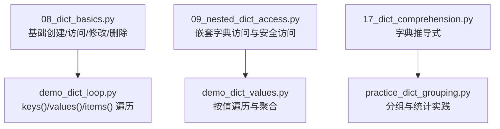
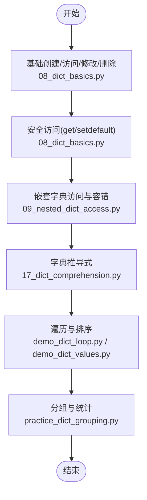
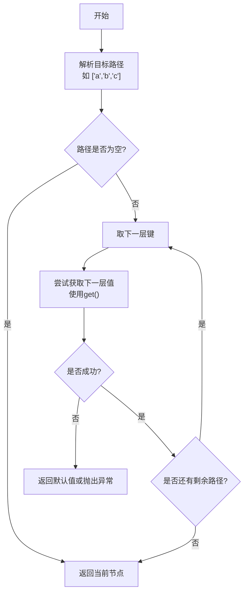
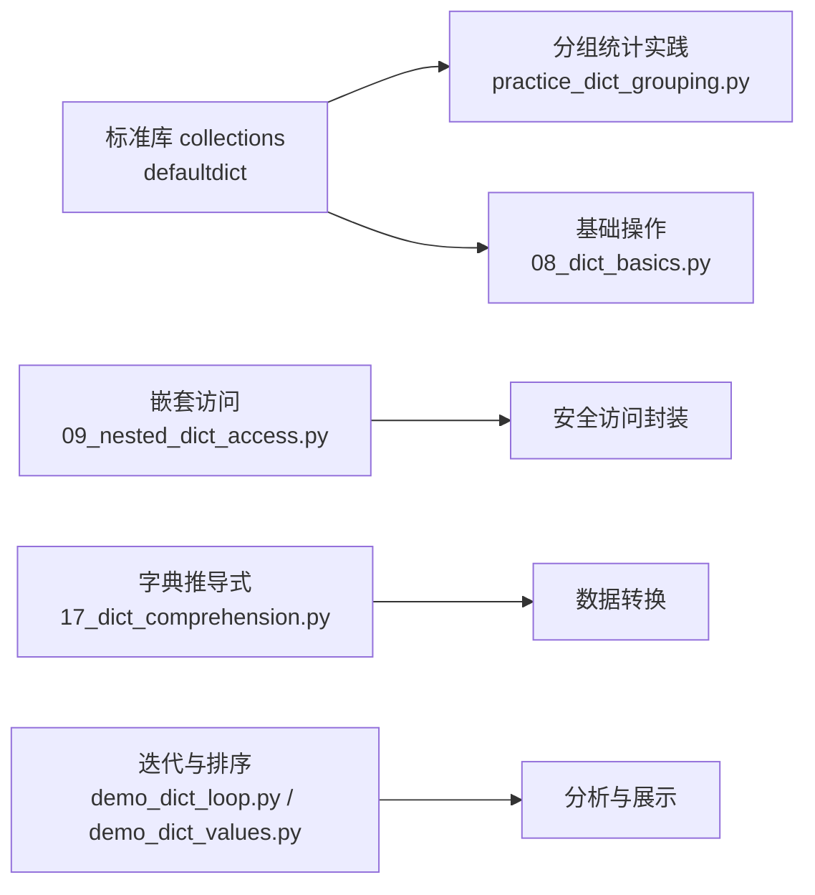

# 字典操作

<cite>
**本文引用的文件**   
- [08_dict_basics.py](file://00_Basics/08_dict_basics.py)
- [09_nested_dict_access.py](file://00_Basics/09_nested_dict_access.py)
- [17_dict_comprehension.py](file://ex17_dict_comprehension.py)
- [demo_dict_loop.py](file://demo_dict_loop.py)
- [demo_dict_values.py](file://demo_dict_values.py)
- [practice_dict_grouping.py](file://practice_dict_grouping.py)
</cite>

## 目录
1. [简介](#简介)
2. [项目结构](#项目结构)
3. [核心组件](#核心组件)
4. [架构总览](#架构总览)
5. [详细组件分析](#详细组件分析)
6. [依赖分析](#依赖分析)
7. [性能考量](#性能考量)
8. [故障排查指南](#故障排查指南)
9. [结论](#结论)
10. [附录](#附录)

## 简介
本指南围绕Python字典的核心操作展开，覆盖创建、访问、修改、删除、安全访问（get）、默认值容器（defaultdict）、嵌套字典处理、字典推导式、迭代与排序、以及性能与哈希表原理。文档以仓库中的示例脚本为依据，帮助读者从基础到进阶系统掌握字典用法。

## 项目结构
本项目包含多个与字典相关的示例脚本，分别演示基础操作、嵌套访问、推导式、循环遍历、分组统计等典型场景。下图展示了与本指南直接相关的文件及其职责：

图表来源
- [08_dict_basics.py:1-200](file://00_Basics/08_dict_basics.py#L1-L200)
- [09_nested_dict_access.py:1-200](file://00_Basics/09_nested_dict_access.py#L1-L200)
- [17_dict_comprehension.py:1-200](file://ex17_dict_comprehension.py#L1-L200)
- [demo_dict_loop.py:1-200](file://demo_dict_loop.py#L1-L200)
- [demo_dict_values.py:1-200](file://demo_dict_values.py#L1-L200)
- [practice_dict_grouping.py:1-200](file://practice_dict_grouping.py#L1-L200)

章节来源
- [08_dict_basics.py:1-200](file://00_Basics/08_dict_basics.py#L1-L200)
- [09_nested_dict_access.py:1-200](file://00_Basics/09_nested_dict_access.py#L1-L200)
- [17_dict_comprehension.py:1-200](file://ex17_dict_comprehension.py#L1-L200)
- [demo_dict_loop.py:1-200](file://demo_dict_loop.py#L1-L200)
- [demo_dict_values.py:1-200](file://demo_dict_values.py#L1-L200)
- [practice_dict_grouping.py:1-200](file://practice_dict_grouping.py#L1-L200)

## 核心组件
本节聚焦字典的常用操作模式与最佳实践，结合仓库示例进行说明。

- 创建与初始化
  - 使用字面量或构造函数创建空字典与初始数据。
  - 通过键赋值实现新增与更新。
- 访问与修改
  - 方括号访问与潜在KeyError风险；推荐使用get()提供默认值。
  - update()合并字典；pop()/popitem()删除并返回；del删除键。
- 安全访问
  - get(key, default)避免异常；setdefault(key, default)在缺失时设置默认值。
- 默认值容器
  - collections.defaultdict用于自动初始化缺失键的值，适合计数、分组、累加等场景。
- 嵌套字典
  - 多层级访问需逐层检查或使用工具函数封装，避免KeyError。
- 字典推导式
  - 基于可迭代对象快速生成新字典，支持条件过滤与表达式转换。
- 迭代与排序
  - keys()/values()/items()三种视图；sorted()对键或值进行排序输出。
- 分组与统计
  - 利用defaultdict或普通字典配合循环完成分组、计数、求和、最值等。

章节来源
- [08_dict_basics.py:1-200](file://00_Basics/08_dict_basics.py#L1-L200)
- [09_nested_dict_access.py:1-200](file://00_Basics/09_nested_dict_access.py#L1-L200)
- [17_dict_comprehension.py:1-200](file://ex17_dict_comprehension.py#L1-L200)
- [demo_dict_loop.py:1-200](file://demo_dict_loop.py#L1-L200)
- [demo_dict_values.py:1-200](file://demo_dict_values.py#L1-L200)
- [practice_dict_grouping.py:1-200](file://practice_dict_grouping.py#L1-L200)

## 架构总览
下图展示字典相关示例之间的调用与协作关系，体现“基础操作 → 安全访问 → 嵌套处理 → 推导式 → 迭代与排序 → 分组统计”的学习路径。

图表来源
- [08_dict_basics.py:1-200](file://00_Basics/08_dict_basics.py#L1-L200)
- [09_nested_dict_access.py:1-200](file://00_Basics/09_nested_dict_access.py#L1-L200)
- [17_dict_comprehension.py:1-200](file://ex17_dict_comprehension.py#L1-L200)
- [demo_dict_loop.py:1-200](file://demo_dict_loop.py#L1-L200)
- [demo_dict_values.py:1-200](file://demo_dict_values.py#L1-L200)
- [practice_dict_grouping.py:1-200](file://practice_dict_grouping.py#L1-L200)

## 详细组件分析

### 基础字典操作（创建、访问、修改、删除）
- 要点
  - 使用字面量或构造器创建字典；通过键赋值实现新增与更新。
  - 访问优先使用get()避免KeyError；update()批量合并；pop()/popitem()/del删除。
- 适用场景
  - 配置项管理、缓存映射、临时聚合结果。
- 参考路径
  - [08_dict_basics.py:1-200](file://00_Basics/08_dict_basics.py#L1-L200)

章节来源
- [08_dict_basics.py:1-200](file://00_Basics/08_dict_basics.py#L1-L200)

### 安全访问与默认值容器
- get()与setdefault()
  - get(key, default)：不存在时返回默认值，不改变原字典。
  - setdefault(key, default)：不存在时插入默认值并返回；存在则返回现有值。
- defaultdict
  - 为缺失键提供工厂函数生成的默认值，常用于计数、分组、累加。
- 参考路径
  - [08_dict_basics.py:1-200](file://00_Basics/08_dict_basics.py#L1-L200)
  - [practice_dict_grouping.py:1-200](file://practice_dict_grouping.py#L1-L200)

章节来源
- [08_dict_basics.py:1-200](file://00_Basics/08_dict_basics.py#L1-L200)
- [practice_dict_grouping.py:1-200](file://practice_dict_grouping.py#L1-L200)

### 嵌套字典的访问与处理
- 挑战
  - 多层级访问易触发KeyError；需要逐层校验或封装安全访问函数。
- 策略
  - 使用get()链式访问；封装safe_get(path, default)；必要时用try/except捕获异常。
- 参考路径
  - [09_nested_dict_access.py:1-200](file://00_Basics/09_nested_dict_access.py#L1-L200)

章节来源
- [09_nested_dict_access.py:1-200](file://00_Basics/09_nested_dict_access.py#L1-L200)

### 字典推导式
- 语法要点
  - {key_expr: value_expr for item in iterable if condition}
- 常见应用
  - 字段映射、过滤重组、数值变换、去重聚合。
- 参考路径
  - [17_dict_comprehension.py:1-200](file://ex17_dict_comprehension.py#L1-L200)

章节来源
- [17_dict_comprehension.py:1-200](file://ex17_dict_comprehension.py#L1-L200)

### 迭代与排序
- 迭代方式
  - keys()/values()/items()视图；for k,v in d.items()高效遍历键值对。
- 排序
  - sorted(d)按键排序；sorted(d.items(), key=...)按值或复合键排序。
- 参考路径
  - [demo_dict_loop.py:1-200](file://demo_dict_loop.py#L1-L200)
  - [demo_dict_values.py:1-200](file://demo_dict_values.py#L1-L200)

章节来源
- [demo_dict_loop.py:1-200](file://demo_dict_loop.py#L1-L200)
- [demo_dict_values.py:1-200](file://demo_dict_values.py#L1-L200)

### 分组与统计实践
- 思路
  - 使用defaultdict(list/dict/int)收集分组数据；再二次计算统计指标（计数、均值、极值）。
- 参考路径
  - [practice_dict_grouping.py:1-200](file://practice_dict_grouping.py#L1-L200)

章节来源
- [practice_dict_grouping.py:1-200](file://practice_dict_grouping.py#L1-L200)

#### 安全访问嵌套数据的流程

图表来源
- [09_nested_dict_access.py:1-200](file://00_Basics/09_nested_dict_access.py#L1-L200)

## 依赖分析
- 模块内聚与耦合
  - 各示例脚本相对独立，职责单一，便于按需学习与实践。
- 外部依赖
  - 主要依赖标准库collections（defaultdict），无第三方包依赖。
- 可能的循环依赖
  - 示例脚本之间无相互导入，不存在循环依赖问题。

图表来源
- [08_dict_basics.py:1-200](file://00_Basics/08_dict_basics.py#L1-L200)
- [09_nested_dict_access.py:1-200](file://00_Basics/09_nested_dict_access.py#L1-L200)
- [17_dict_comprehension.py:1-200](file://ex17_dict_comprehension.py#L1-L200)
- [demo_dict_loop.py:1-200](file://demo_dict_loop.py#L1-L200)
- [demo_dict_values.py:1-200](file://demo_dict_values.py#L1-L200)
- [practice_dict_grouping.py:1-200](file://practice_dict_grouping.py#L1-L200)

章节来源
- [08_dict_basics.py:1-200](file://00_Basics/08_dict_basics.py#L1-L200)
- [09_nested_dict_access.py:1-200](file://00_Basics/09_nested_dict_access.py#L1-L200)
- [17_dict_comprehension.py:1-200](file://ex17_dict_comprehension.py#L1-L200)
- [demo_dict_loop.py:1-200](file://demo_dict_loop.py#L1-L200)
- [demo_dict_values.py:1-200](file://demo_dict_values.py#L1-L200)
- [practice_dict_grouping.py:1-200](file://practice_dict_grouping.py#L1-L200)

## 性能考量
- 时间复杂度
  - 查找/插入/删除平均O(1)，最坏情况O(n)（哈希冲突严重）。
  - 遍历O(n)，排序O(k log k)（k为元素个数）。
- 空间复杂度
  - 额外存储开销与元素数量线性相关；哈希表内部桶数组大小影响内存占用。
- 哈希表原理简介
  - 键必须可哈希（不可变类型）；通过哈希值定位桶位置；冲突采用开放寻址或链地址法解决（CPython实现细节可能随版本变化）。
- 与其他数据结构对比
  - 列表：有序、索引访问O(1)，但成员检测O(n)。
  - 集合：无序、唯一元素，成员检测O(1)。
  - 元组：不可变序列，适合作为字典键。
  - 选择建议：键值映射首选字典；唯一性需求选集合；顺序与索引选列表；不可变组合选元组。

[本节为通用性能讨论，无需具体文件引用]

## 故障排查指南
- KeyError
  - 现象：使用方括号访问不存在的键抛出异常。
  - 处理：改用get()或setdefault()；或在访问前使用in判断键是否存在。
- 嵌套访问异常
  - 现象：多级键缺失导致异常。
  - 处理：封装安全访问函数，逐层get()；或使用try/except捕获并回退默认值。
- 性能退化
  - 现象：大量键导致哈希冲突或频繁扩容。
  - 处理：合理预估容量；避免使用复杂或高冲突的键类型；必要时分批处理。
- 排序不稳定
  - 现象：多关键字排序时稳定性影响结果。
  - 处理：明确排序键优先级；必要时引入稳定排序技巧（如附加索引）。

章节来源
- [08_dict_basics.py:1-200](file://00_Basics/08_dict_basics.py#L1-L200)
- [09_nested_dict_access.py:1-200](file://00_Basics/09_nested_dict_access.py#L1-L200)

## 结论
通过本指南的系统梳理，读者可以掌握字典的基础与进阶用法：安全访问、嵌套数据处理、推导式构建、迭代与排序、以及分组统计实践。理解哈希表原理有助于在实际项目中做出更合理的结构与算法选择，提升代码的健壮性与性能。

[本节为总结性内容，无需具体文件引用]

## 附录
- 推荐练习路径
  - 先完成基础操作与安全访问，再进入嵌套字典与推导式，最后实践迭代、排序与分组统计。
- 参考文件清单
  - [08_dict_basics.py](file://00_Basics/08_dict_basics.py)
  - [09_nested_dict_access.py](file://00_Basics/09_nested_dict_access.py)
  - [17_dict_comprehension.py](file://ex17_dict_comprehension.py)
  - [demo_dict_loop.py](file://demo_dict_loop.py)
  - [demo_dict_values.py](file://demo_dict_values.py)
  - [practice_dict_grouping.py](file://practice_dict_grouping.py)