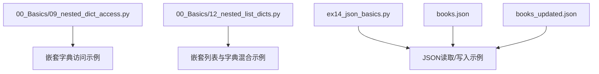
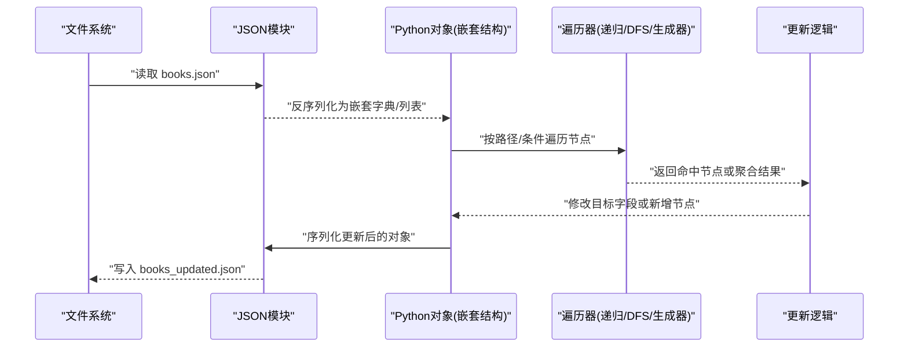
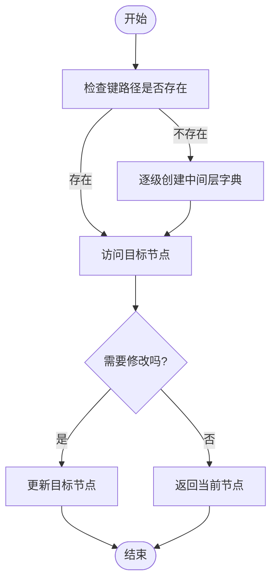
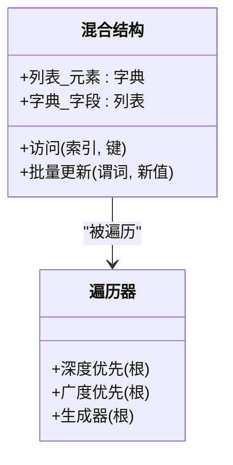
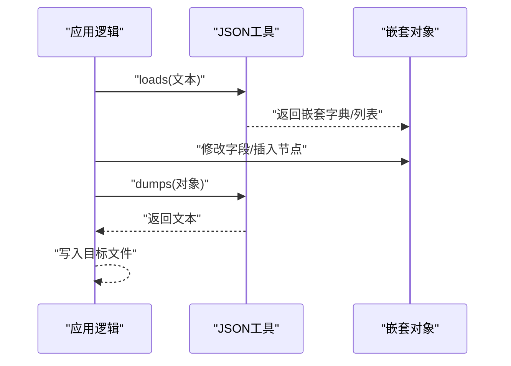
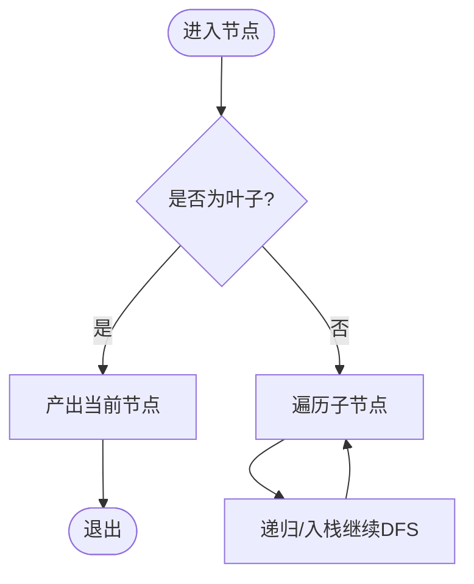
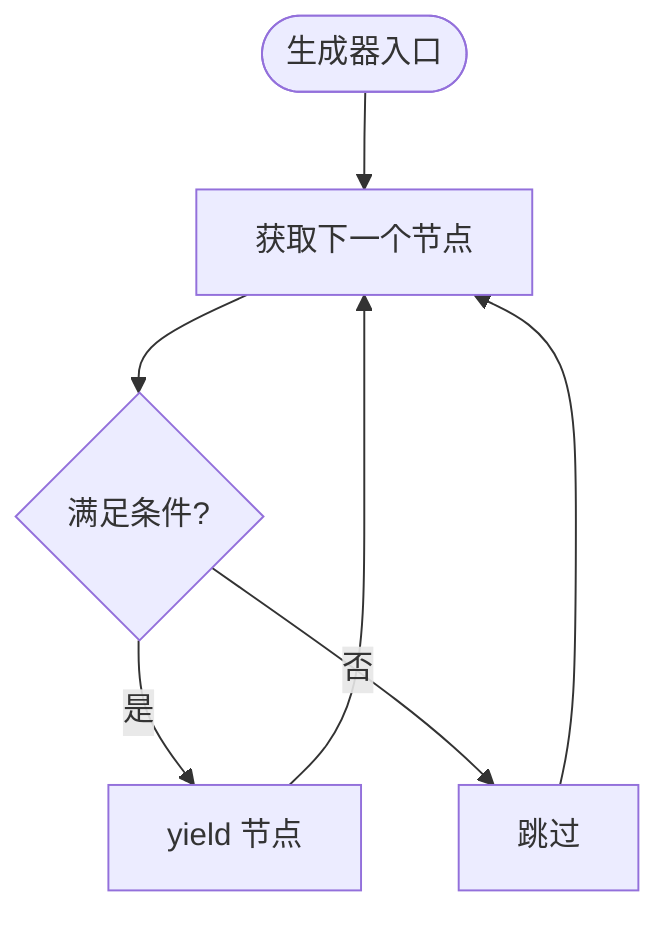
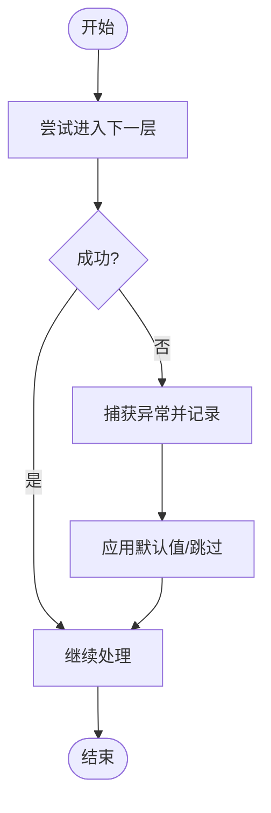
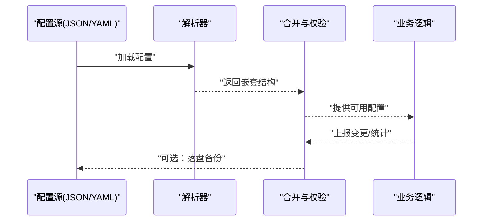
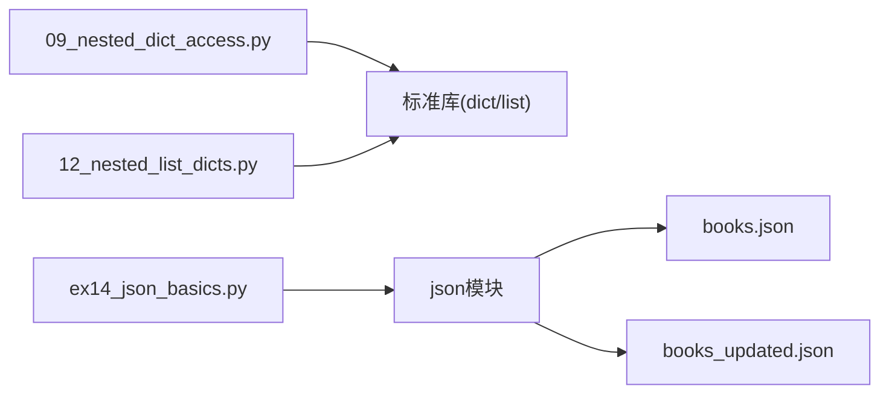

# 嵌套数据结构处理

<cite>
**本文引用的文件**   
- [09_nested_dict_access.py](file://00_Basics/09_nested_dict_access.py)
- [12_nested_list_dicts.py](file://00_Basics/12_nested_list_dicts.py)
- [ex14_json_basics.py](file://ex14_json_basics.py)
- [books.json](file://books.json)
- [books_updated.json](file://books_updated.json)
</cite>

## 目录
1. [简介](#简介)
2. [项目结构](#项目结构)
3. [核心组件](#核心组件)
4. [架构总览](#架构总览)
5. [详细组件分析](#详细组件分析)
6. [依赖关系分析](#依赖关系分析)
7. [性能考虑](#性能考虑)
8. [故障排查指南](#故障排查指南)
9. [结论](#结论)
10. [附录](#附录)

## 简介
本指南围绕Python中嵌套数据结构的创建、访问与修改，系统讲解嵌套列表与嵌套字典的处理方法；深入介绍递归与深度优先搜索（DFS）模式；提供复杂数据结构的遍历算法（多层循环、递归函数、生成器）；演示如何处理不规则嵌套结构并给出异常处理与错误恢复策略；结合JSON解析与生成，展示在配置文件解析与API响应处理等真实业务场景中的最佳实践与性能优化技巧。

## 项目结构
本项目包含多个示例脚本与数据文件，重点涉及以下与“嵌套数据结构”相关的资源：
- 基础示例：嵌套字典访问、嵌套列表与字典混合结构
- JSON示例：JSON读写与更新流程
- 数据文件：书籍清单的原始与更新版本

图表来源
- [09_nested_dict_access.py](file://00_Basics/09_nested_dict_access.py)
- [12_nested_list_dicts.py](file://00_Basics/12_nested_list_dicts.py)
- [ex14_json_basics.py](file://ex14_json_basics.py)
- [books.json](file://books.json)
- [books_updated.json](file://books_updated.json)

章节来源
- [09_nested_dict_access.py](file://00_Basics/09_nested_dict_access.py)
- [12_nested_list_dicts.py](file://00_Basics/12_nested_list_dicts.py)
- [ex14_json_basics.py](file://ex14_json_basics.py)
- [books.json](file://books.json)
- [books_updated.json](file://books_updated.json)

## 核心组件
- 嵌套字典访问与修改：通过键路径定位与赋值，支持默认值与安全访问模式
- 嵌套列表与字典混合结构：组合使用索引与键访问，适合表示表格、树形或图结构
- JSON解析与生成：将外部数据转换为Python对象，或将内部对象序列化为标准格式
- 递归与DFS遍历：对任意深度的嵌套结构进行统一处理
- 生成器遍历：惰性输出节点，降低内存占用，适合大数据集

章节来源
- [09_nested_dict_access.py](file://00_Basics/09_nested_dict_access.py)
- [12_nested_list_dicts.py](file://00_Basics/12_nested_list_dicts.py)
- [ex14_json_basics.py](file://ex14_json_basics.py)

## 架构总览
下图展示了从JSON到Python对象、再到嵌套结构遍历与更新的典型流程，以及最终写回JSON的过程。

图表来源
- [ex14_json_basics.py](file://ex14_json_basics.py)
- [books.json](file://books.json)
- [books_updated.json](file://books_updated.json)

## 详细组件分析

### 嵌套字典访问与修改
- 安全访问：使用带默认值的访问方式避免KeyError
- 路径式访问：通过键序列逐步下钻，便于批量处理
- 就地修改：根据路径直接更新叶子节点或中间节点
- 缺失层级构建：按需创建中间层字典，保证写入不报错

图表来源
- [09_nested_dict_access.py](file://00_Basics/09_nested_dict_access.py)

章节来源
- [09_nested_dict_access.py](file://00_Basics/09_nested_dict_access.py)

### 嵌套列表与字典混合结构
- 常见形态：列表套字典、字典套列表、多层交替
- 访问策略：先按索引进入列表，再按键进入字典
- 批量操作：对列表元素进行映射、过滤与聚合
- 结构校验：在进入深层前进行类型检查，防止TypeError

图表来源
- [12_nested_list_dicts.py](file://00_Basics/12_nested_list_dicts.py)

章节来源
- [12_nested_list_dicts.py](file://00_Basics/12_nested_list_dicts.py)

### JSON解析与生成
- 读取JSON：将文本解析为Python嵌套对象
- 更新对象：在内存中完成增删改查
- 写出JSON：将对象序列化为文本并持久化
- 增量更新：基于差异计算只更新必要字段，减少IO开销

图表来源
- [ex14_json_basics.py](file://ex14_json_basics.py)
- [books.json](file://books.json)
- [books_updated.json](file://books_updated.json)

章节来源
- [ex14_json_basics.py](file://ex14_json_basics.py)
- [books.json](file://books.json)
- [books_updated.json](file://books_updated.json)

### 递归与深度优先搜索（DFS）
- 递归终止条件：遇到非容器类型或达到最大深度
- 状态传递：累积路径、计数或聚合结果
- 回溯清理：在返回时撤销临时状态
- 迭代替代：当深度过大时使用显式栈实现DFS，避免递归深度限制

图表来源
- [09_nested_dict_access.py](file://00_Basics/09_nested_dict_access.py)
- [12_nested_list_dicts.py](file://00_Basics/12_nested_list_dicts.py)

章节来源
- [09_nested_dict_access.py](file://00_Basics/09_nested_dict_access.py)
- [12_nested_list_dicts.py](file://00_Basics/12_nested_list_dicts.py)

### 生成器遍历
- 惰性输出：按需产生节点，节省内存
- 可组合：与其他高阶函数（如filter/map）组合
- 适用场景：大文件流式处理、日志分析、报表汇总

图表来源
- [12_nested_list_dicts.py](file://00_Basics/12_nested_list_dicts.py)

章节来源
- [12_nested_list_dicts.py](file://00_Basics/12_nested_list_dicts.py)

### 不规则嵌套结构与异常处理
- 类型守卫：在进入深层前判断类型，避免类型错误
- 容错策略：记录失败路径，跳过坏节点，继续处理其余部分
- 恢复机制：提供默认值或降级方案，保证整体流程稳定
- 诊断信息：保留上下文（路径、类型、原始片段），便于定位问题

图表来源
- [09_nested_dict_access.py](file://00_Basics/09_nested_dict_access.py)
- [12_nested_list_dicts.py](file://00_Basics/12_nested_list_dicts.py)

章节来源
- [09_nested_dict_access.py](file://00_Basics/09_nested_dict_access.py)
- [12_nested_list_dicts.py](file://00_Basics/12_nested_list_dicts.py)

### 实战案例：配置文件解析与API响应处理
- 配置文件解析：将YAML/JSON配置转为嵌套字典，按路径读取与合并默认值
- API响应处理：对多层次的响应体进行抽取、清洗与聚合，输出结构化结果
- 数据一致性：在更新前后进行校验，确保关键字段完整且类型正确

[此图为概念性流程图，无需图表来源]

## 依赖关系分析
- 模块内聚：各示例脚本职责单一，分别聚焦于字典访问、混合结构、JSON处理
- 外部依赖：主要依赖标准库json模块进行序列化/反序列化
- 数据耦合：JSON文件作为输入/输出，驱动示例脚本执行

图表来源
- [09_nested_dict_access.py](file://00_Basics/09_nested_dict_access.py)
- [12_nested_list_dicts.py](file://00_Basics/12_nested_list_dicts.py)
- [ex14_json_basics.py](file://ex14_json_basics.py)
- [books.json](file://books.json)
- [books_updated.json](file://books_updated.json)

章节来源
- [09_nested_dict_access.py](file://00_Basics/09_nested_dict_access.py)
- [12_nested_list_dicts.py](file://00_Basics/12_nested_list_dicts.py)
- [ex14_json_basics.py](file://ex14_json_basics.py)
- [books.json](file://books.json)
- [books_updated.json](file://books_updated.json)

## 性能考虑
- 选择合适的数据结构：频繁查找用字典，顺序访问用列表
- 避免重复计算：缓存中间结果，减少重复遍历
- 惰性处理：使用生成器延迟计算，降低峰值内存
- 批量IO：合并多次写入，减少磁盘I/O次数
- 提前剪枝：在遍历中加入条件判断，尽早跳过无关分支

[本节为通用指导，无需章节来源]

## 故障排查指南
- 常见问题
  - KeyNotFound：检查键路径与大小写，必要时提供默认值
  - TypeError：在进入深层前进行类型检查，区分列表与字典
  - RecursionError：改用迭代版DFS或提升递归限制
  - JSONDecodeError：校验输入文本格式，增加容错与重试
- 定位手段
  - 打印路径与类型：记录访问路径与节点类型，快速定位断点
  - 最小复现：提取失败片段构造最小用例
  - 对比基线：与已知正确的JSON样例对比差异

章节来源
- [09_nested_dict_access.py](file://00_Basics/09_nested_dict_access.py)
- [12_nested_list_dicts.py](file://00_Basics/12_nested_list_dicts.py)
- [ex14_json_basics.py](file://ex14_json_basics.py)

## 结论
通过对嵌套字典与嵌套列表的系统化处理，结合递归与DFS、生成器与异常恢复策略，可以在复杂业务场景中稳健地解析、遍历与更新数据。配合JSON的读写能力，能够高效地完成从外部数据到内部对象的转换与持久化。遵循上述最佳实践与性能优化建议，可在保证正确性的同时获得良好的运行效率。

[本节为总结性内容，无需章节来源]

## 附录
- 术语
  - 嵌套结构：由列表、字典等容器相互嵌套形成的复合数据结构
  - 路径：从根到目标节点的键/索引序列
  - 叶子节点：不可再分的数据项（如字符串、数字）
- 参考示例路径
  - 嵌套字典访问与修改：[09_nested_dict_access.py](file://00_Basics/09_nested_dict_access.py)
  - 嵌套列表与字典混合结构：[12_nested_list_dicts.py](file://00_Basics/12_nested_list_dicts.py)
  - JSON解析与生成：[ex14_json_basics.py](file://ex14_json_basics.py)
  - 输入数据：[books.json](file://books.json)
  - 输出数据：[books_updated.json](file://books_updated.json)