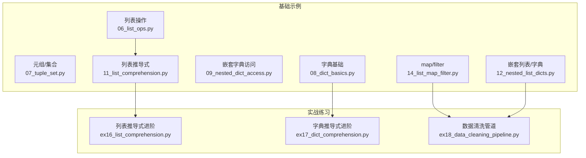
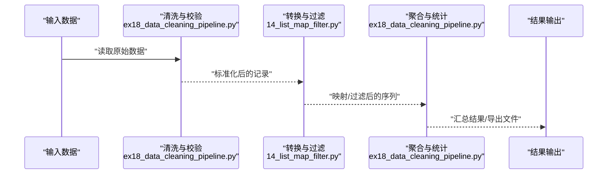
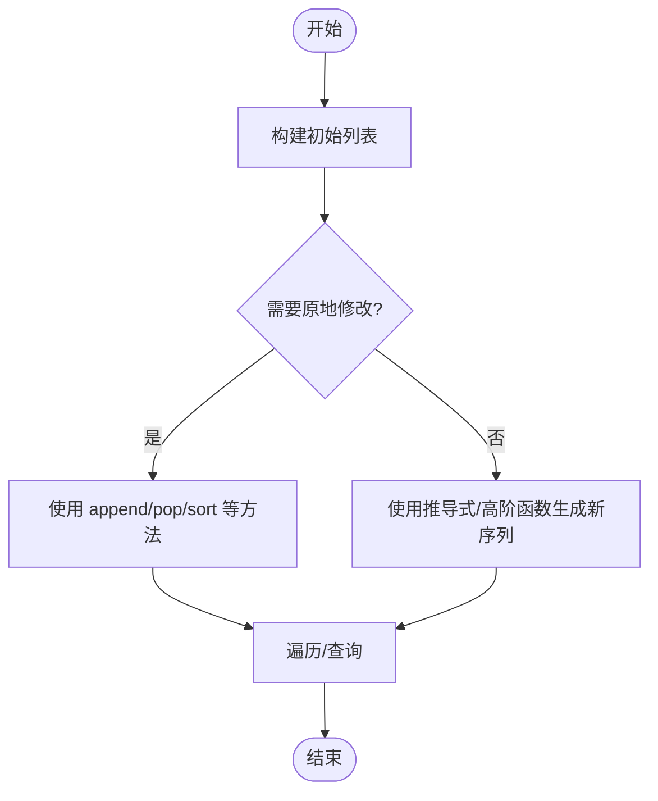
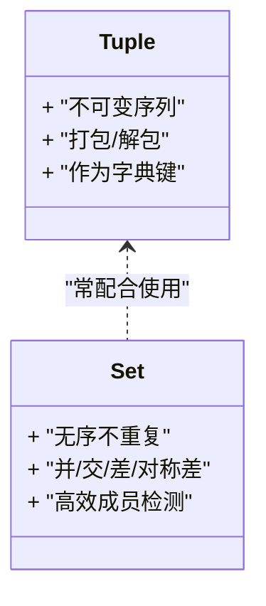
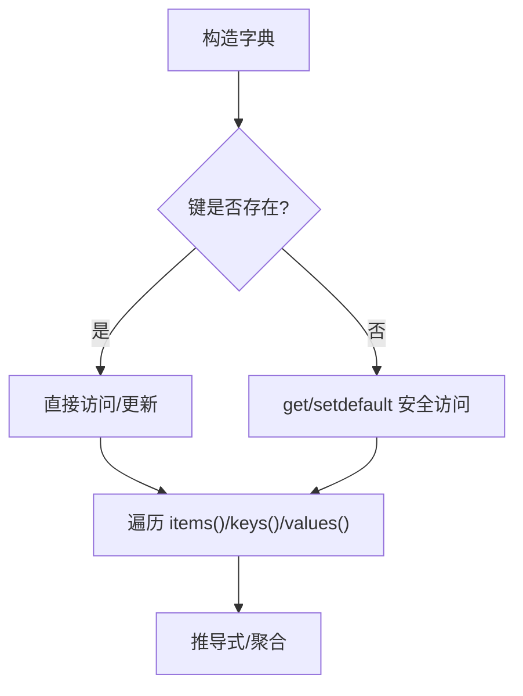
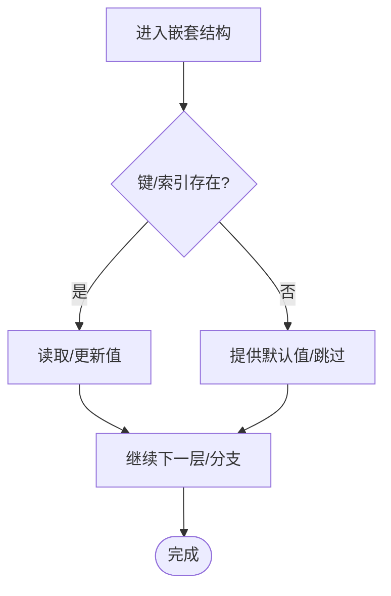
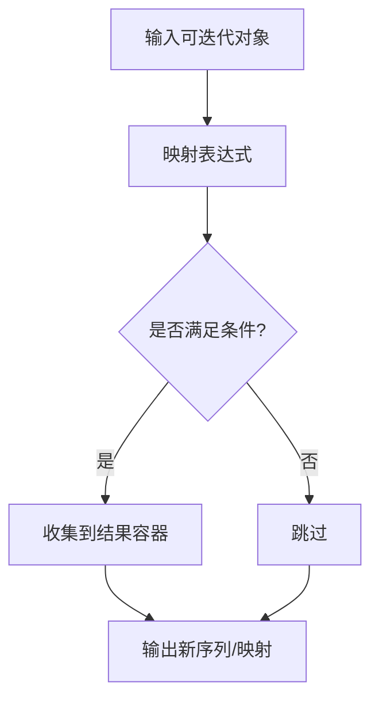
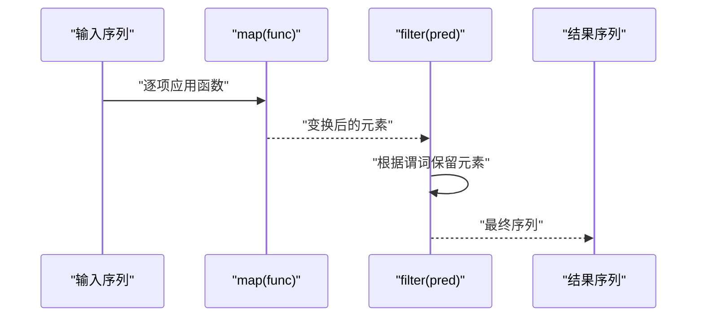
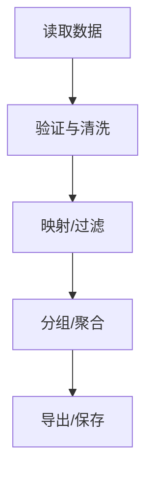
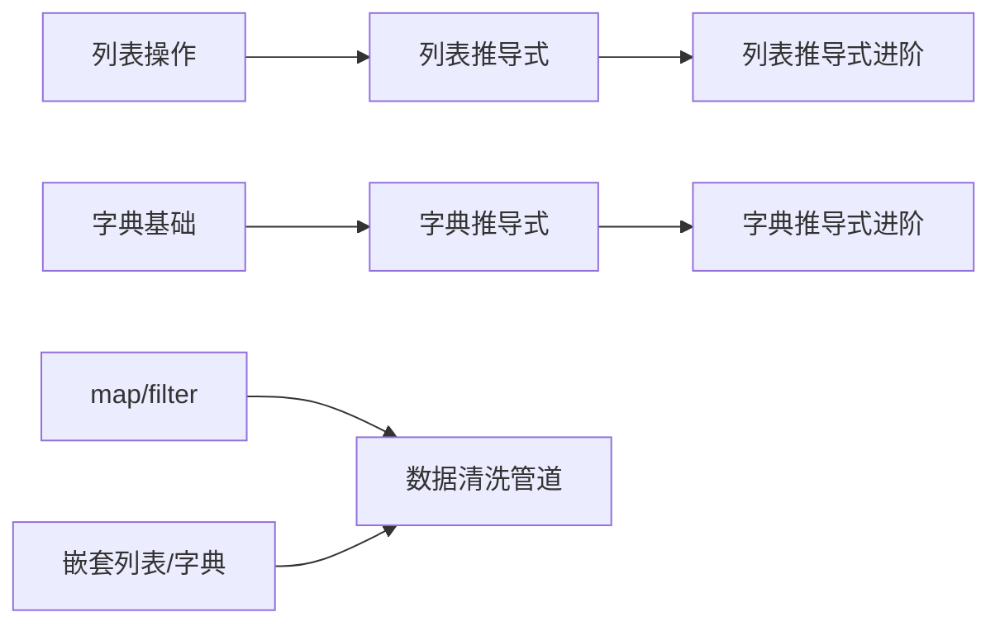

# 数据结构操作

<cite>
**本文引用的文件**   
- [06_list_ops.py](file://00_Basics/06_list_ops.py)
- [07_tuple_set.py](file://00_Basics/07_tuple_set.py)
- [08_dict_basics.py](file://00_Basics/08_dict_basics.py)
- [09_nested_dict_access.py](file://00_Basics/09_nested_dict_access.py)
- [11_list_comprehension.py](file://00_Basics/11_list_comprehension.py)
- [12_nested_list_dicts.py](file://00_Basics/12_nested_list_dicts.py)
- [14_list_map_filter.py](file://00_Basics/14_list_map_filter.py)
- [ex16_list_comprehension.py](file://ex16_list_comprehension.py)
- [ex17_dict_comprehension.py](file://ex17_dict_comprehension.py)
- [ex18_data_cleaning_pipeline.py](file://ex18_data_cleaning_pipeline.py)
</cite>

## 目录
1. [简介](#简介)
2. [项目结构](#项目结构)
3. [核心组件](#核心组件)
4. [架构总览](#架构总览)
5. [详细组件分析](#详细组件分析)
6. [依赖分析](#依赖分析)
7. [性能考虑](#性能考虑)
8. [故障排查指南](#故障排查指南)
9. [结论](#结论)
10. [附录](#附录)

## 简介
本学习文档围绕Python内置数据结构展开，系统讲解列表(list)、字典(dict)、元组(tuple)与集合(set)的创建、访问、修改与遍历；深入剖析嵌套数据结构的处理方法（嵌套列表、嵌套字典）；重点说明列表推导式与字典推导式的语法与性能优势；演示map()、filter()等高阶函数的使用；并提供适用场景选择指南、内存与时间复杂度对比，以及复杂数据处理的最佳实践案例。

## 项目结构
本项目以“基础示例 + 实战练习”的方式组织：
- 基础示例位于 00_Basics 目录，覆盖列表、元组/集合、字典、嵌套访问、推导式、高阶函数等主题。
- 实战练习位于根目录，包含数据清洗管道、统计分析与导出等综合任务。

图表来源
- [06_list_ops.py:1-200](file://00_Basics/06_list_ops.py#L1-L200)
- [07_tuple_set.py:1-200](file://00_Basics/07_tuple_set.py#L1-L200)
- [08_dict_basics.py:1-200](file://00_Basics/08_dict_basics.py#L1-L200)
- [09_nested_dict_access.py:1-200](file://00_Basics/09_nested_dict_access.py#L1-L200)
- [11_list_comprehension.py:1-200](file://00_Basics/11_list_comprehension.py#L1-L200)
- [12_nested_list_dicts.py:1-200](file://00_Basics/12_nested_list_dicts.py#L1-L200)
- [14_list_map_filter.py:1-200](file://00_Basics/14_list_map_filter.py#L1-L200)
- [ex16_list_comprehension.py:1-200](file://ex16_list_comprehension.py#L1-L200)
- [ex17_dict_comprehension.py:1-200](file://ex17_dict_comprehension.py#L1-L200)
- [ex18_data_cleaning_pipeline.py:1-200](file://ex18_data_cleaning_pipeline.py#L1-L200)

章节来源
- [06_list_ops.py:1-200](file://00_Basics/06_list_ops.py#L1-L200)
- [07_tuple_set.py:1-200](file://00_Basics/07_tuple_set.py#L1-L200)
- [08_dict_basics.py:1-200](file://00_Basics/08_dict_basics.py#L1-L200)
- [09_nested_dict_access.py:1-200](file://00_Basics/09_nested_dict_access.py#L1-L200)
- [11_list_comprehension.py:1-200](file://00_Basics/11_list_comprehension.py#L1-L200)
- [12_nested_list_dicts.py:1-200](file://00_Basics/12_nested_list_dicts.py#L1-L200)
- [14_list_map_filter.py:1-200](file://00_Basics/14_list_map_filter.py#L1-L200)
- [ex16_list_comprehension.py:1-200](file://ex16_list_comprehension.py#L1-L200)
- [ex17_dict_comprehension.py:1-200](file://ex17_dict_comprehension.py#L1-L200)
- [ex18_data_cleaning_pipeline.py:1-200](file://ex18_data_cleaning_pipeline.py#L1-L200)

## 核心组件
本节聚焦四大内置数据结构的核心能力与典型用法路径，便于快速定位到仓库中的对应示例。

- 列表(list)
  - 创建与初始化、索引与切片、追加/插入/删除、排序与反转、遍历与枚举。
  - 参考路径：[列表操作:1-200](file://00_Basics/06_list_ops.py#L1-L200)
- 元组(tuple)与集合(set)
  - 元组的不可变性与打包/解包；集合的去重、并交差补集运算。
  - 参考路径：[元组/集合:1-200](file://00_Basics/07_tuple_set.py#L1-L200)
- 字典(dict)
  - 键值对创建、访问与更新、常用方法、遍历键/值/项。
  - 参考路径：[字典基础:1-200](file://00_Basics/08_dict_basics.py#L1-L200)
- 嵌套数据结构
  - 嵌套字典访问与更新、嵌套列表与字典的组合处理。
  - 参考路径：[嵌套字典访问:1-200](file://00_Basics/09_nested_dict_access.py#L1-L200)、[嵌套列表/字典:1-200](file://00_Basics/12_nested_list_dicts.py#L1-L200)
- 推导式
  - 列表推导式、字典推导式的语法与条件过滤。
  - 参考路径：[列表推导式:1-200](file://00_Basics/11_list_comprehension.py#L1-L200)、[列表推导式进阶:1-200](file://ex16_list_comprehension.py#L1-L200)、[字典推导式进阶:1-200](file://ex17_dict_comprehension.py#L1-L200)
- 高阶函数
  - map()、filter()、lambda组合使用，提升表达力与可读性。
  - 参考路径：[map/filter:1-200](file://00_Basics/14_list_map_filter.py#L1-L200)

章节来源
- [06_list_ops.py:1-200](file://00_Basics/06_list_ops.py#L1-L200)
- [07_tuple_set.py:1-200](file://00_Basics/07_tuple_set.py#L1-L200)
- [08_dict_basics.py:1-200](file://00_Basics/08_dict_basics.py#L1-L200)
- [09_nested_dict_access.py:1-200](file://00_Basics/09_nested_dict_access.py#L1-L200)
- [11_list_comprehension.py:1-200](file://00_Basics/11_list_comprehension.py#L1-L200)
- [12_nested_list_dicts.py:1-200](file://00_Basics/12_nested_list_dicts.py#L1-L200)
- [14_list_map_filter.py:1-200](file://00_Basics/14_list_map_filter.py#L1-L200)
- [ex16_list_comprehension.py:1-200](file://ex16_list_comprehension.py#L1-L200)
- [ex17_dict_comprehension.py:1-200](file://ex17_dict_comprehension.py#L1-L200)

## 架构总览
从“数据获取 → 转换/过滤 → 聚合/统计 → 输出/持久化”的角度，将仓库中的示例串联为一条可复用的数据处理流水线。

图表来源
- [ex18_data_cleaning_pipeline.py:1-200](file://ex18_data_cleaning_pipeline.py#L1-L200)
- [14_list_map_filter.py:1-200](file://00_Basics/14_list_map_filter.py#L1-L200)

## 详细组件分析

### 列表(list)
- 关键能力
  - 可变序列：支持索引、切片、拼接、重复、成员检测。
  - 增删改查：append、insert、pop、remove、del、sort、reverse。
  - 遍历：for循环、enumerate、zip、迭代器。
- 常见模式
  - 批量构建与筛选：结合推导式或高阶函数。
  - 原地修改 vs 生成新序列：注意副作用与可读性权衡。
- 参考路径
  - [列表操作:1-200](file://00_Basics/06_list_ops.py#L1-L200)
  - [列表推导式:1-200](file://00_Basics/11_list_comprehension.py#L1-L200)
  - [列表推导式进阶:1-200](file://ex16_list_comprehension.py#L1-L200)

图表来源
- [06_list_ops.py:1-200](file://00_Basics/06_list_ops.py#L1-L200)
- [11_list_comprehension.py:1-200](file://00_Basics/11_list_comprehension.py#L1-L200)
- [ex16_list_comprehension.py:1-200](file://ex16_list_comprehension.py#L1-L200)

章节来源
- [06_list_ops.py:1-200](file://00_Basics/06_list_ops.py#L1-L200)
- [11_list_comprehension.py:1-200](file://00_Basics/11_list_comprehension.py#L1-L200)
- [ex16_list_comprehension.py:1-200](file://ex16_list_comprehension.py#L1-L200)

### 元组(tuple)与集合(set)
- 元组
  - 不可变序列：适合固定结构的数据建模与函数多返回值。
  - 打包/解包：(a, b) = func() 风格。
- 集合
  - 无序不重复：去重、关系运算（并、交、差、对称差）。
  - 高效成员检测：基于哈希表实现。
- 参考路径
  - [元组/集合:1-200](file://00_Basics/07_tuple_set.py#L1-L200)

图表来源
- [07_tuple_set.py:1-200](file://00_Basics/07_tuple_set.py#L1-L200)

章节来源
- [07_tuple_set.py:1-200](file://00_Basics/07_tuple_set.py#L1-L200)

### 字典(dict)
- 关键能力
  - 键值映射：O(1)平均查找、插入、删除。
  - 常用方法：get、setdefault、update、items/keys/values。
  - 遍历：按键、按值、按项。
- 参考路径
  - [字典基础:1-200](file://00_Basics/08_dict_basics.py#L1-L200)
  - [字典推导式进阶:1-200](file://ex17_dict_comprehension.py#L1-L200)

图表来源
- [08_dict_basics.py:1-200](file://00_Basics/08_dict_basics.py#L1-L200)
- [ex17_dict_comprehension.py:1-200](file://ex17_dict_comprehension.py#L1-L200)

章节来源
- [08_dict_basics.py:1-200](file://00_Basics/08_dict_basics.py#L1-L200)
- [ex17_dict_comprehension.py:1-200](file://ex17_dict_comprehension.py#L1-L200)

### 嵌套数据结构（嵌套列表/嵌套字典）
- 访问技巧
  - 链式索引与get默认值结合，避免KeyError。
  - 使用try/except捕获异常，或在访问前进行存在性检查。
- 操作技巧
  - 递归/迭代遍历树形结构。
  - 使用推导式+条件表达式进行扁平化与重组。
- 参考路径
  - [嵌套字典访问:1-200](file://00_Basics/09_nested_dict_access.py#L1-L200)
  - [嵌套列表/字典:1-200](file://00_Basics/12_nested_list_dicts.py#L1-L200)

图表来源
- [09_nested_dict_access.py:1-200](file://00_Basics/09_nested_dict_access.py#L1-L200)
- [12_nested_list_dicts.py:1-200](file://00_Basics/12_nested_list_dicts.py#L1-L200)

章节来源
- [09_nested_dict_access.py:1-200](file://00_Basics/09_nested_dict_access.py#L1-L200)
- [12_nested_list_dicts.py:1-200](file://00_Basics/12_nested_list_dicts.py#L1-L200)

### 推导式（列表/字典）
- 语法要点
  - 列表推导式：[expr for x in iterable if cond]
  - 字典推导式：{k: v for k, v in pairs if cond}
- 性能优势
  - 在C层循环，减少Python字节码开销，通常比等效for循环更快。
  - 更简洁易读，利于一次性构建中间结果。
- 参考路径
  - [列表推导式:1-200](file://00_Basics/11_list_comprehension.py#L1-L200)
  - [列表推导式进阶:1-200](file://ex16_list_comprehension.py#L1-L200)
  - [字典推导式进阶:1-200](file://ex17_dict_comprehension.py#L1-L200)

图表来源
- [11_list_comprehension.py:1-200](file://00_Basics/11_list_comprehension.py#L1-L200)
- [ex16_list_comprehension.py:1-200](file://ex16_list_comprehension.py#L1-L200)
- [ex17_dict_comprehension.py:1-200](file://ex17_dict_comprehension.py#L1-L200)

章节来源
- [11_list_comprehension.py:1-200](file://00_Basics/11_list_comprehension.py#L1-L200)
- [ex16_list_comprehension.py:1-200](file://ex16_list_comprehension.py#L1-L200)
- [ex17_dict_comprehension.py:1-200](file://ex17_dict_comprehension.py#L1-L200)

### 高阶函数（map/filter/lambda）
- 使用方式
  - map(func, iterable)：逐项变换。
  - filter(func, iterable)：条件过滤。
  - lambda：匿名函数，常用于简单映射/过滤逻辑。
- 适用场景
  - 线性变换与过滤，代码更声明式。
  - 与推导式互补：当逻辑复杂时优先推导式，简单映射/过滤可用高阶函数。
- 参考路径
  - [map/filter:1-200](file://00_Basics/14_list_map_filter.py#L1-L200)

图表来源
- [14_list_map_filter.py:1-200](file://00_Basics/14_list_map_filter.py#L1-L200)

章节来源
- [14_list_map_filter.py:1-200](file://00_Basics/14_list_map_filter.py#L1-L200)

### 实战案例：数据清洗管道
- 目标
  - 读取原始数据 → 清洗与校验 → 映射/过滤 → 聚合统计 → 导出结果。
- 关键步骤
  - 使用推导式与高阶函数组合完成转换与过滤。
  - 利用字典进行分组与聚合。
  - 通过集合去重与交集/差集做一致性校验。
- 参考路径
  - [数据清洗管道:1-200](file://ex18_data_cleaning_pipeline.py#L1-L200)

图表来源
- [ex18_data_cleaning_pipeline.py:1-200](file://ex18_data_cleaning_pipeline.py#L1-L200)

章节来源
- [ex18_data_cleaning_pipeline.py:1-200](file://ex18_data_cleaning_pipeline.py#L1-L200)

## 依赖分析
- 模块内聚与耦合
  - 各示例文件相对独立，职责单一，便于按需学习与复用。
  - 推导式与高阶函数在不同文件中反复出现，体现通用模式。
- 外部依赖
  - 示例主要依赖Python标准库，无第三方依赖，便于快速运行与移植。

图表来源
- [06_list_ops.py:1-200](file://00_Basics/06_list_ops.py#L1-L200)
- [11_list_comprehension.py:1-200](file://00_Basics/11_list_comprehension.py#L1-L200)
- [08_dict_basics.py:1-200](file://00_Basics/08_dict_basics.py#L1-L200)
- [ex17_dict_comprehension.py:1-200](file://ex17_dict_comprehension.py#L1-L200)
- [ex16_list_comprehension.py:1-200](file://ex16_list_comprehension.py#L1-L200)
- [14_list_map_filter.py:1-200](file://00_Basics/14_list_map_filter.py#L1-L200)
- [12_nested_list_dicts.py:1-200](file://00_Basics/12_nested_list_dicts.py#L1-L200)
- [ex18_data_cleaning_pipeline.py:1-200](file://ex18_data_cleaning_pipeline.py#L1-L200)

## 性能考虑
- 时间复杂度（平均情况）
  - 列表：索引/切片O(1)，末尾追加O(1)，头部插入/删除O(n)。
  - 字典：查找/插入/删除O(1)。
  - 集合：查找/插入/删除O(1)。
  - 元组：索引O(1)，不可变导致无法就地修改。
- 空间复杂度
  - 列表/集合/字典均会预分配额外容量，频繁扩容可能带来额外开销。
  - 元组更节省内存且可被缓存（小整数/短字符串等）。
- 推导式 vs 循环
  - 推导式通常在C层执行，减少解释器开销，速度更快且更简洁。
- 高阶函数
  - map/filter返回迭代器，惰性求值，适合大数据流式处理。
- 建议
  - 大量成员检测用集合；需要有序且可变用列表；键值映射用字典；固定结构用元组。
  - 复杂条件与多重变换优先考虑推导式；简单映射/过滤可用map/filter。

## 故障排查指南
- 常见错误
  - 索引越界：列表/元组访问前确认长度或使用切片保护。
  - 键不存在：字典访问使用get/setdefault或先判断键存在。
  - 类型错误：确保传入map/filter的函数签名与元素类型匹配。
- 调试技巧
  - 打印中间结果或使用日志记录关键节点。
  - 使用断言或单元测试验证边界条件。
- 参考路径
  - [嵌套字典访问:1-200](file://00_Basics/09_nested_dict_access.py#L1-L200)
  - [map/filter:1-200](file://00_Basics/14_list_map_filter.py#L1-L200)

章节来源
- [09_nested_dict_access.py:1-200](file://00_Basics/09_nested_dict_access.py#L1-L200)
- [14_list_map_filter.py:1-200](file://00_Basics/14_list_map_filter.py#L1-L200)

## 结论
- 列表、字典、元组、集合各有专长：可变序列、键值映射、不可变结构与高效集合运算。
- 推导式与高阶函数能显著提升表达力与性能，建议在合适场景下优先采用。
- 嵌套数据结构的稳健访问与操作是工程实践的关键，应结合默认值与异常处理策略。
- 通过“清洗→转换→聚合→输出”的流水线模式，可将零散技能整合为可复用的数据处理流程。

## 附录
- 快速对照表（概念性总结）
  - 列表：适合有序可变序列；尾部追加高效；随机访问快。
  - 字典：适合键值映射；查找/插入/删除高效。
  - 集合：适合去重与集合运算；成员检测高效。
  - 元组：适合固定结构、函数多返回值、作为字典键。
- 推荐学习顺序
  - 列表 → 字典 → 元组/集合 → 嵌套结构 → 推导式 → 高阶函数 → 实战管道