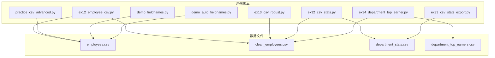
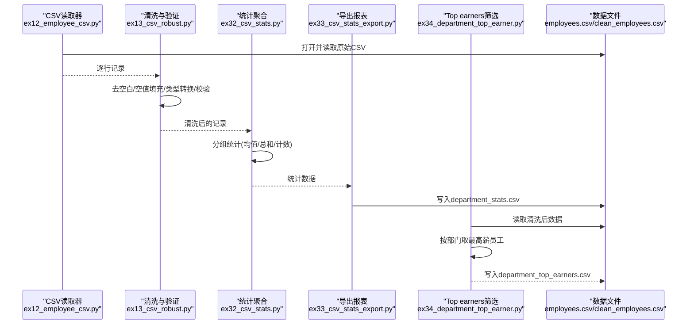
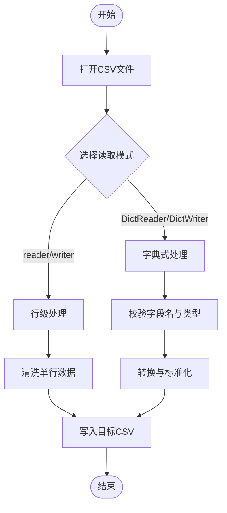
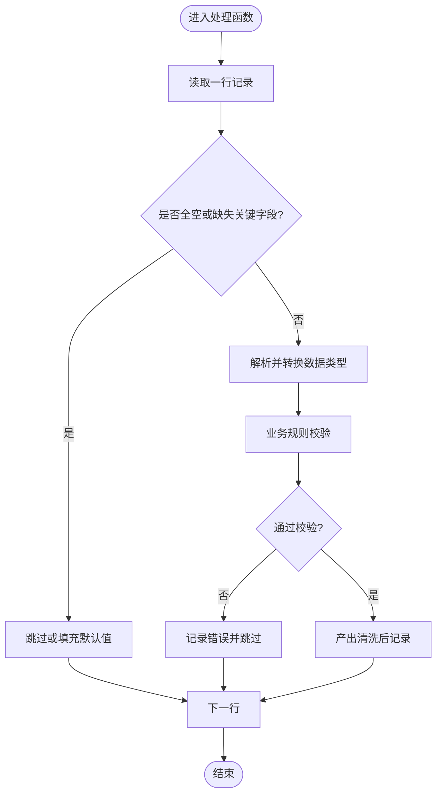
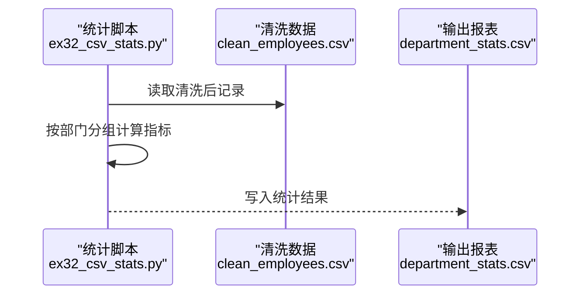
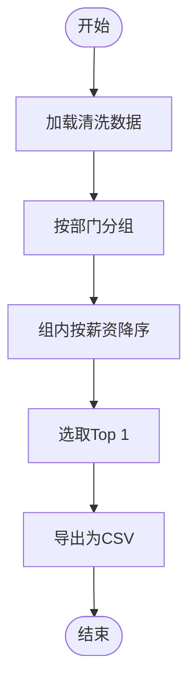
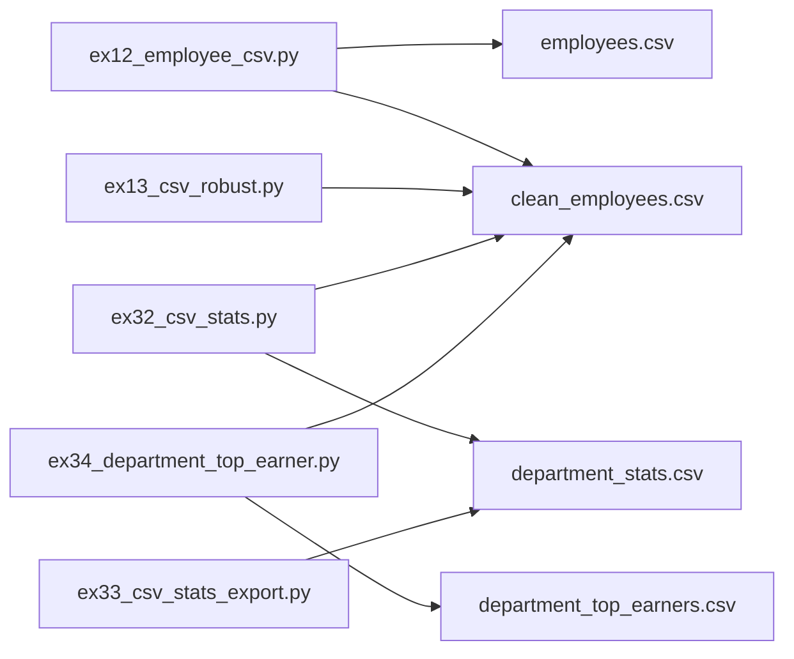

# CSV文件处理

<cite>
**本文引用的文件**   
- [ex12_employee_csv.py](file://ex12_employee_csv.py)
- [ex13_csv_robust.py](file://ex13_csv_robust.py)
- [ex32_csv_stats.py](file://ex32_csv_stats.py)
- [ex33_csv_stats_export.py](file://ex33_csv_stats_export.py)
- [ex34_department_top_earner.py](file://ex34_department_top_earner.py)
- [practice_csv_advanced.py](file://practice_csv_advanced.py)
- [demo_fieldnames.py](file://demo_fieldnames.py)
- [demo_auto_fieldnames.py](file://demo_auto_fieldnames.py)
- [employees.csv](file://employees.csv)
- [clean_employees.csv](file://clean_employees.csv)
- [department_stats.csv](file://department_stats.csv)
- [department_top_earners.csv](file://department_top_earners.csv)
</cite>

## 目录
1. [简介](#简介)
2. [项目结构](#项目结构)
3. [核心组件](#核心组件)
4. [架构总览](#架构总览)
5. [详细组件分析](#详细组件分析)
6. [依赖关系分析](#依赖关系分析)
7. [性能考虑](#性能考虑)
8. [故障排查指南](#故障排查指南)
9. [结论](#结论)
10. [附录](#附录)

## 简介
本技术文档围绕Python标准库csv模块，系统讲解CSV文件的读取与写入、字段名处理（DictReader/DictWriter）、数据清洗与转换、异常处理与健壮性设计，并通过“员工数据处理”的完整案例展示从原始数据到统计报表的端到端管道。文档面向不同层次读者，既提供高层概览，也给出代码级实现要点与可视化图示，帮助快速构建可维护、可扩展的CSV处理流程。

## 项目结构
仓库中包含多个与CSV处理相关的示例脚本与数据文件，覆盖基础读写、字典式读写、统计汇总、导出报表等典型场景：
- 示例脚本：ex12_employee_csv.py、ex13_csv_robust.py、ex32_csv_stats.py、ex33_csv_stats_export.py、ex34_department_top_earner.py、practice_csv_advanced.py、demo_fieldnames.py、demo_auto_fieldnames.py
- 数据文件：employees.csv、clean_employees.csv、department_stats.csv、department_top_earners.csv

图表来源
- [ex12_employee_csv.py:1-200](file://ex12_employee_csv.py#L1-L200)
- [ex13_csv_robust.py:1-200](file://ex13_csv_robust.py#L1-L200)
- [ex32_csv_stats.py:1-200](file://ex32_csv_stats.py#L1-L200)
- [ex33_csv_stats_export.py:1-200](file://ex33_csv_stats_export.py#L1-L200)
- [ex34_department_top_earner.py:1-200](file://ex34_department_top_earner.py#L1-L200)
- [practice_csv_advanced.py:1-200](file://practice_csv_advanced.py#L1-L200)
- [demo_fieldnames.py:1-200](file://demo_fieldnames.py#L1-L200)
- [demo_auto_fieldnames.py:1-200](file://demo_auto_fieldnames.py#L1-L200)
- [employees.csv:1-200](file://employees.csv#L1-L200)
- [clean_employees.csv:1-200](file://clean_employees.csv#L1-L200)
- [department_stats.csv:1-200](file://department_stats.csv#L1-L200)
- [department_top_earners.csv:1-200](file://department_top_earners.csv#L1-L200)

章节来源
- [ex12_employee_csv.py:1-200](file://ex12_employee_csv.py#L1-L200)
- [ex13_csv_robust.py:1-200](file://ex13_csv_robust.py#L1-L200)
- [ex32_csv_stats.py:1-200](file://ex32_csv_stats.py#L1-L200)
- [ex33_csv_stats_export.py:1-200](file://ex33_csv_stats_export.py#L1-L200)
- [ex34_department_top_earner.py:1-200](file://ex34_department_top_earner.py#L1-L200)
- [practice_csv_advanced.py:1-200](file://practice_csv_advanced.py#L1-L200)
- [demo_fieldnames.py:1-200](file://demo_fieldnames.py#L1-L200)
- [demo_auto_fieldnames.py:1-200](file://demo_auto_fieldnames.py#L1-L200)
- [employees.csv:1-200](file://employees.csv#L1-L200)
- [clean_employees.csv:1-200](file://clean_employees.csv#L1-L200)
- [department_stats.csv:1-200](file://department_stats.csv#L1-L200)
- [department_top_earners.csv:1-200](file://department_top_earners.csv#L1-L200)

## 核心组件
本节聚焦csv模块的核心能力与常用模式，结合仓库中的示例脚本进行说明。

- csv.reader()与csv.writer()
  - 适用场景：行级顺序处理，适合流式读取与逐行写入；对内存友好，便于大文件处理。
  - 关键点：指定分隔符、换行符、引号策略；使用with语句管理文件句柄；注意编码设置。
  - 参考路径：[ex12_employee_csv.py](file://ex12_employee_csv.py)、[ex13_csv_robust.py](file://ex13_csv_robust.py)

- DictReader与DictWriter
  - 适用场景：以字段名为键的字典式访问，提升可读性与可维护性；适合复杂字段映射与校验。
  - 关键点：fieldnames显式声明或自动推断；缺失字段默认None；写入时确保字段一致。
  - 参考路径：[demo_fieldnames.py](file://demo_fieldnames.py)、[demo_auto_fieldnames.py](file://demo_auto_fieldnames.py)、[ex13_csv_robust.py](file://ex13_csv_robust.py)

- 数据清洗与类型转换
  - 常见操作：去除空白、统一大小写、空值填充、数值解析、日期格式化、枚举校验。
  - 参考路径：[ex13_csv_robust.py](file://ex13_csv_robust.py)、[practice_csv_advanced.py](file://practice_csv_advanced.py)

- 统计分析与导出
  - 聚合计算：分组求和、均值、最大值、Top-N筛选；结果导出为CSV。
  - 参考路径：[ex32_csv_stats.py](file://ex32_csv_stats.py)、[ex33_csv_stats_export.py](file://ex33_csv_stats_export.py)、[ex34_department_top_earner.py](file://ex34_department_top_earner.py)

章节来源
- [ex12_employee_csv.py:1-200](file://ex12_employee_csv.py#L1-L200)
- [ex13_csv_robust.py:1-200](file://ex13_csv_robust.py#L1-L200)
- [demo_fieldnames.py:1-200](file://demo_fieldnames.py#L1-L200)
- [demo_auto_fieldnames.py:1-200](file://demo_auto_fieldnames.py#L1-L200)
- [ex32_csv_stats.py:1-200](file://ex32_csv_stats.py#L1-L200)
- [ex33_csv_stats_export.py:1-200](file://ex33_csv_stats_export.py#L1-L200)
- [ex34_department_top_earner.py:1-200](file://ex34_department_top_earner.py#L1-L200)
- [practice_csv_advanced.py:1-200](file://practice_csv_advanced.py#L1-L200)

## 架构总览
下图展示了“员工数据处理”的端到端流水线：从原始CSV读取、清洗与验证，到按部门统计与导出Top earners，最终输出结构化报表。

图表来源
- [ex12_employee_csv.py:1-200](file://ex12_employee_csv.py#L1-L200)
- [ex13_csv_robust.py:1-200](file://ex13_csv_robust.py#L1-L200)
- [ex32_csv_stats.py:1-200](file://ex32_csv_stats.py#L1-L200)
- [ex33_csv_stats_export.py:1-200](file://ex33_csv_stats_export.py#L1-L200)
- [ex34_department_top_earner.py:1-200](file://ex34_department_top_earner.py#L1-L200)
- [employees.csv:1-200](file://employees.csv#L1-L200)
- [clean_employees.csv:1-200](file://clean_employees.csv#L1-L200)
- [department_stats.csv:1-200](file://department_stats.csv#L1-L200)
- [department_top_earners.csv:1-200](file://department_top_earners.csv#L1-L200)

## 详细组件分析

### 组件A：基础读写与字段名演示
- 目标：掌握csv.reader()/writer()与DictReader/DictWriter的基本用法，理解fieldnames的作用与自动推断机制。
- 关键要点：
  - reader/writer适用于简单行列处理；DictReader/DictWriter更适合带表头的结构化数据。
  - fieldnames可显式定义以保证一致性；未提供的字段在读取时为None，写入时需保证字段集匹配。
  - 自动推断fieldnames需确保首行为表头且无重复列名。
- 参考路径：
  - [ex12_employee_csv.py](file://ex12_employee_csv.py)
  - [demo_fieldnames.py](file://demo_fieldnames.py)
  - [demo_auto_fieldnames.py](file://demo_auto_fieldnames.py)

图表来源
- [ex12_employee_csv.py:1-200](file://ex12_employee_csv.py#L1-L200)
- [demo_fieldnames.py:1-200](file://demo_fieldnames.py#L1-L200)
- [demo_auto_fieldnames.py:1-200](file://demo_auto_fieldnames.py#L1-L200)

章节来源
- [ex12_employee_csv.py:1-200](file://ex12_employee_csv.py#L1-L200)
- [demo_fieldnames.py:1-200](file://demo_fieldnames.py#L1-L200)
- [demo_auto_fieldnames.py:1-200](file://demo_auto_fieldnames.py#L1-L200)

### 组件B：健壮的数据处理管道
- 目标：构建具备缺失值处理、类型验证与错误恢复能力的稳健管道。
- 关键要点：
  - 缺失值处理：空字符串转None、默认值填充、跳过无效行。
  - 类型验证：数值解析失败回退、日期格式规范化、枚举白名单校验。
  - 错误恢复：捕获异常并记录日志，继续处理后续记录；支持重试与降级策略。
- 参考路径：
  - [ex13_csv_robust.py](file://ex13_csv_robust.py)
  - [practice_csv_advanced.py](file://practice_csv_advanced.py)

图表来源
- [ex13_csv_robust.py:1-200](file://ex13_csv_robust.py#L1-L200)
- [practice_csv_advanced.py:1-200](file://practice_csv_advanced.py#L1-L200)

章节来源
- [ex13_csv_robust.py:1-200](file://ex13_csv_robust.py#L1-L200)
- [practice_csv_advanced.py:1-200](file://practice_csv_advanced.py#L1-L200)

### 组件C：统计分析与导出
- 目标：基于清洗后的数据进行分组统计与报表导出。
- 关键要点：
  - 分组维度：按部门/岗位等字段聚合。
  - 指标计算：人数、平均薪资、最高/最低薪资、分位数等。
  - 导出格式：CSV表头清晰、数值精度控制、排序与分页。
- 参考路径：
  - [ex32_csv_stats.py](file://ex32_csv_stats.py)
  - [ex33_csv_stats_export.py](file://ex33_csv_stats_export.py)

图表来源
- [ex32_csv_stats.py:1-200](file://ex32_csv_stats.py#L1-L200)
- [ex33_csv_stats_export.py:1-200](file://ex33_csv_stats_export.py#L1-L200)
- [clean_employees.csv:1-200](file://clean_employees.csv#L1-L200)
- [department_stats.csv:1-200](file://department_stats.csv#L1-L200)

章节来源
- [ex32_csv_stats.py:1-200](file://ex32_csv_stats.py#L1-L200)
- [ex33_csv_stats_export.py:1-200](file://ex33_csv_stats_export.py#L1-L200)
- [clean_employees.csv:1-200](file://clean_employees.csv#L1-L200)
- [department_stats.csv:1-200](file://department_stats.csv#L1-L200)

### 组件D：Top earners筛选与导出
- 目标：在每个部门中筛选出薪资最高的员工，并导出为独立报表。
- 关键要点：
  - 分组内排序：按薪资降序取第一条。
  - 冲突处理：同薪多人时的稳定排序策略（如入职时间）。
  - 输出规范：包含必要字段与元信息（生成时间、数据来源）。
- 参考路径：
  - [ex34_department_top_earner.py](file://ex34_department_top_earner.py)
  - [department_top_earners.csv](file://department_top_earners.csv)

图表来源
- [ex34_department_top_earner.py:1-200](file://ex34_department_top_earner.py#L1-L200)
- [department_top_earners.csv:1-200](file://department_top_earners.csv#L1-L200)

章节来源
- [ex34_department_top_earner.py:1-200](file://ex34_department_top_earner.py#L1-L200)
- [department_top_earners.csv:1-200](file://department_top_earners.csv#L1-L200)

## 依赖关系分析
各脚本之间通过共享数据文件形成松耦合依赖，职责清晰、易于扩展与维护。

图表来源
- [ex12_employee_csv.py:1-200](file://ex12_employee_csv.py#L1-L200)
- [ex13_csv_robust.py:1-200](file://ex13_csv_robust.py#L1-L200)
- [ex32_csv_stats.py:1-200](file://ex32_csv_stats.py#L1-L200)
- [ex33_csv_stats_export.py:1-200](file://ex33_csv_stats_export.py#L1-L200)
- [ex34_department_top_earner.py:1-200](file://ex34_department_top_earner.py#L1-L200)
- [employees.csv:1-200](file://employees.csv#L1-L200)
- [clean_employees.csv:1-200](file://clean_employees.csv#L1-L200)
- [department_stats.csv:1-200](file://department_stats.csv#L1-L200)
- [department_top_earners.csv:1-200](file://department_top_earners.csv#L1-L200)

章节来源
- [ex12_employee_csv.py:1-200](file://ex12_employee_csv.py#L1-L200)
- [ex13_csv_robust.py:1-200](file://ex13_csv_robust.py#L1-L200)
- [ex32_csv_stats.py:1-200](file://ex32_csv_stats.py#L1-L200)
- [ex33_csv_stats_export.py:1-200](file://ex33_csv_stats_export.py#L1-L200)
- [ex34_department_top_earner.py:1-200](file://ex34_department_top_earner.py#L1-L200)
- [employees.csv:1-200](file://employees.csv#L1-L200)
- [clean_employees.csv:1-200](file://clean_employees.csv#L1-L200)
- [department_stats.csv:1-200](file://department_stats.csv#L1-L200)
- [department_top_earners.csv:1-200](file://department_top_earners.csv#L1-L200)

## 性能考虑
- 流式处理：优先使用reader/writer或迭代式DictReader避免一次性加载全部数据，降低内存占用。
- 批量写入：合并多次小写入为批处理，减少I/O开销。
- 索引与缓存：对频繁查询字段建立内存索引（如部门到员工列表），但需注意内存增长。
- 并行化：当任务可拆分（如按部门独立统计）时，可使用多进程或多线程提升吞吐。
- 编码与换行：统一编码（如UTF-8）与换行符，避免平台差异导致的额外解析成本。

## 故障排查指南
- 常见问题
  - 字段缺失或错位：检查fieldnames与实际列数是否一致；必要时启用容错模式跳过异常行。
  - 类型转换失败：增加try/except包裹解析逻辑，记录失败行并继续处理。
  - 空值与脏数据：统一清洗策略（去空白、替换占位符、默认值填充）。
  - 导出乱码或换行异常：确认编码与newline参数设置。
- 定位方法
  - 打印或记录输入行与中间状态，对比期望字段与类型。
  - 将异常行单独导出至隔离文件以便人工复核。
  - 逐步缩小范围：先验证读取阶段，再验证清洗与转换，最后验证导出。
- 恢复策略
  - 跳过并记录：对不可恢复的错误行进行标记与记录，不影响整体流程。
  - 降级处理：对部分字段缺失采用默认值或忽略该字段参与计算。
  - 重试与幂等：对网络或外部依赖失败进行有限次重试；导出结果支持幂等覆盖。

章节来源
- [ex13_csv_robust.py:1-200](file://ex13_csv_robust.py#L1-L200)
- [practice_csv_advanced.py:1-200](file://practice_csv_advanced.py#L1-L200)

## 结论
通过本仓库的示例与数据文件，可以构建一个完整的CSV处理管道：从基础读写到字典式处理，再到清洗、验证、统计与导出。借助csv模块的灵活性与Python生态工具，能够高效、稳健地处理大规模结构化文本数据。建议在实际项目中遵循模块化设计、明确职责边界、完善异常处理与日志记录，以确保系统的可维护性与可扩展性。

## 附录
- 最佳实践清单
  - 始终使用with语句管理文件句柄，确保资源释放。
  - 显式声明fieldnames，提高可读性与稳定性。
  - 对数值与日期字段进行严格解析与校验，失败时记录并跳过。
  - 导出前进行数据预览与抽样检查，确保格式正确。
  - 为关键步骤添加日志与度量指标，便于监控与回溯。
- 相关数据文件
  - 原始数据：[employees.csv](file://employees.csv)
  - 清洗后数据：[clean_employees.csv](file://clean_employees.csv)
  - 统计报表：[department_stats.csv](file://department_stats.csv)
  - Top earners报表：[department_top_earners.csv](file://department_top_earners.csv)