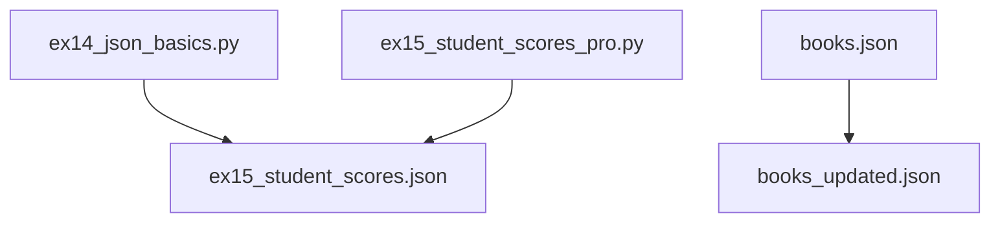
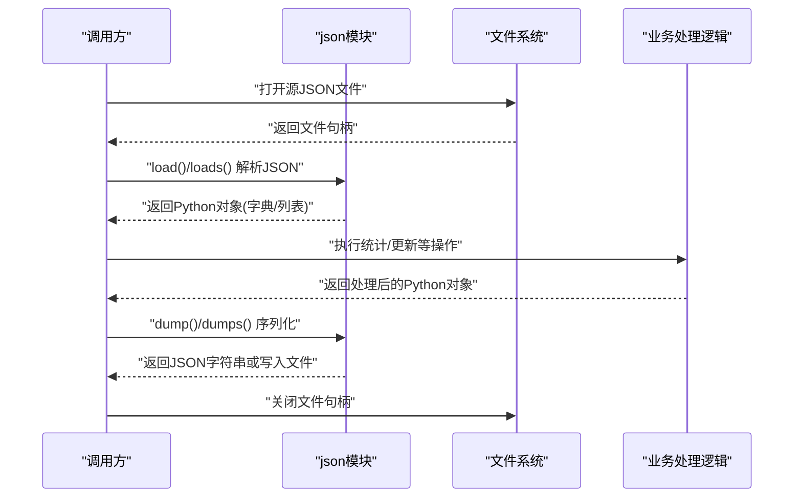
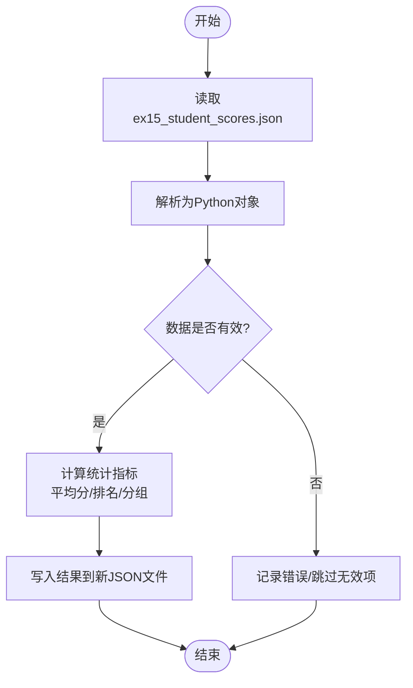
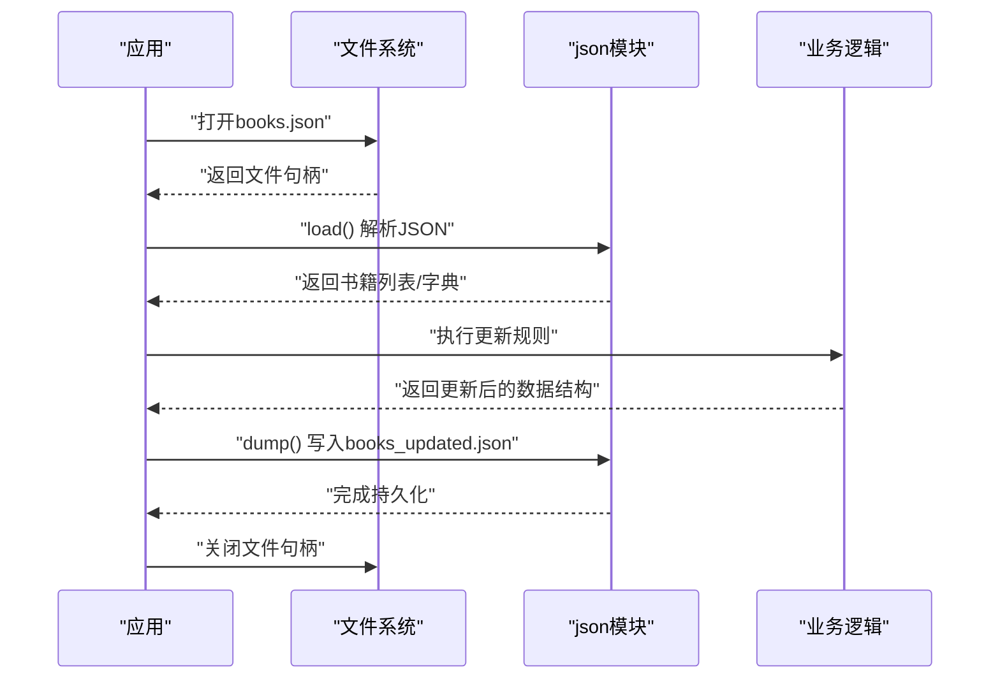
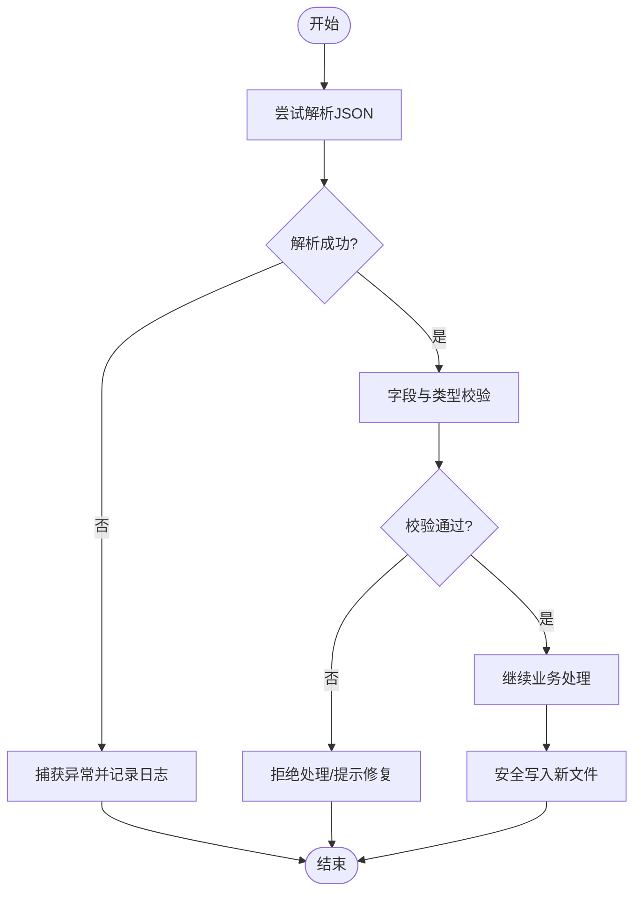
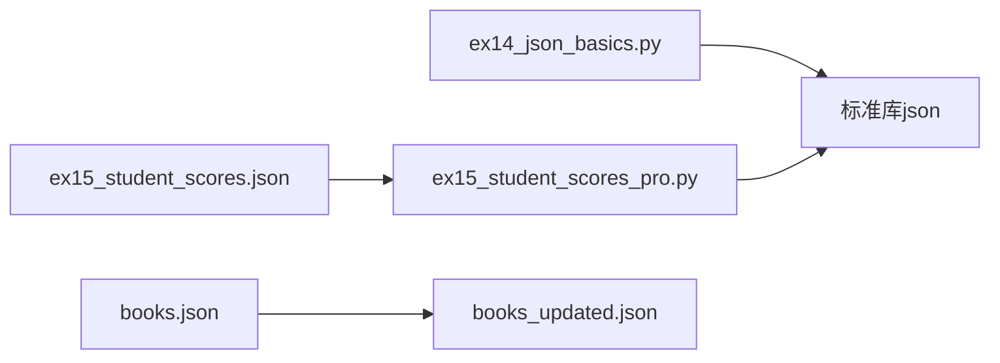

# JSON数据处理

<cite>
**本文引用的文件**   
- [ex14_json_basics.py](file://ex14_json_basics.py)
- [ex15_student_scores.json](file://ex15_student_scores.json)
- [ex15_student_scores_pro.py](file://ex15_student_scores_pro.py)
- [books.json](file://books.json)
- [books_updated.json](file://books_updated.json)
</cite>

## 目录
1. [简介](#简介)
2. [项目结构](#项目结构)
3. [核心组件](#核心组件)
4. [架构总览](#架构总览)
5. [详细组件分析](#详细组件分析)
6. [依赖关系分析](#依赖关系分析)
7. [性能考虑](#性能考虑)
8. [故障排查指南](#故障排查指南)
9. [结论](#结论)
10. [附录](#附录)

## 简介
本技术文档围绕Python标准库json模块，系统讲解JSON数据的解析与生成、类型映射、嵌套结构与数组处理、验证与错误处理，并通过“学生成绩管理”和“书籍信息管理”两个实际案例，展示从读取、修改、校验到保存的完整流程与最佳实践。读者无需深入编程背景即可理解并上手使用。

## 项目结构
本项目包含多个示例脚本与数据文件，其中与JSON处理直接相关的文件如下：
- ex14_json_basics.py：演示json模块基础用法（加载/转储、字符串与文件接口）
- ex15_student_scores.json：学生成绩原始数据（JSON文件）
- ex15_student_scores_pro.py：学生成绩处理的进阶示例（含读取、统计、写入等）
- books.json：书籍信息原始数据（JSON文件）
- books_updated.json：经处理后更新的书籍信息（JSON文件）

图表来源
- [ex14_json_basics.py](file://ex14_json_basics.py)
- [ex15_student_scores.json](file://ex15_student_scores.json)
- [ex15_student_scores_pro.py](file://ex15_student_scores_pro.py)
- [books.json](file://books.json)
- [books_updated.json](file://books_updated.json)

章节来源
- [ex14_json_basics.py](file://ex14_json_basics.py)
- [ex15_student_scores.json](file://ex15_student_scores.json)
- [ex15_student_scores_pro.py](file://ex15_student_scores_pro.py)
- [books.json](file://books.json)
- [books_updated.json](file://books_updated.json)

## 核心组件
本节聚焦json模块的核心API及其在工程中的使用方式：
- json.load()：从文件对象中解析JSON为Python对象
- json.loads()：从字符串解析JSON为Python对象
- json.dump()：将Python对象序列化为JSON并写入文件对象
- json.dumps()：将Python对象序列化为JSON字符串

典型使用要点
- 编码与缩进：通过参数控制输出格式（如缩进、排序键），便于可读性与调试
- 容错与健壮性：结合异常捕获与数据校验，确保输入合法、输出稳定
- 类型映射：遵循Python与JSON之间的双向映射规则（见后文）

章节来源
- [ex14_json_basics.py](file://ex14_json_basics.py)
- [ex15_student_scores_pro.py](file://ex15_student_scores_pro.py)

## 架构总览
下图展示了JSON处理在两个案例中的整体数据流：从源数据读取、解析为Python对象、进行业务处理（统计/更新）、再写回目标文件或字符串。

图表来源
- [ex14_json_basics.py](file://ex14_json_basics.py)
- [ex15_student_scores_pro.py](file://ex15_student_scores_pro.py)

## 详细组件分析

### 基础用法示例（ex14_json_basics.py）
该文件用于演示json模块的基础能力，包括：
- 从字符串解析JSON（对应json.loads）
- 从文件解析JSON（对应json.load）
- 将Python对象转为JSON字符串（对应json.dumps）
- 将Python对象写入JSON文件（对应json.dump）

建议关注点
- 何时选择loads/dumps与load/dump
- 格式化输出（缩进、键排序）对可读性的影响
- 常见异常场景（非法JSON、类型不匹配）及捕获策略

章节来源
- [ex14_json_basics.py](file://ex14_json_basics.py)

### 学生成绩管理（ex15_student_scores.json 与 ex15_student_scores_pro.py）
该案例以“学生成绩”为主题，展示完整的JSON处理流程：
- 读取：从ex15_student_scores.json加载成绩数据
- 处理：计算平均分、排名、分组统计等
- 输出：将结果写入新的JSON文件或打印摘要

图表来源
- [ex15_student_scores.json](file://ex15_student_scores.json)
- [ex15_student_scores_pro.py](file://ex15_student_scores_pro.py)

章节来源
- [ex15_student_scores.json](file://ex15_student_scores.json)
- [ex15_student_scores_pro.py](file://ex15_student_scores_pro.py)

### 书籍信息管理（books.json 与 books_updated.json）
该案例演示对书籍信息的批量更新与持久化：
- 读取：从books.json加载书籍清单
- 处理：根据业务规则更新字段（如价格、库存、标签等）
- 输出：将更新后的数据保存到books_updated.json

图表来源
- [books.json](file://books.json)
- [books_updated.json](file://books_updated.json)

章节来源
- [books.json](file://books.json)
- [books_updated.json](file://books_updated.json)

### Python与JSON类型映射
下表总结了Python与JSON的双向映射关系，便于在读写时正确转换：

| Python类型 | JSON类型 | 说明 |
| --- | --- | --- |
| dict | object | 键必须为字符串；值可为任意可序列化类型 |
| list/tuple | array | 元组会被转换为数组 |
| str | string | 字符串需符合UTF-8编码规范 |
| int/float | number | 整数与浮点数均映射为number |
| bool | boolean | True/False映射为true/false |
| None | null | None映射为null |
| set/frozenset | 不支持 | 需要自定义编码器或先转换为list |
| datetime/date/time | 不支持 | 需要自定义编码器或先转换为字符串 |

注意
- 当遇到不支持的类型时，可通过自定义编码器或预处理将其转换为支持类型
- 大数值或高精度小数需注意精度损失问题

章节来源
- [ex14_json_basics.py](file://ex14_json_basics.py)
- [ex15_student_scores_pro.py](file://ex15_student_scores_pro.py)

### 嵌套数据结构与数组处理
- 嵌套字典：适合表示实体属性（如学生信息、书籍元数据）
- 嵌套列表：适合表示集合与序列（如成绩列表、评论列表）
- 混合结构：字典中包含列表、列表中嵌套字典等复杂组合

处理建议
- 访问前先检查键是否存在或使用默认值
- 遍历列表时做好空值与类型校验
- 对深层嵌套采用路径式访问或封装辅助函数

章节来源
- [ex15_student_scores.json](file://ex15_student_scores.json)
- [books.json](file://books.json)

### 验证与错误处理机制
建议在JSON处理链路中加入以下保障：
- 格式校验：捕获解析异常，避免程序崩溃
- 类型校验：确保关键字段类型符合预期（如数字、字符串）
- 缺失字段处理：提供默认值或拒绝处理
- 增量更新：失败时保留原文件，避免数据丢失

图表来源
- [ex14_json_basics.py](file://ex14_json_basics.py)
- [ex15_student_scores_pro.py](file://ex15_student_scores_pro.py)

章节来源
- [ex14_json_basics.py](file://ex14_json_basics.py)
- [ex15_student_scores_pro.py](file://ex15_student_scores_pro.py)

## 依赖关系分析
JSON处理在本项目中主要依赖标准库json模块，并与文件系统交互。各示例之间相对独立，耦合度低，便于复用与扩展。

图表来源
- [ex14_json_basics.py](file://ex14_json_basics.py)
- [ex15_student_scores_pro.py](file://ex15_student_scores_pro.py)
- [ex15_student_scores.json](file://ex15_student_scores.json)
- [books.json](file://books.json)
- [books_updated.json](file://books_updated.json)

章节来源
- [ex14_json_basics.py](file://ex14_json_basics.py)
- [ex15_student_scores_pro.py](file://ex15_student_scores_pro.py)
- [ex15_student_scores.json](file://ex15_student_scores.json)
- [books.json](file://books.json)
- [books_updated.json](file://books_updated.json)

## 性能考虑
- 大数据量：优先使用迭代器与分块处理，避免一次性加载过多内存
- 序列化开销：合理设置缩进与键排序，平衡可读性与性能
- I/O优化：使用缓冲写入、减少频繁磁盘操作
- 类型转换：尽量避免在循环中进行昂贵的类型转换，提前预处理

[本节为通用指导，不涉及具体文件分析]

## 故障排查指南
常见问题与定位方法
- 解析失败：检查JSON语法是否正确（括号、逗号、引号）
- 类型不符：确认字段类型是否符合预期（如数字误写为字符串）
- 键缺失：为可选字段提供默认值或增加存在性检查
- 写入失败：检查文件权限与路径有效性，必要时回滚到备份

建议措施
- 在关键节点添加日志记录
- 对输入数据进行最小化校验后再进入业务逻辑
- 使用临时文件+原子替换策略保证写入一致性

章节来源
- [ex14_json_basics.py](file://ex14_json_basics.py)
- [ex15_student_scores_pro.py](file://ex15_student_scores_pro.py)

## 结论
通过本项目的示例与案例，我们系统掌握了json模块的核心用法、类型映射、嵌套与数组处理、以及验证与错误处理的最佳实践。在实际工程中，建议始终将“健壮性”置于首位：严格校验输入、妥善处理异常、安全持久化输出，从而构建可靠的JSON数据处理流水线。

[本节为总结性内容，不涉及具体文件分析]

## 附录
- 参考文件
  - 基础用法：[ex14_json_basics.py](file://ex14_json_basics.py)
  - 学生成绩数据：[ex15_student_scores.json](file://ex15_student_scores.json)
  - 学生成绩处理：[ex15_student_scores_pro.py](file://ex15_student_scores_pro.py)
  - 书籍数据：[books.json](file://books.json)
  - 更新后的书籍数据：[books_updated.json](file://books_updated.json)

[本节为索引性内容，不涉及具体文件分析]