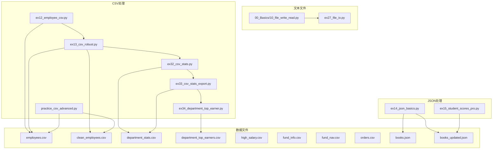
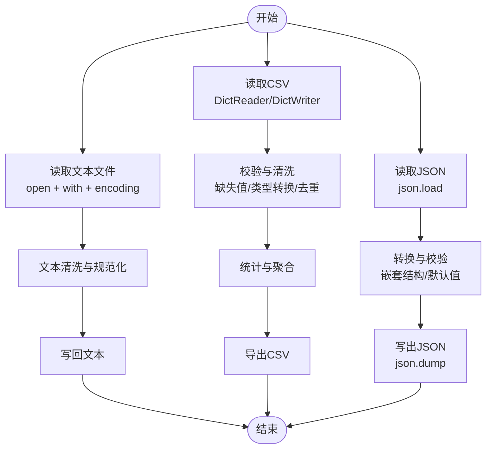
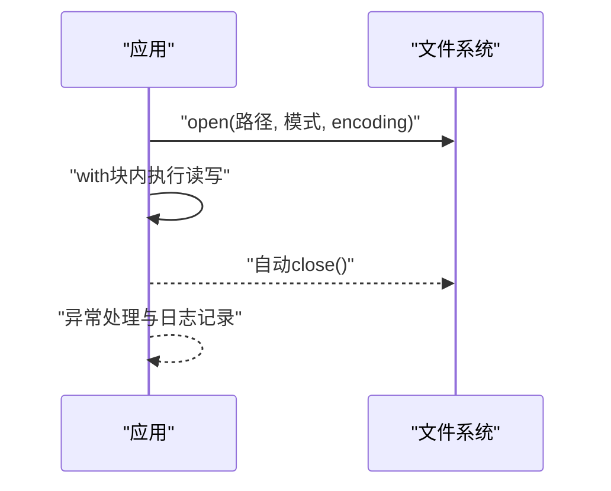
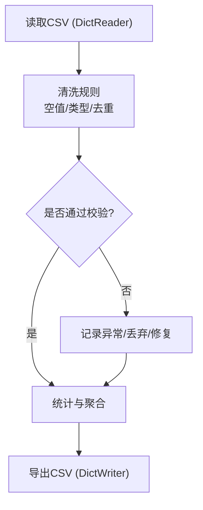
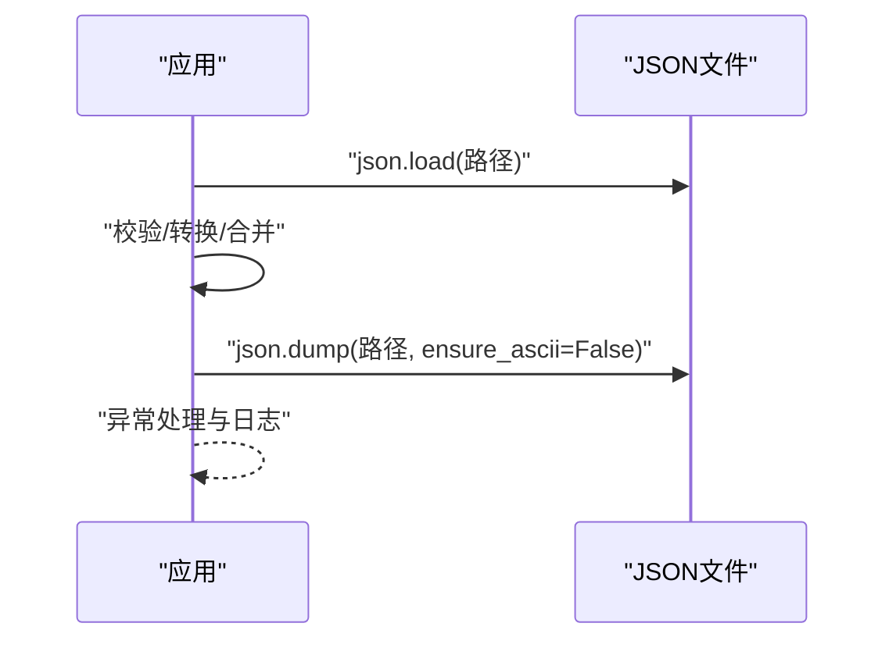
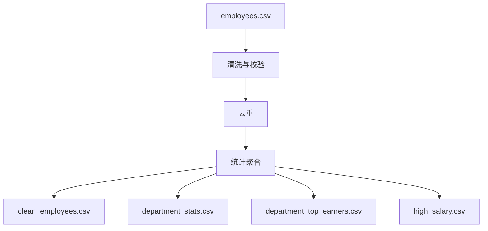
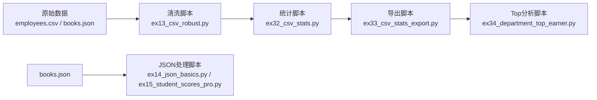

# 文件操作

<cite>
**本文引用的文件**   
- [00_Basics/10_file_write_read.py](file://00_Basics/10_file_write_read.py)
- [ex27_file_io.py](file://ex27_file_io.py)
- [ex12_employee_csv.py](file://ex12_employee_csv.py)
- [ex13_csv_robust.py](file://ex13_csv_robust.py)
- [ex32_csv_stats.py](file://ex32_csv_stats.py)
- [ex33_csv_stats_export.py](file://ex33_csv_stats_export.py)
- [ex34_department_top_earner.py](file://ex34_department_top_earner.py)
- [practice_csv_advanced.py](file://practice_csv_advanced.py)
- [ex14_json_basics.py](file://ex14_json_basics.py)
- [ex15_student_scores_pro.py](file://ex15_student_scores_pro.py)
- [books.json](file://books.json)
- [books_updated.json](file://books_updated.json)
- [employees.csv](file://employees.csv)
- [clean_employees.csv](file://clean_employees.csv)
- [department_stats.csv](file://department_stats.csv)
- [department_top_earners.csv](file://department_top_earners.csv)
- [high_salary.csv](file://high_salary.csv)
- [fund_info.csv](file://fund_info.csv)
- [fund_nav.csv](file://fund_nav.csv)
- [orders.csv](file://orders.csv)
</cite>

## 目录
1. [简介](#简介)
2. [项目结构](#项目结构)
3. [核心组件](#核心组件)
4. [架构总览](#架构总览)
5. [详细组件分析](#详细组件分析)
6. [依赖关系分析](#依赖关系分析)
7. [性能考虑](#性能考虑)
8. [故障排查指南](#故障排查指南)
9. [结论](#结论)
10. [附录](#附录)

## 简介
本技术文档围绕Python中的文件操作展开，聚焦以下目标：
- 文本文件的读写：open()模式、with语句安全使用、编码处理与常见陷阱
- CSV文件处理：csv模块用法、字段名管理、异常处理与数据清洗技巧
- JSON数据处理：json模块基础与复杂结构的解析/生成
- 最佳实践：错误处理、资源管理与性能优化
- 实战案例：从原始数据到清洗、统计与导出的完整流程

## 项目结构
仓库中包含大量与文件IO相关的示例脚本与数据文件。为便于理解，将相关代码按主题分组：
- 文本文件读写：基础读写、上下文管理器、编码处理
- CSV处理：读取、清洗、统计、导出
- JSON处理：基础读写、复杂结构处理
- 综合案例：多步骤数据处理流水线

图表来源
- [00_Basics/10_file_write_read.py:1-200](file://00_Basics/10_file_write_read.py#L1-L200)
- [ex27_file_io.py:1-200](file://ex27_file_io.py#L1-L200)
- [ex12_employee_csv.py:1-200](file://ex12_employee_csv.py#L1-L200)
- [ex13_csv_robust.py:1-200](file://ex13_csv_robust.py#L1-L200)
- [ex32_csv_stats.py:1-200](file://ex32_csv_stats.py#L1-L200)
- [ex33_csv_stats_export.py:1-200](file://ex33_csv_stats_export.py#L1-L200)
- [ex34_department_top_earner.py:1-200](file://ex34_department_top_earner.py#L1-L200)
- [practice_csv_advanced.py:1-200](file://practice_csv_advanced.py#L1-L200)
- [ex14_json_basics.py:1-200](file://ex14_json_basics.py#L1-L200)
- [ex15_student_scores_pro.py:1-200](file://ex15_student_scores_pro.py#L1-L200)
- [employees.csv:1-200](file://employees.csv#L1-L200)
- [clean_employees.csv:1-200](file://clean_employees.csv#L1-L200)
- [department_stats.csv:1-200](file://department_stats.csv#L1-L200)
- [department_top_earners.csv:1-200](file://department_top_earners.csv#L1-L200)
- [high_salary.csv:1-200](file://high_salary.csv#L1-L200)
- [fund_info.csv:1-200](file://fund_info.csv#L1-L200)
- [fund_nav.csv:1-200](file://fund_nav.csv#L1-L200)
- [orders.csv:1-200](file://orders.csv#L1-L200)
- [books.json:1-200](file://books.json#L1-L200)
- [books_updated.json:1-200](file://books_updated.json#L1-L200)

章节来源
- [00_Basics/10_file_write_read.py:1-200](file://00_Basics/10_file_write_read.py#L1-L200)
- [ex27_file_io.py:1-200](file://ex27_file_io.py#L1-L200)
- [ex12_employee_csv.py:1-200](file://ex12_employee_csv.py#L1-L200)
- [ex13_csv_robust.py:1-200](file://ex13_csv_robust.py#L1-L200)
- [ex32_csv_stats.py:1-200](file://ex32_csv_stats.py#L1-L200)
- [ex33_csv_stats_export.py:1-200](file://ex33_csv_stats_export.py#L1-L200)
- [ex34_department_top_earner.py:1-200](file://ex34_department_top_earner.py#L1-L200)
- [practice_csv_advanced.py:1-200](file://practice_csv_advanced.py#L1-L200)
- [ex14_json_basics.py:1-200](file://ex14_json_basics.py#L1-L200)
- [ex15_student_scores_pro.py:1-200](file://ex15_student_scores_pro.py#L1-L200)
- [employees.csv:1-200](file://employees.csv#L1-L200)
- [clean_employees.csv:1-200](file://clean_employees.csv#L1-L200)
- [department_stats.csv:1-200](file://department_stats.csv#L1-L200)
- [department_top_earners.csv:1-200](file://department_top_earners.csv#L1-L200)
- [high_salary.csv:1-200](file://high_salary.csv#L1-L200)
- [fund_info.csv:1-200](file://fund_info.csv#L1-L200)
- [fund_nav.csv:1-200](file://fund_nav.csv#L1-L200)
- [orders.csv:1-200](file://orders.csv#L1-L200)
- [books.json:1-200](file://books.json#L1-L200)
- [books_updated.json:1-200](file://books_updated.json#L1-L200)

## 核心组件
- 文本文件读写
  - open()常用模式：只读、写入、追加、二进制等；结合encoding参数确保跨平台一致性
  - with语句：自动关闭文件句柄，避免资源泄露
  - 编码处理：UTF-8优先，必要时显式指定；处理BOM与换行符差异
- CSV处理
  - csv.DictReader/DictWriter：以字典形式访问列，简化字段名管理
  - 健壮性：跳过空行、处理缺失值、类型转换、去重与规范化
  - 统计与导出：聚合计算、排序筛选、结果导出
- JSON处理
  - json.load/dump：序列化/反序列化的基础API
  - 复杂结构：嵌套对象、列表、日期时间格式化、自定义编码器
  - 容错：断言键存在、默认值回退、增量更新与校验

章节来源
- [00_Basics/10_file_write_read.py:1-200](file://00_Basics/10_file_write_read.py#L1-L200)
- [ex27_file_io.py:1-200](file://ex27_file_io.py#L1-L200)
- [ex12_employee_csv.py:1-200](file://ex12_employee_csv.py#L1-L200)
- [ex13_csv_robust.py:1-200](file://ex13_csv_robust.py#L1-L200)
- [ex32_csv_stats.py:1-200](file://ex32_csv_stats.py#L1-L200)
- [ex33_csv_stats_export.py:1-200](file://ex33_csv_stats_export.py#L1-L200)
- [ex34_department_top_earner.py:1-200](file://ex34_department_top_earner.py#L1-L200)
- [practice_csv_advanced.py:1-200](file://practice_csv_advanced.py#L1-L200)
- [ex14_json_basics.py:1-200](file://ex14_json_basics.py#L1-L200)
- [ex15_student_scores_pro.py:1-200](file://ex15_student_scores_pro.py#L1-L200)

## 架构总览
下图展示了从原始数据到最终产物的端到端流程，涵盖文本、CSV与JSON三类数据的典型处理路径。

图表来源
- [00_Basics/10_file_write_read.py:1-200](file://00_Basics/10_file_write_read.py#L1-L200)
- [ex27_file_io.py:1-200](file://ex27_file_io.py#L1-L200)
- [ex12_employee_csv.py:1-200](file://ex12_employee_csv.py#L1-L200)
- [ex13_csv_robust.py:1-200](file://ex13_csv_robust.py#L1-L200)
- [ex32_csv_stats.py:1-200](file://ex32_csv_stats.py#L1-L200)
- [ex33_csv_stats_export.py:1-200](file://ex33_csv_stats_export.py#L1-L200)
- [ex34_department_top_earner.py:1-200](file://ex34_department_top_earner.py#L1-L200)
- [practice_csv_advanced.py:1-200](file://practice_csv_advanced.py#L1-L200)
- [ex14_json_basics.py:1-200](file://ex14_json_basics.py#L1-L200)
- [ex15_student_scores_pro.py:1-200](file://ex15_student_scores_pro.py#L1-L200)

## 详细组件分析

### 文本文件读写（open与with）
- 关键要点
  - 使用with语句确保文件在异常或正常退出时均被正确关闭
  - 明确指定encoding（推荐UTF-8），避免平台差异导致的乱码
  - 根据场景选择模式：r/w/a/b等；大文件建议逐行迭代而非一次性加载
- 典型流程
  - 打开文件 → 读取/写入 → 异常捕获 → 自动关闭
- 常见问题
  - 未指定编码导致中文乱码
  - 忘记关闭文件造成资源泄露
  - 大文件内存占用过高

图表来源
- [00_Basics/10_file_write_read.py:1-200](file://00_Basics/10_file_write_read.py#L1-L200)
- [ex27_file_io.py:1-200](file://ex27_file_io.py#L1-L200)

章节来源
- [00_Basics/10_file_write_read.py:1-200](file://00_Basics/10_file_write_read.py#L1-L200)
- [ex27_file_io.py:1-200](file://ex27_file_io.py#L1-L200)

### CSV处理（csv模块、字段名、异常与清洗）
- 关键要点
  - 使用DictReader/DictWriter以字段名为键，提升可读性与可维护性
  - 对缺失值进行填充或过滤；数值型字段需做类型转换与边界检查
  - 去重策略：基于主键或组合键；保留最新或最高优先级记录
  - 统计指标：分组聚合、Top-N、阈值筛选
- 典型流程
  - 读取CSV → 清洗与校验 → 统计与聚合 → 导出结果
- 示例数据
  - employees.csv、clean_employees.csv用于员工数据清洗对比
  - department_stats.csv、department_top_earners.csv用于部门统计与Top薪资导出
  - high_salary.csv、orders.csv、fund_info.csv、fund_nav.csv用于不同业务场景的CSV处理

图表来源
- [ex12_employee_csv.py:1-200](file://ex12_employee_csv.py#L1-L200)
- [ex13_csv_robust.py:1-200](file://ex13_csv_robust.py#L1-L200)
- [ex32_csv_stats.py:1-200](file://ex32_csv_stats.py#L1-L200)
- [ex33_csv_stats_export.py:1-200](file://ex33_csv_stats_export.py#L1-L200)
- [ex34_department_top_earner.py:1-200](file://ex34_department_top_earner.py#L1-L200)
- [practice_csv_advanced.py:1-200](file://practice_csv_advanced.py#L1-L200)
- [employees.csv:1-200](file://employees.csv#L1-L200)
- [clean_employees.csv:1-200](file://clean_employees.csv#L1-L200)
- [department_stats.csv:1-200](file://department_stats.csv#L1-L200)
- [department_top_earners.csv:1-200](file://department_top_earners.csv#L1-L200)
- [high_salary.csv:1-200](file://high_salary.csv#L1-L200)
- [orders.csv:1-200](file://orders.csv#L1-L200)
- [fund_info.csv:1-200](file://fund_info.csv#L1-L200)
- [fund_nav.csv:1-200](file://fund_nav.csv#L1-L200)

章节来源
- [ex12_employee_csv.py:1-200](file://ex12_employee_csv.py#L1-L200)
- [ex13_csv_robust.py:1-200](file://ex13_csv_robust.py#L1-L200)
- [ex32_csv_stats.py:1-200](file://ex32_csv_stats.py#L1-L200)
- [ex33_csv_stats_export.py:1-200](file://ex33_csv_stats_export.py#L1-L200)
- [ex34_department_top_earner.py:1-200](file://ex34_department_top_earner.py#L1-L200)
- [practice_csv_advanced.py:1-200](file://practice_csv_advanced.py#L1-L200)
- [employees.csv:1-200](file://employees.csv#L1-L200)
- [clean_employees.csv:1-200](file://clean_employees.csv#L1-L200)
- [department_stats.csv:1-200](file://department_stats.csv#L1-L200)
- [department_top_earners.csv:1-200](file://department_top_earners.csv#L1-L200)
- [high_salary.csv:1-200](file://high_salary.csv#L1-L200)
- [orders.csv:1-200](file://orders.csv#L1-L200)
- [fund_info.csv:1-200](file://fund_info.csv#L1-L200)
- [fund_nav.csv:1-200](file://fund_nav.csv#L1-L200)

### JSON数据处理（json模块与复杂结构）
- 关键要点
  - 使用json.load/dump进行序列化与反序列化
  - 复杂结构：嵌套对象、列表、枚举映射、日期时间格式化处理
  - 健壮性：键存在性检查、默认值回退、增量更新与版本兼容
- 典型流程
  - 读取JSON → 校验与转换 → 写出JSON
- 示例数据
  - books.json、books_updated.json用于图书信息的基础与进阶处理

图表来源
- [ex14_json_basics.py:1-200](file://ex14_json_basics.py#L1-L200)
- [ex15_student_scores_pro.py:1-200](file://ex15_student_scores_pro.py#L1-L200)
- [books.json:1-200](file://books.json#L1-L200)
- [books_updated.json:1-200](file://books_updated.json#L1-L200)

章节来源
- [ex14_json_basics.py:1-200](file://ex14_json_basics.py#L1-L200)
- [ex15_student_scores_pro.py:1-200](file://ex15_student_scores_pro.py#L1-L200)
- [books.json:1-200](file://books.json#L1-L200)
- [books_updated.json:1-200](file://books_updated.json#L1-L200)

### 实战案例：员工数据清洗与统计导出
- 输入：employees.csv（可能包含缺失值、重复项、不一致格式）
- 处理：
  - 清洗：去除空白、统一大小写、缺失值填充、类型转换
  - 去重：基于工号或姓名+部门组合键
  - 统计：部门人数、平均薪资、Top薪资员工
- 输出：
  - clean_employees.csv（清洗后数据）
  - department_stats.csv（部门统计）
  - department_top_earners.csv（部门Top薪资）
  - high_salary.csv（高薪资名单）

图表来源
- [ex12_employee_csv.py:1-200](file://ex12_employee_csv.py#L1-L200)
- [ex13_csv_robust.py:1-200](file://ex13_csv_robust.py#L1-L200)
- [ex32_csv_stats.py:1-200](file://ex32_csv_stats.py#L1-L200)
- [ex33_csv_stats_export.py:1-200](file://ex33_csv_stats_export.py#L1-L200)
- [ex34_department_top_earner.py:1-200](file://ex34_department_top_earner.py#L1-L200)
- [employees.csv:1-200](file://employees.csv#L1-L200)
- [clean_employees.csv:1-200](file://clean_employees.csv#L1-L200)
- [department_stats.csv:1-200](file://department_stats.csv#L1-L200)
- [department_top_earners.csv:1-200](file://department_top_earners.csv#L1-L200)
- [high_salary.csv:1-200](file://high_salary.csv#L1-L200)

章节来源
- [ex12_employee_csv.py:1-200](file://ex12_employee_csv.py#L1-L200)
- [ex13_csv_robust.py:1-200](file://ex13_csv_robust.py#L1-L200)
- [ex32_csv_stats.py:1-200](file://ex32_csv_stats.py#L1-L200)
- [ex33_csv_stats_export.py:1-200](file://ex33_csv_stats_export.py#L1-L200)
- [ex34_department_top_earner.py:1-200](file://ex34_department_top_earner.py#L1-L200)
- [employees.csv:1-200](file://employees.csv#L1-L200)
- [clean_employees.csv:1-200](file://clean_employees.csv#L1-L200)
- [department_stats.csv:1-200](file://department_stats.csv#L1-L200)
- [department_top_earners.csv:1-200](file://department_top_earners.csv#L1-L200)
- [high_salary.csv:1-200](file://high_salary.csv#L1-L200)

## 依赖关系分析
- 内部依赖
  - CSV处理脚本之间形成“清洗→统计→导出”的链式依赖
  - JSON处理脚本独立，但可与CSV结果联合分析
- 外部依赖
  - 标准库：os、sys、csv、json、pathlib等
  - 可选第三方库：pandas（仓库中存在pandas示例，可作为扩展能力）

图表来源
- [ex13_csv_robust.py:1-200](file://ex13_csv_robust.py#L1-L200)
- [ex32_csv_stats.py:1-200](file://ex32_csv_stats.py#L1-L200)
- [ex33_csv_stats_export.py:1-200](file://ex33_csv_stats_export.py#L1-L200)
- [ex34_department_top_earner.py:1-200](file://ex34_department_top_earner.py#L1-L200)
- [ex14_json_basics.py:1-200](file://ex14_json_basics.py#L1-L200)
- [ex15_student_scores_pro.py:1-200](file://ex15_student_scores_pro.py#L1-L200)
- [employees.csv:1-200](file://employees.csv#L1-L200)
- [books.json:1-200](file://books.json#L1-L200)

章节来源
- [ex13_csv_robust.py:1-200](file://ex13_csv_robust.py#L1-L200)
- [ex32_csv_stats.py:1-200](file://ex32_csv_stats.py#L1-L200)
- [ex33_csv_stats_export.py:1-200](file://ex33_csv_stats_export.py#L1-L200)
- [ex34_department_top_earner.py:1-200](file://ex34_department_top_earner.py#L1-L200)
- [ex14_json_basics.py:1-200](file://ex14_json_basics.py#L1-L200)
- [ex15_student_scores_pro.py:1-200](file://ex15_student_scores_pro.py#L1-L200)
- [employees.csv:1-200](file://employees.csv#L1-L200)
- [books.json:1-200](file://books.json#L1-L200)

## 性能考虑
- 文本与CSV
  - 大文件逐行迭代，避免一次性加载到内存
  - 使用缓冲I/O与合适的缓冲区大小
  - 减少不必要的字符串拼接，采用生成器与流式处理
- JSON
  - 合理设置indent与ensure_ascii，平衡可读性与体积
  - 对大型JSON分块处理或使用ijson等流式解析库（可扩展）
- 通用优化
  - 批量写入与事务式提交（如适用）
  - 缓存中间结果，避免重复计算
  - 使用pathlib统一管理路径，减少路径拼接开销

[本节为通用指导，不直接分析具体文件]

## 故障排查指南
- 常见错误
  - UnicodeDecodeError：编码不一致或未指定encoding
  - FileNotFoundError/PermissionError：路径错误或权限不足
  - csv.Error：字段数不匹配、引号/转义问题
  - json.JSONDecodeError：格式不正确或截断
- 定位方法
  - 打印文件头几行与行数，确认格式
  - 记录异常堆栈与上下文信息（路径、行号、字段名）
  - 对脏数据进行抽样验证与最小复现
- 恢复策略
  - 提供默认值与回退逻辑
  - 跳过坏行并记录日志，保证整体流程继续
  - 生成错误报告供人工复核

章节来源
- [ex13_csv_robust.py:1-200](file://ex13_csv_robust.py#L1-L200)
- [ex14_json_basics.py:1-200](file://ex14_json_basics.py#L1-L200)
- [ex15_student_scores_pro.py:1-200](file://ex15_student_scores_pro.py#L1-L200)

## 结论
- 文本文件读写应始终使用with与明确的encoding
- CSV处理强调健壮性与可追溯性：清洗、校验、统计、导出形成闭环
- JSON处理需关注结构与兼容性：默认值、增量更新、版本演进
- 通过实际案例串联全流程，有助于快速落地与复用

[本节为总结，不直接分析具体文件]

## 附录
- 参考数据文件
  - CSV：employees.csv、clean_employees.csv、department_stats.csv、department_top_earners.csv、high_salary.csv、orders.csv、fund_info.csv、fund_nav.csv
  - JSON：books.json、books_updated.json
- 相关脚本
  - 文本：00_Basics/10_file_write_read.py、ex27_file_io.py
  - CSV：ex12_employee_csv.py、ex13_csv_robust.py、ex32_csv_stats.py、ex33_csv_stats_export.py、ex34_department_top_earner.py、practice_csv_advanced.py
  - JSON：ex14_json_basics.py、ex15_student_scores_pro.py

章节来源
- [00_Basics/10_file_write_read.py:1-200](file://00_Basics/10_file_write_read.py#L1-L200)
- [ex27_file_io.py:1-200](file://ex27_file_io.py#L1-L200)
- [ex12_employee_csv.py:1-200](file://ex12_employee_csv.py#L1-L200)
- [ex13_csv_robust.py:1-200](file://ex13_csv_robust.py#L1-L200)
- [ex32_csv_stats.py:1-200](file://ex32_csv_stats.py#L1-L200)
- [ex33_csv_stats_export.py:1-200](file://ex33_csv_stats_export.py#L1-L200)
- [ex34_department_top_earner.py:1-200](file://ex34_department_top_earner.py#L1-L200)
- [practice_csv_advanced.py:1-200](file://practice_csv_advanced.py#L1-L200)
- [ex14_json_basics.py:1-200](file://ex14_json_basics.py#L1-L200)
- [ex15_student_scores_pro.py:1-200](file://ex15_student_scores_pro.py#L1-L200)
- [employees.csv:1-200](file://employees.csv#L1-L200)
- [clean_employees.csv:1-200](file://clean_employees.csv#L1-L200)
- [department_stats.csv:1-200](file://department_stats.csv#L1-L200)
- [department_top_earners.csv:1-200](file://department_top_earners.csv#L1-L200)
- [high_salary.csv:1-200](file://high_salary.csv#L1-L200)
- [orders.csv:1-200](file://orders.csv#L1-L200)
- [fund_info.csv:1-200](file://fund_info.csv#L1-L200)
- [fund_nav.csv:1-200](file://fund_nav.csv#L1-L200)
- [books.json:1-200](file://books.json#L1-L200)
- [books_updated.json:1-200](file://books_updated.json#L1-L200)