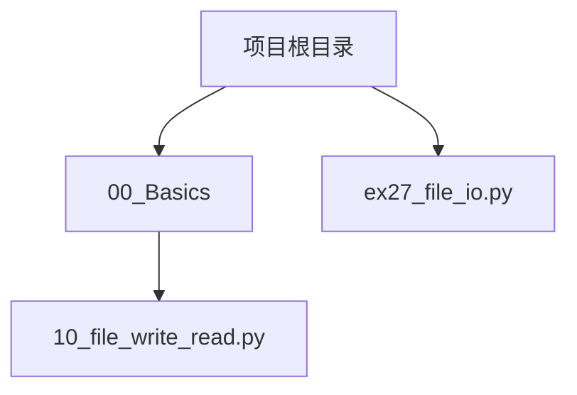
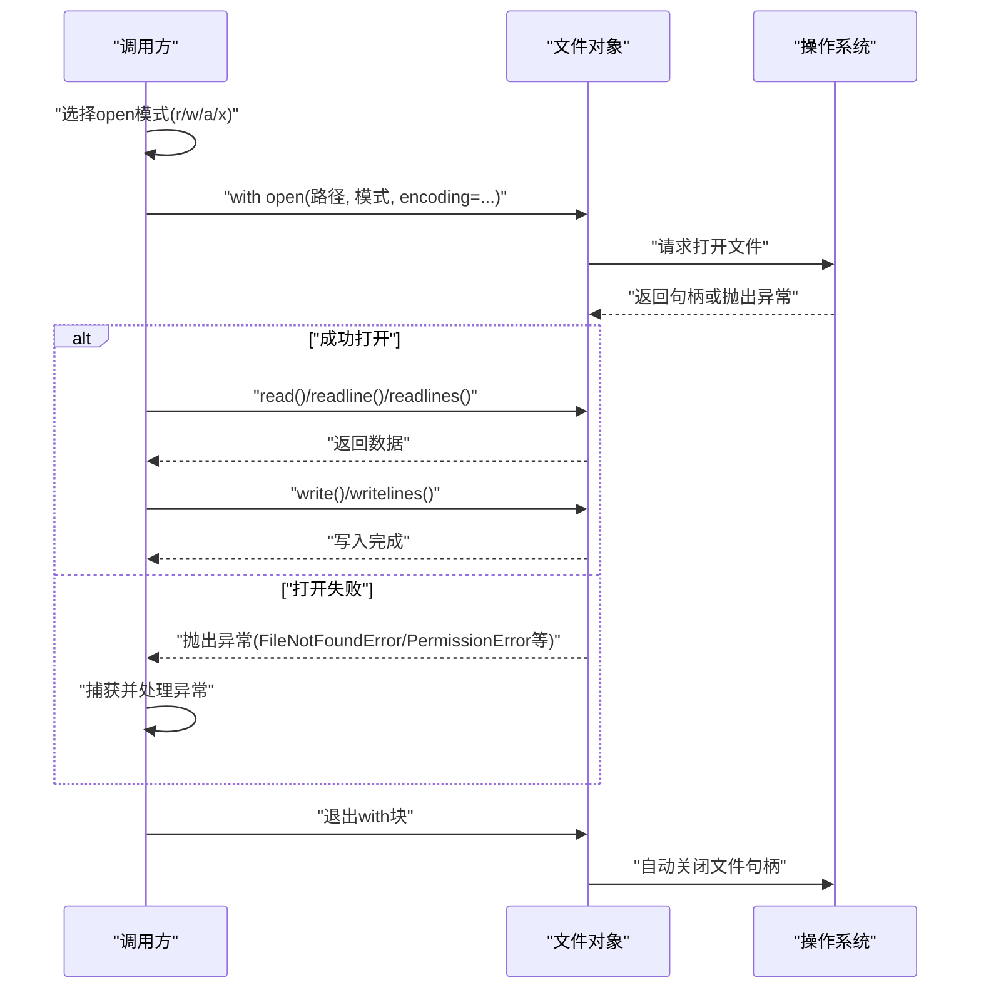
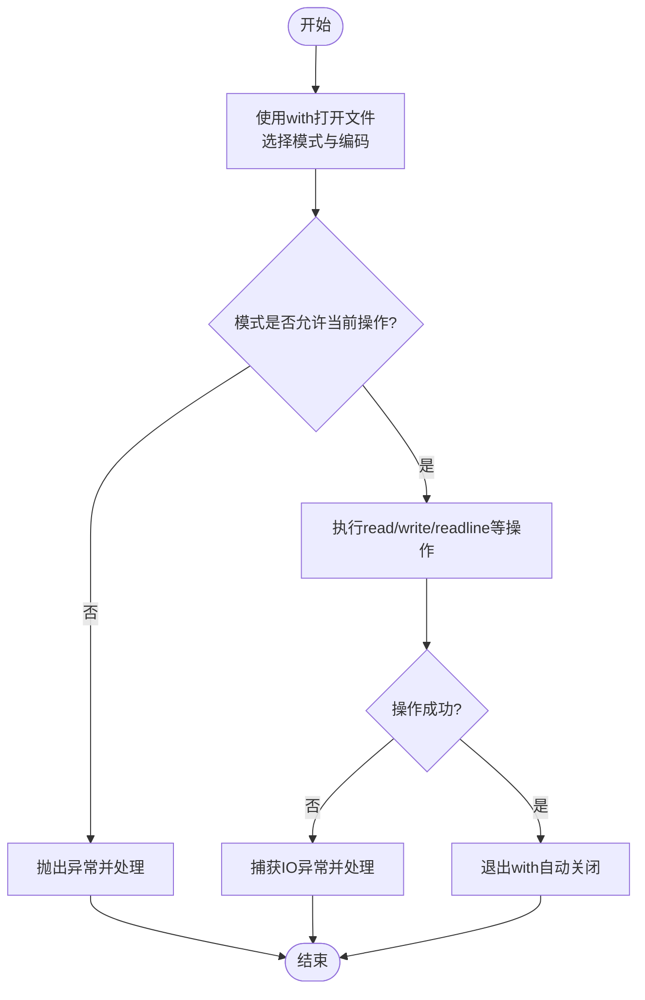
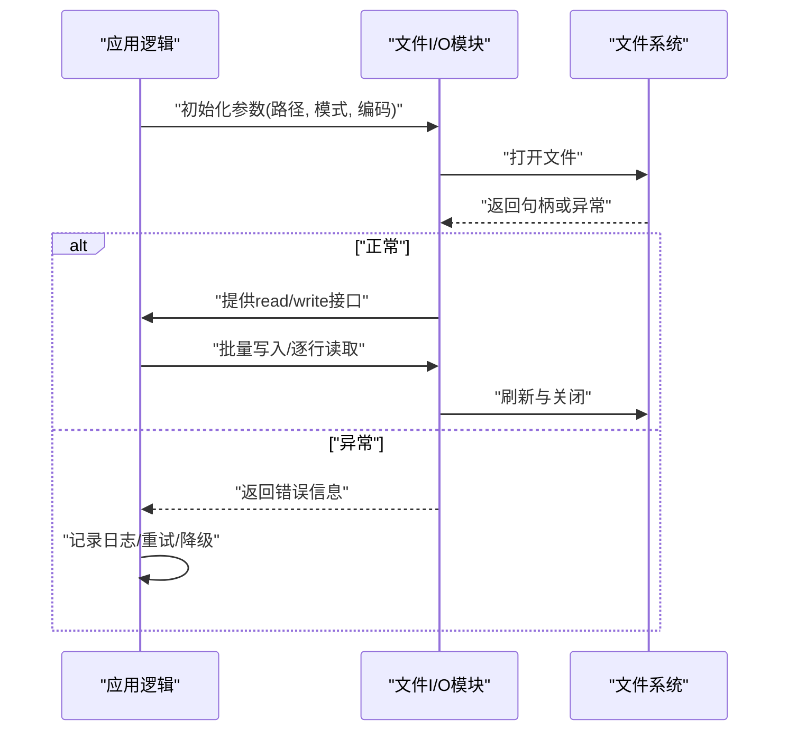
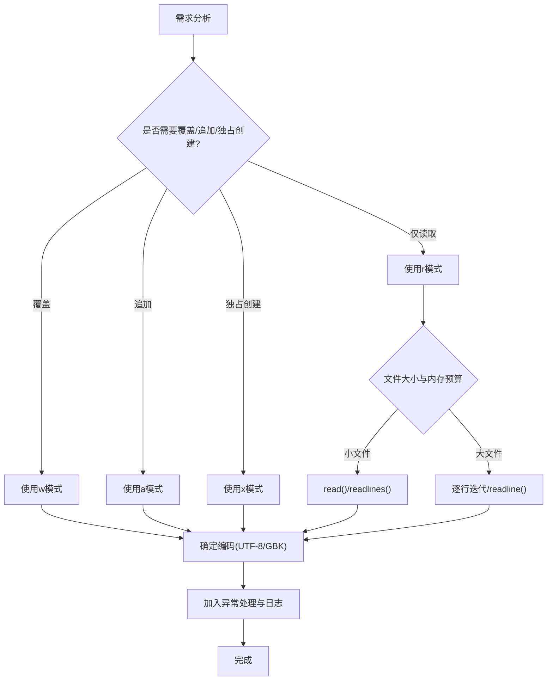
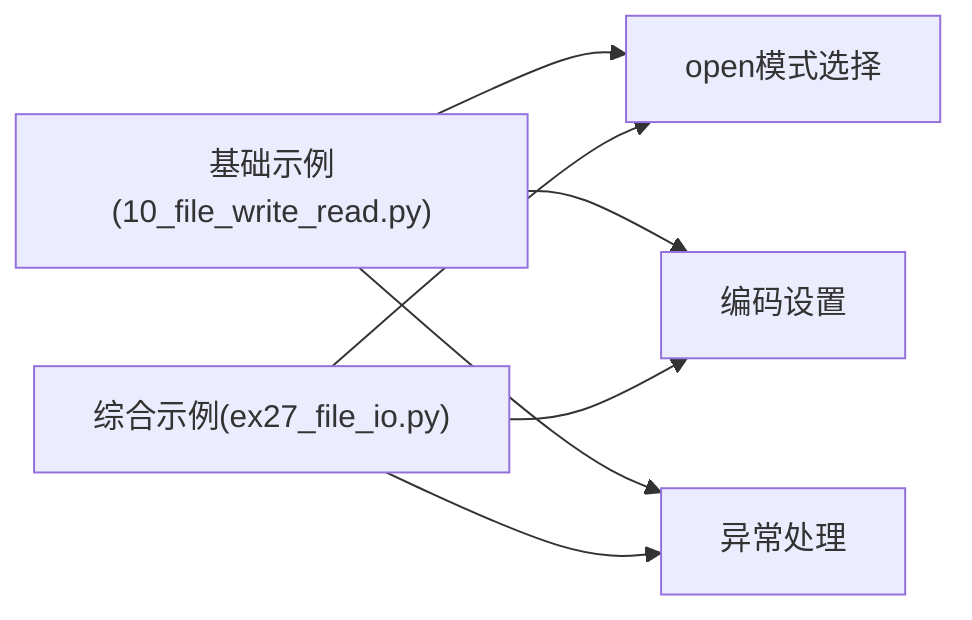

# 文本文件操作

<cite>
**本文引用的文件**   
- [00_Basics/10_file_write_read.py](file://00_Basics/10_file_write_read.py)
- [ex27_file_io.py](file://ex27_file_io.py)
</cite>

## 目录
1. [简介](#简介)
2. [项目结构](#项目结构)
3. [核心组件](#核心组件)
4. [架构总览](#架构总览)
5. [详细组件分析](#详细组件分析)
6. [依赖关系分析](#依赖关系分析)
7. [性能考虑](#性能考虑)
8. [故障排查指南](#故障排查指南)
9. [结论](#结论)
10. [附录](#附录)

## 简介
本技术文档聚焦于Python中“文本文件操作”的完整实践与最佳实践，围绕以下目标展开：
- open()函数的模式（r、w、a、x等）及其适用场景
- with语句的安全资源管理机制
- 文件编码处理（UTF-8、GBK等）的读写方法
- 读取方法对比（read()、readline()、readlines()）与写入方法选择
- 完整的错误处理机制（如FileNotFoundError、PermissionError等）
- 通过实际示例展示完整流程与大文件处理的性能优化技巧

## 项目结构
本项目包含多个与文件I/O相关的示例脚本。其中与本主题直接相关的关键文件如下：
- 基础读写示例：位于00_Basics/10_file_write_read.py
- 综合文件I/O示例：位于ex27_file_io.py

图表来源
- [00_Basics/10_file_write_read.py](file://00_Basics/10_file_write_read.py)
- [ex27_file_io.py](file://ex27_file_io.py)

章节来源
- [00_Basics/10_file_write_read.py](file://00_Basics/10_file_write_read.py)
- [ex27_file_io.py](file://ex27_file_io.py)

## 核心组件
本节从“模式选择”、“安全上下文管理”、“编码处理”、“读取/写入方法”和“异常处理”五个维度梳理核心要点，并结合仓库中的示例进行说明。

- open()模式与使用场景
  - r：只读文本模式，适用于读取已有文本文件
  - w：覆盖写模式，若文件不存在则创建；存在则清空后写入
  - a：追加写模式，在文件末尾追加内容
  - x：独占创建模式，仅当文件不存在时创建并写入，已存在则报错
  - 组合模式：如rb、wb、ab、rt、wt、at等，用于二进制或显式文本模式
  - 参考示例路径：[00_Basics/10_file_write_read.py](file://00_Basics/10_file_write_read.py)、[ex27_file_io.py](file://ex27_file_io.py)

- with语句的安全资源管理
  - 自动关闭文件句柄，避免忘记close导致的资源泄漏
  - 即使发生异常也能确保释放资源
  - 推荐在所有文件操作中优先使用with
  - 参考示例路径：[00_Basics/10_file_write_read.py](file://00_Basics/10_file_write_read.py)、[ex27_file_io.py](file://ex27_file_io.py)

- 文件编码处理
  - UTF-8：跨平台通用，推荐默认使用
  - GBK：Windows中文环境常见，需显式指定encoding="gbk"
  - 读写两端必须一致，否则出现乱码或解码错误
  - 参考示例路径：[00_Basics/10_file_write_read.py](file://00_Basics/10_file_write_read.py)、[ex27_file_io.py](file://ex27_file_io.py)

- 读取方法对比
  - read()：一次性读取全部内容，适合小文件
  - readline()：逐行读取，适合流式处理
  - readlines()：读取所有行到列表，便于索引访问但占用内存较大
  - 迭代文件对象：按行遍历，内存友好，适合大文件
  - 参考示例路径：[00_Basics/10_file_write_read.py](file://00_Basics/10_file_write_read.py)、[ex27_file_io.py](file://ex27_file_io.py)

- 写入方法对比
  - write()：写入字符串，需要自行控制换行符
  - writelines()：批量写入可迭代项，不自动添加换行符
  - 建议结合with与合适的模式（w/a/x）使用
  - 参考示例路径：[00_Basics/10_file_write_read.py](file://00_Basics/10_file_write_read.py)、[ex27_file_io.py](file://ex27_file_io.py)

- 错误处理机制
  - FileNotFoundError：打开不存在的文件（r模式）
  - PermissionError：权限不足导致无法读写
  - UnicodeDecodeError/UnicodeEncodeError：编码不一致
  - IsADirectoryError：对目录执行文件操作
  - 建议使用try/except捕获并给出明确提示
  - 参考示例路径：[00_Basics/10_file_write_read.py](file://00_Basics/10_file_write_read.py)、[ex27_file_io.py](file://ex27_file_io.py)

章节来源
- [00_Basics/10_file_write_read.py](file://00_Basics/10_file_write_read.py)
- [ex27_file_io.py](file://ex27_file_io.py)

## 架构总览
下图展示了典型文本文件操作的调用序列，涵盖打开、读写、异常处理与资源释放。

图表来源
- [00_Basics/10_file_write_read.py](file://00_Basics/10_file_write_read.py)
- [ex27_file_io.py](file://ex27_file_io.py)

## 详细组件分析

### 组件A：基础读写流程（00_Basics/10_file_write_read.py）
该示例演示了基本的文本文件读写流程，包括：
- 使用with语句打开文件
- 选择合适的open模式
- 使用write()与read()等方法进行读写
- 处理可能的异常（如文件不存在、权限问题）

图表来源
- [00_Basics/10_file_write_read.py](file://00_Basics/10_file_write_read.py)

章节来源
- [00_Basics/10_file_write_read.py](file://00_Basics/10_file_write_read.py)

### 组件B：综合文件I/O示例（ex27_file_io.py）
该示例进一步扩展了文件I/O能力，可能包含：
- 多种模式的切换与对比
- 不同编码的读写（UTF-8、GBK）
- 更完善的异常处理策略
- 针对大文件的分块读取与流式处理思路

图表来源
- [ex27_file_io.py](file://ex27_file_io.py)

章节来源
- [ex27_file_io.py](file://ex27_file_io.py)

### 概念性总览
下图为概念性流程图，帮助理解在不同场景下如何选择open模式与读取方法。

[此图为概念性流程，无需图表来源]

## 依赖关系分析
- 模块内聚性
  - 基础示例与综合示例各自独立，职责清晰
- 外部依赖
  - 主要依赖Python标准库的文件I/O能力
- 耦合点
  - 模式选择与编码设置贯穿整个流程
  - 异常处理在各处保持一致的策略

图表来源
- [00_Basics/10_file_write_read.py](file://00_Basics/10_file_write_read.py)
- [ex27_file_io.py](file://ex27_file_io.py)

章节来源
- [00_Basics/10_file_write_read.py](file://00_Basics/10_file_write_read.py)
- [ex27_file_io.py](file://ex27_file_io.py)

## 性能考虑
- 大文件处理
  - 优先使用逐行迭代或readline()，避免一次性加载全部数据
  - 必要时采用分块读取（例如固定字节数），减少内存峰值
- I/O缓冲
  - Python默认提供缓冲，通常无需手动调整
  - 对于高频小写入，适当合并写入可减少系统调用次数
- 编码转换
  - 统一使用UTF-8以减少跨平台差异
  - 遇到GBK等本地编码时，显式指定encoding并做健壮性校验
- 并发与锁
  - 多进程/多线程写入同一文件时需加锁，避免交错写入

[本节为通用指导，无需章节来源]

## 故障排查指南
- 常见问题与定位
  - 文件不存在：检查路径与文件名大小写，确认文件是否存在
  - 权限不足：检查用户权限与文件属性，尝试以管理员运行
  - 编码错误：核对源文件编码与代码中encoding参数是否一致
  - 目录误用：确认路径指向的是文件而非目录
- 建议的异常处理策略
  - 捕获具体异常类型，打印清晰的错误信息与上下文
  - 对关键路径增加重试与回退逻辑
  - 记录日志以便后续审计与排障

章节来源
- [00_Basics/10_file_write_read.py](file://00_Basics/10_file_write_read.py)
- [ex27_file_io.py](file://ex27_file_io.py)

## 结论
- 始终使用with语句管理文件资源，确保异常安全与资源释放
- 根据业务需求选择合适的open模式，避免误用覆盖或追加
- 统一编码策略，优先UTF-8，必要时显式指定GBK等本地编码
- 读取方法按文件大小与内存预算选择，大文件优先流式处理
- 建立一致的异常处理与日志记录机制，提升可维护性与可观测性

[本节为总结性内容，无需章节来源]

## 附录
- 快速对照表
  - 模式：r（只读）、w（覆盖写）、a（追加写）、x（独占创建）
  - 读取：read()、readline()、readlines()、逐行迭代
  - 写入：write()、writelines()
  - 编码：UTF-8（推荐）、GBK（Windows中文环境）
  - 异常：FileNotFoundError、PermissionError、UnicodeDecodeError、IsADirectoryError

[本节为补充信息，无需章节来源]