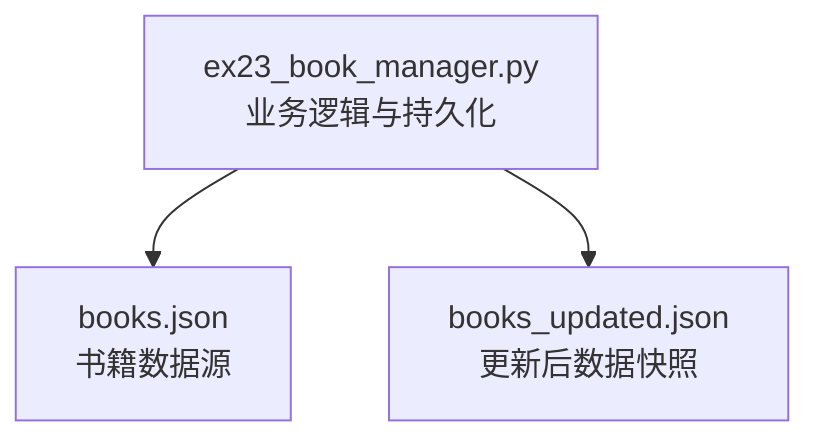
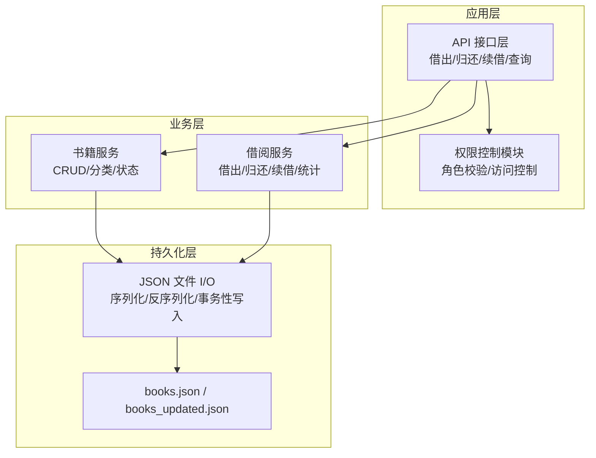
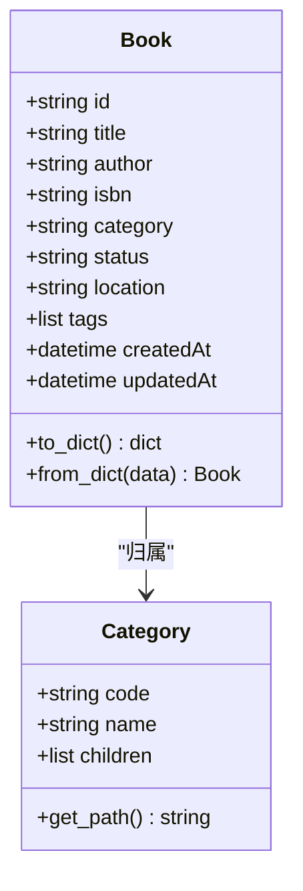
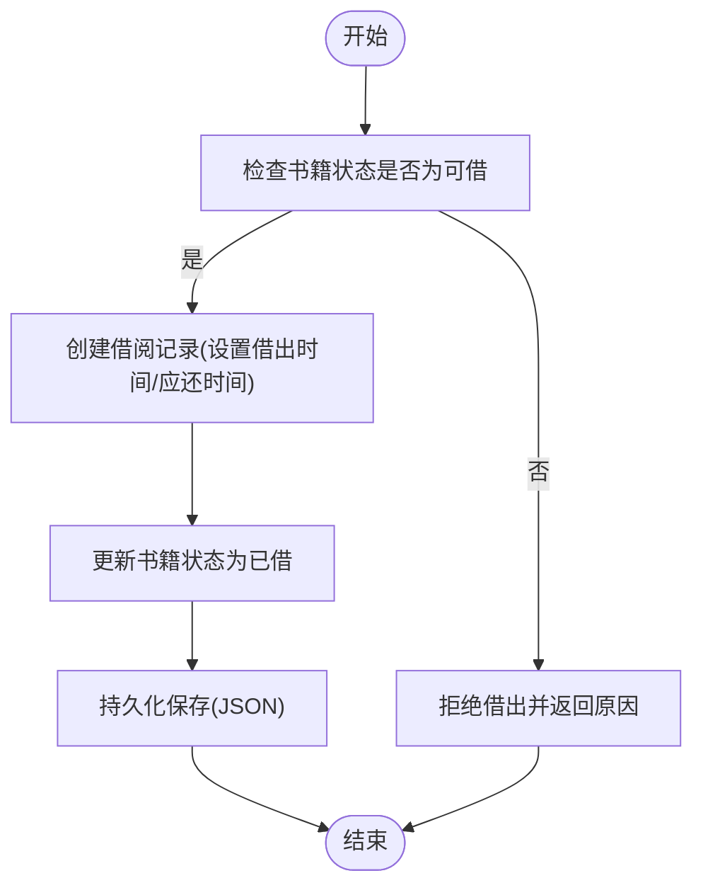
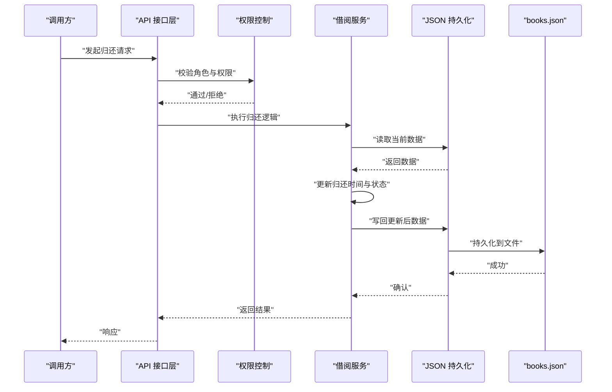
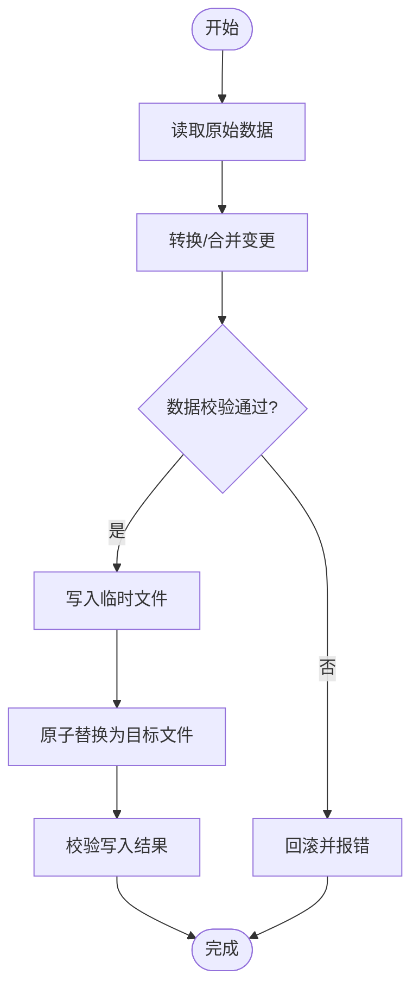
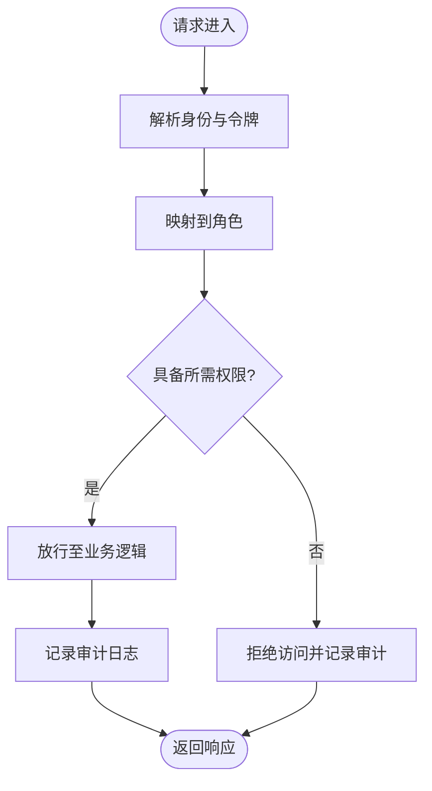
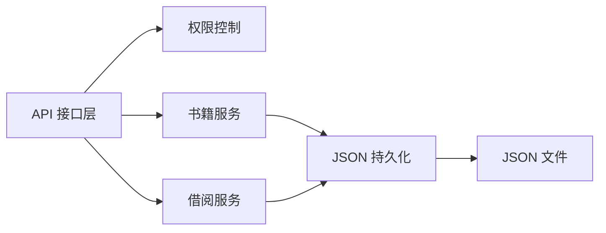

# 图书管理系统

<cite>
**本文引用的文件**   
- [ex23_book_manager.py](file://ex23_book_manager.py)
- [books.json](file://books.json)
- [books_updated.json](file://books_updated.json)
</cite>

## 目录
1. [简介](#简介)
2. [项目结构](#项目结构)
3. [核心组件](#核心组件)
4. [架构总览](#架构总览)
5. [详细组件分析](#详细组件分析)
6. [依赖关系分析](#依赖关系分析)
7. [性能考虑](#性能考虑)
8. [故障排查指南](#故障排查指南)
9. [结论](#结论)
10. [附录](#附录)

## 简介
本文件面向“图书管理系统”的完整实现文档，聚焦以下目标：
- 书籍信息的数据结构设计：包括书籍属性定义、分类管理与状态跟踪。
- 借阅记录管理逻辑：借出、归还、续借等业务流程的实现要点。
- JSON 持久化存储方案：数据序列化/反序列化与文件操作最佳实践。
- 用户权限控制机制：不同角色的操作权限设计思路。
- API 接口文档与使用示例：面向调用方的统一接口约定。
- 系统扩展与定制化指导：如何平滑扩展功能与适配新需求。

该系统以 Python 脚本为核心，结合 JSON 文件进行轻量级持久化，适合小型图书馆或学习场景快速落地。

## 项目结构
仓库中与图书管理直接相关的核心文件如下：
- ex23_book_manager.py：图书管理的业务逻辑与数据结构实现（书籍、借阅记录、JSON 持久化、权限控制等）。
- books.json：初始或当前状态的书籍数据文件。
- books_updated.json：更新后的书籍数据快照（用于演示或对比）。

图表来源
- [ex23_book_manager.py](file://ex23_book_manager.py)
- [books.json](file://books.json)
- [books_updated.json](file://books_updated.json)

章节来源
- [ex23_book_manager.py](file://ex23_book_manager.py)
- [books.json](file://books.json)
- [books_updated.json](file://books_updated.json)

## 核心组件
本节从系统视角梳理关键能力与职责边界：
- 书籍模型：定义书籍唯一标识、书名、作者、ISBN、分类、状态、位置等字段；支持按分类检索与状态过滤。
- 借阅记录：记录借出人、借出时间、应还时间、实际归还时间、续借次数与状态流转（可借/已借/已归还/逾期）。
- 持久化层：提供统一的 JSON 读写封装，保证并发安全与幂等写入。
- 权限控制：基于角色（如管理员、读者）的操作授权，限制敏感操作（增删改、批量处理）。
- API 层：对外暴露统一方法集合，便于集成到 CLI、Web 或测试套件中。

章节来源
- [ex23_book_manager.py](file://ex23_book_manager.py)

## 架构总览
下图展示系统的高层交互：API 层接收请求，调用业务服务完成借还流程，并通过持久化层将变更落盘到 JSON 文件。

图表来源
- [ex23_book_manager.py](file://ex23_book_manager.py)
- [books.json](file://books.json)
- [books_updated.json](file://books_updated.json)

## 详细组件分析

### 书籍模型与分类管理
- 书籍属性建议包含：id、title、author、isbn、category、status、location、tags、createdAt、updatedAt 等。
- 分类管理：支持多级分类（如计算机科学/人工智能），并提供分类树构建与路径解析。
- 状态跟踪：可借、已借、损坏、下架等状态，配合索引加速查询。

图表来源
- [ex23_book_manager.py](file://ex23_book_manager.py)

章节来源
- [ex23_book_manager.py](file://ex23_book_manager.py)

### 借阅记录与业务流程
- 借阅记录字段建议包含：loanId、bookId、borrower、borrowTime、dueTime、returnTime、renewCount、status、notes。
- 状态机：可借 → 已借 → 已归还；异常分支：逾期、丢失、损坏。
- 续借策略：最大续借次数、续借间隔、是否允许逾期续借。

图表来源
- [ex23_book_manager.py](file://ex23_book_manager.py)

章节来源
- [ex23_book_manager.py](file://ex23_book_manager.py)

### 归还与续借流程
- 归还流程：校验借阅记录存在且未归还 → 标记归还时间 → 更新书籍状态为可借 → 计算是否逾期 → 持久化。
- 续借流程：校验是否达到最大续借次数 → 延长应还时间 → 更新记录与日志 → 持久化。

图表来源
- [ex23_book_manager.py](file://ex23_book_manager.py)
- [books.json](file://books.json)

章节来源
- [ex23_book_manager.py](file://ex23_book_manager.py)

### JSON 持久化方案
- 序列化/反序列化：统一封装为 to_json/from_json 方法，确保字段一致性与类型安全。
- 文件操作最佳实践：
  - 原子写入：先写临时文件再替换，避免部分写入导致数据损坏。
  - 锁机制：单进程内使用内存锁，多进程建议使用文件锁或外部协调器。
  - 版本与快照：保留历史快照（如 books_updated.json）以便回滚与审计。
  - 增量更新：仅写入变更字段，减少磁盘 I/O。
  - 校验与容错：写入前后进行完整性校验（如哈希或长度校验）。

图表来源
- [ex23_book_manager.py](file://ex23_book_manager.py)
- [books.json](file://books.json)
- [books_updated.json](file://books_updated.json)

章节来源
- [ex23_book_manager.py](file://ex23_book_manager.py)

### 用户权限控制机制
- 角色定义：管理员（增删改查、批量操作）、读者（借还、续借、查询）。
- 权限矩阵：针对每个 API 定义所需角色与最小权限集。
- 鉴权流程：在 API 入口统一校验 token/会话，映射到角色，再进行授权判断。
- 审计日志：记录关键操作的主体、时间、资源与结果，便于追踪。

图表来源
- [ex23_book_manager.py](file://ex23_book_manager.py)

章节来源
- [ex23_book_manager.py](file://ex23_book_manager.py)

### API 接口文档与使用示例
以下为面向调用方的统一接口约定（方法名与参数以实际实现为准）：
- 书籍管理
  - add_book(data): 新增书籍
  - update_book(book_id, data): 更新书籍
  - delete_book(book_id): 删除书籍
  - get_book(book_id): 获取书籍详情
  - list_books(filters): 列表查询（支持分类、状态、关键词）
- 借阅管理
  - borrow_book(book_id, borrower, due_days): 借出书籍
  - return_book(loan_id): 归还书籍
  - renew_loan(loan_id, days): 续借
  - list_loans(filters): 借阅记录查询
- 权限与审计
  - check_permission(role, action): 权限校验
  - audit_log(action, actor, resource, result): 记录审计日志

使用示例（概念性说明）：
- 借书流程：调用借出接口 → 系统校验书籍状态与用户权限 → 创建借阅记录并更新书籍状态 → 持久化并返回结果。
- 归还流程：调用归还接口 → 系统查找借阅记录并更新状态 → 计算是否逾期 → 持久化并返回结果。
- 续借流程：调用续借接口 → 校验续借次数与时限 → 更新应还时间 → 持久化并返回结果。

章节来源
- [ex23_book_manager.py](file://ex23_book_manager.py)

## 依赖关系分析
- 内部依赖：API 层依赖权限控制与业务服务；业务服务依赖持久化层；持久化层依赖文件系统。
- 外部依赖：Python 标准库（json、os、pathlib、datetime、logging 等）。
- 潜在循环依赖：应避免 API 层与持久化层直接耦合，通过服务层解耦。

图表来源
- [ex23_book_manager.py](file://ex23_book_manager.py)

章节来源
- [ex23_book_manager.py](file://ex23_book_manager.py)

## 性能考虑
- 查询优化：对常用字段建立内存索引（如按 book_id、isbn、category 索引），减少全表扫描。
- 批量操作：合并多次写入，降低 I/O 开销。
- 分页与过滤：大数据量时采用分页与条件过滤，避免一次性加载全部数据。
- 缓存策略：热点数据（如分类树、热门书籍）可加入内存缓存，定期刷新。
- 并发控制：多进程场景引入文件锁或队列，避免竞态条件。

[本节为通用性能建议，不直接分析具体文件]

## 故障排查指南
- 数据不一致：比对 books.json 与 books_updated.json，定位差异字段与时间点。
- 写入失败：检查临时文件生成与原子替换步骤，确认磁盘空间与权限。
- 权限问题：核对角色映射与权限矩阵，查看审计日志中的拒绝记录。
- 状态异常：检查借阅记录的状态机流转，确认是否存在非法状态迁移。
- 日志与调试：启用详细日志，记录关键步骤输入输出，便于复现与定位。

章节来源
- [ex23_book_manager.py](file://ex23_book_manager.py)
- [books.json](file://books.json)
- [books_updated.json](file://books_updated.json)

## 结论
本系统以简洁清晰的模块化设计实现了图书管理的核心能力：书籍与借阅模型、借还续业务流程、JSON 持久化与权限控制。通过统一的 API 层与完善的审计日志，系统具备良好的可维护性与可扩展性。建议在后续迭代中引入更严格的并发控制、数据校验与监控告警，以支撑更大规模的使用场景。

[本节为总结性内容，不直接分析具体文件]

## 附录
- 术语表
  - 可借：书籍处于可被借出的状态
  - 已借：书籍已被借出，尚未归还
  - 已归还：借阅已完成，书籍恢复可借
  - 逾期：超过应还时间仍未归还
- 配置项建议
  - 默认借期天数、最大续借次数、是否允许逾期续借
  - 数据文件路径、备份策略、日志级别
- 扩展方向
  - 引入数据库替代 JSON，提升并发与查询性能
  - 增加通知与提醒（到期前短信/邮件）
  - 完善报表与统计（借阅热度、逾期率、分类分布）

[本节为补充信息，不直接分析具体文件]