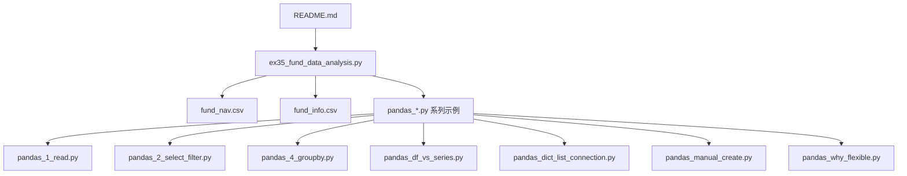
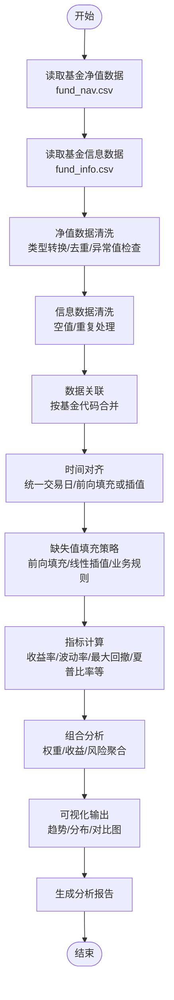
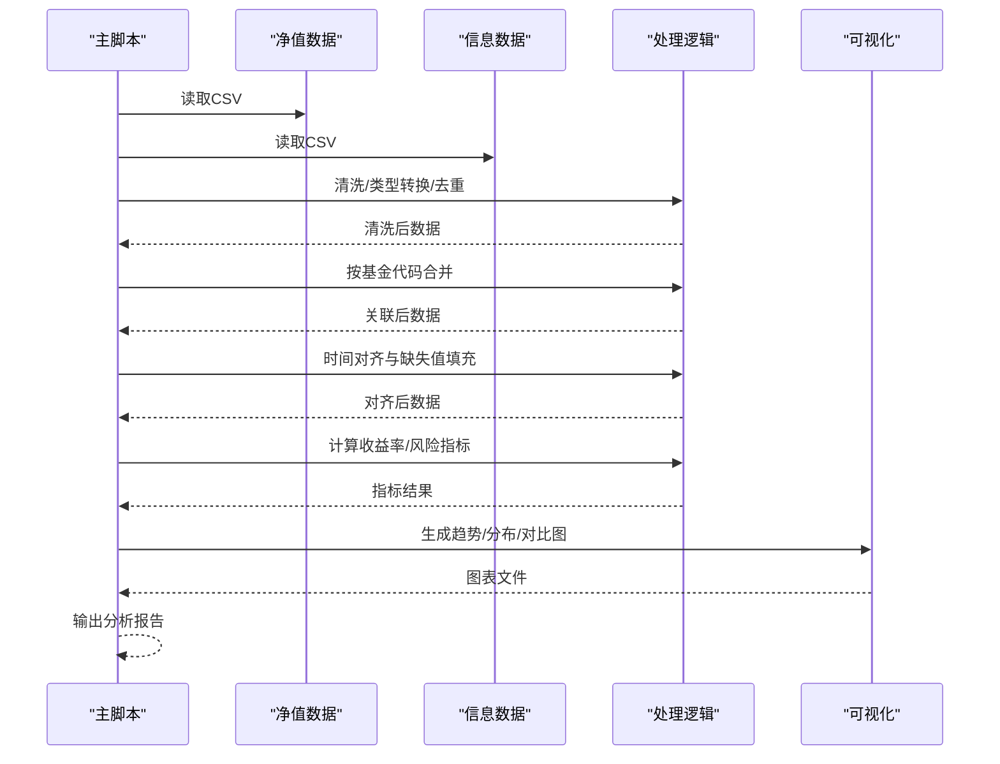
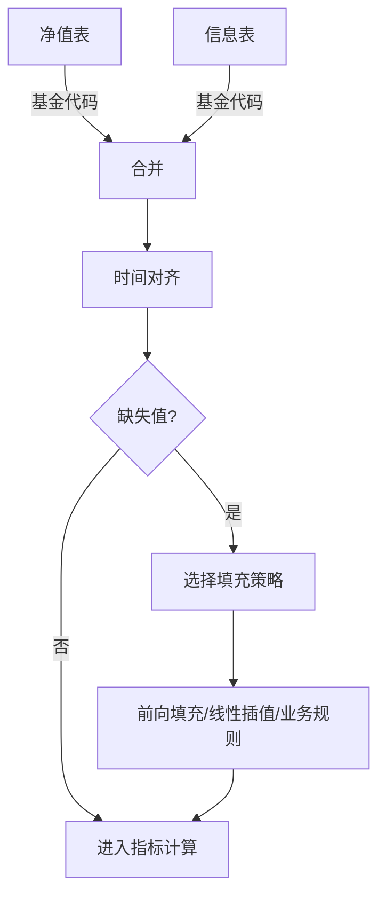
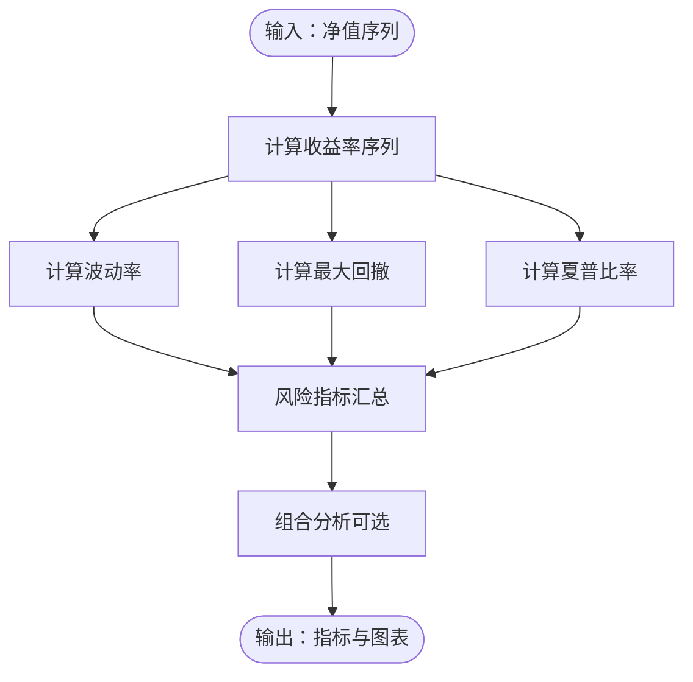
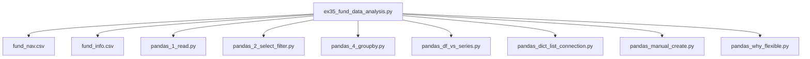

# 基金数据分析

<cite>
**本文引用的文件**   
- [README.md](file://README.md)
- [ex35_fund_data_analysis.py](file://ex35_fund_data_analysis.py)
- [pandas_1_read.py](file://pandas_1_read.py)
- [pandas_2_select_filter.py](file://pandas_2_select_filter.py)
- [pandas_4_groupby.py](file://pandas_4_groupby.py)
- [pandas_df_vs_series.py](file://pandas_df_vs_series.py)
- [pandas_dict_list_connection.py](file://pandas_dict_list_connection.py)
- [pandas_manual_create.py](file://pandas_manual_create.py)
- [pandas_why_flexible.py](file://pandas_why_flexible.py)
- [fund_nav.csv](file://fund_nav.csv)
- [fund_info.csv](file://fund_info.csv)
</cite>

## 目录
1. [引言](#引言)
2. [项目结构](#项目结构)
3. [核心组件](#核心组件)
4. [架构总览](#架构总览)
5. [详细组件分析](#详细组件分析)
6. [依赖关系分析](#依赖关系分析)
7. [性能考虑](#性能考虑)
8. [故障排查指南](#故障排查指南)
9. [结论](#结论)
10. [附录](#附录)

## 引言
本项目围绕“基金数据分析”主题，基于Pandas完成从数据读取、清洗、关联、时间对齐、缺失值填充到指标计算与可视化的完整流程。重点覆盖：
- 数据结构特征：时间序列（日期）、数值型（净值/收益率等）、分类型（基金代码/类型）的处理方法
- 金融分析算法：收益率计算、风险评估指标、投资组合分析思路
- 多数据源整合：数据关联、时间对齐、缺失值填充策略
- 可视化输出：趋势图、分布图、对比分析图
- 性能调优与大数据集处理最佳实践

## 项目结构
仓库包含基础Python练习与Pandas示例，以及一个面向基金数据的综合脚本与两份CSV数据文件。整体组织方式以“功能脚本 + 数据文件”为主，便于逐步学习与复用。

图表来源
- [ex35_fund_data_analysis.py](file://ex35_fund_data_analysis.py)
- [pandas_1_read.py](file://pandas_1_read.py)
- [pandas_2_select_filter.py](file://pandas_2_select_filter.py)
- [pandas_4_groupby.py](file://pandas_4_groupby.py)
- [pandas_df_vs_series.py](file://pandas_df_vs_series.py)
- [pandas_dict_list_connection.py](file://pandas_dict_list_connection.py)
- [pandas_manual_create.py](file://pandas_manual_create.py)
- [pandas_why_flexible.py](file://pandas_why_flexible.py)
- [fund_nav.csv](file://fund_nav.csv)
- [fund_info.csv](file://fund_info.csv)

章节来源
- [README.md](file://README.md)
- [ex35_fund_data_analysis.py](file://ex35_fund_data_analysis.py)
- [pandas_1_read.py](file://pandas_1_read.py)
- [pandas_2_select_filter.py](file://pandas_2_select_filter.py)
- [pandas_4_groupby.py](file://pandas_4_groupby.py)
- [pandas_df_vs_series.py](file://pandas_df_vs_series.py)
- [pandas_dict_list_connection.py](file://pandas_dict_list_connection.py)
- [pandas_manual_create.py](file://pandas_manual_create.py)
- [pandas_why_flexible.py](file://pandas_why_flexible.py)
- [fund_nav.csv](file://fund_nav.csv)
- [fund_info.csv](file://fund_info.csv)

## 核心组件
- 数据层
  - fund_nav.csv：基金净值时间序列数据（典型字段含日期、基金代码、单位净值等）
  - fund_info.csv：基金信息数据（典型字段含基金代码、名称、类型等）
- 处理层
  - ex35_fund_data_analysis.py：端到端分析脚本，串联数据读取、清洗、关联、时间对齐、缺失值填充、指标计算与可视化
  - pandas_*.py 系列：提供Pandas在读取、筛选、分组、Series/DataFrame操作等方面的能力参考
- 输出层
  - 图表与报告：通过Pandas与Matplotlib/Seaborn生成趋势图、分布图、对比图等

章节来源
- [ex35_fund_data_analysis.py](file://ex35_fund_data_analysis.py)
- [pandas_1_read.py](file://pandas_1_read.py)
- [pandas_2_select_filter.py](file://pandas_2_select_filter.py)
- [pandas_4_groupby.py](file://pandas_4_groupby.py)
- [pandas_df_vs_series.py](file://pandas_df_vs_series.py)
- [pandas_dict_list_connection.py](file://pandas_dict_list_connection.py)
- [pandas_manual_create.py](file://pandas_manual_create.py)
- [pandas_why_flexible.py](file://pandas_why_flexible.py)
- [fund_nav.csv](file://fund_nav.csv)
- [fund_info.csv](file://fund_info.csv)

## 架构总览
下图展示了从原始数据到分析报告的整体流程，涵盖数据获取、预处理、指标计算与可视化输出。

图表来源
- [ex35_fund_data_analysis.py](file://ex35_fund_data_analysis.py)
- [fund_nav.csv](file://fund_nav.csv)
- [fund_info.csv](file://fund_info.csv)

## 详细组件分析

### 数据模型与字段说明
- 基金净值表（fund_nav.csv）
  - 典型字段：日期、基金代码、单位净值
  - 数据类型：日期（时间序列）、字符串（分类）、浮点数（数值）
  - 关键特性：非交易日缺失、节假日导致的时间不连续
- 基金信息表（fund_info.csv）
  - 典型字段：基金代码、基金名称、基金类型
  - 数据类型：字符串（分类）
  - 关键特性：一对多关系（一条信息对应多条净值记录）

章节来源
- [fund_nav.csv](file://fund_nav.csv)
- [fund_info.csv](file://fund_info.csv)

### 数据处理流水线（ex35_fund_data_analysis.py）
该脚本作为主入口，负责串联以下环节：
- 数据读取：使用Pandas读取CSV
- 数据清洗：类型转换、去重、异常值检查
- 数据关联：按基金代码将净值与信息表合并
- 时间对齐：统一时间索引，处理缺失交易日
- 缺失值填充：前向填充、线性插值等
- 指标计算：收益率、波动率、最大回撤、夏普比率等
- 可视化：趋势图、分布图、对比分析图
- 报告输出：汇总统计与图表保存

图表来源
- [ex35_fund_data_analysis.py](file://ex35_fund_data_analysis.py)
- [fund_nav.csv](file://fund_nav.csv)
- [fund_info.csv](file://fund_info.csv)

章节来源
- [ex35_fund_data_analysis.py](file://ex35_fund_data_analysis.py)

### 时间序列数据处理
- 日期解析与索引设置：确保日期列为时间类型并设为索引
- 频率与重采样：按日/周/月进行重采样，补齐缺失交易日
- 滚动窗口：用于移动平均、滚动波动率等

章节来源
- [pandas_1_read.py](file://pandas_1_read.py)
- [pandas_df_vs_series.py](file://pandas_df_vs_series.py)

### 数值型数据处理
- 基本运算：对数收益率、简单收益率、累计收益
- 统计描述：均值、标准差、分位数、偏度、峰度
- 异常值检测：基于分位数或Z-Score的离群点识别

章节来源
- [pandas_2_select_filter.py](file://pandas_2_select_filter.py)
- [pandas_df_vs_series.py](file://pandas_df_vs_series.py)

### 分类数据处理
- 分组聚合：按基金类型/基金公司进行收益与风险聚合
- 交叉分析：不同类型基金的收益分布对比
- 编码与映射：将分类变量转换为可计算的数值表示（如哑变量）

章节来源
- [pandas_4_groupby.py](file://pandas_4_groupby.py)
- [pandas_df_vs_series.py](file://pandas_df_vs_series.py)

### 多数据源整合技术
- 数据关联：基于基金代码进行内连接/左连接，保留必要维度
- 时间对齐：以净值表的日期为基准，对齐信息表维度
- 缺失值填充：
  - 前向填充：适用于短期缺失且假设延续性
  - 线性插值：适用于平滑变化场景
  - 业务规则：如节假日跳过、停牌处理等

图表来源
- [ex35_fund_data_analysis.py](file://ex35_fund_data_analysis.py)
- [fund_nav.csv](file://fund_nav.csv)
- [fund_info.csv](file://fund_info.csv)

章节来源
- [ex35_fund_data_analysis.py](file://ex35_fund_data_analysis.py)

### 金融数据分析核心算法
- 收益率计算
  - 简单收益率：相邻期净值比减一
  - 对数收益率：相邻期净值对数差
  - 年化收益率：按交易日换算
- 风险评估指标
  - 波动率：收益率标准差（日/年）
  - 最大回撤：历史峰值到谷底的最大跌幅
  - 夏普比率：超额收益与波动率的比值
- 投资组合分析
  - 组合收益：加权平均收益
  - 组合风险：协方差矩阵与权重向量计算组合方差
  - 有效前沿：在给定风险水平下最大化收益

图表来源
- [ex35_fund_data_analysis.py](file://ex35_fund_data_analysis.py)

章节来源
- [ex35_fund_data_analysis.py](file://ex35_fund_data_analysis.py)

### 可视化图表生成
- 趋势图：单只或多只基金的净值走势、累计收益曲线
- 分布图：收益率直方图、箱线图展示分散程度
- 对比分析图：不同基金类型/公司的收益与风险对比柱状图或雷达图

章节来源
- [ex35_fund_data_analysis.py](file://ex35_fund_data_analysis.py)

### 实际案例：从数据获取到分析报告
- 步骤概览
  - 读取fund_nav.csv与fund_info.csv
  - 清洗与类型转换
  - 按基金代码合并数据
  - 时间对齐与缺失值填充
  - 计算收益率与风险指标
  - 生成趋势/分布/对比图
  - 输出分析报告（文本+图表）
- 关键要点
  - 日期列需解析为时间类型
  - 合并时注意一对多关系的基数控制
  - 缺失值填充需结合业务背景选择策略
  - 指标计算需考虑交易日历与复权处理

章节来源
- [ex35_fund_data_analysis.py](file://ex35_fund_data_analysis.py)
- [fund_nav.csv](file://fund_nav.csv)
- [fund_info.csv](file://fund_info.csv)

## 依赖关系分析
- 外部库依赖
  - Pandas：数据读取、清洗、分组、时间序列操作
  - Matplotlib/Seaborn：可视化输出
- 内部模块依赖
  - ex35_fund_data_analysis.py 依赖 fund_nav.csv 与 fund_info.csv
  - ex35_fund_data_analysis.py 参考 pandas_*.py 系列中的用法模式

图表来源
- [ex35_fund_data_analysis.py](file://ex35_fund_data_analysis.py)
- [pandas_1_read.py](file://pandas_1_read.py)
- [pandas_2_select_filter.py](file://pandas_2_select_filter.py)
- [pandas_4_groupby.py](file://pandas_4_groupby.py)
- [pandas_df_vs_series.py](file://pandas_df_vs_series.py)
- [pandas_dict_list_connection.py](file://pandas_dict_list_connection.py)
- [pandas_manual_create.py](file://pandas_manual_create.py)
- [pandas_why_flexible.py](file://pandas_why_flexible.py)
- [fund_nav.csv](file://fund_nav.csv)
- [fund_info.csv](file://fund_info.csv)

章节来源
- [ex35_fund_data_analysis.py](file://ex35_fund_data_analysis.py)
- [pandas_1_read.py](file://pandas_1_read.py)
- [pandas_2_select_filter.py](file://pandas_2_select_filter.py)
- [pandas_4_groupby.py](file://pandas_4_groupby.py)
- [pandas_df_vs_series.py](file://pandas_df_vs_series.py)
- [pandas_dict_list_connection.py](file://pandas_dict_list_connection.py)
- [pandas_manual_create.py](file://pandas_manual_create.py)
- [pandas_why_flexible.py](file://pandas_why_flexible.py)
- [fund_nav.csv](file://fund_nav.csv)
- [fund_info.csv](file://fund_info.csv)

## 性能考虑
- 内存优化
  - 合理选择数据类型（如将基金代码转为类别类型）
  - 避免不必要的中间副本，使用in-place操作与视图
- 计算加速
  - 向量化运算优先于循环
  - 使用groupby与agg进行批量聚合
- I/O优化
  - 大文件分块读取与增量处理
  - 缓存中间结果，减少重复计算
- 并行与分布式
  - 多进程/多线程用于独立任务（如多基金并行计算）
  - 对于超大数据集，考虑Dask或Spark

[本节为通用指导，无需具体文件引用]

## 故障排查指南
- 常见问题
  - 日期解析失败：检查日期格式与分隔符
  - 合并后出现重复行：确认连接键唯一性与基数
  - 缺失值过多：评估填充策略是否合适，必要时剔除无效样本
  - 指标异常：检查收益率计算是否考虑复权与分红
- 定位方法
  - 打印各阶段数据形状与样例
  - 使用describe与info快速诊断数据类型与缺失情况
  - 绘制关键指标的时序图辅助定位异常点

章节来源
- [ex35_fund_data_analysis.py](file://ex35_fund_data_analysis.py)
- [pandas_1_read.py](file://pandas_1_read.py)
- [pandas_2_select_filter.py](file://pandas_2_select_filter.py)
- [pandas_4_groupby.py](file://pandas_4_groupby.py)
- [pandas_df_vs_series.py](file://pandas_df_vs_series.py)

## 结论
本项目以Pandas为核心工具，构建了完整的基金数据分析流水线。通过对时间序列、数值型与分类数据的系统化处理，实现了收益率与风险指标的计算、投资组合分析与可视化输出。建议在后续迭代中引入更稳健的数据校验、复权处理与回测框架，以提升分析的准确性与实用性。

[本节为总结性内容，无需具体文件引用]

## 附录
- 相关示例参考
  - 数据读取与基础操作：pandas_1_read.py、pandas_df_vs_series.py
  - 筛选与过滤：pandas_2_select_filter.py
  - 分组与聚合：pandas_4_groupby.py
  - DataFrame与Series差异：pandas_df_vs_series.py
  - 字典/列表与DataFrame互转：pandas_dict_list_connection.py
  - 手动创建DataFrame：pandas_manual_create.py
  - Pandas灵活性说明：pandas_why_flexible.py

章节来源
- [pandas_1_read.py](file://pandas_1_read.py)
- [pandas_2_select_filter.py](file://pandas_2_select_filter.py)
- [pandas_4_groupby.py](file://pandas_4_groupby.py)
- [pandas_df_vs_series.py](file://pandas_df_vs_series.py)
- [pandas_dict_list_connection.py](file://pandas_dict_list_connection.py)
- [pandas_manual_create.py](file://pandas_manual_create.py)
- [pandas_why_flexible.py](file://pandas_why_flexible.py)