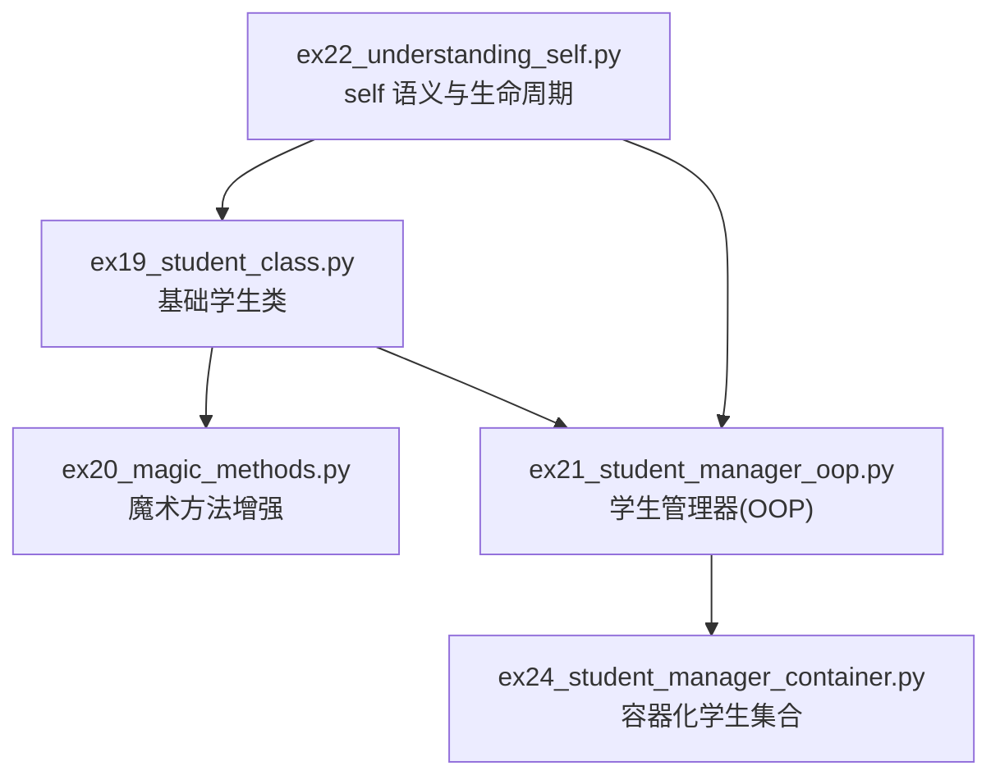
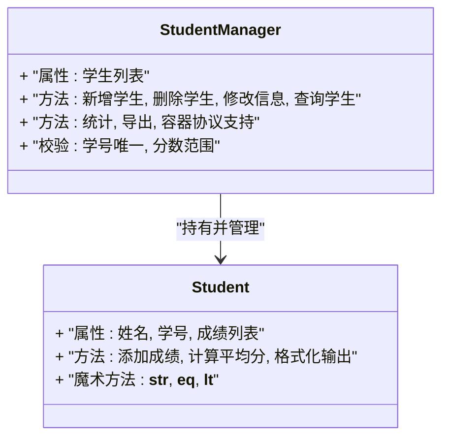
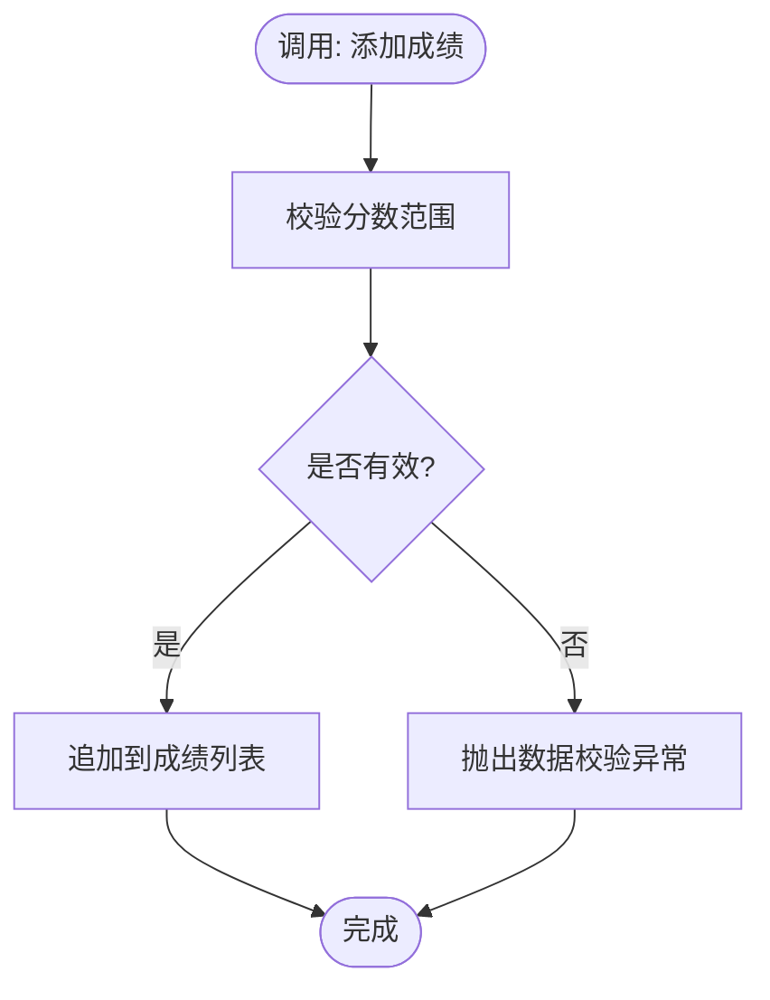
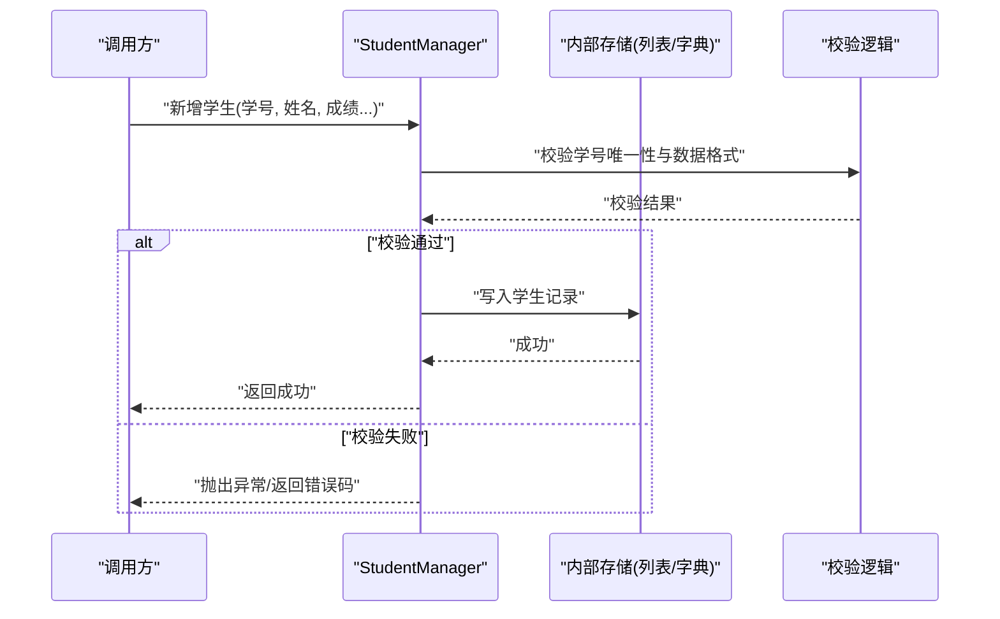
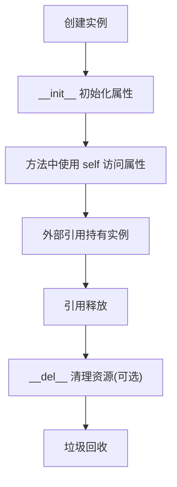
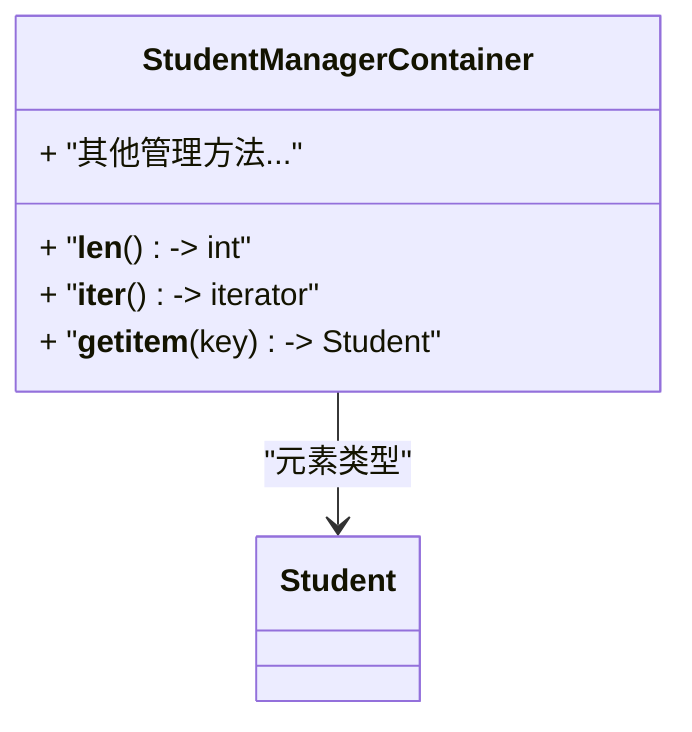

# 学生管理系统

<cite>
**本文引用的文件**   
- [ex19_student_class.py](file://ex19_student_class.py)
- [ex20_magic_methods.py](file://ex20_magic_methods.py)
- [ex21_student_manager_oop.py](file://ex21_student_manager_oop.py)
- [ex22_understanding_self.py](file://ex22_understanding_self.py)
- [ex24_student_manager_container.py](file://ex24_student_manager_container.py)
</cite>

## 目录
1. [简介](#简介)
2. [项目结构](#项目结构)
3. [核心组件](#核心组件)
4. [架构总览](#架构总览)
5. [详细组件分析](#详细组件分析)
6. [依赖关系分析](#依赖关系分析)
7. [性能考虑](#性能考虑)
8. [故障排查指南](#故障排查指南)
9. [结论](#结论)
10. [附录](#附录)

## 简介
本文件面向“学生管理系统”的面向对象实现，围绕以下目标展开：
- 深入解析学生类的设计模式：属性定义、方法封装与魔术方法的使用。
- 讲解学生管理器的面向对象设计：增删改查（CRUD）、数据验证与业务逻辑处理。
- 通过实际代码示例路径展示 self 关键字的理解与应用，解释对象生命周期与内存管理。
- 提供系统架构图与数据流图，说明模块间的交互关系。
- 包含错误处理机制、性能优化建议与扩展开发指南。

## 项目结构
本项目采用按功能演进的文件组织方式，逐步构建学生模型与管理器：
- ex19_student_class.py：基础学生类，定义属性与方法，体现封装思想。
- ex20_magic_methods.py：演示常用魔术方法，增强类的可读性与易用性。
- ex21_student_manager_oop.py：面向对象的“学生管理器”，提供增删改查与校验逻辑。
- ex22_understanding_self.py：通过对比与示例帮助理解 self 的作用域与绑定语义。
- ex24_student_manager_container.py：将学生集合容器化，支持迭代、长度等容器协议。

图表来源
- [ex19_student_class.py](file://ex19_student_class.py)
- [ex20_magic_methods.py](file://ex20_magic_methods.py)
- [ex21_student_manager_oop.py](file://ex21_student_manager_oop.py)
- [ex22_understanding_self.py](file://ex22_understanding_self.py)
- [ex24_student_manager_container.py](file://ex24_student_manager_container.py)

章节来源
- [ex19_student_class.py](file://ex19_student_class.py)
- [ex20_magic_methods.py](file://ex20_magic_methods.py)
- [ex21_student_manager_oop.py](file://ex21_student_manager_oop.py)
- [ex22_understanding_self.py](file://ex22_understanding_self.py)
- [ex24_student_manager_container.py](file://ex24_student_manager_container.py)

## 核心组件
- 学生类（Student）
  - 职责：表示一个学生的基本信息与行为，如姓名、学号、成绩等；提供格式化输出、计算平均分等方法；通过魔术方法提升可打印性与比较能力。
  - 关键设计点：
    - 属性封装：对外暴露必要接口，内部状态受保护。
    - 方法封装：对输入进行校验，保证数据一致性。
    - 魔术方法：如字符串表示、相等性比较、排序比较等，提升可用性。
- 学生管理器（StudentManager）
  - 职责：维护学生集合，提供增删改查、批量操作、统计与查询等业务能力。
  - 关键设计点：
    - 数据验证：在添加/更新时进行合法性检查（如学号唯一性、分数范围）。
    - 事务式操作：复杂操作可组合多个步骤，必要时回滚或抛出明确异常。
    - 容器协议：支持 len、迭代等，便于与其他 Python 生态集成。
- self 语义与生命周期
  - 作用：实例方法的第一个参数，指向当前实例，用于访问实例属性与方法。
  - 生命周期：从构造到销毁，实例引用计数归零后由垃圾回收释放。

章节来源
- [ex19_student_class.py](file://ex19_student_class.py)
- [ex20_magic_methods.py](file://ex20_magic_methods.py)
- [ex21_student_manager_oop.py](file://ex21_student_manager_oop.py)
- [ex22_understanding_self.py](file://ex22_understanding_self.py)
- [ex24_student_manager_container.py](file://ex24_student_manager_container.py)

## 架构总览
下图展示了学生类与管理器之间的协作关系以及典型的数据流。

图表来源
- [ex19_student_class.py](file://ex19_student_class.py)
- [ex20_magic_methods.py](file://ex20_magic_methods.py)
- [ex21_student_manager_oop.py](file://ex21_student_manager_oop.py)
- [ex24_student_manager_container.py](file://ex24_student_manager_container.py)

## 详细组件分析

### 学生类（Student）设计
- 属性定义
  - 标识类：学号（唯一键），姓名（显示名）。
  - 业务类：成绩列表（数值型），可用于计算平均分、排名等。
- 方法封装
  - 添加成绩：校验分数范围，追加到成绩列表。
  - 计算平均分：过滤无效值，返回平均值。
  - 格式化输出：结合魔术方法实现友好打印。
- 魔术方法
  - __str__：提供人类可读的字符串表示。
  - __eq__：基于学号或综合字段判断相等性。
  - __lt__/__le__/__gt__/__ge__：支持排序与比较。
  - __repr__：开发者友好的调试表示。

图表来源
- [ex19_student_class.py](file://ex19_student_class.py)
- [ex20_magic_methods.py](file://ex20_magic_methods.py)

章节来源
- [ex19_student_class.py](file://ex19_student_class.py)
- [ex20_magic_methods.py](file://ex20_magic_methods.py)

### 学生管理器（StudentManager）设计
- 数据结构
  - 内部使用列表或字典维护学生集合，确保学号唯一索引以提升查找效率。
- CRUD 操作
  - 新增：校验学号唯一性、学生信息完整性。
  - 删除：按学号定位并移除，不存在则抛错或返回失败标志。
  - 修改：按学号定位并更新字段，再次执行校验。
  - 查询：按学号、姓名模糊匹配、成绩区间筛选等。
- 数据验证与业务逻辑
  - 统一校验入口，集中处理非法输入。
  - 复杂操作组合：例如批量导入时先预校验再提交。
- 容器协议
  - 实现 __len__、__iter__、__getitem__ 等，使管理器可作为容器使用。

图表来源
- [ex21_student_manager_oop.py](file://ex21_student_manager_oop.py)
- [ex24_student_manager_container.py](file://ex24_student_manager_container.py)

章节来源
- [ex21_student_manager_oop.py](file://ex21_student_manager_oop.py)
- [ex24_student_manager_container.py](file://ex24_student_manager_container.py)

### self 关键字与对象生命周期
- self 的作用
  - 在实例方法中，self 指向当前实例，用于访问实例属性与方法。
  - 类方法与静态方法不使用 self（分别使用 cls 或不使用参数）。
- 生命周期与内存管理
  - 创建：调用构造函数分配内存，初始化属性。
  - 引用：外部变量或容器持有引用，保持存活。
  - 销毁：引用计数归零后，触发析构逻辑，内存被回收。
- 常见误区
  - 忘记传递 self 导致类型错误。
  - 误用类属性代替实例属性造成共享状态问题。

图表来源
- [ex22_understanding_self.py](file://ex22_understanding_self.py)

章节来源
- [ex22_understanding_self.py](file://ex22_understanding_self.py)

### 容器化学生集合
- 容器协议
  - 实现 __len__ 返回学生数量。
  - 实现 __iter__ 支持 for 遍历。
  - 实现 __getitem__ 支持索引访问。
- 优势
  - 与 Python 标准库无缝集成（如 list、tuple、dict 的操作风格）。
  - 简化上层调用，提高可读性与可维护性。

图表来源
- [ex24_student_manager_container.py](file://ex24_student_manager_container.py)

章节来源
- [ex24_student_manager_container.py](file://ex24_student_manager_container.py)

## 依赖关系分析
- 内聚与耦合
  - 学生类高度内聚，关注自身数据与行为。
  - 管理器聚合学生对象，负责协调与校验，耦合度适中。
- 直接依赖
  - 管理器依赖学生类作为元素类型。
  - 容器化管理器依赖学生类并提供容器协议。
- 潜在循环依赖
  - 当前结构无循环依赖风险，若引入双向引用需避免。

图表来源
- [ex19_student_class.py](file://ex19_student_class.py)
- [ex21_student_manager_oop.py](file://ex21_student_manager_oop.py)
- [ex24_student_manager_container.py](file://ex24_student_manager_container.py)

章节来源
- [ex19_student_class.py](file://ex19_student_class.py)
- [ex21_student_manager_oop.py](file://ex21_student_manager_oop.py)
- [ex24_student_manager_container.py](file://ex24_student_manager_container.py)

## 性能考虑
- 查找优化
  - 使用字典以学号为键维护索引，将 O(n) 查找降为 O(1)。
- 批量操作
  - 批量导入时先预校验，再一次性写入，减少重复校验开销。
- 内存管理
  - 及时释放不再使用的临时对象，避免大列表长期驻留。
- 计算优化
  - 平均分等统计可缓存增量结果，避免每次全量重算。

[本节为通用性能指导，不直接分析具体文件]

## 故障排查指南
- 常见问题
  - 学号重复：新增前检查唯一性，抛出明确异常。
  - 分数越界：统一校验规则，拒绝非法输入。
  - 空引用：删除不存在的学号时返回错误或默认值。
- 日志与断言
  - 在关键路径加入日志记录，便于追踪问题。
  - 使用断言辅助开发期验证不变式。
- 单元测试建议
  - 覆盖正常路径与边界条件（空集合、重复学号、负数成绩等）。

章节来源
- [ex21_student_manager_oop.py](file://ex21_student_manager_oop.py)
- [ex24_student_manager_container.py](file://ex24_student_manager_container.py)

## 结论
本系统通过清晰的分层与职责划分，实现了学生数据的建模与管理：
- 学生类聚焦数据与行为，配合魔术方法提升可用性。
- 学生管理器提供完整的 CRUD 与校验逻辑，并可容器化以便集成。
- 借助自描述与良好封装，系统具备可扩展性与可维护性。
后续可在持久化、并发安全、审计日志等方面进一步扩展。

[本节为总结性内容，不直接分析具体文件]

## 附录
- 扩展开发指南
  - 持久化：增加 JSON/CSV 读写接口，支持导入导出。
  - 权限控制：为管理器增加角色与权限校验。
  - 事件通知：在学生变更时发布事件，供监听者处理。
  - 测试驱动：完善用例，覆盖更多边界场景。

[本节为概念性内容，不直接分析具体文件]