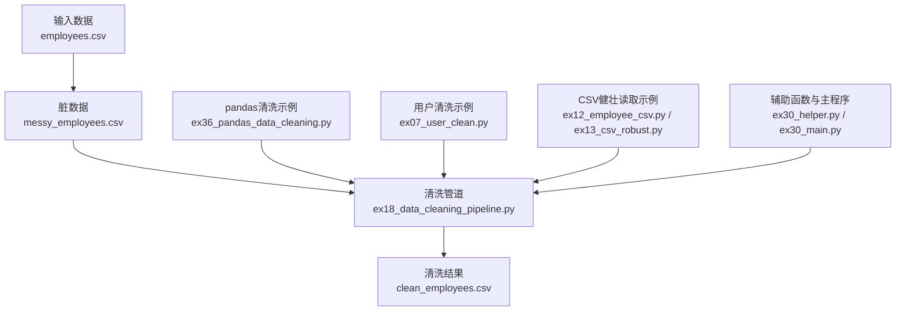
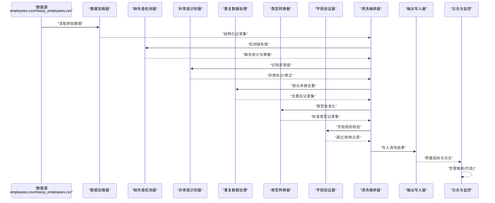
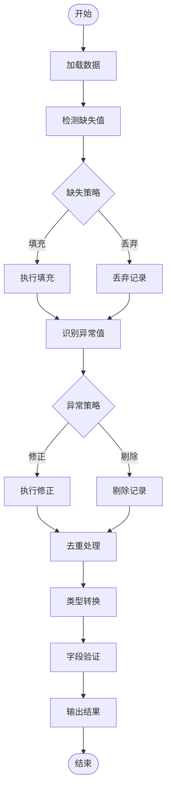
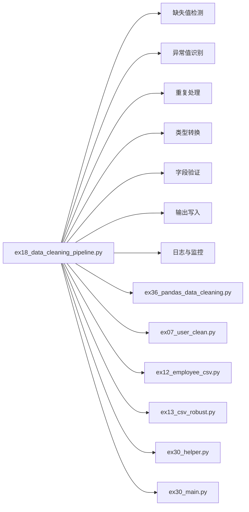

# 数据清洗管道

<cite>
**本文引用的文件**   
- [ex18_data_cleaning_pipeline.py](file://ex18_data_cleaning_pipeline.py)
- [employees.csv](file://employees.csv)
- [messy_employees.csv](file://messy_employees.csv)
- [clean_employees.csv](file://clean_employees.csv)
- [ex36_pandas_data_cleaning.py](file://ex36_pandas_data_cleaning.py)
- [ex07_user_clean.py](file://ex07_user_clean.py)
- [ex12_employee_csv.py](file://ex12_employee_csv.py)
- [ex13_csv_robust.py](file://ex13_csv_robust.py)
- [ex30_helper.py](file://ex30_helper.py)
- [ex30_main.py](file://ex30_main.py)
</cite>

## 目录
1. [简介](#简介)
2. [项目结构](#项目结构)
3. [核心组件](#核心组件)
4. [架构总览](#架构总览)
5. [详细组件分析](#详细组件分析)
6. [依赖关系分析](#依赖关系分析)
7. [性能考虑](#性能考虑)
8. [故障排查指南](#故障排查指南)
9. [结论](#结论)
10. [附录](#附录)

## 简介
本文件围绕“数据清洗管道”的实现与最佳实践，结合仓库中的员工数据清洗案例，系统阐述从原始脏数据到干净数据的完整流程。内容覆盖：
- 数据结构与质量问题识别（缺失值、异常值、格式不一致）
- 清洗算法实现（去重、类型转换、字段校验）
- 管道架构设计（数据流、错误处理、日志记录）
- 性能优化策略（批量处理、内存管理、并行计算）
- 数据质量评估指标与监控告警机制

## 项目结构
本项目包含多个与数据处理相关的示例脚本与CSV样例数据，其中与数据清洗管道直接相关的关键文件如下：
- ex18_data_cleaning_pipeline.py：数据清洗管道的核心实现
- employees.csv / messy_employees.csv / clean_employees.csv：员工数据输入、脏数据与清洗后输出样例
- ex36_pandas_data_cleaning.py：基于pandas的数据清洗示例
- ex07_user_clean.py：用户数据清洗示例
- ex12_employee_csv.py / ex13_csv_robust.py：CSV读取与健壮性处理示例
- ex30_helper.py / ex30_main.py：辅助函数与主程序入口示例

图表来源
- [ex18_data_cleaning_pipeline.py](file://ex18_data_cleaning_pipeline.py)
- [employees.csv](file://employees.csv)
- [messy_employees.csv](file://messy_employees.csv)
- [clean_employees.csv](file://clean_employees.csv)
- [ex36_pandas_data_cleaning.py](file://ex36_pandas_data_cleaning.py)
- [ex07_user_clean.py](file://ex07_user_clean.py)
- [ex12_employee_csv.py](file://ex12_employee_csv.py)
- [ex13_csv_robust.py](file://ex13_csv_robust.py)
- [ex30_helper.py](file://ex30_helper.py)
- [ex30_main.py](file://ex30_main.py)

章节来源
- [ex18_data_cleaning_pipeline.py](file://ex18_data_cleaning_pipeline.py)
- [ex36_pandas_data_cleaning.py](file://ex36_pandas_data_cleaning.py)
- [ex07_user_clean.py](file://ex07_user_clean.py)
- [ex12_employee_csv.py](file://ex12_employee_csv.py)
- [ex13_csv_robust.py](file://ex13_csv_robust.py)
- [ex30_helper.py](file://ex30_helper.py)
- [ex30_main.py](file://ex30_main.py)

## 核心组件
- 数据加载器：负责读取CSV/JSON等源数据，进行基础解析与编码处理，支持容错读取与字段名规范化。
- 缺失值检测器：统计各列缺失比例，提供填充或丢弃策略。
- 异常值识别器：基于阈值或分布方法识别数值型异常，并给出修正或标记策略。
- 重复数据处理：按业务键去重，保留最新或最高质量记录。
- 类型转换器：将字符串日期、金额、布尔等转换为标准类型。
- 字段验证器：依据规则对字段范围、枚举值、正则表达式等进行校验。
- 清洗编排器：串联上述步骤，形成可配置的数据清洗流水线。
- 输出写入器：将清洗后的数据持久化至CSV/数据库，并生成质量报告。
- 日志与监控：记录关键节点状态、耗时、错误与质量指标，支持告警触发。

章节来源
- [ex18_data_cleaning_pipeline.py](file://ex18_data_cleaning_pipeline.py)
- [ex36_pandas_data_cleaning.py](file://ex36_pandas_data_cleaning.py)
- [ex07_user_clean.py](file://ex07_user_clean.py)
- [ex12_employee_csv.py](file://ex12_employee_csv.py)
- [ex13_csv_robust.py](file://ex13_csv_robust.py)
- [ex30_helper.py](file://ex30_helper.py)
- [ex30_main.py](file://ex30_main.py)

## 架构总览
下图展示了数据清洗管道的端到端流程，包括输入、清洗阶段、输出与监控告警。

图表来源
- [ex18_data_cleaning_pipeline.py](file://ex18_data_cleaning_pipeline.py)
- [employees.csv](file://employees.csv)
- [messy_employees.csv](file://messy_employees.csv)
- [clean_employees.csv](file://clean_employees.csv)

## 详细组件分析

### 数据加载器
- 职责：读取CSV/JSON，统一字段名，处理编码与分隔符问题，支持断点续读与分块读取。
- 关键点：
  - 字段名规范化（大小写、空格、下划线）
  - 空行与注释行过滤
  - 大文件分块迭代，降低内存占用
- 参考路径
  - [ex12_employee_csv.py](file://ex12_employee_csv.py)
  - [ex13_csv_robust.py](file://ex13_csv_robust.py)

章节来源
- [ex12_employee_csv.py](file://ex12_employee_csv.py)
- [ex13_csv_robust.py](file://ex13_csv_robust.py)

### 缺失值检测器
- 职责：统计每列缺失比例，提供填充策略（均值/中位数/众数/固定值/前向/后向），或丢弃策略。
- 关键点：
  - 区分数值型与类别型缺失处理
  - 时间序列的前后填充
  - 缺失模式可视化（可选）
- 参考路径
  - [ex36_pandas_data_cleaning.py](file://ex36_pandas_data_cleaning.py)

章节来源
- [ex36_pandas_data_cleaning.py](file://ex36_pandas_data_cleaning.py)

### 异常值识别器
- 职责：识别数值型异常（如薪资、年龄），采用IQR、Z-Score或业务阈值方法。
- 关键点：
  - 多策略组合（统计+业务规则）
  - 异常标记与修正（截尾、替换、剔除）
- 参考路径
  - [ex36_pandas_data_cleaning.py](file://ex36_pandas_data_cleaning.py)

章节来源
- [ex36_pandas_data_cleaning.py](file://ex36_pandas_data_cleaning.py)

### 重复数据处理
- 职责：按业务键（如员工ID）去重，保留最新或质量最高的记录。
- 关键点：
  - 定义优先级字段（更新时间、完整性评分）
  - 合并冲突字段（取非空、最新值）
- 参考路径
  - [ex18_data_cleaning_pipeline.py](file://ex18_data_cleaning_pipeline.py)

章节来源
- [ex18_data_cleaning_pipeline.py](file://ex18_data_cleaning_pipeline.py)

### 类型转换器
- 职责：将字符串日期、金额、布尔、枚举等转换为标准类型。
- 关键点：
  - 日期解析容错（多种格式）
  - 金额去除货币符号与千分位
  - 布尔映射（是/否、Y/N、1/0）
- 参考路径
  - [ex18_data_cleaning_pipeline.py](file://ex18_data_cleaning_pipeline.py)

章节来源
- [ex18_data_cleaning_pipeline.py](file://ex18_data_cleaning_pipeline.py)

### 字段验证器
- 职责：依据规则对字段范围、枚举值、正则表达式等进行校验。
- 关键点：
  - 规则配置化（JSON/YAML）
  - 失败记录隔离与重试
- 参考路径
  - [ex18_data_cleaning_pipeline.py](file://ex18_data_cleaning_pipeline.py)

章节来源
- [ex18_data_cleaning_pipeline.py](file://ex18_data_cleaning_pipeline.py)

### 清洗编排器
- 职责：串联加载、缺失、异常、去重、转换、校验等步骤，形成可配置的流水线。
- 关键点：
  - 步骤顺序可配置
  - 中间状态快照与回滚
  - 错误边界与跳过策略
- 参考路径
  - [ex18_data_cleaning_pipeline.py](file://ex18_data_cleaning_pipeline.py)

章节来源
- [ex18_data_cleaning_pipeline.py](file://ex18_data_cleaning_pipeline.py)

### 输出写入器
- 职责：将清洗后的数据持久化至CSV/数据库，并生成质量报告。
- 关键点：
  - 增量写入与幂等性
  - 报告包含行数、缺失率、异常率、去重率等
- 参考路径
  - [ex18_data_cleaning_pipeline.py](file://ex18_data_cleaning_pipeline.py)

章节来源
- [ex18_data_cleaning_pipeline.py](file://ex18_data_cleaning_pipeline.py)

### 日志与监控
- 职责：记录关键节点状态、耗时、错误与质量指标，支持告警触发。
- 关键点：
  - 结构化日志（JSON）
  - 指标采集（Prometheus/Grafana可选）
  - 告警规则（缺失率阈值、异常率阈值）
- 参考路径
  - [ex30_helper.py](file://ex30_helper.py)
  - [ex30_main.py](file://ex30_main.py)

章节来源
- [ex30_helper.py](file://ex30_helper.py)
- [ex30_main.py](file://ex30_main.py)

### 员工数据清洗案例（从脏数据到干净数据）
- 输入：messy_employees.csv（含缺失、异常、重复、格式不一致）
- 过程：
  - 加载与字段规范化
  - 缺失值检测与填充
  - 异常值识别与修正
  - 重复记录去重
  - 类型转换与字段校验
- 输出：clean_employees.csv（标准格式、高质量）
- 参考路径
  - [messy_employees.csv](file://messy_employees.csv)
  - [clean_employees.csv](file://clean_employees.csv)
  - [ex18_data_cleaning_pipeline.py](file://ex18_data_cleaning_pipeline.py)

章节来源
- [messy_employees.csv](file://messy_employees.csv)
- [clean_employees.csv](file://clean_employees.csv)
- [ex18_data_cleaning_pipeline.py](file://ex18_data_cleaning_pipeline.py)

### 概念性概览（通用工作流）

[此图为概念性流程图，不直接映射具体源码文件]

## 依赖关系分析
- 内部依赖：
  - ex18_data_cleaning_pipeline.py 作为编排核心，调用缺失、异常、去重、转换、校验等子模块
  - ex36_pandas_data_cleaning.py 提供pandas工具链能力
  - ex07_user_clean.py 提供用户清洗的参考实现
  - ex12_employee_csv.py / ex13_csv_robust.py 提供CSV读取与健壮性处理
  - ex30_helper.py / ex30_main.py 提供辅助函数与主程序入口
- 外部依赖：
  - pandas（数据分析与清洗）
  - csv/json（标准库）
  - logging（日志）
  - 可选：prometheus_client、requests（监控与告警）

图表来源
- [ex18_data_cleaning_pipeline.py](file://ex18_data_cleaning_pipeline.py)
- [ex36_pandas_data_cleaning.py](file://ex36_pandas_data_cleaning.py)
- [ex07_user_clean.py](file://ex07_user_clean.py)
- [ex12_employee_csv.py](file://ex12_employee_csv.py)
- [ex13_csv_robust.py](file://ex13_csv_robust.py)
- [ex30_helper.py](file://ex30_helper.py)
- [ex30_main.py](file://ex30_main.py)

章节来源
- [ex18_data_cleaning_pipeline.py](file://ex18_data_cleaning_pipeline.py)
- [ex36_pandas_data_cleaning.py](file://ex36_pandas_data_cleaning.py)
- [ex07_user_clean.py](file://ex07_user_clean.py)
- [ex12_employee_csv.py](file://ex12_employee_csv.py)
- [ex13_csv_robust.py](file://ex13_csv_robust.py)
- [ex30_helper.py](file://ex30_helper.py)
- [ex30_main.py](file://ex30_main.py)

## 性能考虑
- 批量处理：
  - 使用分块读取与批处理写入，避免一次性加载全部数据
  - 在去重与聚合阶段使用哈希表或索引加速
- 内存管理：
  - 及时释放中间变量，使用生成器迭代
  - 控制DataFrame/列表规模，必要时落盘临时文件
- 并行计算：
  - 对独立记录的转换与校验使用多线程或多进程
  - 注意共享资源竞争与序列化开销
- I/O优化：
  - 压缩存储（gzip/parquet）
  - 预分配缓冲区，减少频繁磁盘写入
- 监控与调优：
  - 记录各阶段耗时与内存峰值
  - 根据瓶颈调整批次大小与并发度

[本节为通用指导，不直接分析具体文件]

## 故障排查指南
- 常见问题定位：
  - 编码错误：检查输入文件编码与读取参数
  - 字段缺失：查看缺失统计与填充策略是否合理
  - 类型转换失败：确认日期/金额格式与容错规则
  - 异常值误判：调整阈值或引入业务规则
  - 重复记录未去重：核对业务键与优先级字段
- 日志与诊断：
  - 启用结构化日志，记录错误堆栈与上下文
  - 导出失败样本用于离线分析
- 参考路径
  - [ex30_helper.py](file://ex30_helper.py)
  - [ex30_main.py](file://ex30_main.py)

章节来源
- [ex30_helper.py](file://ex30_helper.py)
- [ex30_main.py](file://ex30_main.py)

## 结论
本数据清洗管道以模块化与可配置为核心，覆盖缺失值、异常值、重复处理、类型转换与字段验证等关键环节，并通过日志与监控保障可观测性与稳定性。结合员工数据清洗案例，实现了从脏数据到干净数据的端到端转换。建议在生产环境中进一步引入并行计算与更完善的监控告警体系，以提升吞吐与可靠性。

[本节为总结，不直接分析具体文件]

## 附录
- 数据质量评估指标：
  - 完整性：缺失率、必填字段覆盖率
  - 准确性：异常率、类型错误率
  - 一致性：重复率、枚举合规率
  - 时效性：数据延迟、更新频率
- 监控告警机制：
  - 指标采集：缺失率、异常率、去重率、转换成功率
  - 阈值告警：超过阈值的指标触发通知
  - 趋势分析：历史指标对比与漂移检测

[本节为补充信息，不直接分析具体文件]