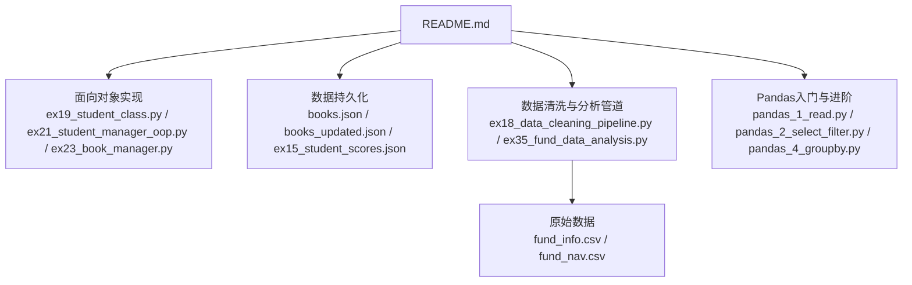
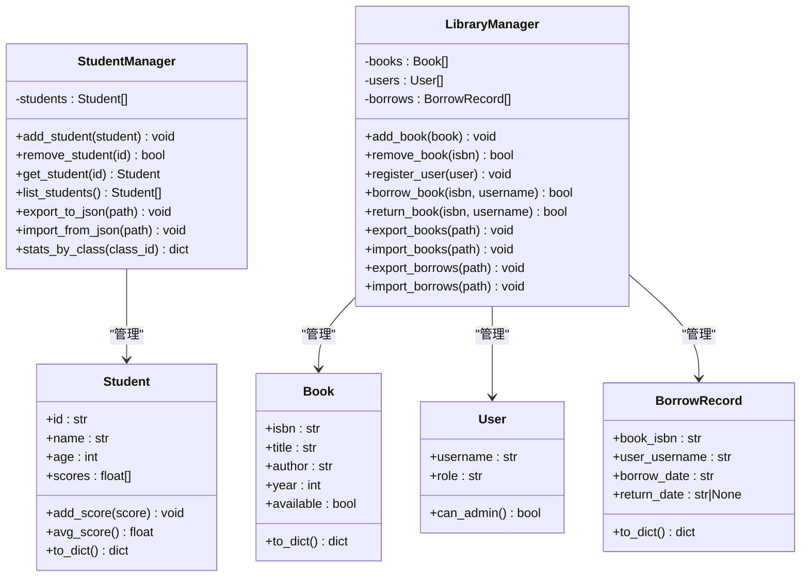
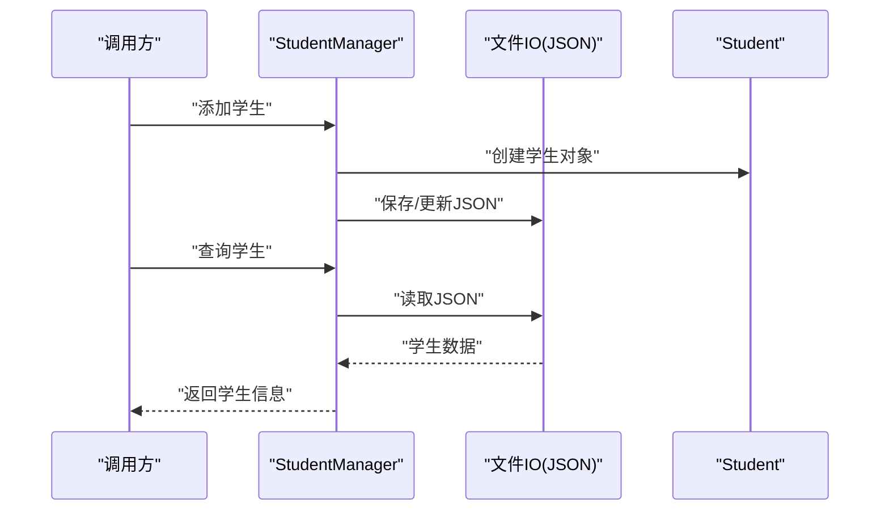
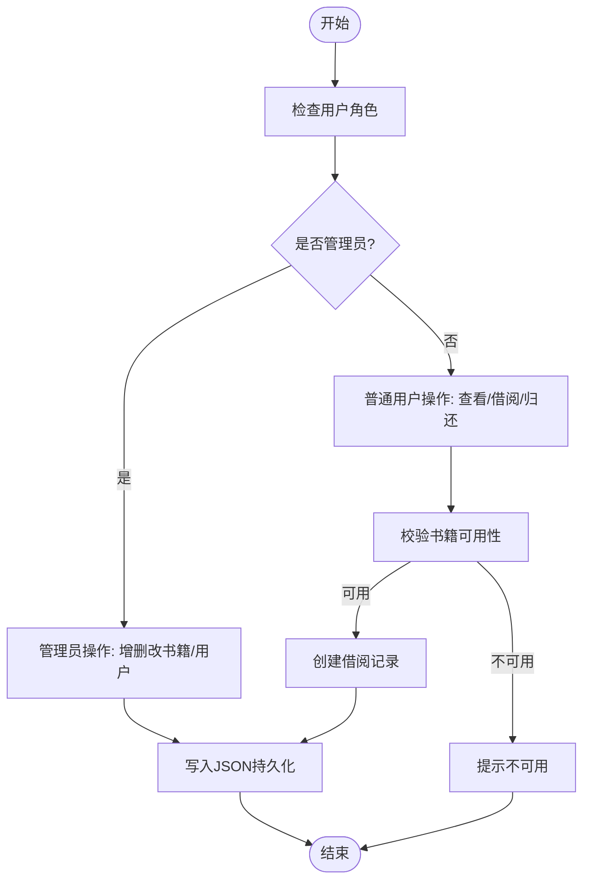
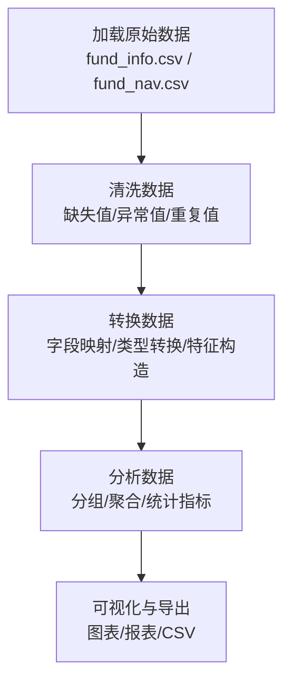
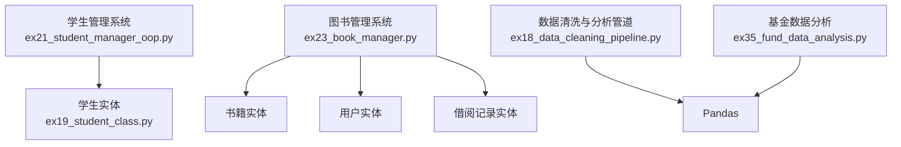

# 综合项目实践

<cite>
**本文引用的文件**   
- [README.md](file://README.md)
- [ex19_student_class.py](file://ex19_student_class.py)
- [ex21_student_manager_oop.py](file://ex21_student_manager_oop.py)
- [ex23_book_manager.py](file://ex23_book_manager.py)
- [books.json](file://books.json)
- [books_updated.json](file://books_updated.json)
- [ex18_data_cleaning_pipeline.py](file://ex18_data_cleaning_pipeline.py)
- [ex35_fund_data_analysis.py](file://ex35_fund_data_analysis.py)
- [fund_info.csv](file://fund_info.csv)
- [fund_nav.csv](file://fund_nav.csv)
- [pandas_1_read.py](file://pandas_1_read.py)
- [pandas_2_select_filter.py](file://pandas_2_select_filter.py)
- [pandas_4_groupby.py](file://pandas_4_groupby.py)
- [ex06_student_scores.py](file://ex06_student_scores.py)
- [ex15_student_scores_pro.py](file://ex15_student_scores_pro.py)
- [ex15_student_scores.json](file://ex15_student_scores.json)
</cite>

## 目录
1. [引言](#引言)
2. [项目结构](#项目结构)
3. [核心组件](#核心组件)
4. [架构总览](#架构总览)
5. [详细组件分析](#详细组件分析)
6. [依赖分析](#依赖分析)
7. [性能考虑](#性能考虑)
8. [故障排查指南](#故障排查指南)
9. [结论](#结论)
10. [附录](#附录)

## 引言
本指导文档面向希望系统掌握Python工程化实践的读者，围绕三个真实业务场景展开：学生管理系统、图书管理系统与数据分析管道。文档从需求分析、类结构设计、功能模块划分到数据交互与可视化，提供循序渐进的讲解，并通过基金数据分析案例展示数据处理挑战与解决方案。最后给出扩展指南，涵盖新功能添加、性能优化与部署建议。

## 项目结构
仓库采用“按主题/练习”组织的方式，包含基础语法示例、面向对象设计、文件与CSV/JSON处理、Pandas数据分析以及端到端的数据清洗与分析流程。关键路径如下：
- 面向对象与系统实现：ex19_student_class.py、ex21_student_manager_oop.py、ex23_book_manager.py
- 数据持久化与样例数据：books.json、books_updated.json、ex15_student_scores.json
- 数据清洗与分析管道：ex18_data_cleaning_pipeline.py、ex35_fund_data_analysis.py
- Pandas入门与进阶：pandas_1_read.py、pandas_2_select_filter.py、pandas_4_groupby.py
- 其他辅助练习：ex06_student_scores.py（成绩统计）、ex35_fund_data_analysis.py（基金分析）

图表来源
- [README.md](file://README.md)
- [ex19_student_class.py](file://ex19_student_class.py)
- [ex21_student_manager_oop.py](file://ex21_student_manager_oop.py)
- [ex23_book_manager.py](file://ex23_book_manager.py)
- [books.json](file://books.json)
- [books_updated.json](file://books_updated.json)
- [ex18_data_cleaning_pipeline.py](file://ex18_data_cleaning_pipeline.py)
- [ex35_fund_data_analysis.py](file://ex35_fund_data_analysis.py)
- [fund_info.csv](file://fund_info.csv)
- [fund_nav.csv](file://fund_nav.csv)
- [pandas_1_read.py](file://pandas_1_read.py)
- [pandas_2_select_filter.py](file://pandas_2_select_filter.py)
- [pandas_4_groupby.py](file://pandas_4_groupby.py)

章节来源
- [README.md](file://README.md)

## 核心组件
- 学生管理系统
  - 需求要点：学生信息增删改查、成绩管理、班级分组、统计导出、持久化存储。
  - 类结构：Student实体类、StudentManager管理类；支持容器化操作与魔法方法增强体验。
  - 数据流：内存对象 ↔ JSON/CSV持久化。
- 图书管理系统
  - 需求要点：书籍信息管理（增删改查）、借阅记录跟踪、用户权限控制（管理员/普通用户）。
  - 类结构：Book实体类、User实体类、BorrowRecord实体类、LibraryManager管理类；结合JSON进行持久化。
  - 数据流：JSON读写、业务校验与权限检查。
- 数据分析管道
  - 需求要点：数据获取→清洗→转换→分析→可视化。
  - 实现要点：Pandas读取CSV、缺失值与异常值处理、字段映射与类型转换、聚合统计、结果导出与可视化输出。
  - 案例：基金数据分析（净值走势、收益统计、风险指标等）。

章节来源
- [ex19_student_class.py](file://ex19_student_class.py)
- [ex21_student_manager_oop.py](file://ex21_student_manager_oop.py)
- [ex23_book_manager.py](file://ex23_book_manager.py)
- [ex18_data_cleaning_pipeline.py](file://ex18_data_cleaning_pipeline.py)
- [ex35_fund_data_analysis.py](file://ex35_fund_data_analysis.py)

## 架构总览
整体架构以“领域模型 + 管理器 + 数据源”为核心，通过清晰的职责分离实现可扩展与可维护的系统。

图表来源
- [ex19_student_class.py](file://ex19_student_class.py)
- [ex21_student_manager_oop.py](file://ex21_student_manager_oop.py)
- [ex23_book_manager.py](file://ex23_book_manager.py)

## 详细组件分析

### 学生管理系统
- 需求分析
  - 学生基本信息管理（ID、姓名、年龄、成绩列表）。
  - 成绩计算（平均分、最高分、最低分）。
  - 批量导入导出（JSON/CSV）。
  - 统计与查询（按班级、按分数段）。
- 类结构设计
  - Student：封装学生属性与成绩计算方法，提供序列化接口。
  - StudentManager：维护学生集合，提供CRUD、统计与持久化能力。
- 功能模块划分
  - 数据层：JSON/CSV读写。
  - 业务层：成绩统计、筛选与排序。
  - 接口层：命令行或简单API调用入口。
- 数据库交互
  - 当前使用JSON作为轻量持久化方案；可扩展至SQLite/MySQL。
- 复杂度与优化
  - 查找与过滤：基于索引（如ID字典）可将查找降至O(1)。
  - 批量操作：使用向量化或批处理减少I/O次数。

图表来源
- [ex19_student_class.py](file://ex19_student_class.py)
- [ex21_student_manager_oop.py](file://ex21_student_manager_oop.py)
- [ex15_student_scores.json](file://ex15_student_scores.json)

章节来源
- [ex19_student_class.py](file://ex19_student_class.py)
- [ex21_student_manager_oop.py](file://ex21_student_manager_oop.py)
- [ex06_student_scores.py](file://ex06_student_scores.py)
- [ex15_student_scores_pro.py](file://ex15_student_scores_pro.py)
- [ex15_student_scores.json](file://ex15_student_scores.json)

### 图书管理系统
- 业务逻辑
  - 书籍信息管理：ISBN为主键，支持增删改查与库存状态管理。
  - 借阅记录跟踪：借出与归还时间戳、状态流转。
  - 用户权限控制：管理员与普通用户角色区分，限制敏感操作。
- 类结构设计
  - Book：书籍实体，含可用状态。
  - User：用户实体，含角色与权限判断。
  - BorrowRecord：借阅记录实体。
  - LibraryManager：协调书籍、用户与借阅记录的完整业务流程。
- 数据持久化
  - 使用JSON文件存储书籍与借阅记录，便于演示与迁移。
- 权限控制流程
  - 管理员可执行全部操作；普通用户仅能查看与借阅/归还。

图表来源
- [ex23_book_manager.py](file://ex23_book_manager.py)
- [books.json](file://books.json)
- [books_updated.json](file://books_updated.json)

章节来源
- [ex23_book_manager.py](file://ex23_book_manager.py)
- [books.json](file://books.json)
- [books_updated.json](file://books_updated.json)

### 数据分析管道（数据清洗与分析）
- 管道阶段
  - 数据获取：从CSV/JSON读取原始数据。
  - 数据清洗：缺失值填充/删除、异常值检测与处理、重复行去重。
  - 数据转换：字段映射、类型转换、特征构造。
  - 数据分析：分组聚合、趋势分析、指标计算。
  - 可视化与导出：生成图表与报告，导出结果文件。
- 工具与库
  - Pandas用于数据加载、清洗与聚合。
  - Matplotlib/Seaborn用于可视化（可选）。
- 典型流程（以基金数据为例）

图表来源
- [ex18_data_cleaning_pipeline.py](file://ex18_data_cleaning_pipeline.py)
- [ex35_fund_data_analysis.py](file://ex35_fund_data_analysis.py)
- [fund_info.csv](file://fund_info.csv)
- [fund_nav.csv](file://fund_nav.csv)
- [pandas_1_read.py](file://pandas_1_read.py)
- [pandas_2_select_filter.py](file://pandas_2_select_filter.py)
- [pandas_4_groupby.py](file://pandas_4_groupby.py)

章节来源
- [ex18_data_cleaning_pipeline.py](file://ex18_data_cleaning_pipeline.py)
- [ex35_fund_data_analysis.py](file://ex35_fund_data_analysis.py)
- [pandas_1_read.py](file://pandas_1_read.py)
- [pandas_2_select_filter.py](file://pandas_2_select_filter.py)
- [pandas_4_groupby.py](file://pandas_4_groupby.py)

## 依赖分析
- 内部依赖
  - 学生管理与图书管理均依赖各自实体类与管理器，形成高内聚低耦合的结构。
  - 数据清洗与分析管道依赖Pandas生态，具备良好扩展性。
- 外部依赖
  - JSON/CSV标准库与第三方库（Pandas、Matplotlib/Seaborn等）。
- 潜在循环依赖
  - 当前模块边界清晰，未见循环依赖迹象。

图表来源
- [ex19_student_class.py](file://ex19_student_class.py)
- [ex21_student_manager_oop.py](file://ex21_student_manager_oop.py)
- [ex23_book_manager.py](file://ex23_book_manager.py)
- [ex18_data_cleaning_pipeline.py](file://ex18_data_cleaning_pipeline.py)
- [ex35_fund_data_analysis.py](file://ex35_fund_data_analysis.py)

## 性能考虑
- 数据结构选择
  - 使用字典索引替代线性扫描，提升查找与更新效率。
- I/O优化
  - 批量读写JSON/CSV，减少频繁磁盘访问。
- 计算优化
  - 利用Pandas向量化操作替代逐行循环，提高清洗与聚合速度。
- 内存管理
  - 大数据集分块处理，避免一次性加载导致内存溢出。
- 并发与异步
  - 对独立任务（如多文件清洗）可采用多线程或多进程并行处理。

## 故障排查指南
- 常见错误
  - 文件路径不存在或权限不足：检查路径与运行环境权限。
  - JSON格式错误：确保序列化为合法JSON，注意特殊字符转义。
  - CSV编码问题：统一使用UTF-8编码，必要时指定编码参数。
  - 数据类型不一致：在清洗阶段进行类型转换与校验。
- 调试策略
  - 增加日志记录，定位失败步骤。
  - 使用断点与中间结果输出，验证每一步数据质量。
  - 单元测试覆盖关键函数与边界条件。

## 结论
本项目通过学生管理系统、图书管理系统与数据分析管道三大模块，展示了Python在面向对象设计与数据处理方面的综合能力。借助清晰的类结构与模块化设计，系统具备良好的扩展性与可维护性；通过Pandas构建的数据清洗与分析管道，能够高效应对真实业务场景中的数据挑战。建议在后续迭代中引入数据库持久化、权限框架与自动化测试，进一步提升系统的健壮性与可观测性。

## 附录
- 扩展指南
  - 新功能添加：遵循单一职责原则，新增实体与管理器，保持接口稳定。
  - 性能优化：引入索引、缓存与批处理机制，评估并监控关键路径耗时。
  - 部署考虑：使用虚拟环境隔离依赖，配置环境变量与配置文件，编写Dockerfile与CI/CD流水线。
- 参考练习
  - 成绩统计与导出：ex06_student_scores.py、ex15_student_scores_pro.py、ex15_student_scores.json
  - Pandas入门与进阶：pandas_1_read.py、pandas_2_select_filter.py、pandas_4_groupby.py