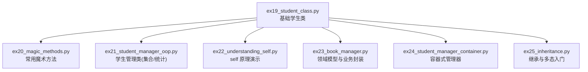
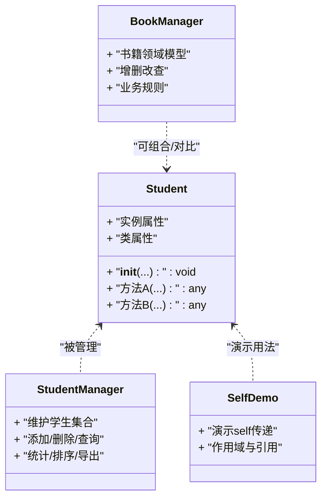
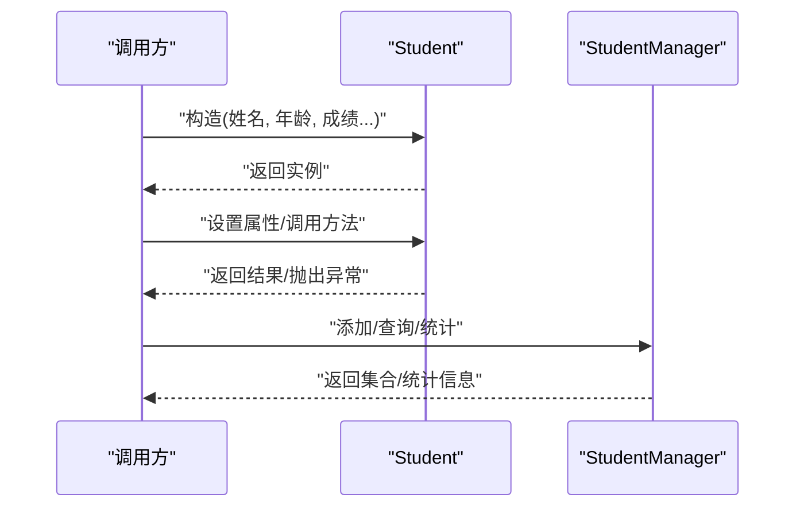
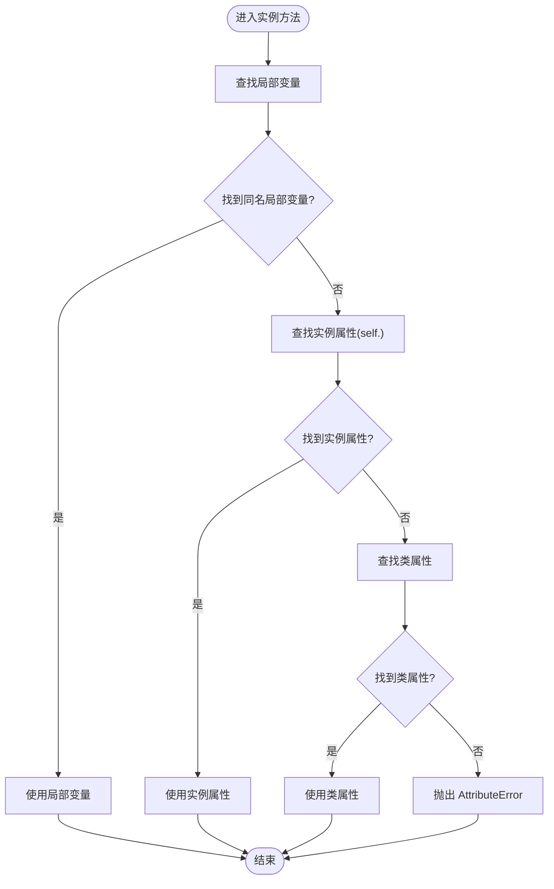
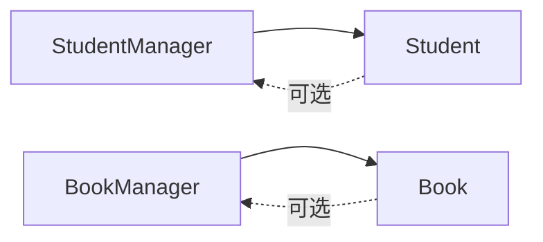

# 类与对象基础

<cite>
**本文引用的文件**   
- [ex19_student_class.py](file://ex19_student_class.py)
- [ex20_magic_methods.py](file://ex20_magic_methods.py)
- [ex21_student_manager_oop.py](file://ex21_student_manager_oop.py)
- [ex22_understanding_self.py](file://ex22_understanding_self.py)
- [ex23_book_manager.py](file://ex23_book_manager.py)
- [ex24_student_manager_container.py](file://ex24_student_manager_container.py)
- [ex25_inheritance.py](file://ex25_inheritance.py)
</cite>

## 目录
1. [简介](#简介)
2. [项目结构](#项目结构)
3. [核心组件](#核心组件)
4. [架构总览](#架构总览)
5. [详细组件分析](#详细组件分析)
6. [依赖关系分析](#依赖关系分析)
7. [性能考虑](#性能考虑)
8. [故障排查指南](#故障排查指南)
9. [结论](#结论)
10. [附录](#附录)

## 简介
本文件面向初学者，系统讲解 Python 面向对象编程的核心概念：类的定义语法、属性（实例变量与类变量）、方法定义与调用机制、self 关键字的工作原理与作用域管理。通过“学生类”的实际案例，展示如何创建类、实例化对象、访问属性和调用方法，并涵盖构造函数 __init__ 的使用、默认参数设置、属性验证等最佳实践。同时提供常见错误与调试技巧，帮助读者建立对面向对象思想的直观理解。

## 项目结构
仓库中与“类与对象”主题直接相关的示例集中在根目录下的一系列脚本中，涵盖了从基础类定义到进阶的魔法方法、继承与管理器模式的完整学习路径。下图展示了这些文件在面向对象学习中的角色与关联。

图表来源
- [ex19_student_class.py:1-200](file://ex19_student_class.py#L1-L200)
- [ex20_magic_methods.py:1-200](file://ex20_magic_methods.py#L1-L200)
- [ex21_student_manager_oop.py:1-200](file://ex21_student_manager_oop.py#L1-L200)
- [ex22_understanding_self.py:1-200](file://ex22_understanding_self.py#L1-L200)
- [ex23_book_manager.py:1-200](file://ex23_book_manager.py#L1-L200)
- [ex24_student_manager_container.py:1-200](file://ex24_student_manager_container.py#L1-L200)
- [ex25_inheritance.py:1-200](file://ex25_inheritance.py#L1-L200)

章节来源
- [ex19_student_class.py:1-200](file://ex19_student_class.py#L1-L200)
- [ex20_magic_methods.py:1-200](file://ex20_magic_methods.py#L1-L200)
- [ex21_student_manager_oop.py:1-200](file://ex21_student_manager_oop.py#L1-L200)
- [ex22_understanding_self.py:1-200](file://ex22_understanding_self.py#L1-L200)
- [ex23_book_manager.py:1-200](file://ex23_book_manager.py#L1-L200)
- [ex24_student_manager_container.py:1-200](file://ex24_student_manager_container.py#L1-L200)
- [ex25_inheritance.py:1-200](file://ex25_inheritance.py#L1-L200)

## 核心组件
本节聚焦于面向对象的基础构件：类、属性与方法，并结合学生类案例说明其工作方式。

- 类的定义与实例化
  - 使用 class 关键字定义类；通过类名加括号进行实例化，得到对象。
  - 实例拥有独立的实例变量，类级别共享类变量。
- 属性（实例变量与类变量）
  - 实例变量通常在构造或方法中赋值，属于具体对象。
  - 类变量在类体中定义，被所有实例共享。
- 方法与调用
  - 实例方法第一个参数约定为 self，代表当前实例的引用。
  - 通过“对象.方法()”的方式调用实例方法；类方法/静态方法有各自的装饰器与用途。
- 构造函数 __init__
  - 用于初始化实例状态，支持默认参数与参数校验。
  - 推荐在 __init__ 中完成必要属性的绑定与合法性检查。
- 属性验证与封装
  - 可通过 property 将“读取/写入逻辑”与“数据访问”解耦，实现输入校验与计算属性。
- 常用魔术方法
  - 如字符串表示、比较、算术运算等，提升类的易用性与可读性。

章节来源
- [ex19_student_class.py:1-200](file://ex19_student_class.py#L1-L200)
- [ex20_magic_methods.py:1-200](file://ex20_magic_methods.py#L1-L200)
- [ex21_student_manager_oop.py:1-200](file://ex21_student_manager_oop.py#L1-L200)
- [ex22_understanding_self.py:1-200](file://ex22_understanding_self.py#L1-L200)

## 架构总览
下图以“学生类”为核心，展示其与相关管理器、工具类之间的交互关系，体现“领域模型 + 管理器”的常见组织方式。

图表来源
- [ex19_student_class.py:1-200](file://ex19_student_class.py#L1-L200)
- [ex21_student_manager_oop.py:1-200](file://ex21_student_manager_oop.py#L1-L200)
- [ex22_understanding_self.py:1-200](file://ex22_understanding_self.py#L1-L200)
- [ex23_book_manager.py:1-200](file://ex23_book_manager.py#L1-L200)

## 详细组件分析

### 学生类（Student）分析与最佳实践
- 设计要点
  - 在 __init__ 中完成必要字段初始化，并提供合理的默认值。
  - 对关键属性（如成绩、年龄）进行范围校验，避免非法状态。
  - 提供只读或带校验的读写接口，必要时使用 property。
  - 实现必要的魔术方法（如字符串表示、比较），便于打印与排序。
- 典型流程（序列图）

图表来源
- [ex19_student_class.py:1-200](file://ex19_student_class.py#L1-L200)
- [ex21_student_manager_oop.py:1-200](file://ex21_student_manager_oop.py#L1-L200)

章节来源
- [ex19_student_class.py:1-200](file://ex19_student_class.py#L1-L200)
- [ex21_student_manager_oop.py:1-200](file://ex21_student_manager_oop.py#L1-L200)

### self 关键字工作原理与作用域
- 核心概念
  - self 是实例方法的第一个参数，指向调用该方法的实例对象。
  - 调用时由解释器自动传入，无需显式传参。
  - self 允许在方法内访问和修改实例属性，也可调用其他实例方法。
- 内存与引用
  - self 是对象的引用，修改 self 的属性会直接影响原对象。
  - 注意可变对象（列表、字典）的共享与副作用。
- 作用域与命名冲突
  - 局部变量优先于实例属性；同名时使用 self. 明确访问实例属性。
- 流程图（属性访问解析）

图表来源
- [ex22_understanding_self.py:1-200](file://ex22_understanding_self.py#L1-L200)

章节来源
- [ex22_understanding_self.py:1-200](file://ex22_understanding_self.py#L1-L200)

### 魔术方法与表达式友好
- 目标
  - 让类更“像内置类型”，支持 print、比较、算术等操作。
- 常用方法
  - 字符串表示：用于友好的打印输出。
  - 比较：支持 ==、!=、<、<=、>、>=。
  - 算术：支持 +、-、*、/ 等（按业务语义实现）。
- 建议
  - 保持对称性与一致性，例如实现 __eq__ 时同时考虑哈希与相等性。
  - 谨慎重载运算符，确保行为符合直觉。

章节来源
- [ex20_magic_methods.py:1-200](file://ex20_magic_methods.py#L1-L200)

### 管理器模式与容器封装
- 职责分离
  - 领域模型（如 Student）专注自身数据与行为。
  - 管理器（如 StudentManager）负责集合操作、统计、持久化等横切关注点。
- 常见能力
  - 增删改查、过滤、排序、聚合统计、导出。
- 容器式管理器
  - 将集合操作封装为类，对外暴露简洁 API，隐藏内部数据结构细节。

章节来源
- [ex21_student_manager_oop.py:1-200](file://ex21_student_manager_oop.py#L1-L200)
- [ex24_student_manager_container.py:1-200](file://ex24_student_manager_container.py#L1-L200)

### 领域模型与业务封装（图书示例）
- 目的
  - 用类表达真实世界实体，把数据与行为放在一起，提高内聚性。
- 要点
  - 明确不变量与约束（如价格非负、库存数量合理）。
  - 提供业务方法（如借出、归还、盘点），而非仅暴露原始数据。
  - 与外部系统交互时，尽量在管理器层处理 IO 与协议细节。

章节来源
- [ex23_book_manager.py:1-200](file://ex23_book_manager.py#L1-L200)

### 继承与多态入门
- 动机
  - 复用公共逻辑，扩展或定制特定行为。
- 原则
  - 子类应能替换父类（里氏替换原则）。
  - 优先组合优于继承，避免过度派生。
- 实践
  - 在子类中重写方法以实现差异化行为。
  - 合理使用 super() 调用父类实现，避免重复代码。

章节来源
- [ex25_inheritance.py:1-200](file://ex25_inheritance.py#L1-L200)

## 依赖关系分析
- 耦合与内聚
  - 领域模型（Student、Book）高内聚，专注于自身状态与行为。
  - 管理器（StudentManager、BookManager）作为协调者，降低调用方复杂度。
- 直接依赖
  - 管理器依赖领域模型；领域模型通常不反向依赖管理器。
- 潜在循环
  - 避免管理器之间互相强依赖，必要时引入接口或事件机制解耦。

图表来源
- [ex19_student_class.py:1-200](file://ex19_student_class.py#L1-L200)
- [ex21_student_manager_oop.py:1-200](file://ex21_student_manager_oop.py#L1-L200)
- [ex23_book_manager.py:1-200](file://ex23_book_manager.py#L1-L200)

章节来源
- [ex19_student_class.py:1-200](file://ex19_student_class.py#L1-L200)
- [ex21_student_manager_oop.py:1-200](file://ex21_student_manager_oop.py#L1-L200)
- [ex23_book_manager.py:1-200](file://ex23_book_manager.py#L1-L200)

## 性能考虑
- 属性访问
  - 频繁的属性访问可能带来开销，可在热点路径缓存计算结果。
- 大对象与拷贝
  - 避免不必要的深拷贝；注意可变对象的共享与副作用。
- 集合操作
  - 在管理器中进行批量操作时，优先使用向量化或惰性求值策略（如生成器）。
- 魔术方法
  - 谨慎重载高频运算符，避免在热路径执行复杂逻辑。

[本节为通用指导，不涉及具体文件]

## 故障排查指南
- 常见问题
  - 忘记 self 参数：导致 TypeError。
  - 未调用父类 __init__：导致部分属性未初始化。
  - 误用类变量代替实例变量：造成状态污染。
  - 可变默认参数：引发意外共享状态。
  - 属性名冲突：局部变量遮蔽实例属性。
- 定位技巧
  - 使用断点与日志记录关键状态变化。
  - 打印 repr/str 快速查看对象快照。
  - 使用 type()/isinstance() 确认对象类型与继承链。
  - 借助 IDE 的“跳转到定义”与“查找引用”追踪依赖。
- 修复建议
  - 在 __init__ 中集中初始化与校验。
  - 使用 property 统一访问入口，集中处理校验与副作用。
  - 将可变默认参数改为 None，并在方法体内初始化。

章节来源
- [ex22_understanding_self.py:1-200](file://ex22_understanding_self.py#L1-L200)
- [ex20_magic_methods.py:1-200](file://ex20_magic_methods.py#L1-L200)

## 结论
通过学生类及相关管理器、魔术方法与继承示例，我们系统地梳理了 Python 面向对象的核心概念与实践要点。掌握 self 的作用域与引用语义、合理划分领域模型与管理器职责、善用魔术方法与属性封装，是写出健壮且易维护代码的关键。建议在后续学习中结合更多真实场景，逐步引入抽象、接口与测试，持续提升设计与工程质量。

## 附录
- 术语速查
  - 类：对象的蓝图，描述数据与行为。
  - 实例：根据类创建的具体对象。
  - 属性：对象或类拥有的数据。
  - 方法：与对象或类绑定的函数。
  - 构造函数：初始化实例的特殊方法。
  - 魔术方法：以双下划线包裹的特殊方法，用于语言特性扩展。
  - 继承：基于已有类构建新类的能力。
- 学习路径建议
  - 先掌握类与实例、属性与方法的基本用法。
  - 再深入魔术方法与属性封装。
  - 最后学习继承、组合与管理器模式。