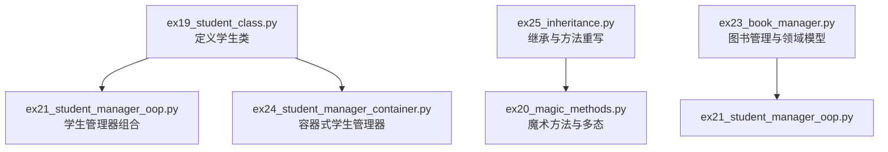
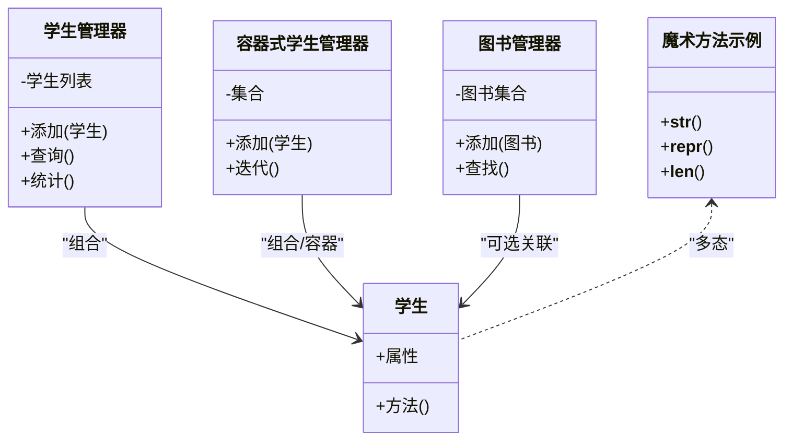
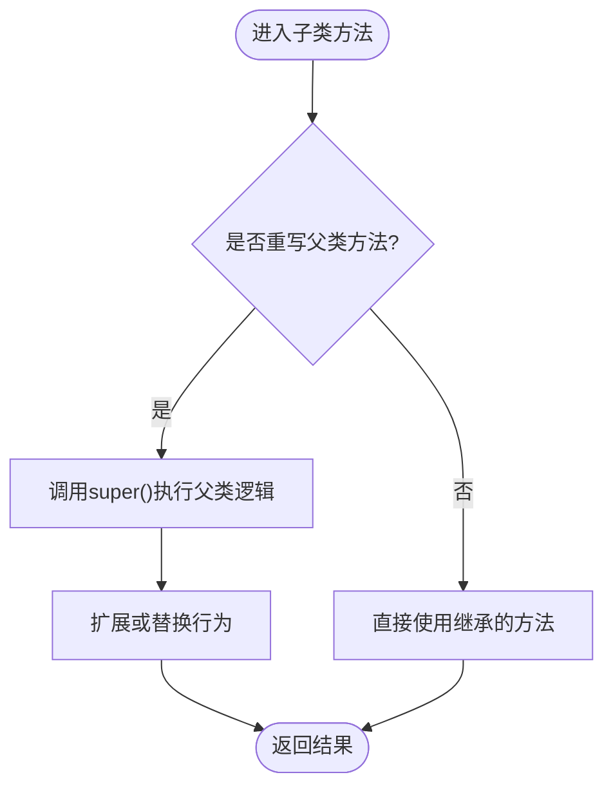
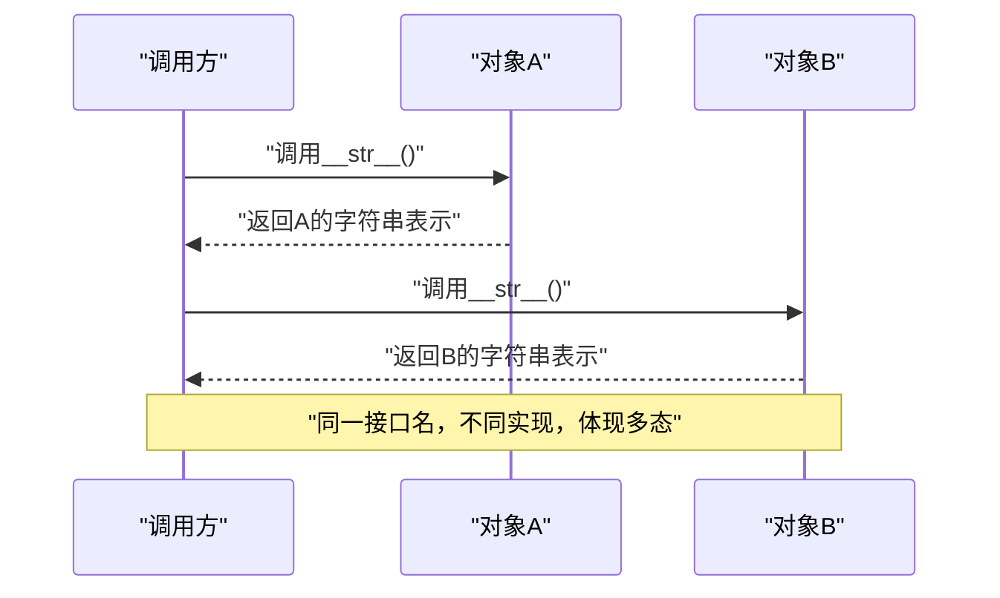
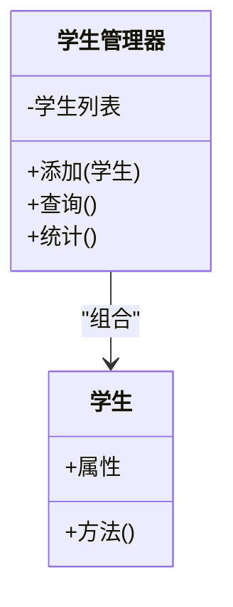
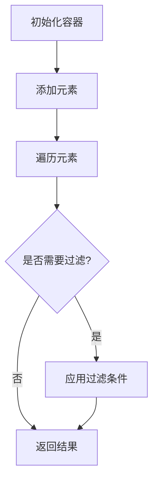
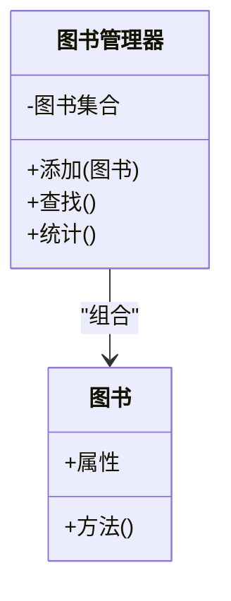
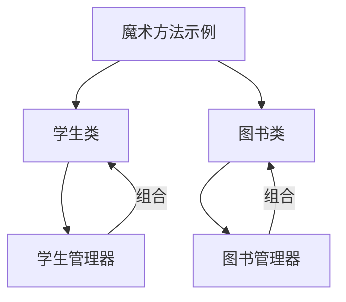

# 继承与多态

<cite>
**本文引用的文件**   
- [ex25_inheritance.py](file://ex25_inheritance.py)
- [ex19_student_class.py](file://ex19_student_class.py)
- [ex20_magic_methods.py](file://ex20_magic_methods.py)
- [ex21_student_manager_oop.py](file://ex21_student_manager_oop.py)
- [ex23_book_manager.py](file://ex23_book_manager.py)
- [ex24_student_manager_container.py](file://ex24_student_manager_container.py)
</cite>

## 目录
1. [简介](#简介)
2. [项目结构](#项目结构)
3. [核心组件](#核心组件)
4. [架构总览](#架构总览)
5. [详细组件分析](#详细组件分析)
6. [依赖关系分析](#依赖关系分析)
7. [性能考虑](#性能考虑)
8. [故障排查指南](#故障排查指南)
9. [结论](#结论)
10. [附录](#附录)

## 简介
本文件围绕Python的继承与多态机制，结合仓库中的面向对象示例代码，系统阐述以下主题：
- 继承的基本概念：父类（基类）与子类（派生类）的关系、单继承与多继承的实现方式
- 方法重写（override）的原理与使用场景，以及通过super()调用父类方法
- 多态的概念：接口设计、鸭子类型与运行时多态
- 继承层次结构的设计模式：代码复用、扩展性与可维护性
- 最佳实践与设计原则：组合优于继承的思想

为便于读者理解，文档在关键章节提供基于实际源码的结构化图示与流程说明，并在需要时给出“章节来源”以定位到具体实现。

## 项目结构
仓库中包含多个面向对象的练习脚本，其中与继承和多态直接相关的核心文件如下：
- ex25_inheritance.py：演示继承与方法重写的典型用法
- ex19_student_class.py：定义学生类，作为后续管理器的基础实体
- ex20_magic_methods.py：展示魔术方法与多态的结合点
- ex21_student_manager_oop.py：引入管理器类，体现职责分离与组合思想
- ex23_book_manager.py：图书管理相关逻辑，可作为领域模型与管理器结合的参考
- ex24_student_manager_container.py：容器式管理器，体现聚合与组合的使用

图表来源
- [ex19_student_class.py:1-200](file://ex19_student_class.py#L1-L200)
- [ex21_student_manager_oop.py:1-200](file://ex21_student_manager_oop.py#L1-L200)
- [ex24_student_manager_container.py:1-200](file://ex24_student_manager_container.py#L1-L200)
- [ex25_inheritance.py:1-200](file://ex25_inheritance.py#L1-L200)
- [ex20_magic_methods.py:1-200](file://ex20_magic_methods.py#L1-L200)
- [ex23_book_manager.py:1-200](file://ex23_book_manager.py#L1-L200)

章节来源
- [ex19_student_class.py:1-200](file://ex19_student_class.py#L1-L200)
- [ex21_student_manager_oop.py:1-200](file://ex21_student_manager_oop.py#L1-L200)
- [ex24_student_manager_container.py:1-200](file://ex24_student_manager_container.py#L1-L200)
- [ex25_inheritance.py:1-200](file://ex25_inheritance.py#L1-L200)
- [ex20_magic_methods.py:1-200](file://ex20_magic_methods.py#L1-L200)
- [ex23_book_manager.py:1-200](file://ex23_book_manager.py#L1-L200)

## 核心组件
本节聚焦于继承与多态的核心实现要点，并结合仓库中的示例进行说明：
- 继承与方法重写：通过子类扩展或替换父类行为，提升复用与扩展能力
- super()调用：在子类中安全地调用父类方法，避免重复实现
- 多态：通过统一接口与鸭子类型，在不同对象上调用相同方法名得到不同结果
- 组合优于继承：在复杂系统中优先使用组合来组织职责，降低耦合度

章节来源
- [ex25_inheritance.py:1-200](file://ex25_inheritance.py#L1-L200)
- [ex20_magic_methods.py:1-200](file://ex20_magic_methods.py#L1-L200)
- [ex21_student_manager_oop.py:1-200](file://ex21_student_manager_oop.py#L1-L200)
- [ex24_student_manager_container.py:1-200](file://ex24_student_manager_container.py#L1-L200)

## 架构总览
下图展示了学生与图书管理领域的类关系与交互，突出继承层次与组合边界：

图表来源
- [ex19_student_class.py:1-200](file://ex19_student_class.py#L1-L200)
- [ex21_student_manager_oop.py:1-200](file://ex21_student_manager_oop.py#L1-L200)
- [ex24_student_manager_container.py:1-200](file://ex24_student_manager_container.py#L1-L200)
- [ex23_book_manager.py:1-200](file://ex23_book_manager.py#L1-L200)
- [ex20_magic_methods.py:1-200](file://ex20_magic_methods.py#L1-L200)

## 详细组件分析

### 继承与方法重写（ex25_inheritance.py）
- 继承层次：通过子类继承父类，获得已有属性与方法；可在子类中重写方法以定制行为
- 方法重写：子类覆盖父类同名方法，实现特定业务逻辑；必要时通过super()调用父类实现，保证扩展而不破坏原有行为
- 适用场景：当存在“is-a”关系且需要差异化行为时，优先考虑继承；若差异较大或关系复杂，应评估组合方案

图表来源
- [ex25_inheritance.py:1-200](file://ex25_inheritance.py#L1-L200)

章节来源
- [ex25_inheritance.py:1-200](file://ex25_inheritance.py#L1-L200)

### 魔术方法与多态（ex20_magic_methods.py）
- 魔术方法：如字符串表示、长度计算等，为对象提供统一的内置接口
- 多态体现：不同对象实现相同的魔术方法名，外部调用无需关心具体类型，即可得到符合预期的结果
- 设计建议：在自定义容器中或领域模型中合理使用魔术方法，增强可读性与一致性

图表来源
- [ex20_magic_methods.py:1-200](file://ex20_magic_methods.py#L1-L200)

章节来源
- [ex20_magic_methods.py:1-200](file://ex20_magic_methods.py#L1-L200)

### 学生类与管理器（ex19_student_class.py、ex21_student_manager_oop.py）
- 学生类：封装学生的基本属性与行为，作为领域模型的基础单元
- 学生管理器：通过组合持有学生集合，提供添加、查询、统计等管理能力
- 职责分离：学生类关注自身状态与行为，管理器关注集合操作与业务流程，降低耦合

图表来源
- [ex19_student_class.py:1-200](file://ex19_student_class.py#L1-L200)
- [ex21_student_manager_oop.py:1-200](file://ex21_student_manager_oop.py#L1-L200)

章节来源
- [ex19_student_class.py:1-200](file://ex19_student_class.py#L1-L200)
- [ex21_student_manager_oop.py:1-200](file://ex21_student_manager_oop.py#L1-L200)

### 容器式学生管理器（ex24_student_manager_container.py）
- 容器式管理：将集合操作抽象为容器，支持迭代、计数等通用能力
- 组合与复用：通过组合现有容器类型，快速构建具备标准行为的自定义容器
- 扩展性：在不修改学生类的前提下，增加新的容器策略或过滤规则

图表来源
- [ex24_student_manager_container.py:1-200](file://ex24_student_manager_container.py#L1-L200)

章节来源
- [ex24_student_manager_container.py:1-200](file://ex24_student_manager_container.py#L1-L200)

### 图书管理与领域模型（ex23_book_manager.py）
- 领域模型：图书类封装书名、作者、ISBN等属性与校验逻辑
- 管理器职责：负责图书的增删改查与统计，与领域模型解耦
- 多态与接口：若未来引入多种资源类型（如期刊、报告），可通过统一接口实现多态处理

图表来源
- [ex23_book_manager.py:1-200](file://ex23_book_manager.py#L1-L200)

章节来源
- [ex23_book_manager.py:1-200](file://ex23_book_manager.py#L1-L200)

## 依赖关系分析
- 低耦合高内聚：学生类与图书类各自封装领域逻辑，管理器通过组合持有这些对象，避免深层继承带来的紧耦合
- 多态接口：通过魔术方法与统一方法名，使不同对象在同一调用路径下表现一致
- 可扩展性：新增领域对象或容器策略时，只需遵循既有接口约定，无需修改现有管理器逻辑

图表来源
- [ex19_student_class.py:1-200](file://ex19_student_class.py#L1-L200)
- [ex21_student_manager_oop.py:1-200](file://ex21_student_manager_oop.py#L1-L200)
- [ex23_book_manager.py:1-200](file://ex23_book_manager.py#L1-L200)
- [ex20_magic_methods.py:1-200](file://ex20_magic_methods.py#L1-L200)

章节来源
- [ex19_student_class.py:1-200](file://ex19_student_class.py#L1-L200)
- [ex21_student_manager_oop.py:1-200](file://ex21_student_manager_oop.py#L1-L200)
- [ex23_book_manager.py:1-200](file://ex23_book_manager.py#L1-L200)
- [ex20_magic_methods.py:1-200](file://ex20_magic_methods.py#L1-L200)

## 性能考虑
- 继承链深度：过深的继承层次会增加方法解析成本，影响运行效率；建议保持合理的继承层级
- 方法重写开销：频繁的重写与super()调用会带来额外开销，应在必要处使用
- 组合与缓存：对热点路径可采用组合+缓存策略，减少重复计算
- 容器选择：根据数据规模与访问模式选择合适的容器类型，以提升整体性能

[本节为通用指导，不直接分析具体文件]

## 故障排查指南
- 方法未找到错误：检查子类是否正确继承父类，或是否存在拼写错误导致方法名不一致
- super()调用异常：确认父类构造与初始化顺序，确保super()在合适的时机被调用
- 多态行为不符：验证对象是否实现了约定的接口方法，或是否存在命名冲突
- 组合对象为空：检查管理器是否在正确时机创建并注入依赖对象

章节来源
- [ex25_inheritance.py:1-200](file://ex25_inheritance.py#L1-L200)
- [ex20_magic_methods.py:1-200](file://ex20_magic_methods.py#L1-L200)
- [ex21_student_manager_oop.py:1-200](file://ex21_student_manager_oop.py#L1-L200)

## 结论
- 继承与方法重写适用于清晰的“is-a”关系与行为扩展场景，但需谨慎控制继承深度
- 多态通过统一接口与鸭子类型提升系统的灵活性与可测试性
- 组合优于继承：在复杂系统中优先使用组合来组织职责，降低耦合度，提高可维护性
- 合理运用魔术方法与容器式管理，可以显著提升代码的可读性与扩展性

[本节为总结性内容，不直接分析具体文件]

## 附录
- 术语对照
  - 父类/基类：被继承的类
  - 子类/派生类：继承自父类的类
  - 方法重写：子类覆盖父类同名方法
  - 多态：同一接口名对应不同实现
  - 组合：对象之间通过引用协作，而非继承
- 推荐实践
  - 明确“is-a”与“has-a”关系，优先使用组合
  - 保持接口稳定，避免频繁变更公共方法签名
  - 在子类中尽量通过super()复用父类逻辑，减少重复代码
  - 为关键方法编写单元测试，确保重写与多态行为符合预期

[本节为补充信息，不直接分析具体文件]