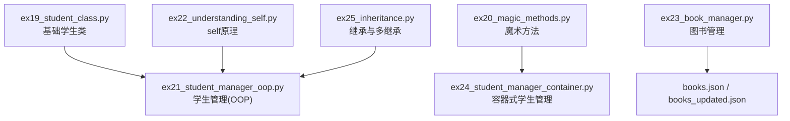
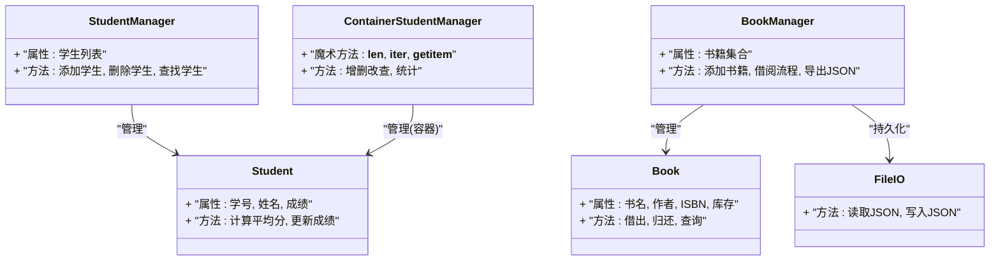
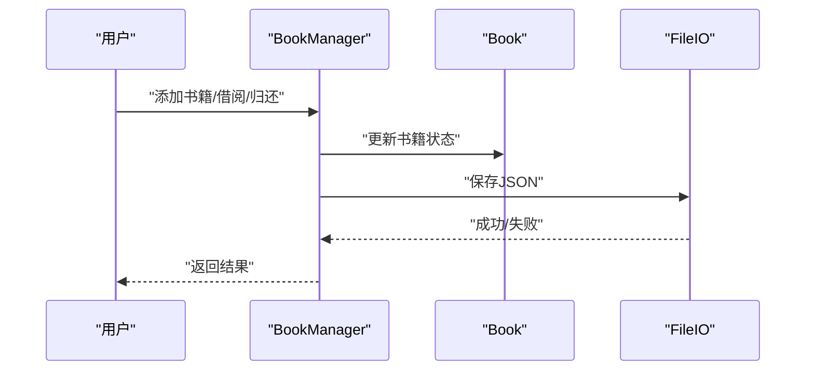
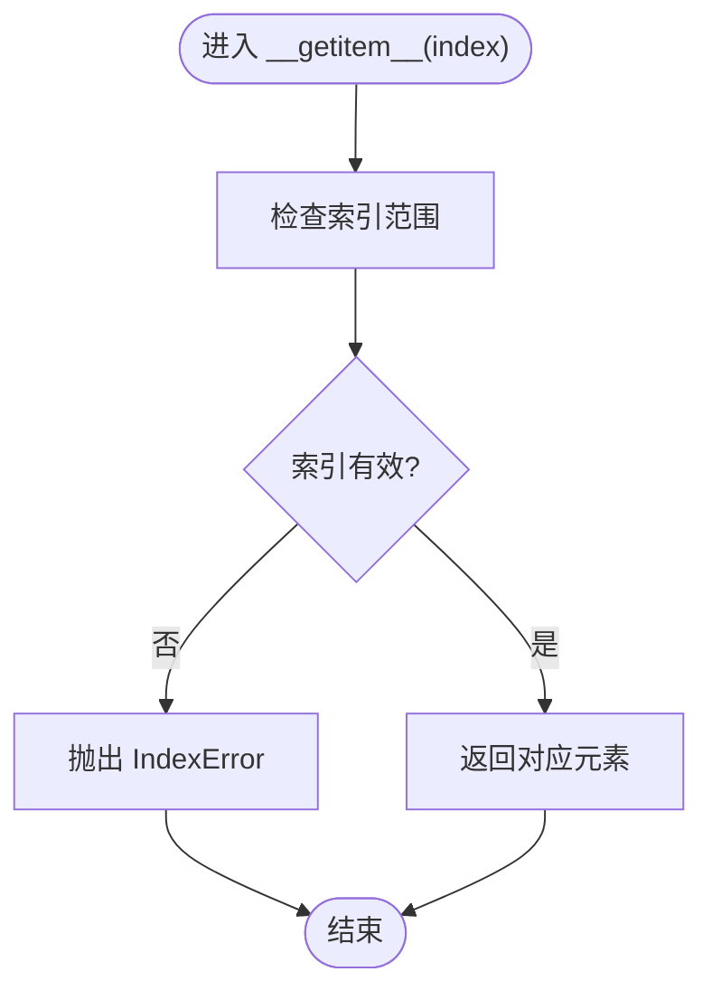
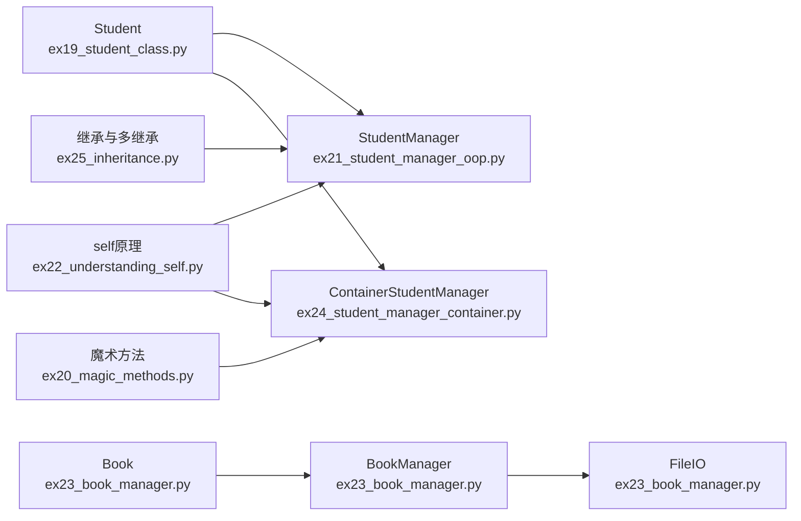

# 面向对象编程

<cite>
**本文引用的文件**   
- [ex19_student_class.py](file://ex19_student_class.py)
- [ex20_magic_methods.py](file://ex20_magic_methods.py)
- [ex21_student_manager_oop.py](file://ex21_student_manager_oop.py)
- [ex22_understanding_self.py](file://ex22_understanding_self.py)
- [ex23_book_manager.py](file://ex23_book_manager.py)
- [ex24_student_manager_container.py](file://ex24_student_manager_container.py)
- [ex25_inheritance.py](file://ex25_inheritance.py)
</cite>

## 目录
1. [简介](#简介)
2. [项目结构](#项目结构)
3. [核心组件](#核心组件)
4. [架构总览](#架构总览)
5. [详细组件分析](#详细组件分析)
6. [依赖关系分析](#依赖关系分析)
7. [性能与可维护性建议](#性能与可维护性建议)
8. [故障排查指南](#故障排查指南)
9. [结论](#结论)
10. [附录：实践清单与最佳实践](#附录实践清单与最佳实践)

## 简介
本指南围绕Python面向对象编程（OOP）展开，聚焦以下主题：
- 类与对象：类的定义、实例化、属性与方法组织
- self关键字：工作原理与作用域管理
- 继承机制：单继承、多继承、方法重写与super()使用
- 魔术方法：常用实现如__init__、__str__、__len__等
- 实战案例：学生管理系统、图书管理系统等，展示设计原则与应用模式

目标读者为初学者与有一定基础的开发者，旨在通过循序渐进的讲解与可视化图示，帮助读者建立系统化的OOP知识体系。

## 项目结构
仓库中包含多个面向对象的示例脚本，涵盖基础类定义、魔术方法、管理器容器、继承与多继承等主题。关键文件如下：
- ex19_student_class.py：基础学生类定义与实例化
- ex20_magic_methods.py：魔术方法演示
- ex21_student_manager_oop.py：基于OOP的学生管理
- ex22_understanding_self.py：self关键字深入理解
- ex23_book_manager.py：图书管理与数据持久化
- ex24_student_manager_container.py：容器式学生管理（支持迭代/长度等）
- ex25_inheritance.py：继承与多继承示例

图表来源
- [ex19_student_class.py](file://ex19_student_class.py)
- [ex20_magic_methods.py](file://ex20_magic_methods.py)
- [ex21_student_manager_oop.py](file://ex21_student_manager_oop.py)
- [ex22_understanding_self.py](file://ex22_understanding_self.py)
- [ex23_book_manager.py](file://ex23_book_manager.py)
- [ex24_student_manager_container.py](file://ex24_student_manager_container.py)
- [ex25_inheritance.py](file://ex25_inheritance.py)

章节来源
- [ex19_student_class.py](file://ex19_student_class.py)
- [ex20_magic_methods.py](file://ex20_magic_methods.py)
- [ex21_student_manager_oop.py](file://ex21_student_manager_oop.py)
- [ex22_understanding_self.py](file://ex22_understanding_self.py)
- [ex23_book_manager.py](file://ex23_book_manager.py)
- [ex24_student_manager_container.py](file://ex24_student_manager_container.py)
- [ex25_inheritance.py](file://ex25_inheritance.py)

## 核心组件
本节从概念到实现，梳理OOP的关键要素，并结合仓库中的示例进行说明。

- 类与对象
  - 类是蓝图，对象是具体实例；通过类定义属性和方法，通过实例化创建对象
  - 参考：[ex19_student_class.py](file://ex19_student_class.py)
- 属性与方法组织
  - 实例属性在构造或方法中设置，类属性用于共享状态
  - 方法分为实例方法、类方法、静态方法（视具体实现而定）
  - 参考：[ex19_student_class.py](file://ex19_student_class.py)、[ex21_student_manager_oop.py](file://ex21_student_manager_oop.py)
- self关键字
  - self指向当前实例，用于访问实例属性与方法，体现作用域绑定
  - 参考：[ex22_understanding_self.py](file://ex22_understanding_self.py)
- 继承机制
  - 单继承：子类扩展父类功能
  - 多继承：组合多个父类能力，注意MRO与方法解析顺序
  - super()：调用父类方法，避免重复代码
  - 参考：[ex25_inheritance.py](file://ex25_inheritance.py)
- 魔术方法
  - __init__：初始化实例
  - __str__：字符串表示
  - __len__：长度语义
  - 其他常见：__repr__、__eq__、__getitem__、__iter__等
  - 参考：[ex20_magic_methods.py](file://ex20_magic_methods.py)、[ex24_student_manager_container.py](file://ex24_student_manager_container.py)

章节来源
- [ex19_student_class.py](file://ex19_student_class.py)
- [ex21_student_manager_oop.py](file://ex21_student_manager_oop.py)
- [ex22_understanding_self.py](file://ex22_understanding_self.py)
- [ex25_inheritance.py](file://ex25_inheritance.py)
- [ex20_magic_methods.py](file://ex20_magic_methods.py)
- [ex24_student_manager_container.py](file://ex24_student_manager_container.py)

## 架构总览
下图展示了学生与图书管理系统的整体架构，包括实体类、管理器类以及数据持久化层。

图表来源
- [ex19_student_class.py](file://ex19_student_class.py)
- [ex21_student_manager_oop.py](file://ex21_student_manager_oop.py)
- [ex23_book_manager.py](file://ex23_book_manager.py)
- [ex24_student_manager_container.py](file://ex24_student_manager_container.py)

## 详细组件分析

### 学生类与基础OOP（ex19_student_class.py）
- 职责：定义学生实体的基本结构与行为
- 关键点：
  - 使用__init__初始化实例属性
  - 提供实例方法以操作学生数据
  - 良好的命名与职责单一原则
- 适用场景：作为后续管理器与容器的基础类型

章节来源
- [ex19_student_class.py](file://ex19_student_class.py)

### 魔术方法详解（ex20_magic_methods.py）
- 职责：演示常用魔术方法的语义与用法
- 关键点：
  - __init__：构造阶段完成必要校验与默认值设置
  - __str__：提供人类可读的字符串表示
  - __len__：为容器或集合提供长度语义
  - 其他：__repr__、__eq__、__getitem__等增强交互体验
- 设计建议：
  - 保持语义一致，例如__str__与__repr__的区别
  - 对异常输入进行防御性处理

章节来源
- [ex20_magic_methods.py](file://ex20_magic_methods.py)

### 学生管理-OOP风格（ex21_student_manager_oop.py）
- 职责：封装学生的增删改查与统计逻辑
- 关键点：
  - 将业务逻辑集中在管理器类中，遵循单一职责
  - 通过实例方法操作内部数据结构
  - 对外暴露清晰的API接口
- 适用场景：小型系统的数据管理层

章节来源
- [ex21_student_manager_oop.py](file://ex21_student_manager_oop.py)

### self关键字深入（ex22_understanding_self.py）
- 职责：解释self的作用域与绑定机制
- 关键点：
  - self是实例方法的第一个参数，指向当前实例
  - 通过self访问实例属性与方法，避免全局污染
  - 理解方法调用时Python自动传入self的机制
- 常见问题：
  - 忘记声明self导致AttributeError
  - 误用类名访问实例属性

章节来源
- [ex22_understanding_self.py](file://ex22_understanding_self.py)

### 图书管理系统（ex23_book_manager.py）
- 职责：管理书籍信息与借阅流程，并实现JSON持久化
- 关键点：
  - 书籍实体包含基本信息与状态
  - 管理器负责业务规则（如库存检查、借阅记录）
  - 文件I/O模块负责读写JSON数据
- 数据流：
  - 启动加载JSON -> 内存操作 -> 变更保存JSON

图表来源
- [ex23_book_manager.py](file://ex23_book_manager.py)

章节来源
- [ex23_book_manager.py](file://ex23_book_manager.py)

### 容器式学生管理（ex24_student_manager_container.py）
- 职责：实现容器语义，支持迭代、长度与索引访问
- 关键点：
  - 实现__len__、__iter__、__getitem__等魔术方法
  - 使管理器具备“像列表一样”的使用体验
  - 提升API易用性与一致性
- 复杂度：
  - __len__通常为O(1)
  - __getitem__按索引访问，平均O(1)，越界需抛出异常
  - __iter__返回迭代器，遍历为O(n)

图表来源
- [ex24_student_manager_container.py](file://ex24_student_manager_container.py)

章节来源
- [ex24_student_manager_container.py](file://ex24_student_manager_container.py)

### 继承与多继承（ex25_inheritance.py）
- 职责：演示单继承、多继承与方法重写
- 关键点：
  - 子类通过继承复用父类能力
  - 方法重写覆盖父类行为
  - super()调用父类方法，保证扩展点清晰
  - 多继承需注意MRO与方法解析顺序
- 设计建议：
  - 优先组合优于继承，避免过度耦合
  - 明确继承层次，减少菱形继承带来的歧义

章节来源
- [ex25_inheritance.py](file://ex25_inheritance.py)

## 依赖关系分析
下图展示各模块之间的依赖关系与协作方式。

图表来源
- [ex19_student_class.py](file://ex19_student_class.py)
- [ex21_student_manager_oop.py](file://ex21_student_manager_oop.py)
- [ex23_book_manager.py](file://ex23_book_manager.py)
- [ex24_student_manager_container.py](file://ex24_student_manager_container.py)
- [ex22_understanding_self.py](file://ex22_understanding_self.py)
- [ex20_magic_methods.py](file://ex20_magic_methods.py)
- [ex25_inheritance.py](file://ex25_inheritance.py)

章节来源
- [ex19_student_class.py](file://ex19_student_class.py)
- [ex21_student_manager_oop.py](file://ex21_student_manager_oop.py)
- [ex23_book_manager.py](file://ex23_book_manager.py)
- [ex24_student_manager_container.py](file://ex24_student_manager_container.py)
- [ex22_understanding_self.py](file://ex22_understanding_self.py)
- [ex20_magic_methods.py](file://ex20_magic_methods.py)
- [ex25_inheritance.py](file://ex25_inheritance.py)

## 性能与可维护性建议
- 合理选择数据结构
  - 频繁查找使用字典或集合，降低时间复杂度
  - 列表适合顺序访问与简单存储
- 控制方法粒度
  - 单一职责，避免过长方法
  - 抽取公共逻辑为私有方法或工具函数
- 谨慎使用多继承
  - 明确MRO，避免方法冲突
  - 优先考虑组合与协议（duck typing）
- 魔术方法的一致性
  - 确保__str__与__repr__语义清晰
  - 自定义比较与哈希时需保持一致性
- 错误处理与日志
  - 对异常输入进行校验与提示
  - 记录关键操作以便追踪问题

## 故障排查指南
- AttributeError
  - 现象：访问未定义的实例属性或方法
  - 排查：确认__init__是否正确初始化；检查self是否遗漏
  - 参考：[ex22_understanding_self.py](file://ex22_understanding_self.py)
- TypeError
  - 现象：类型不匹配或不可调用
  - 排查：检查方法签名与参数传递；确认魔术方法返回值类型
  - 参考：[ex20_magic_methods.py](file://ex20_magic_methods.py)
- IndexError
  - 现象：索引越界
  - 排查：在__getitem__中进行边界检查并抛出明确异常
  - 参考：[ex24_student_manager_container.py](file://ex24_student_manager_container.py)
- JSON读写错误
  - 现象：文件格式错误或权限不足
  - 排查：验证JSON结构；捕获IO异常并给出友好提示
  - 参考：[ex23_book_manager.py](file://ex23_book_manager.py)

章节来源
- [ex22_understanding_self.py](file://ex22_understanding_self.py)
- [ex20_magic_methods.py](file://ex20_magic_methods.py)
- [ex24_student_manager_container.py](file://ex24_student_manager_container.py)
- [ex23_book_manager.py](file://ex23_book_manager.py)

## 结论
通过本指南的学习与实践，读者应能：
- 掌握类与对象的基本概念与使用方法
- 理解self的作用域与绑定机制
- 运用继承与super()构建可扩展的代码结构
- 合理使用魔术方法提升API可用性
- 在学生与图书管理等实际场景中应用OOP设计原则

建议在真实项目中结合单元测试与文档注释，持续优化代码质量与可维护性。

## 附录：实践清单与最佳实践
- 实践清单
  - 定义一个学生类，包含基本信息与成绩计算方法
  - 实现一个学生管理器，支持增删改查与统计
  - 为管理器实现容器魔术方法，使其可迭代与获取长度
  - 定义图书类与图书管理器，实现JSON持久化
  - 使用继承扩展学生类型（如研究生），并重写相关方法
- 最佳实践
  - 单一职责：每个类只关注一件事
  - 开闭原则：对扩展开放，对修改封闭
  - 组合优于继承：优先通过组合复用能力
  - 明确契约：通过类型提示与文档注释约定接口
  - 防御性编程：对输入进行校验，妥善处理异常