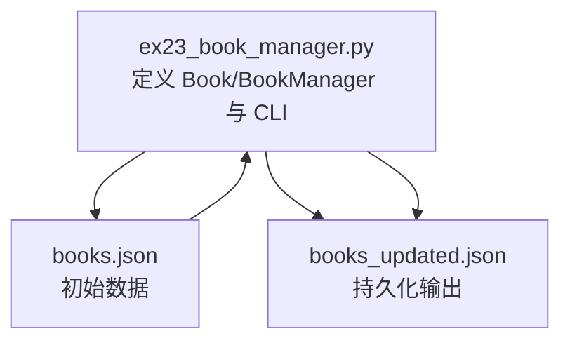
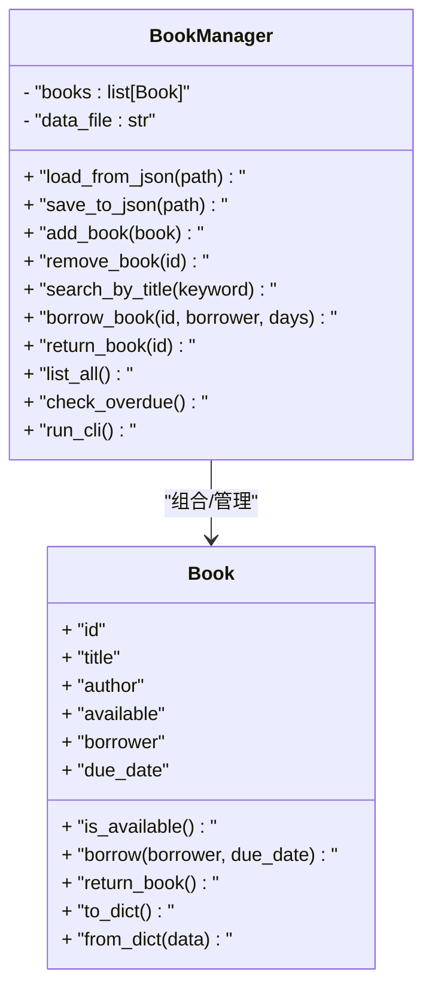
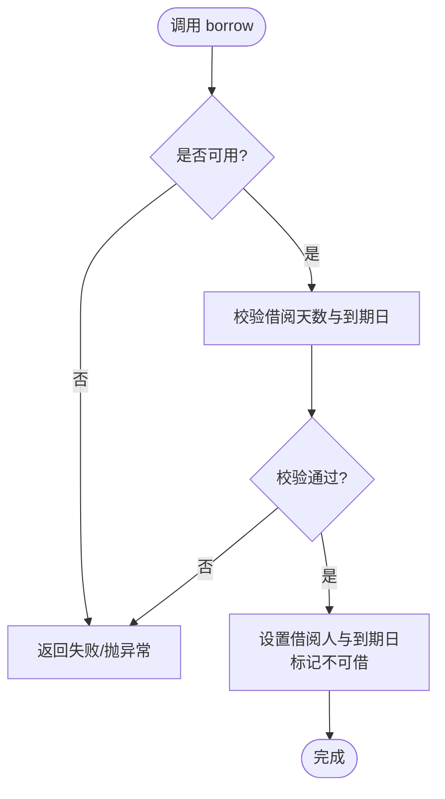
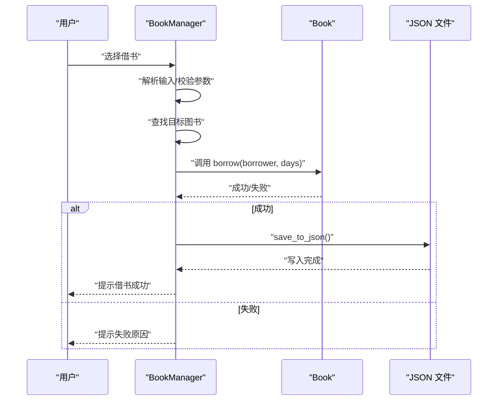
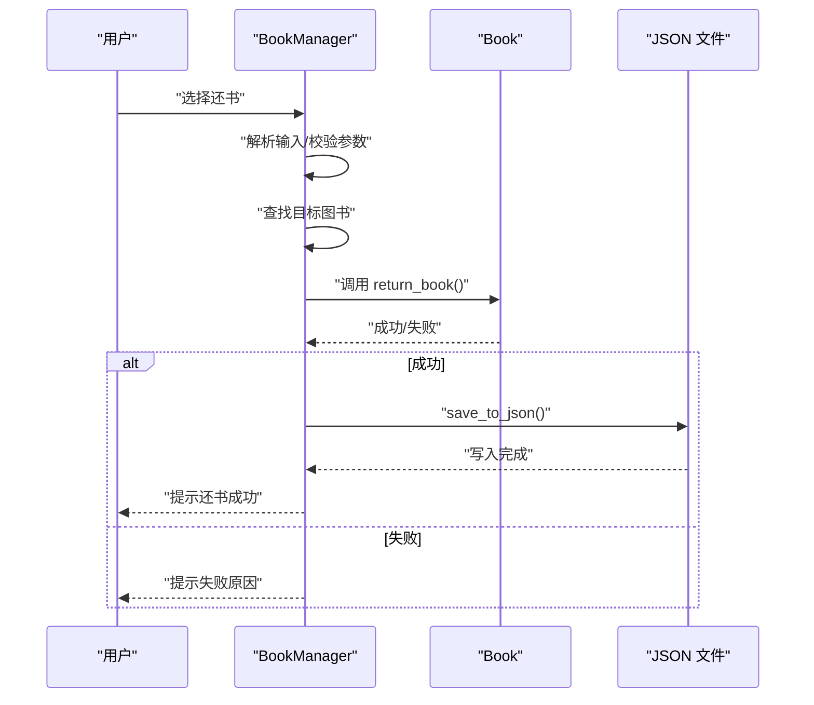
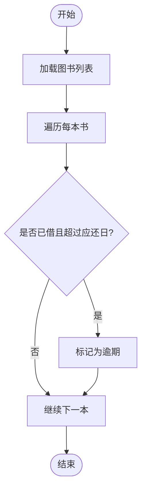
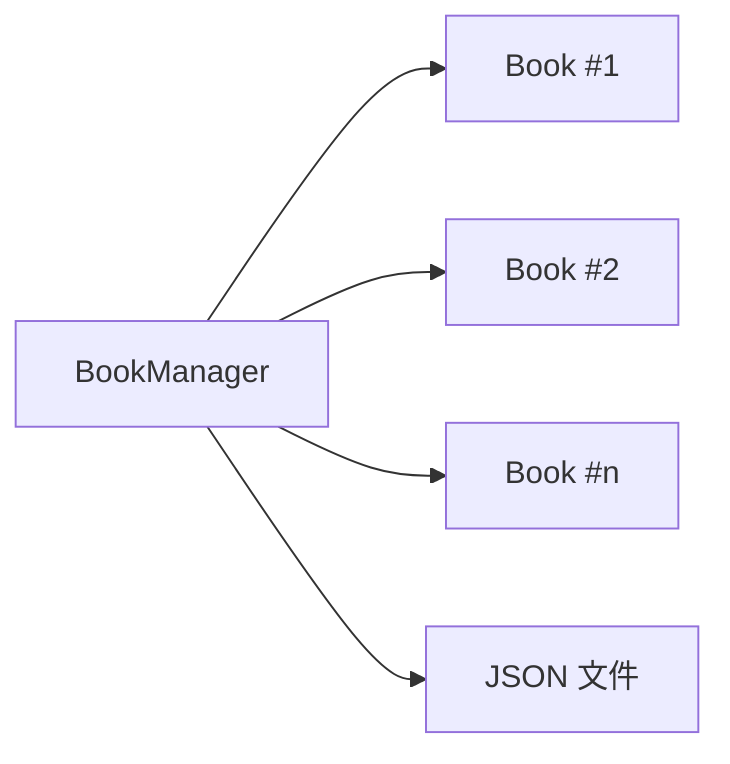

# 图书管理系统

<cite>
**本文引用的文件**   
- [ex23_book_manager.py](file://ex23_book_manager.py)
- [books.json](file://books.json)
- [books_updated.json](file://books_updated.json)
</cite>

## 目录
1. [简介](#简介)
2. [项目结构](#项目结构)
3. [核心组件](#核心组件)
4. [架构总览](#架构总览)
5. [详细组件分析](#详细组件分析)
6. [依赖分析](#依赖分析)
7. [性能考虑](#性能考虑)
8. [故障排查指南](#故障排查指南)
9. [结论](#结论)
10. [附录：API 与使用示例](#附录api-与使用示例)

## 简介
本文件面向“图书管理系统”的面向对象实现，重点围绕 Book 类与 BookManager 类的架构设计、结构化数据模型、借阅状态管理、用户交互逻辑、复杂业务规则（如借阅限制、逾期处理、库存管理）、数据持久化（JSON 文件读写与格式转换），以及异常处理、日志记录与调试技巧进行系统化说明。文档以循序渐进的方式呈现，既适合初学者快速上手，也便于进阶读者深入理解设计与实现细节。

## 项目结构
本项目包含一个核心实现脚本与两份 JSON 数据文件：
- ex23_book_manager.py：定义 Book 与 BookManager 等核心类型与业务逻辑，提供命令行交互入口。
- books.json：初始图书数据源。
- books_updated.json：更新后的图书数据快照（用于演示持久化结果）。

图表来源
- [ex23_book_manager.py](file://ex23_book_manager.py)
- [books.json](file://books.json)
- [books_updated.json](file://books_updated.json)

章节来源
- [ex23_book_manager.py](file://ex23_book_manager.py)
- [books.json](file://books.json)
- [books_updated.json](file://books_updated.json)

## 核心组件
- Book 类：表示一本图书的领域对象，封装图书基本信息与借阅状态字段，并提供基础校验与格式化能力。
- BookManager 类：负责图书集合的管理、业务规则执行（借出/归还/查询/统计）、数据持久化（从 JSON 加载与保存）以及与用户的交互流程。

关键职责划分
- Book：单一实体的属性与行为（只关注单本书的状态与约束）。
- BookManager：聚合操作、事务性更新、I/O 与错误处理（关注系统级流程与外部资源）。

章节来源
- [ex23_book_manager.py](file://ex23_book_manager.py)

## 架构总览
整体采用“领域模型 + 管理器 + 持久化 + 交互层”的分层组织方式：
- 领域模型：Book
- 业务编排：BookManager
- 数据持久化：JSON 文件读写
- 交互层：命令行菜单与输入解析

图表来源
- [ex23_book_manager.py](file://ex23_book_manager.py)

## 详细组件分析

### Book 类分析
- 数据结构
  - id：唯一标识
  - title：书名
  - author：作者
  - available：是否可借
  - borrower：当前借阅人
  - due_date：应还日期
- 核心方法
  - is_available：判断是否可借
  - borrow：设置借阅人与到期日，并标记不可借
  - return_book：归还后重置状态
  - to_dict/from_dict：序列化/反序列化为字典，支撑 JSON 持久化
- 复杂度
  - 所有方法均为 O(1) 时间复杂度
- 错误处理
  - 对非法参数（如负数天数、重复借还）进行校验并抛出异常或返回失败标志
- 优化建议
  - 将日期计算与格式化抽取为工具函数，提升复用性与可测试性

图表来源
- [ex23_book_manager.py](file://ex23_book_manager.py)

章节来源
- [ex23_book_manager.py](file://ex23_book_manager.py)

### BookManager 类分析
- 数据模型
  - books：Book 实例列表
  - data_file：默认持久化路径
- 核心功能
  - 数据加载/保存：从 JSON 读取到内存，或将内存写入 JSON
  - 增删改查：添加/删除图书、按标题搜索、列出全部
  - 借阅/归还：根据 ID 执行借出与归还，维护库存与状态一致性
  - 逾期检查：遍历书籍，识别已逾期的借阅记录
  - 交互循环：提供菜单驱动的命令行界面
- 业务流程（借书）

图表来源
- [ex23_book_manager.py](file://ex23_book_manager.py)
- [books.json](file://books.json)
- [books_updated.json](file://books_updated.json)

- 业务流程（还书）

图表来源
- [ex23_book_manager.py](file://ex23_book_manager.py)
- [books.json](file://books.json)
- [books_updated.json](file://books_updated.json)

- 业务流程（逾期检查）

图表来源
- [ex23_book_manager.py](file://ex23_book_manager.py)

章节来源
- [ex23_book_manager.py](file://ex23_book_manager.py)

### 数据持久化方案
- 数据格式
  - 使用 JSON 作为持久化载体，结构清晰、跨语言友好
- 加载流程
  - 打开文件 -> 解析 JSON -> 转换为 Book 列表
- 保存流程
  - 遍历 Book 列表 -> 转换为字典 -> 写入 JSON 文件
- 容错策略
  - 文件不存在时创建空集合或给出明确提示
  - JSON 解析异常时回滚或保留上次有效状态
  - 写入失败时记录错误并提示用户重试

章节来源
- [ex23_book_manager.py](file://ex23_book_manager.py)
- [books.json](file://books.json)
- [books_updated.json](file://books_updated.json)

### 用户交互逻辑
- 菜单驱动：提供借书、还书、查询、列表、退出等选项
- 输入校验：对 ID、关键字、天数等进行合法性检查
- 反馈机制：每次操作后给出明确的成功/失败提示与原因
- 退出条件：支持安全退出并自动保存最新状态

章节来源
- [ex23_book_manager.py](file://ex23_book_manager.py)

## 依赖分析
- 模块内依赖
  - BookManager 组合多个 Book 实例，形成一对多关系
  - BookManager 负责 I/O 与业务编排，Book 专注领域语义
- 外部依赖
  - JSON 标准库用于数据序列化/反序列化
  - 可选：datetime 用于日期计算与格式化

图表来源
- [ex23_book_manager.py](file://ex23_book_manager.py)
- [books.json](file://books.json)
- [books_updated.json](file://books_updated.json)

章节来源
- [ex23_book_manager.py](file://ex23_book_manager.py)

## 性能考虑
- 时间复杂度
  - 借/还/查：O(n)（线性扫描），n 为图书数量；可通过索引优化至 O(1)
- 空间复杂度
  - 内存中维护 Book 列表，额外开销较小
- 优化建议
  - 引入基于 id 的哈希表映射，加速查找
  - 批量操作时减少频繁磁盘写入，采用事务式提交
  - 对大集合增加分页或过滤条件，降低 UI 渲染压力

## 故障排查指南
- 常见问题
  - 文件不存在或权限不足：确认路径与权限，必要时创建默认文件
  - JSON 格式错误：检查文件格式与编码，确保键名一致
  - 重复借还：校验借阅状态，避免并发冲突
  - 逾期判定异常：核对日期计算与时区设置
- 定位技巧
  - 在关键分支打印上下文信息（ID、状态、日期）
  - 捕获并记录异常堆栈，便于回溯
  - 使用最小复现用例验证修复效果

章节来源
- [ex23_book_manager.py](file://ex23_book_manager.py)

## 结论
本系统以清晰的领域模型与职责分离为基础，实现了图书的基本管理与借阅流程，并通过 JSON 完成数据持久化。建议在后续迭代中引入索引与事务式写入以提升性能与一致性，同时完善日志与监控，增强系统的可观测性与健壮性。

## 附录：API 与使用示例

### API 概览
- 数据加载/保存
  - load_from_json(path)：从指定 JSON 文件加载图书数据
  - save_to_json(path)：将内存中的图书数据保存到指定 JSON 文件
- 图书管理
  - add_book(book)：新增一本书
  - remove_book(id)：按 ID 删除一本书
  - search_by_title(keyword)：按关键词模糊匹配书名
  - list_all()：列出所有图书及其状态
- 借阅与归还
  - borrow_book(id, borrower, days)：为指定图书办理借出
  - return_book(id)：归还指定图书
- 统计与检查
  - check_overdue()：检查并返回逾期列表
- 交互
  - run_cli()：启动命令行菜单循环

### 使用示例（步骤）
- 初始化
  - 创建 BookManager 实例，指定默认数据文件
- 加载数据
  - 调用 load_from_json("books.json")
- 借书
  - 选择借书菜单项，输入图书 ID、借阅人姓名与天数
  - 系统校验可用性并更新状态，随后保存至 JSON
- 还书
  - 选择还书菜单项，输入图书 ID
  - 系统校验可还性并更新状态，随后保存至 JSON
- 查询与统计
  - 按标题搜索、列出全部、检查逾期
- 退出
  - 选择退出，系统自动保存最新状态

章节来源
- [ex23_book_manager.py](file://ex23_book_manager.py)
- [books.json](file://books.json)
- [books_updated.json](file://books_updated.json)