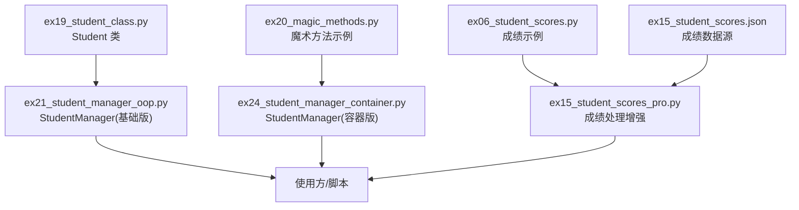
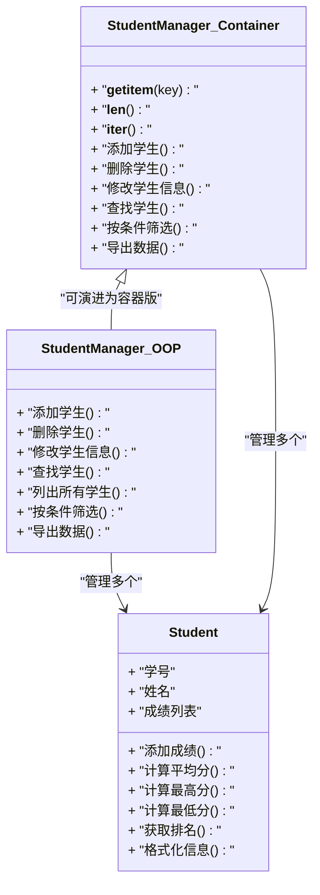
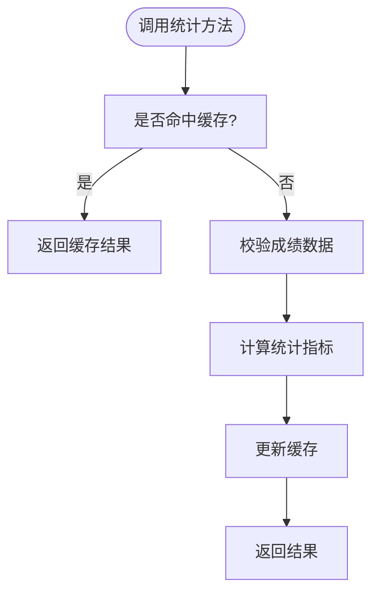
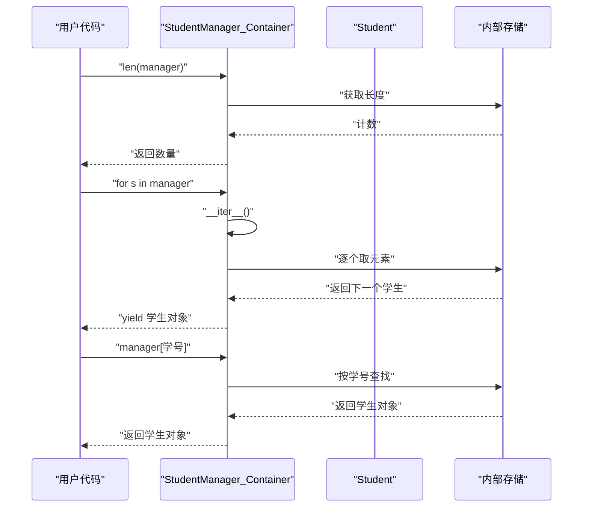
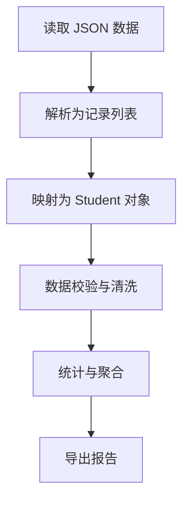
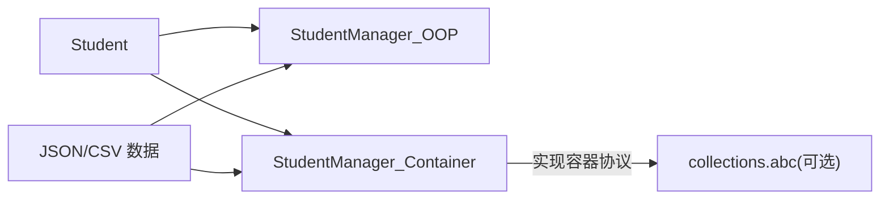

# 学生管理系统

<cite>
**本文引用的文件**   
- [ex19_student_class.py](file://ex19_student_class.py)
- [ex20_magic_methods.py](file://ex20_magic_methods.py)
- [ex21_student_manager_oop.py](file://ex21_student_manager_oop.py)
- [ex24_student_manager_container.py](file://ex24_student_manager_container.py)
- [ex06_student_scores.py](file://ex06_student_scores.py)
- [ex15_student_scores.json](file://ex15_student_scores.json)
- [ex15_student_scores_pro.py](file://ex15_student_scores_pro.py)
</cite>

## 目录
1. [简介](#简介)
2. [项目结构](#项目结构)
3. [核心组件](#核心组件)
4. [架构总览](#架构总览)
5. [详细组件分析](#详细组件分析)
6. [依赖关系分析](#依赖关系分析)
7. [性能考虑](#性能考虑)
8. [故障排查指南](#故障排查指南)
9. [结论](#结论)
10. [附录](#附录)

## 简介
本文件面向“学生管理系统”的面向对象实现，聚焦以下目标：
- 基于面向对象设计，构建 Student 与 StudentManager 两个核心类
- 讲解数据结构设计、业务逻辑封装与模块划分原则
- 展示如何使用魔术方法实现容器能力（如 __getitem__、__len__、__iter__）
- 覆盖学生的增删改查、成绩管理与统计功能
- 提供完整的使用模式与设计决策说明
- 给出错误处理策略、性能优化建议与扩展开发指南

## 项目结构
围绕学生管理系统的核心代码主要分布在以下文件中：
- ex19_student_class.py：定义学生实体类，包含学号、姓名、成绩等属性与方法
- ex20_magic_methods.py：演示常用魔术方法，为后续容器化提供基础
- ex21_student_manager_oop.py：以面向对象方式组织学生集合的管理器
- ex24_student_manager_container.py：在管理器中实现容器协议，支持索引访问、长度查询与迭代
- ex06_student_scores.py / ex15_student_scores_pro.py / ex15_student_scores.json：成绩数据与统计示例，可作为系统的数据来源或测试样例

图示来源
- [ex19_student_class.py](file://ex19_student_class.py)
- [ex20_magic_methods.py](file://ex20_magic_methods.py)
- [ex21_student_manager_oop.py](file://ex21_student_manager_oop.py)
- [ex24_student_manager_container.py](file://ex24_student_manager_container.py)
- [ex06_student_scores.py](file://ex06_student_scores.py)
- [ex15_student_scores_pro.py](file://ex15_student_scores_pro.py)
- [ex15_student_scores.json](file://ex15_student_scores.json)

章节来源
- [ex19_student_class.py](file://ex19_student_class.py)
- [ex20_magic_methods.py](file://ex20_magic_methods.py)
- [ex21_student_manager_oop.py](file://ex21_student_manager_oop.py)
- [ex24_student_manager_container.py](file://ex24_student_manager_container.py)
- [ex06_student_scores.py](file://ex06_student_scores.py)
- [ex15_student_scores_pro.py](file://ex15_student_scores_pro.py)
- [ex15_student_scores.json](file://ex15_student_scores.json)

## 核心组件
- Student 类
  - 职责：表示一名学生，维护学号、姓名、成绩列表等状态；提供计算平均分、最高分、最低分、排名等统计方法；提供格式化输出与校验逻辑。
  - 关键设计点：
    - 输入校验：学号唯一性、成绩范围、非空约束
    - 不可变键：学号作为唯一标识，便于查找与去重
    - 统计方法：避免重复计算，必要时缓存结果
- StudentManager 类
  - 职责：管理一组学生对象，提供增删改查、批量操作、按条件筛选、导出等功能
  - 两种形态：
    - 基础版（ex21_student_manager_oop.py）：以内部集合存储学生，提供常规管理接口
    - 容器版（ex24_student_manager_container.py）：实现容器协议，支持索引访问、长度查询与迭代，提升易用性

章节来源
- [ex19_student_class.py](file://ex19_student_class.py)
- [ex21_student_manager_oop.py](file://ex21_student_manager_oop.py)
- [ex24_student_manager_container.py](file://ex24_student_manager_container.py)

## 架构总览
系统采用分层与单一职责原则：
- 领域层：Student 负责单个学生的数据与统计
- 管理层：StudentManager 负责学生集合的 CRUD、筛选与聚合
- 数据层：JSON/CSV 文件作为持久化或测试数据源
- 工具层：魔术方法与通用辅助函数，支撑容器化与数据处理

图示来源
- [ex19_student_class.py](file://ex19_student_class.py)
- [ex21_student_manager_oop.py](file://ex21_student_manager_oop.py)
- [ex24_student_manager_container.py](file://ex24_student_manager_container.py)

## 详细组件分析

### Student 类分析
- 数据结构
  - 学号：字符串或整数，作为唯一标识
  - 姓名：字符串
  - 成绩：数值列表，支持多次追加
- 业务逻辑
  - 成绩有效性校验：范围检查、类型检查
  - 统计方法：平均分、最高分、最低分、及格率、分数分布
  - 排序与排名：根据平均分或总分进行排序
- 复杂度与优化
  - 统计方法可在每次变更时增量更新，避免 O(n) 重复计算
  - 对频繁访问的统计结果进行缓存，并在成绩变化时失效缓存

图示来源
- [ex19_student_class.py](file://ex19_student_class.py)

章节来源
- [ex19_student_class.py](file://ex19_student_class.py)

### 魔术方法与容器化（ex20_magic_methods.py）
- 常见魔术方法
  - __getitem__：支持通过键或索引访问元素
  - __setitem__：支持通过键或索引设置元素
  - __delitem__：支持通过键或索引删除元素
  - __len__：返回容器大小
  - __iter__：返回迭代器，支持 for 循环遍历
  - __contains__：支持 in 操作符判断成员存在
- 设计要点
  - 统一异常：键不存在或越界时抛出明确异常
  - 一致性：保证 __len__ 与 __iter__ 行为一致
  - 惰性求值：对大型集合可采用生成器减少内存占用

章节来源
- [ex20_magic_methods.py](file://ex20_magic_methods.py)

### StudentManager 基础版（ex21_student_manager_oop.py）
- 职责
  - 维护学生集合（字典或列表）
  - 提供增删改查、筛选、导出等接口
- 关键方法
  - 添加学生：校验学号唯一性，避免重复
  - 删除学生：按学号移除并返回成功标志
  - 修改学生信息：支持部分字段更新
  - 查找学生：按学号或条件快速定位
  - 筛选与聚合：按成绩区间、姓名前缀等过滤
  - 导出：将结果序列化为 JSON/CSV
- 错误处理
  - 参数校验失败抛出异常
  - 资源不足或 IO 错误捕获并记录日志

章节来源
- [ex21_student_manager_oop.py](file://ex21_student_manager_oop.py)

### StudentManager 容器版（ex24_student_manager_container.py）
- 容器协议实现
  - __getitem__：支持按学号或索引访问
  - __len__：返回学生数量
  - __iter__：返回学生对象的迭代器
- 优势
  - 更 Pythonic 的用法：支持 len(manager)、for s in manager、manager[学号]
  - 与标准库兼容：可与 collections.abc 结合进一步扩展
- 注意事项
  - 索引与键的区分：学号为键，整数索引为位置
  - 并发安全：若多线程访问需加锁保护

图示来源
- [ex24_student_manager_container.py](file://ex24_student_manager_container.py)

章节来源
- [ex24_student_manager_container.py](file://ex24_student_manager_container.py)

### 成绩管理与统计（ex06_student_scores.py / ex15_student_scores_pro.py / ex15_student_scores.json）
- 数据来源
  - ex15_student_scores.json：结构化成绩数据，适合批量导入
  - ex06_student_scores.py：基础成绩处理示例
  - ex15_student_scores_pro.py：增强版处理，包含清洗、分组、统计
- 典型流程
  - 读取 JSON 数据
  - 解析并映射到 Student 对象
  - 计算统计指标（平均分、方差、等级分布）
  - 导出汇总报告

图示来源
- [ex06_student_scores.py](file://ex06_student_scores.py)
- [ex15_student_scores_pro.py](file://ex15_student_scores_pro.py)
- [ex15_student_scores.json](file://ex15_student_scores.json)

章节来源
- [ex06_student_scores.py](file://ex06_student_scores.py)
- [ex15_student_scores_pro.py](file://ex15_student_scores_pro.py)
- [ex15_student_scores.json](file://ex15_student_scores.json)

## 依赖关系分析
- 模块内聚与耦合
  - Student 独立性强，仅依赖基础数据类型与内置函数
  - StudentManager 依赖 Student，并通过魔术方法降低外部耦合
- 外部依赖
  - JSON/CSV 读写用于数据持久化与导入导出
  - 可选：collections.abc 用于抽象容器协议
- 潜在循环依赖
  - 当前设计无循环依赖；若引入回调或事件机制需注意解耦

图示来源
- [ex19_student_class.py](file://ex19_student_class.py)
- [ex21_student_manager_oop.py](file://ex21_student_manager_oop.py)
- [ex24_student_manager_container.py](file://ex24_student_manager_container.py)

章节来源
- [ex19_student_class.py](file://ex19_student_class.py)
- [ex21_student_manager_oop.py](file://ex21_student_manager_oop.py)
- [ex24_student_manager_container.py](file://ex24_student_manager_container.py)

## 性能考虑
- 时间复杂度
  - 查找：按学号查找应使用哈希表（字典），O(1)
  - 插入/删除：均摊 O(1)
  - 统计：若未缓存，计算平均/极值为 O(n)，建议增量更新或缓存
- 空间复杂度
  - 存储学生对象与成绩列表，注意大对象引用与内存占用
- 优化建议
  - 对频繁统计的结果进行缓存，并在成绩变化时失效
  - 使用生成器进行惰性遍历，减少中间列表创建
  - 批量导入时预分配容量或使用向量化处理（如 pandas，但保持轻量优先）

## 故障排查指南
- 常见问题
  - 学号重复：添加学生前检查唯一性，抛出明确异常
  - 成绩非法：范围与类型校验失败时提示具体原因
  - 索引越界：容器访问时检查边界，返回友好错误
  - 数据加载失败：IO 异常捕获并记录上下文信息
- 调试技巧
  - 打印关键状态（学生数量、最近一次操作）
  - 单元测试覆盖边界条件（空集合、单元素、重复键）
  - 使用断言与日志分级输出

章节来源
- [ex21_student_manager_oop.py](file://ex21_student_manager_oop.py)
- [ex24_student_manager_container.py](file://ex24_student_manager_container.py)

## 结论
本系统通过清晰的面向对象设计与容器化协议实现，提供了易用的学生管理能力。Student 专注个体数据与统计，StudentManager 负责集合管理与对外接口。借助魔术方法，系统具备 Pythonic 的交互体验。建议在后续迭代中完善缓存策略、并发安全与数据迁移能力，以满足更大规模场景的需求。

## 附录
- 使用模式示例（路径指引）
  - 初始化与基本操作：参考 [ex21_student_manager_oop.py](file://ex21_student_manager_oop.py)
  - 容器化访问：参考 [ex24_student_manager_container.py](file://ex24_student_manager_container.py)
  - 成绩导入与统计：参考 [ex15_student_scores_pro.py](file://ex15_student_scores_pro.py) 与 [ex15_student_scores.json](file://ex15_student_scores.json)
- 最佳实践
  - 单一职责：每个类只承担一个清晰职责
  - 防御式编程：严格校验输入，尽早失败
  - 可扩展性：预留插件点与配置项，便于新增统计维度或导出格式