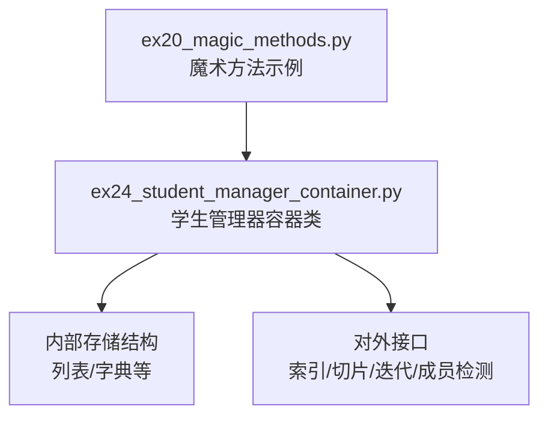
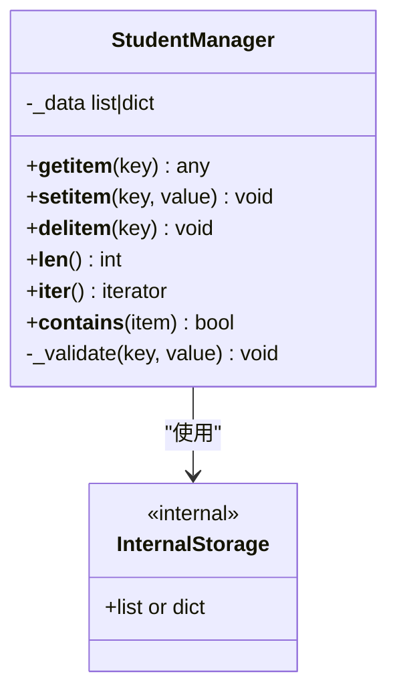
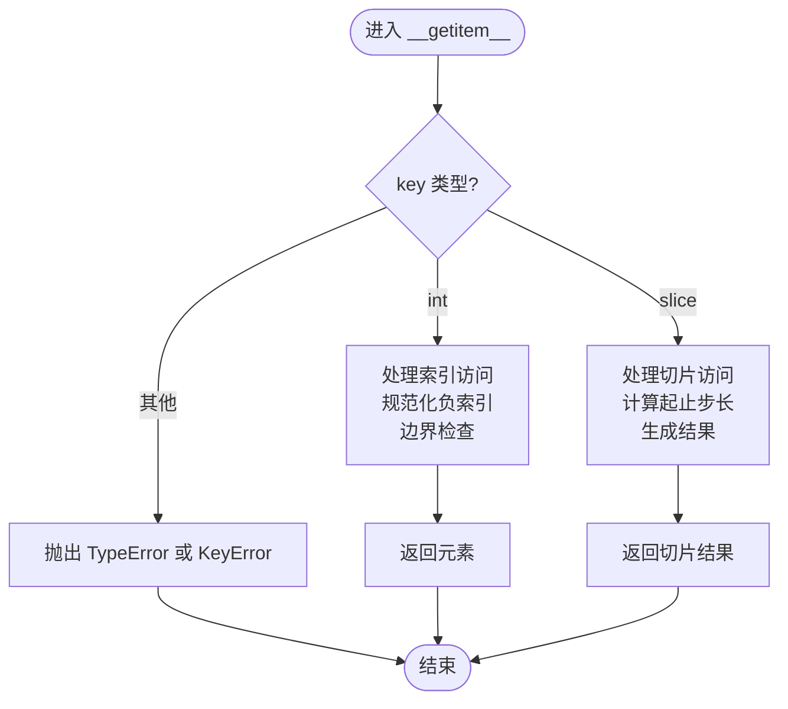
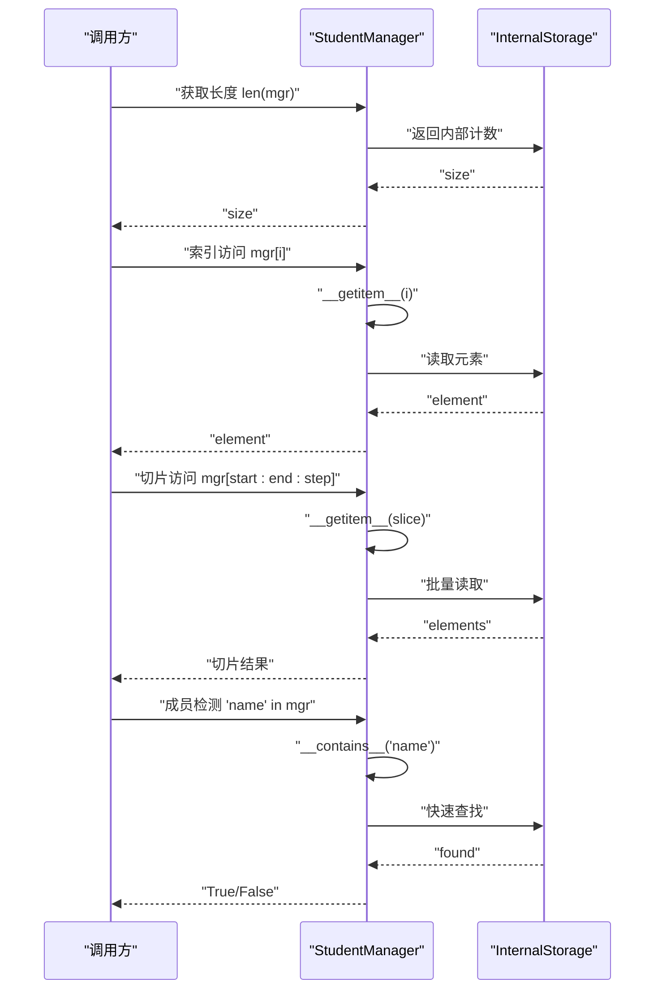
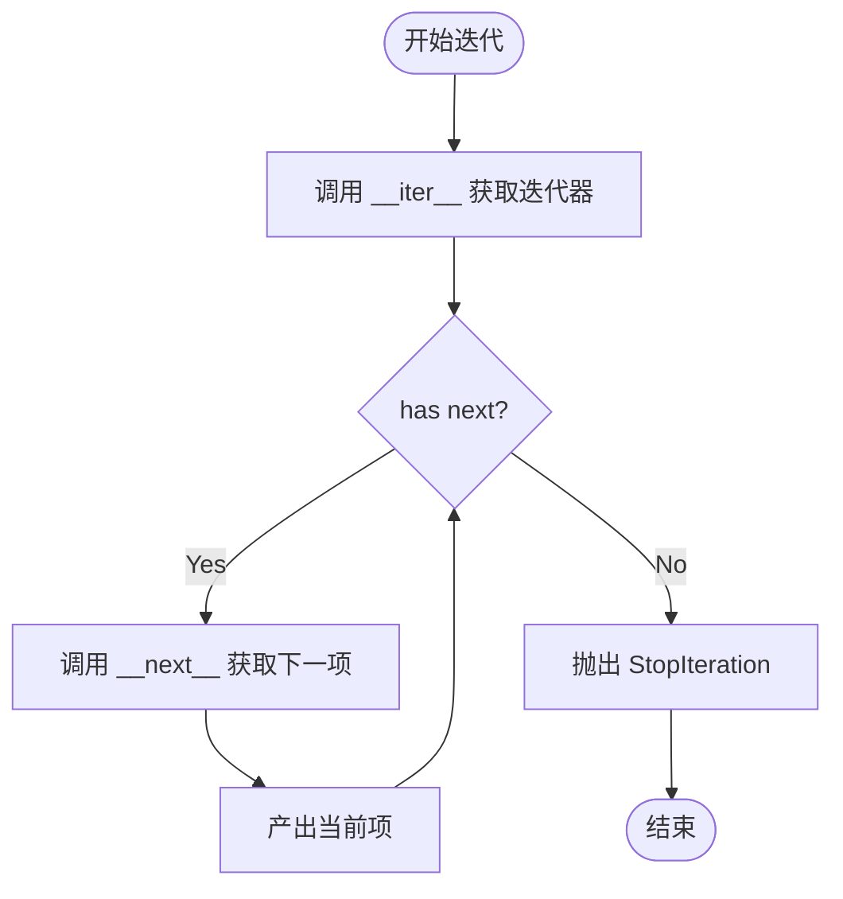
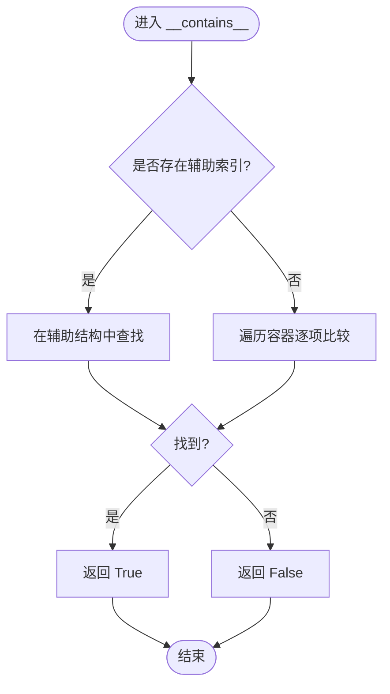
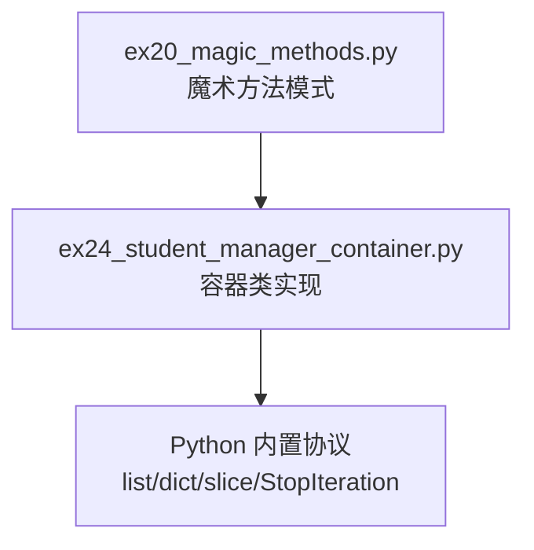

# 容器类设计与实现

<cite>
**本文引用的文件**   
- [ex20_magic_methods.py](file://ex20_magic_methods.py)
- [ex24_student_manager_container.py](file://ex24_student_manager_container.py)
</cite>

## 目录
1. [简介](#简介)
2. [项目结构](#项目结构)
3. [核心组件](#核心组件)
4. [架构总览](#架构总览)
5. [详细组件分析](#详细组件分析)
6. [依赖关系分析](#依赖关系分析)
7. [性能考虑](#性能考虑)
8. [故障排查指南](#故障排查指南)
9. [结论](#结论)
10. [附录](#附录)

## 简介
本技术文档围绕Python中自定义容器类的设计与实现，系统讲解魔术方法的设计模式与实现细节。重点覆盖以下核心能力：
- 索引访问与赋值：__getitem__、__setitem__、__delitem__
- 长度查询：__len__
- 迭代协议：__iter__（以及可选的__next__）
- 成员检测：__contains__
- 切片支持：通过__getitem__中的slice对象处理
- 设计原则与适用场景：何时选择自定义容器、如何保持与内置容器的行为一致
- 性能优化策略：内存管理与访问效率提升
- 完整示例与测试思路：基于仓库中的示例进行说明与扩展

## 项目结构
仓库中包含多个练习脚本，其中与“容器类设计与实现”直接相关的两个关键文件为：
- ex20_magic_methods.py：演示常用魔术方法的用法与典型实现模式
- ex24_student_manager_container.py：以“学生管理器”为例，构建一个具备容器行为的自定义类

图表来源
- [ex20_magic_methods.py](file://ex20_magic_methods.py)
- [ex24_student_manager_container.py](file://ex24_student_manager_container.py)

章节来源
- [ex20_magic_methods.py](file://ex20_magic_methods.py)
- [ex24_student_manager_container.py](file://ex24_student_manager_container.py)

## 核心组件
本节聚焦于容器类的核心魔术方法与协议，结合仓库示例进行说明。

- __getitem__(self, key)
  - 作用：实现obj[key]读取；当key为整数时返回对应元素；当key为切片对象时返回子序列或映射视图
  - 要点：正确处理负索引、越界异常、切片边界；可返回新对象或视图
- __setitem__(self, key, value)
  - 作用：实现obj[key]=value写入；支持索引与切片赋值
  - 要点：类型校验、范围检查、一致性维护（如缓存失效）
- __delitem__(self, key)
  - 作用：实现del obj[key]删除；支持索引与切片删除
  - 要点：存在性检查、删除后状态一致性
- __len__(self)
  - 作用：实现len(obj)；返回容器大小
  - 要点：O(1)复杂度优先；与内部计数保持一致
- __iter__(self)
  - 作用：实现for x in obj迭代；返回迭代器对象
  - 要点：若仅需要前向迭代，可直接返回自身并实现__next__；否则返回独立迭代器以避免并发修改问题
- __contains__(self, item)
  - 作用：实现item in obj成员检测；默认基于迭代实现，建议针对热点路径提供O(1)或O(log n)实现
  - 要点：可借助集合或哈希表加速查找

章节来源
- [ex20_magic_methods.py](file://ex20_magic_methods.py)
- [ex24_student_manager_container.py](file://ex24_student_manager_container.py)

## 架构总览
下图展示了“学生管理器容器类”的整体结构与交互关系。该类封装内部存储并提供标准容器语义。

图表来源
- [ex24_student_manager_container.py](file://ex24_student_manager_container.py)

## 详细组件分析

### 魔术方法设计与实现要点
- 索引访问与切片
  - 在__getitem__中判断key是否为slice实例，分别处理单元素与切片逻辑
  - 对负索引进行规范化处理，确保与Python内置序列行为一致
  - 对于映射型容器，键不存在时应抛出合适的异常（如KeyError）
- 赋值与删除
  - __setitem__需进行参数校验与边界检查，必要时触发内部一致性更新
  - __delitem__应保证删除后的数据结构完整性，避免悬挂引用
- 迭代协议
  - 若容器是可变序列，推荐返回独立的迭代器对象，防止迭代期间被修改导致未定义行为
  - 若实现__next__，需在迭代结束时抛出StopIteration
- 成员检测
  - 默认基于迭代实现，但建议在__contains__中利用哈希结构或索引加速

图表来源
- [ex20_magic_methods.py](file://ex20_magic_methods.py)
- [ex24_student_manager_container.py](file://ex24_student_manager_container.py)

章节来源
- [ex20_magic_methods.py](file://ex20_magic_methods.py)
- [ex24_student_manager_container.py](file://ex24_student_manager_container.py)

### 容器类示例：学生管理器
该示例展示了一个具备容器行为的“学生管理器”，其职责包括：
- 管理学生数据（内部存储）
- 提供索引访问、切片、迭代、成员检测等容器语义
- 在设置与删除时进行必要的校验与一致性维护

图表来源
- [ex24_student_manager_container.py](file://ex24_student_manager_container.py)

章节来源
- [ex24_student_manager_container.py](file://ex24_student_manager_container.py)

### 迭代器协议与切片支持
- 迭代器协议
  - 若容器需要支持for循环，必须实现__iter__，返回迭代器对象
  - 如需反向迭代，可实现__reversed__（返回反向迭代器）
- 切片支持
  - 在__getitem__中识别slice对象，计算start、stop、step，并生成相应结果
  - 注意空切片与越界情况的处理，保持与内置序列一致的行为

图表来源
- [ex20_magic_methods.py](file://ex20_magic_methods.py)
- [ex24_student_manager_container.py](file://ex24_student_manager_container.py)

章节来源
- [ex20_magic_methods.py](file://ex20_magic_methods.py)
- [ex24_student_manager_container.py](file://ex24_student_manager_container.py)

### 成员检测与查找优化
- 默认实现：基于迭代遍历，时间复杂度O(n)
- 优化策略：
  - 维护一个辅助集合或字典用于快速查找，使__contains__达到O(1)
  - 在__setitem__/__delitem__中同步更新辅助结构，保证一致性
  - 若数据有序，可使用二分查找将复杂度降至O(log n)

图表来源
- [ex20_magic_methods.py](file://ex20_magic_methods.py)
- [ex24_student_manager_container.py](file://ex24_student_manager_container.py)

章节来源
- [ex20_magic_methods.py](file://ex20_magic_methods.py)
- [ex24_student_manager_container.py](file://ex24_student_manager_container.py)

## 依赖关系分析
- 模块内依赖
  - ex24_student_manager_container.py 依赖 ex20_magic_methods.py 中的魔术方法模式与最佳实践
- 外部依赖
  - 主要依赖Python内置类型与协议（list、dict、slice、StopIteration等）
- 耦合与内聚
  - 容器类内部高内聚：所有与数据访问、切片、迭代相关的逻辑集中在类中
  - 对外低耦合：通过标准协议暴露接口，便于替换内部存储实现

图表来源
- [ex20_magic_methods.py](file://ex20_magic_methods.py)
- [ex24_student_manager_container.py](file://ex24_student_manager_container.py)

章节来源
- [ex20_magic_methods.py](file://ex20_magic_methods.py)
- [ex24_student_manager_container.py](file://ex24_student_manager_container.py)

## 性能考虑
- 时间复杂度
  - __len__：尽量O(1)，维护内部计数
  - __getitem__：索引访问O(1)，切片访问O(k)（k为切片长度）
  - __setitem__/__delitem__：索引操作O(1)，切片操作O(k)
  - __iter__：创建迭代器O(1)，逐项迭代O(n)
  - __contains__：默认O(n)，优化后可达O(1)或O(log n)
- 空间复杂度
  - 辅助索引（如集合/字典）会增加额外空间，权衡查找速度与内存占用
- 内存管理
  - 避免不必要的中间对象创建，尤其在切片与迭代过程中
  - 及时释放不再使用的临时变量，减少峰值内存
- 访问效率提升
  - 使用局部变量缓存频繁访问的属性
  - 对热点路径进行短路判断与提前返回
  - 合理选择内部数据结构（列表vs字典），依据访问模式优化

[本节为通用性能指导，不直接分析具体文件]

## 故障排查指南
- 常见错误
  - IndexError：索引越界或未处理负索引
  - KeyError：键不存在且未正确抛出异常
  - TypeError：不支持的类型作为键或值
  - StopIteration：迭代器未正确终止或重复抛出
- 调试技巧
  - 在魔术方法入口打印关键参数与内部状态
  - 使用断言验证不变式（如长度与内部计数一致）
  - 编写单元测试覆盖边界条件（空容器、负索引、大切片、重复键等）
- 一致性维护
  - 在__setitem__/__delitem__中同步更新辅助结构
  - 在迭代期间避免修改容器，必要时返回副本或抛出异常

章节来源
- [ex20_magic_methods.py](file://ex20_magic_methods.py)
- [ex24_student_manager_container.py](file://ex24_student_manager_container.py)

## 结论
通过实现标准魔术方法，可以构建出与Python内置容器行为一致的自定义容器类。关键在于：
- 严格遵循协议规范，保证行为一致性
- 针对热点路径进行性能优化（如__contains__的快速查找）
- 维护内部状态的一致性，避免副作用
- 编写完善的测试用例，覆盖边界与异常路径

[本节为总结性内容，不直接分析具体文件]

## 附录
- 设计原则
  - 最小惊讶原则：行为应与内置容器一致
  - 单一职责：容器类专注于数据访问与协议实现
  - 可扩展性：内部存储可替换，便于未来演进
- 适用场景
  - 需要定制访问语义（如只读、延迟加载、权限控制）
  - 需要额外的业务约束（如唯一性、范围限制）
  - 需要高性能查找与统计（如引入辅助索引）

[本节为概念性内容，不直接分析具体文件]