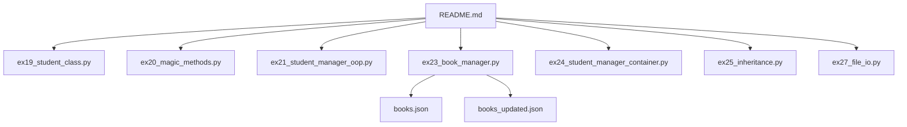
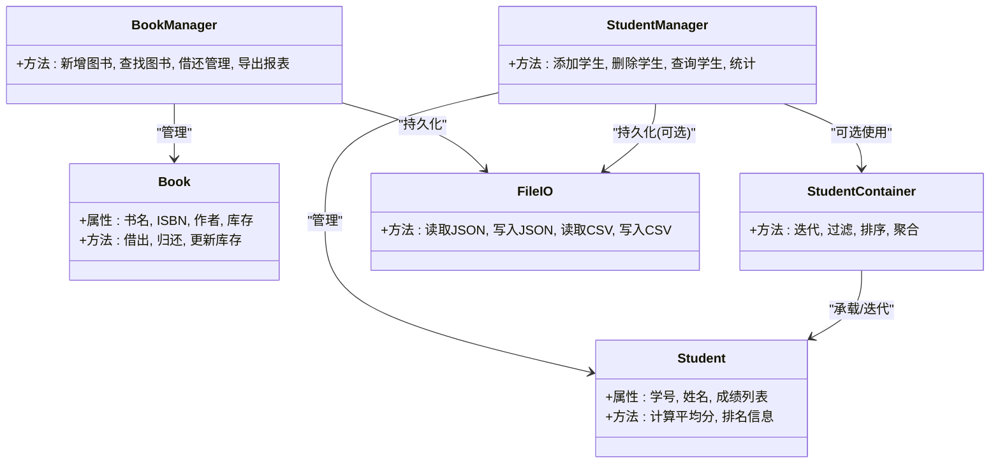
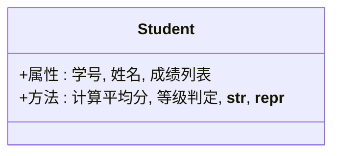
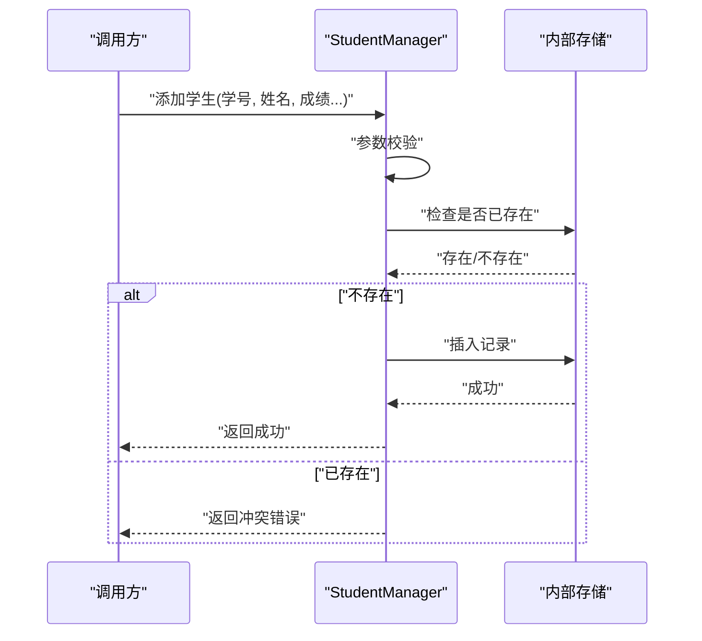
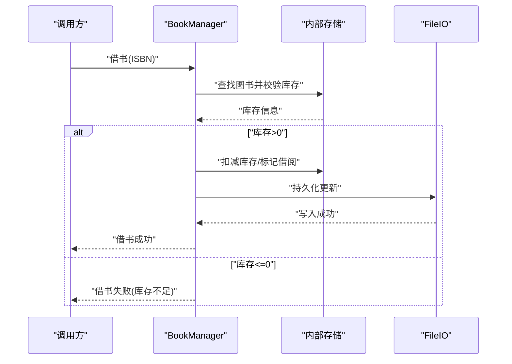
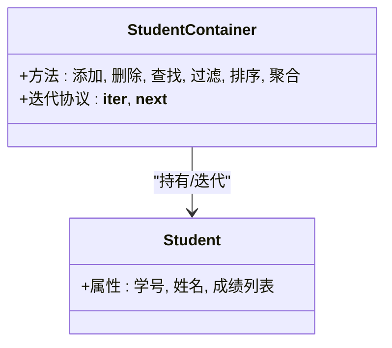
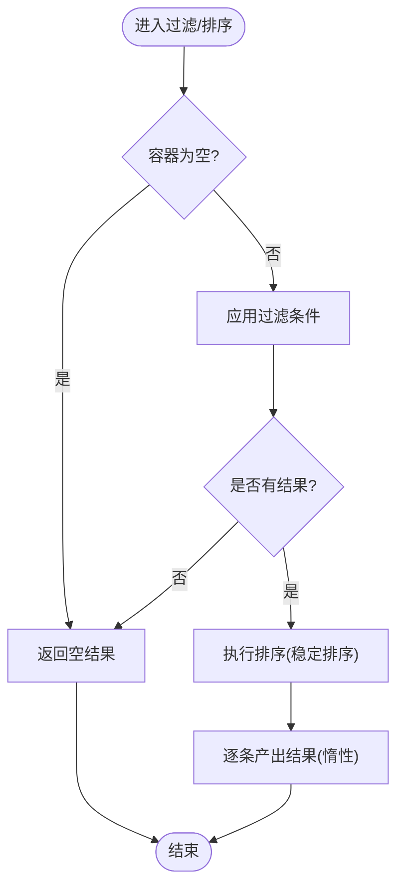
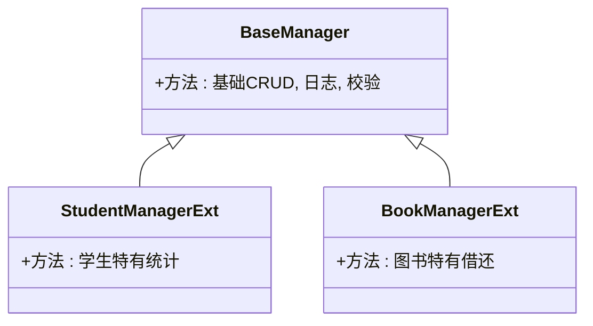
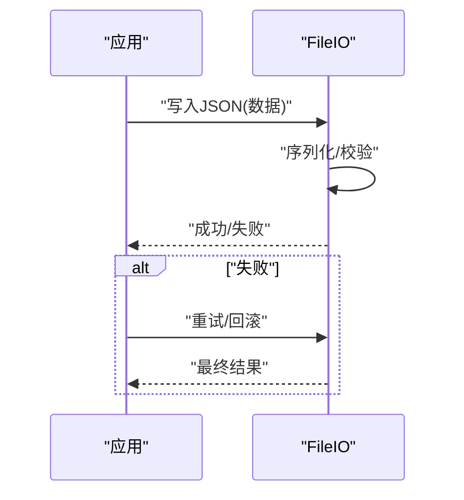
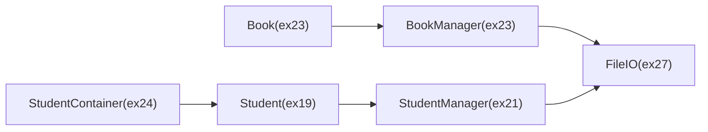

# 面向对象项目实践

<cite>
**本文引用的文件**   
- [README.md](file://README.md)
- [ex19_student_class.py](file://ex19_student_class.py)
- [ex20_magic_methods.py](file://ex20_magic_methods.py)
- [ex21_student_manager_oop.py](file://ex21_student_manager_oop.py)
- [ex23_book_manager.py](file://ex23_book_manager.py)
- [ex24_student_manager_container.py](file://ex24_student_manager_container.py)
- [ex25_inheritance.py](file://ex25_inheritance.py)
- [ex27_file_io.py](file://ex27_file_io.py)
- [books.json](file://books.json)
- [books_updated.json](file://books_updated.json)
</cite>

## 目录
1. [简介](#简介)
2. [项目结构](#项目结构)
3. [核心组件](#核心组件)
4. [架构总览](#架构总览)
5. [详细组件分析](#详细组件分析)
6. [依赖关系分析](#依赖关系分析)
7. [性能考虑](#性能考虑)
8. [故障排查指南](#故障排查指南)
9. [结论](#结论)
10. [附录](#附录)

## 简介
本实践文档围绕“学生管理系统”和“图书管理系统”两个真实场景，系统展示面向对象编程（OOP）在工程中的落地方式：类与职责划分、数据持久化、业务逻辑封装、容器设计与迭代器模式、继承与多态的应用、以及从脚本到模块化程序的演进路径。同时提供代码审查要点、测试策略与文档编写规范建议，帮助读者建立可维护、可扩展的OOP工程能力。

## 项目结构
仓库包含大量基础练习与面向对象的综合示例。与本主题直接相关的核心文件如下：
- 学生类与魔法方法：ex19_student_class.py、ex20_magic_methods.py
- 学生管理（OOP）：ex21_student_manager_oop.py
- 图书管理：ex23_book_manager.py
- 容器式学生管理（自定义集合/迭代器）：ex24_student_manager_container.py
- 继承示例：ex25_inheritance.py
- 文件IO示例：ex27_file_io.py
- 图书数据：books.json、books_updated.json
- 项目说明：README.md

图表来源
- [README.md](file://README.md)
- [ex19_student_class.py](file://ex19_student_class.py)
- [ex20_magic_methods.py](file://ex20_magic_methods.py)
- [ex21_student_manager_oop.py](file://ex21_student_manager_oop.py)
- [ex23_book_manager.py](file://ex23_book_manager.py)
- [ex24_student_manager_container.py](file://ex24_student_manager_container.py)
- [ex25_inheritance.py](file://ex25_inheritance.py)
- [ex27_file_io.py](file://ex27_file_io.py)
- [books.json](file://books.json)
- [books_updated.json](file://books_updated.json)

章节来源
- [README.md](file://README.md)

## 核心组件
- 学生实体与行为：定义学生属性与方法，体现单一职责与内聚性。
- 学生管理器：封装增删改查、统计等业务流程，解耦数据与操作。
- 图书管理器：处理复杂数据关系（如借阅状态、分类、库存），并实现持久化。
- 容器式学生管理：基于自定义集合类型与迭代器模式，提供高效遍历与查询。
- 继承体系：通过基类与派生类抽象通用行为，提升复用性与扩展性。
- 文件IO：统一读写JSON/CSV等格式，支撑数据持久化。

章节来源
- [ex19_student_class.py](file://ex19_student_class.py)
- [ex20_magic_methods.py](file://ex20_magic_methods.py)
- [ex21_student_manager_oop.py](file://ex21_student_manager_oop.py)
- [ex23_book_manager.py](file://ex23_book_manager.py)
- [ex24_student_manager_container.py](file://ex24_student_manager_container.py)
- [ex25_inheritance.py](file://ex25_inheritance.py)
- [ex27_file_io.py](file://ex27_file_io.py)

## 架构总览
下图展示了各模块的职责边界与交互关系：实体层负责领域模型，管理层负责业务编排，容器层提供集合与迭代能力，持久化层负责数据存取。

图表来源
- [ex19_student_class.py](file://ex19_student_class.py)
- [ex21_student_manager_oop.py](file://ex21_student_manager_oop.py)
- [ex23_book_manager.py](file://ex23_book_manager.py)
- [ex24_student_manager_container.py](file://ex24_student_manager_container.py)
- [ex27_file_io.py](file://ex27_file_io.py)

## 详细组件分析

### 学生类与魔法方法
- 设计要点
  - 将学生作为领域实体，集中管理学号、姓名、成绩等属性与相关行为。
  - 通过魔法方法增强对象的可读性、比较与格式化能力，便于调试与展示。
- 关键职责
  - 计算平均分、等级判定、字符串表示等。
- 复杂度与优化
  - 平均分为线性时间；可通过缓存或惰性求值避免重复计算。
- 错误处理
  - 对空成绩列表、非法输入进行校验与异常提示。

章节来源
- [ex19_student_class.py](file://ex19_student_class.py)
- [ex20_magic_methods.py](file://ex20_magic_methods.py)

#### 类图（学生与魔法方法）

图表来源
- [ex19_student_class.py](file://ex19_student_class.py)
- [ex20_magic_methods.py](file://ex20_magic_methods.py)

### 学生管理器（OOP）
- 设计要点
  - 以管理类封装学生实体的增删改查与统计，遵循单一职责原则。
  - 对外暴露稳定的接口，内部可使用列表/字典等数据结构组织数据。
- 典型流程
  - 添加学生：参数校验→去重检查→插入→返回结果。
  - 查询学生：按条件筛选→返回匹配集合。
  - 统计指标：平均分、最高分、及格率等。
- 错误处理
  - 对重复学号、不存在学生、非法输入进行明确反馈。

章节来源
- [ex21_student_manager_oop.py](file://ex21_student_manager_oop.py)

#### 序列图（添加学生流程）

图表来源
- [ex21_student_manager_oop.py](file://ex21_student_manager_oop.py)

### 图书管理系统
- 设计要点
  - 图书实体包含书名、ISBN、作者、库存等字段；管理器负责借还、检索、统计与导出。
  - 复杂关系：同一ISBN的多副本、借阅状态、逾期规则等可在管理器中建模。
- 数据持久化
  - 使用JSON文件保存图书清单与状态变更，确保重启后数据不丢失。
- 错误处理
  - 对重复ISBN、库存不足、非法操作进行拦截与提示。

章节来源
- [ex23_book_manager.py](file://ex23_book_manager.py)
- [books.json](file://books.json)
- [books_updated.json](file://books_updated.json)

#### 序列图（借书流程）

图表来源
- [ex23_book_manager.py](file://ex23_book_manager.py)
- [ex27_file_io.py](file://ex27_file_io.py)

### 容器式学生管理（自定义集合与迭代器）
- 设计要点
  - 自定义容器类承载学生集合，支持迭代、过滤、排序与聚合。
  - 实现迭代器协议，使容器可被for循环与内置函数使用。
- 性能优化
  - 索引加速查找（如字典映射学号→学生）。
  - 惰性求值与生成器用于大规模数据的流式处理。
  - 批量操作减少中间对象创建。
- 错误处理
  - 越界访问、无效迭代状态、空容器操作的健壮性保障。

章节来源
- [ex24_student_manager_container.py](file://ex24_student_manager_container.py)

#### 类图（容器与迭代器）

图表来源
- [ex24_student_manager_container.py](file://ex24_student_manager_container.py)
- [ex19_student_class.py](file://ex19_student_class.py)

#### 流程图（过滤与排序）

图表来源
- [ex24_student_manager_container.py](file://ex24_student_manager_container.py)

### 继承与多态
- 设计要点
  - 通过基类抽象通用行为（如基本CRUD、日志、校验），派生类扩展特定业务。
  - 利用多态在不同子类上统一调用，降低耦合度。
- 适用场景
  - 不同数据源（内存/文件/数据库）的统一访问接口。
  - 不同报表导出格式（JSON/CSV）的统一导出流程。

章节来源
- [ex25_inheritance.py](file://ex25_inheritance.py)

#### 类图（继承体系）

图表来源
- [ex25_inheritance.py](file://ex25_inheritance.py)

### 文件IO与持久化
- 设计要点
  - 统一封装JSON/CSV读写，提供错误恢复与幂等写入。
  - 为图书与学生数据提供序列化/反序列化能力。
- 错误处理
  - 文件不存在、权限问题、格式错误的捕获与提示。

章节来源
- [ex27_file_io.py](file://ex27_file_io.py)

#### 序列图（持久化更新）

图表来源
- [ex27_file_io.py](file://ex27_file_io.py)

## 依赖关系分析
- 低耦合高内聚
  - 实体类仅关注自身属性与行为；管理器专注业务流程编排；容器类专注集合与迭代；IO层专注数据存取。
- 外部依赖
  - JSON/CSV标准库；必要时可扩展第三方库以提升性能与功能。
- 潜在循环依赖
  - 当前分层清晰，未见明显循环；若引入事件总线或观察者需小心边界。

图表来源
- [ex19_student_class.py](file://ex19_student_class.py)
- [ex21_student_manager_oop.py](file://ex21_student_manager_oop.py)
- [ex23_book_manager.py](file://ex23_book_manager.py)
- [ex24_student_manager_container.py](file://ex24_student_manager_container.py)
- [ex27_file_io.py](file://ex27_file_io.py)

章节来源
- [ex19_student_class.py](file://ex19_student_class.py)
- [ex21_student_manager_oop.py](file://ex21_student_manager_oop.py)
- [ex23_book_manager.py](file://ex23_book_manager.py)
- [ex24_student_manager_container.py](file://ex24_student_manager_container.py)
- [ex27_file_io.py](file://ex27_file_io.py)

## 性能考虑
- 容器与迭代
  - 使用索引结构（如字典）加速查找；对大数据集采用惰性求值与生成器减少内存占用。
- 算法选择
  - 排序优先使用稳定排序；过滤尽量早剪枝，减少后续处理量。
- 持久化
  - 批量写入与事务式更新，避免频繁I/O；必要时引入缓冲与压缩。
- 并发与锁
  - 多线程环境下对共享资源加锁，保证一致性。

[本节为通用指导，无需具体文件引用]

## 故障排查指南
- 常见问题
  - 数据不一致：检查持久化写入是否成功，是否存在并发写冲突。
  - 迭代异常：确认迭代器状态重置与边界条件处理。
  - 输入校验失败：完善参数校验与错误消息，定位非法输入来源。
- 诊断手段
  - 增加结构化日志（操作、输入、输出、耗时）。
  - 单元测试覆盖边界与异常分支。
  - 断言与快照对比验证持久化前后一致性。

章节来源
- [ex27_file_io.py](file://ex27_file_io.py)
- [ex24_student_manager_container.py](file://ex24_student_manager_container.py)

## 结论
本项目通过学生与图书两大场景，完整演示了OOP在真实开发中的应用：清晰的类与职责划分、稳健的业务封装、灵活的容器与迭代器设计、以及可靠的持久化方案。结合继承与多态，进一步提升了复用性与扩展性。建议在后续迭代中持续完善测试覆盖率、性能基准与文档规范，推动项目向高质量工程迈进。

[本节为总结性内容，无需具体文件引用]

## 附录

### 代码审查要点
- 单一职责与内聚性：每个类/模块职责清晰，避免过度耦合。
- 接口稳定性：对外API保持稳定，变更需有迁移策略。
- 错误处理：显式校验与异常，提供可恢复机制。
- 可测试性：无副作用的纯函数优先，依赖注入便于Mock。
- 可读性：命名规范、注释充分、示例完备。

[本节为通用指导，无需具体文件引用]

### 测试策略
- 单元层面：针对类方法与工具函数编写用例，覆盖正常与异常路径。
- 集成层面：验证持久化与外部依赖交互的正确性。
- 回归与快照：对重要输出进行快照对比，防止无意破坏。
- 性能基准：对热点路径建立基准测试，监控退化。

[本节为通用指导，无需具体文件引用]

### 文档编写规范
- 目标读者：区分初学者与进阶读者，提供渐进式阅读路径。
- 图示优先：用类图、序列图、流程图辅助理解。
- 版本对齐：随代码变更同步更新文档与示例。
- 可复现：提供最小可运行示例与环境要求。

[本节为通用指导，无需具体文件引用]