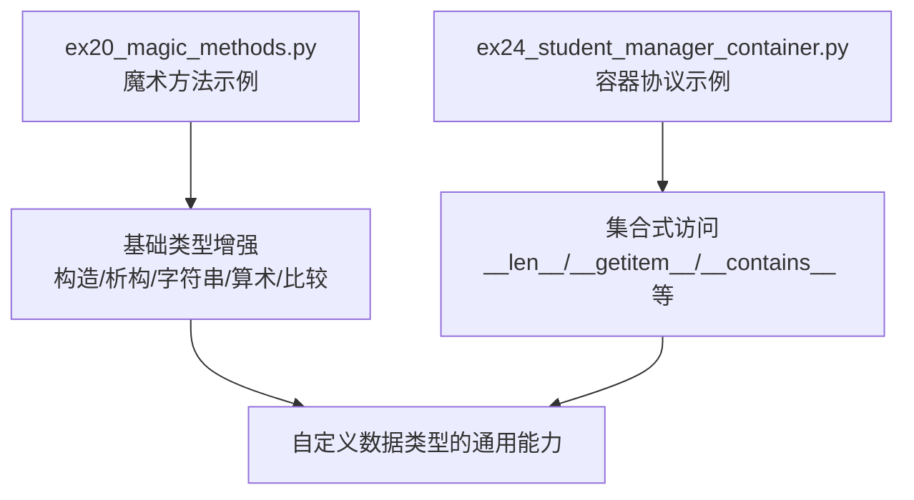
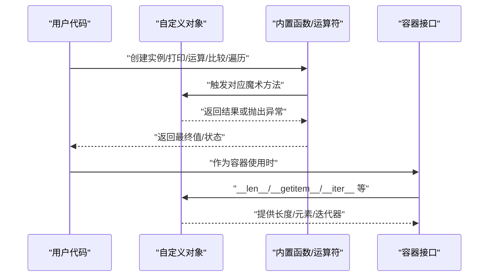

# 魔术方法与特殊方法

<cite>
**本文引用的文件**   
- [ex20_magic_methods.py](file://ex20_magic_methods.py)
- [ex24_student_manager_container.py](file://ex24_student_manager_container.py)
</cite>

## 目录
1. [简介](#简介)
2. [项目结构](#项目结构)
3. [核心组件](#核心组件)
4. [架构总览](#架构总览)
5. [详细组件分析](#详细组件分析)
6. [依赖关系分析](#依赖关系分析)
7. [性能考量](#性能考量)
8. [故障排查指南](#故障排查指南)
9. [结论](#结论)
10. [附录](#附录)

## 简介
本技术文档围绕Python的魔术方法（Special Methods，亦称“双下划线方法”）展开，系统阐述其概念、命名约定与调用时机，并结合仓库中的示例代码，深入讲解构造/析构、字符串表示、算术运算、比较、容器协议、迭代器协议以及上下文管理器协议的实现要点。通过逐步递进的说明与图示，帮助读者掌握如何基于魔术方法构建自定义数据类型与领域模型，并在框架开发中发挥关键作用。

## 项目结构
本项目包含多个练习脚本，其中与魔术方法直接相关的核心文件如下：
- ex20_magic_methods.py：演示常用魔术方法的用法与行为，涵盖构造/析构、字符串表示、算术与比较等。
- ex24_student_manager_container.py：以学生管理场景为例，展示容器协议（如长度、索引访问、成员检测等）的实现方式。

图表来源
- [ex20_magic_methods.py](file://ex20_magic_methods.py)
- [ex24_student_manager_container.py](file://ex24_student_manager_container.py)

章节来源
- [ex20_magic_methods.py](file://ex20_magic_methods.py)
- [ex24_student_manager_container.py](file://ex24_student_manager_container.py)

## 核心组件
本节聚焦两类核心内容：
- 常用魔术方法族：构造/析构、字符串表示、算术运算、比较、容器协议等。
- 协议扩展：迭代器协议与上下文管理器协议在自定义类型中的应用。

章节来源
- [ex20_magic_methods.py](file://ex20_magic_methods.py)
- [ex24_student_manager_container.py](file://ex24_student_manager_container.py)

## 架构总览
下图从“对象生命周期与协议交互”的角度，概览魔术方法在典型使用路径中的参与点。

图表来源
- [ex20_magic_methods.py](file://ex20_magic_methods.py)
- [ex24_student_manager_container.py](file://ex24_student_manager_container.py)

## 详细组件分析

### 构造与析构
- __init__(self, ...)：对象初始化阶段被调用，用于设置初始状态。注意它不等同于构造函数，真正的构造发生在对象分配时，__init__仅负责初始化。
- __del__(self)：对象即将被销毁时调用，通常用于释放资源。由于垃圾回收时机不确定，不建议将关键清理逻辑放在此处，推荐使用显式的 close() 或上下文管理器。

实践建议
- 在 __init__ 中进行参数校验与默认值填充，确保对象处于一致状态。
- 若持有外部资源（文件句柄、网络连接），优先使用上下文管理器或显式关闭方法，而非依赖 __del__。

章节来源
- [ex20_magic_methods.py](file://ex20_magic_methods.py)

### 字符串表示
- __str__(self)：面向用户的友好字符串表示，常用于 print() 和 str()。
- __repr__(self)：面向开发与调试的“官方”字符串表示，理想情况下应能还原对象或至少提供明确信息，常用于 repr() 与交互式解释器输出。

返回值要求
- 两者都必须返回字符串；若未定义，Python会回退到默认实现。

章节来源
- [ex20_magic_methods.py](file://ex20_magic_methods.py)

### 算术运算
- 一元：__neg__, __pos__, __abs__ 等
- 二元：__add__, __sub__, __mul__, __truediv__, __floordiv__, __mod__, __pow__ 等
- 反运算：当左操作数不支持该运算且右操作数为自定义类型时，Python会尝试右操作数的 __radd__ 等方法。
- 就地运算：__iadd__, __isub__ 等，应在原地修改并返回 self。

返回值要求
- 算术方法应返回新对象或数值结果；就地运算返回 self 以支持链式赋值。

章节来源
- [ex20_magic_methods.py](file://ex20_magic_methods.py)

### 比较运算
- 基本比较：__eq__, __ne__, __lt__, __le__, __gt__, __ge__
- 等价性 vs 相等性：__hash__ 与 __eq__ 需保持一致（可哈希的对象必须实现稳定的 __hash__）。
- 排序辅助：__lt__ 等可用于 cmp_to_key 风格的排序；Python 3 更推荐只实现 __lt__ 并使用 functools.total_ordering 生成其余比较方法。

注意事项
- 避免在比较中抛出异常；对不可比较的类型应返回 NotImplemented 或进行类型检查后返回 False。

章节来源
- [ex20_magic_methods.py](file://ex20_magic_methods.py)

### 容器协议
- __len__(self)：返回容器长度，供 len() 使用。
- __getitem__(self, key)：支持下标访问与切片；键为整数或切片对象。
- __setitem__(self, key, value)：支持赋值访问。
- __delitem__(self, key)：支持删除元素。
- __contains__(self, item)：支持 in 操作符。
- __iter__(self)：返回迭代器，使对象可被 for 遍历。
- __reversed__(self)：可选，返回反向迭代器，供 reversed() 使用。

返回值要求
- __len__ 返回非负整数；__getitem__ 返回元素或切片结果；__iter__ 返回迭代器对象；__contains__ 返回布尔值。

章节来源
- [ex24_student_manager_container.py](file://ex24_student_manager_container.py)

### 迭代器协议
- __iter__(self)：返回迭代器对象（可以是自身）。
- __next__(self)：返回下一个元素，若无更多元素则抛出 StopIteration。

最佳实践
- 保持内部状态（如索引）与迭代过程一致，避免并发修改导致的不确定行为。
- 对于大型容器，考虑惰性求值以提升性能。

章节来源
- [ex24_student_manager_container.py](file://ex24_student_manager_container.py)

### 上下文管理器协议
- __enter__(self)：进入 with 块前执行，返回绑定到 as 子句的资源对象。
- __exit__(self, exc_type, exc_val, exc_tb)：退出 with 块时执行，负责清理；若返回 True 可抑制异常传播。

适用场景
- 资源获取与释放（文件、锁、连接）、事务提交/回滚、临时状态切换等。

章节来源
- [ex20_magic_methods.py](file://ex20_magic_methods.py)

### 属性访问与描述符
- __getattr__(self, name)：仅在普通属性查找失败时调用，适合动态属性或懒加载。
- __getattribute__(self, name)：所有属性访问都会经过此方法，谨慎使用以避免无限递归。
- __setattr__(self, name, value) / __delattr__(self, name)：拦截属性赋值与删除。
- 描述符协议：__get__, __set__, __delete__，用于实现属性级控制（如验证、计算属性）。

章节来源
- [ex20_magic_methods.py](file://ex20_magic_methods.py)

### 可调用对象
- __call__(self, *args, **kwargs)：使实例像函数一样被调用，适用于策略模式、回调封装、装饰器等。

章节来源
- [ex20_magic_methods.py](file://ex20_magic_methods.py)

### 类级别与元类相关
- __new__(cls, ...)：在 __init__ 之前创建实例，适合单例、不可变类型定制创建流程。
- __class_getitem__(cls, item)：支持类级别的泛型语法（如 MyType[int]）。
- __instancecheck__ / __subclasscheck__：配合元类或 ABC 使用，定制 isinstance/issubclass 的行为。

章节来源
- [ex20_magic_methods.py](file://ex20_magic_methods.py)

### 协程与异步
- __await__：使对象成为可等待对象，便于在 async/await 中使用。

章节来源
- [ex20_magic_methods.py](file://ex20_magic_methods.py)

### 数学与位运算
- 数学：__round__, __floor__, __ceil__, __trunc__ 等。
- 位运算：__and__, __or__, __xor__, __invert__, __lshift__, __rshift__。

章节来源
- [ex20_magic_methods.py](file://ex20_magic_methods.py)

### 序列与映射协议
- 序列：__contains__, __reversed__, 结合 __getitem__ 实现随机访问。
- 映射：__getitem__, __setitem__, __delitem__, __contains__, __len__ 使其具备 dict 风格行为。

章节来源
- [ex24_student_manager_container.py](file://ex24_student_manager_container.py)

### 错误处理与 NotImplemented
- 当某操作在当前类型上未实现或不支持时，返回 NotImplemented 让 Python 尝试其他路径（如反运算或类型转换）。
- 在比较与算术方法中合理使用 NotImplemented，有助于提升互操作性。

章节来源
- [ex20_magic_methods.py](file://ex20_magic_methods.py)

## 依赖关系分析
- ex20_magic_methods.py 主要演示各类魔术方法的使用，属于“能力层”，为自定义类型提供通用语义。
- ex24_student_manager_container.py 在此基础上组合多种协议，形成“容器型”业务对象，体现协议组合带来的表达能力。

图表来源
- [ex20_magic_methods.py](file://ex20_magic_methods.py)
- [ex24_student_manager_container.py](file://ex24_student_manager_container.py)

章节来源
- [ex20_magic_methods.py](file://ex20_magic_methods.py)
- [ex24_student_manager_container.py](file://ex24_student_manager_container.py)

## 性能考量
- 避免在高频路径中实现过于复杂的 __getattribute__ 或 __setattr__，以免引入额外开销。
- 容器的大规模遍历尽量使用惰性迭代，减少中间对象创建。
- 合理实现 __hash__ 与 __eq__，避免冲突过多影响集合性能。
- 就地运算（__iadd__ 等）返回 self 可减少不必要的对象复制。

## 故障排查指南
常见问题与定位思路
- 打印输出不符合预期：检查是否同时定义了 __str__ 与 __repr__，确认调用方使用的是 str() 还是 repr()。
- 比较行为异常：确认是否实现了必要的比较方法，并确保 __hash__ 与 __eq__ 的一致性。
- 容器访问报错：检查 __len__ 返回值是否为非负整数，__getitem__ 是否正确处理越界与切片。
- 迭代器失效：确认 __next__ 在耗尽时抛出 StopIteration，且 __iter__ 返回的是新的迭代器或自身。
- 上下文管理器未释放资源：检查 __exit__ 是否捕获并处理异常，必要时记录日志以便追踪。

章节来源
- [ex20_magic_methods.py](file://ex20_magic_methods.py)
- [ex24_student_manager_container.py](file://ex24_student_manager_container.py)

## 结论
魔术方法是Python赋予自定义类型的“超能力”。通过正确实现构造/析构、字符串表示、算术与比较、容器与迭代器协议、上下文管理等，可以构建出语义清晰、易用且高效的领域模型。在框架开发中，魔术方法更是实现插件化、DSL与领域语言的关键手段。建议在设计与实现过程中遵循最小惊讶原则，保证行为一致性与可组合性。

## 附录
- 参考示例路径
  - 魔术方法综合示例：[ex20_magic_methods.py](file://ex20_magic_methods.py)
  - 容器协议示例：[ex24_student_manager_container.py](file://ex24_student_manager_container.py)