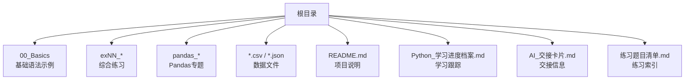
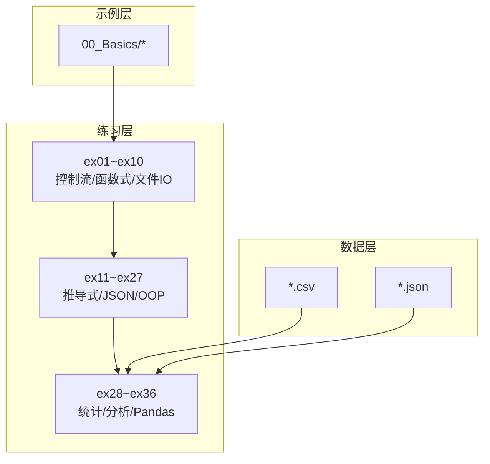
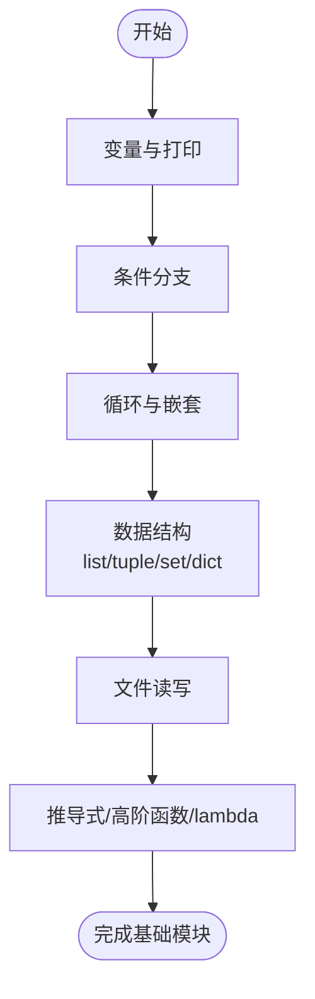
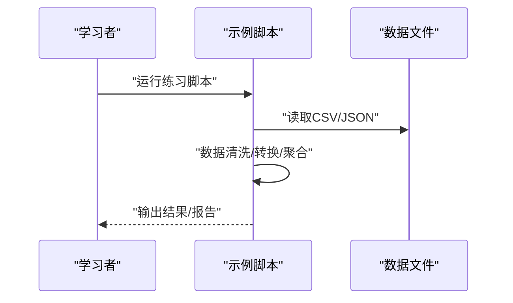
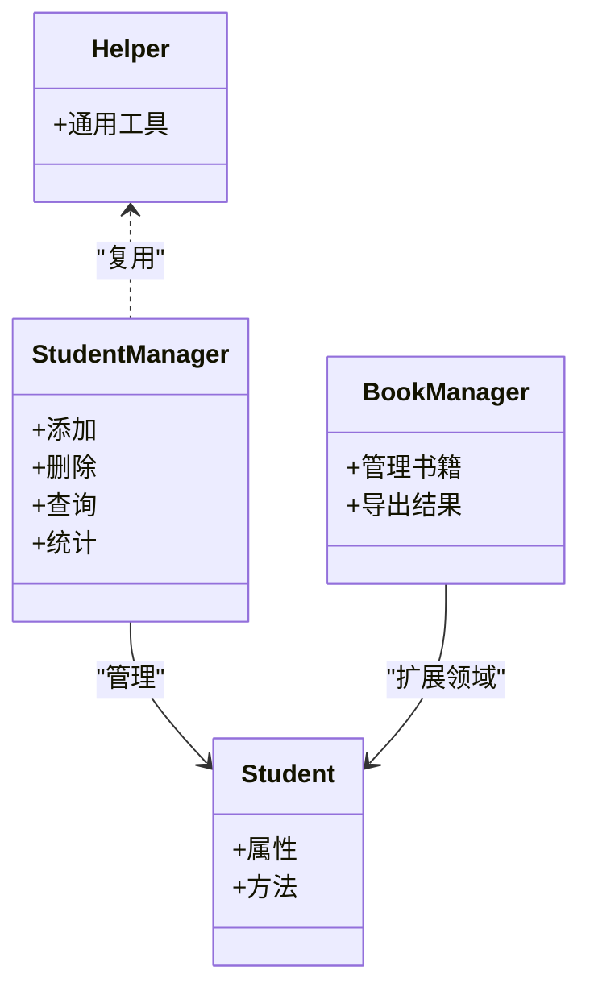
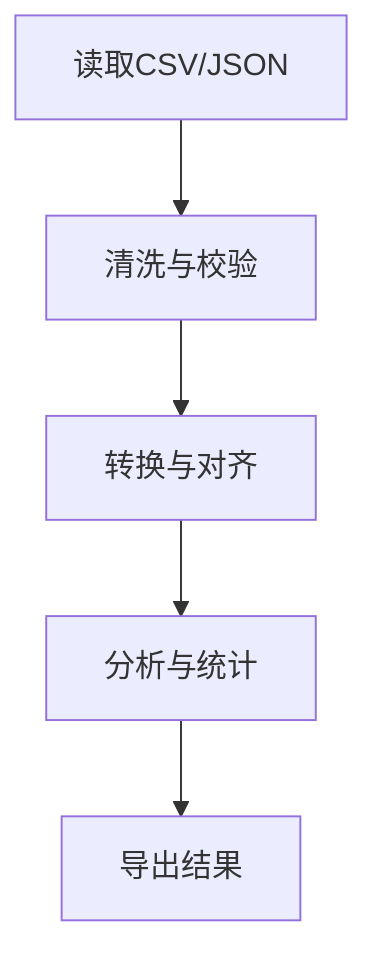
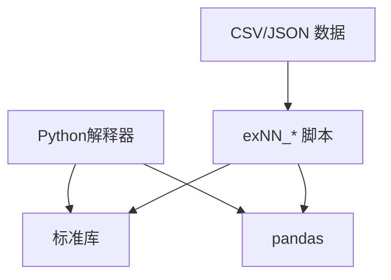

# 项目概述

<cite>
**本文引用的文件**   
- [README.md](file://README.md)
- [AI_交接卡片.md](file://AI_交接卡片.md)
- [Python_学习进度档案.md](file://Python_学习进度档案.md)
- [练习题目清单.md](file://练习题目清单.md)
- [00_Basics/01_print_vars.py](file://00_Basics/01_print_vars.py)
- [00_Basics/02_if_else.py](file://00_Basics/02_if_else.py)
- [00_Basics/03_for_range.py](file://00_Basics/03_for_range.py)
- [00_Basics/04_while_loop.py](file://00_Basics/04_while_loop.py)
- [00_Basics/05_nested_loop.py](file://00_Basics/05_nested_loop.py)
- [00_Basics/06_list_ops.py](file://00_Basics/06_list_ops.py)
- [00_Basics/07_tuple_set.py](file://00_Basics/07_tuple_set.py)
- [00_Basics/08_dict_basics.py](file://00_Basics/08_dict_basics.py)
- [00_Basics/09_nested_dict_access.py](file://00_Basics/09_nested_dict_access.py)
- [00_Basics/10_file_write_read.py](file://00_Basics/10_file_write_read.py)
- [00_Basics/11_list_comprehension.py](file://00_Basics/11_list_comprehension.py)
- [00_Basics/12_nested_list_dicts.py](file://00_Basics/12_nested_list_dicts.py)
- [00_Basics/14_list_map_filter.py](file://00_Basics/14_list_map_filter.py)
- [00_Basics/15_list_loop_modify.py](file://00_Basics/15_list_loop_modify.py)
- [00_Basics/16_lambda_demo.py](file://00_Basics/16_lambda_demo.py)
- [ex01_calc_safe.py](file://ex01_calc_safe.py)
- [ex02_grade_level.py](file://ex02_grade_level.py)
- [ex03_prime_tools.py](file://ex03_prime_tools.py)
- [ex04_cart_checkout.py](file://ex04_cart结账.py)
- [ex05_log_stats.py](file://ex05_log_stats.py)
- [ex06_student_scores.py](file://ex06_student_scores.py)
- [ex07_user_clean.py](file://ex07_user_clean.py)
- [ex08_log_file_analyzer.py](file://ex08_log_file_analyzer.py)
- [ex09_word_counter_advanced.py](file://ex09_word_counter_advanced.py)
- [ex10_filter_lambda.py](file://ex10_filter_lambda.py)
- [ex11_map_reduce.py](file://ex11_map_reduce.py)
- [ex11_sorted_lambda_reduce.py](file://ex11_sorted_lambda_reduce.py)
- [ex12_employee_csv.py](file://ex12_employee_csv.py)
- [ex13_csv_robust.py](file://ex13_csv_robust.py)
- [ex14_json_basics.py](file://ex14_json_basics.py)
- [ex15_student_scores.json](file://ex15_student_scores.json)
- [ex15_student_scores_pro.py](file://ex15_student_scores_pro.py)
- [ex16_list_comprehension.py](file://ex16_list_comprehension.py)
- [ex17_dict_comprehension.py](file://ex17_dict_comprehension.py)
- [ex18_data_cleaning_pipeline.py](file://ex18_data_cleaning_pipeline.py)
- [ex19_student_class.py](file://ex19_student_class.py)
- [ex20_magic_methods.py](file://ex20_magic_methods.py)
- [ex21_student_manager_oop.py](file://ex21_student_manager_oop.py)
- [ex22_understanding_self.py](file://ex22_understanding_self.py)
- [ex23_book_manager.py](file://ex23_book_manager.py)
- [ex24_student_manager_container.py](file://ex24_student_manager_container.py)
- [ex25_inheritance.py](file://ex25_inheritance.py)
- [ex27_file_io.py](file://ex27_file_io.py)
- [ex30_helper.py](file://ex30_helper.py)
- [ex30_main.py](file://ex30_main.py)
- [ex32_csv_stats.py](file://ex32_csv_stats.py)
- [ex33_csv_stats_export.py](file://ex33_csv_stats_export.py)
- [ex34_department_top_earner.py](file://ex34_department_top_earner.py)
- [ex35_fund_data_analysis.py](file://ex35_fund_data_analysis.py)
- [ex36_pandas_data_cleaning.py](file://ex36_pandas_data_cleaning.py)
- [pandas_1_read.py](file://pandas_1_read.py)
- [pandas_2_select_filter.py](file://pandas_2_select_filter.py)
- [pandas_4_groupby.py](file://pandas_4_groupby.py)
- [pandas_df_vs_series.py](file://pandas_df_vs_series.py)
- [pandas_dict_list_connection.py](file://pandas_dict_list_connection.py)
- [pandas_manual_create.py](file://pandas_manual_create.py)
- [pandas_why_flexible.py](file://pandas_why_flexible.py)
- [practice_csv_advanced.py](file://practice_csv_advanced.py)
- [practice_dict_grouping.py](file://practice_dict_grouping.py)
- [employees.csv](file://employees.csv)
- [department_stats.csv](file://department_stats.csv)
- [department_top_earners.csv](file://department_top_earners.csv)
- [high_salary.csv](file://high_salary.csv)
- [clean_employees.csv](file://clean_employees.csv)
- [orders.csv](file://orders.csv)
- [fund_info.csv](file://fund_info.csv)
- [fund_nav.csv](file://fund_nav.csv)
- [books.json](file://books.json)
- [books_updated.json](file://books_updated.json)
</cite>

## 目录
1. [简介](#简介)
2. [项目结构](#项目结构)
3. [核心组件](#核心组件)
4. [架构总览](#架构总览)
5. [详细组件分析](#详细组件分析)
6. [依赖分析](#依赖分析)
7. [性能考虑](#性能考虑)
8. [故障排查指南](#故障排查指南)
9. [结论](#结论)
10. [附录](#附录)

## 简介
本项目是一个面向初学者的Python系统学习仓库，围绕“从基础语法到数据分析”的渐进式路径组织内容。通过大量可运行的示例与练习题，帮助学习者逐步掌握：
- Python基础语法与控制流
- 常用数据结构（列表、元组、集合、字典）及其组合使用
- 函数式编程工具（map/filter/reduce、列表推导、lambda）
- 文件与数据格式处理（CSV、JSON）
- 面向对象编程（类、方法、继承、魔术方法、容器化）
- 数据处理与分析（Pandas入门与清洗流程）

学习目标
- 建立扎实的Python编程基础，形成良好的代码习惯
- 理解并熟练使用核心数据结构与算法思维
- 掌握常见I/O与数据格式读写能力
- 学会用面向对象思想组织代码
- 具备使用Pandas进行数据读取、筛选、分组与清洗的基本能力

适合人群
- 零基础或仅有其他语言基础的初学者
- 希望系统化补齐Python知识点的自学者
- 需要以实践为导向快速上手数据分析的学员

前置要求
- 能安装Python环境并运行脚本
- 了解命令行或IDE基本操作
- 可选：安装第三方库pandas用于数据分析模块

预期成果
- 能够独立编写结构化脚本完成数据处理任务
- 能设计简单的类与对象模型，实现数据管理功能
- 能使用Pandas完成常见的数据读取、过滤、聚合与导出

教学理念与实践导向
- 循序渐进：从打印变量、条件分支、循环，到推导式、高阶函数，再到OOP与数据分析
- 实战驱动：每个知识点配套可运行的示例与练习题，强调“做中学”
- 模块化组织：按主题划分目录，便于按需学习与复习
- 数据真实：提供CSV/JSON等真实数据集，贴近实际工作场景

[本节不直接分析具体源文件]

## 项目结构
仓库采用“主题+编号”的文件命名方式，便于定位与排序学习顺序。主要组织如下：
- 00_Basics：基础语法与核心概念的最小可运行示例
- exNN_*：按难度递增的综合练习，覆盖控制流、函数式编程、文件IO、OOP、数据分析等
- pandas_*：Pandas专题示例，涵盖读取、选择过滤、分组聚合、创建与概念说明
- CSV/JSON数据文件：作为练习的数据输入与输出样例
- README与进度档案：项目说明与学习跟踪

**图表来源**
- [README.md](file://README.md)
- [Python_学习进度档案.md](file://Python_学习进度档案.md)
- [AI_交接卡片.md](file://AI_交接卡片.md)
- [练习题目清单.md](file://练习题目清单.md)

**章节来源**
- [README.md](file://README.md)
- [Python_学习进度档案.md](file://Python_学习进度档案.md)
- [AI_交接卡片.md](file://AI_交接卡片.md)
- [练习题目清单.md](file://练习题目清单.md)

## 核心组件
本项目的核心由“基础示例—综合练习—数据分析”三大部分构成，层层递进：
- 基础示例（00_Basics）：聚焦最小可行示例，帮助快速理解语法点
- 综合练习（exNN_*）：将多个知识点融合，训练问题建模与工程化思维
- 数据分析（pandas_* + ex35/ex36）：引入Pandas，完成真实数据的清洗与分析

关键学习路径建议
- 第一阶段：00_Basics 全部示例，配合 ex01~ex10 巩固
- 第二阶段：ex11~ex27，强化函数式编程、文件IO与面向对象
- 第三阶段：ex28~ex36 与 pandas_*，进入数据处理与分析

**章节来源**
- [00_Basics/01_print_vars.py](file://00_Basics/01_print_vars.py)
- [00_Basics/02_if_else.py](file://00_Basics/02_if_else.py)
- [00_Basics/03_for_range.py](file://00_Basics/03_for_range.py)
- [00_Basics/04_while_loop.py](file://00_Basics/04_while_loop.py)
- [00_Basics/05_nested_loop.py](file://00_Basics/05_nested_loop.py)
- [00_Basics/06_list_ops.py](file://00_Basics/06_list_ops.py)
- [00_Basics/07_tuple_set.py](file://00_Basics/07_tuple_set.py)
- [00_Basics/08_dict_basics.py](file://00_Basics/08_dict_basics.py)
- [00_Basics/09_nested_dict_access.py](file://00_Basics/09_nested_dict_access.py)
- [00_Basics/10_file_write_read.py](file://00_Basics/10_file_write_read.py)
- [00_Basics/11_list_comprehension.py](file://00_Basics/11_list_comprehension.py)
- [00_Basics/12_nested_list_dicts.py](file://00_Basics/12_nested_list_dicts.py)
- [00_Basics/14_list_map_filter.py](file://00_Basics/14_list_map_filter.py)
- [00_Basics/15_list_loop_modify.py](file://00_Basics/15_list_loop_modify.py)
- [00_Basics/16_lambda_demo.py](file://00_Basics/16_lambda_demo.py)
- [ex01_calc_safe.py](file://ex01_calc_safe.py)
- [ex02_grade_level.py](file://ex02_grade_level.py)
- [ex03_prime_tools.py](file://ex03_prime_tools.py)
- [ex04_cart_checkout.py](file://ex04_cart结账.py)
- [ex05_log_stats.py](file://ex05_log_stats.py)
- [ex06_student_scores.py](file://ex06_student_scores.py)
- [ex07_user_clean.py](file://ex07_user_clean.py)
- [ex08_log_file_analyzer.py](file://ex08_log_file_analyzer.py)
- [ex09_word_counter_advanced.py](file://ex09_word_counter_advanced.py)
- [ex10_filter_lambda.py](file://ex10_filter_lambda.py)
- [ex11_map_reduce.py](file://ex11_map_reduce.py)
- [ex11_sorted_lambda_reduce.py](file://ex11_sorted_lambda_reduce.py)
- [ex12_employee_csv.py](file://ex12_employee_csv.py)
- [ex13_csv_robust.py](file://ex13_csv_robust.py)
- [ex14_json_basics.py](file://ex14_json_basics.py)
- [ex15_student_scores.json](file://ex15_student_scores.json)
- [ex15_student_scores_pro.py](file://ex15_student_scores_pro.py)
- [ex16_list_comprehension.py](file://ex16_list_comprehension.py)
- [ex17_dict_comprehension.py](file://ex17_dict_comprehension.py)
- [ex18_data_cleaning_pipeline.py](file://ex18_data_cleaning_pipeline.py)
- [ex19_student_class.py](file://ex19_student_class.py)
- [ex20_magic_methods.py](file://ex20_magic_methods.py)
- [ex21_student_manager_oop.py](file://ex21_student_manager_oop.py)
- [ex22_understanding_self.py](file://ex22_understanding_self.py)
- [ex23_book_manager.py](file://ex23_book_manager.py)
- [ex24_student_manager_container.py](file://ex24_student_manager_container.py)
- [ex25_inheritance.py](file://ex25_inheritance.py)
- [ex27_file_io.py](file://ex27_file_io.py)
- [ex30_helper.py](file://ex30_helper.py)
- [ex30_main.py](file://ex30_main.py)
- [ex32_csv_stats.py](file://ex32_csv_stats.py)
- [ex33_csv_stats_export.py](file://ex33_csv_stats_export.py)
- [ex34_department_top_earner.py](file://ex34_department_top_earner.py)
- [ex35_fund_data_analysis.py](file://ex35_fund_data_analysis.py)
- [ex36_pandas_data_cleaning.py](file://ex36_pandas_data_cleaning.py)
- [pandas_1_read.py](file://pandas_1_read.py)
- [pandas_2_select_filter.py](file://pandas_2_select_filter.py)
- [pandas_4_groupby.py](file://pandas_4_groupby.py)
- [pandas_df_vs_series.py](file://pandas_df_vs_series.py)
- [pandas_dict_list_connection.py](file://pandas_dict_list_connection.py)
- [pandas_manual_create.py](file://pandas_manual_create.py)
- [pandas_why_flexible.py](file://pandas_why_flexible.py)

## 架构总览
整体架构遵循“示例—练习—数据”三层结构：
- 示例层（00_Basics）：单点知识验证，便于快速试错
- 练习层（exNN_*）：多知识点融合，强调问题解决与工程化
- 数据层（CSV/JSON + pandas_*）：真实数据驱动的分析流程

**图表来源**
- [00_Basics/01_print_vars.py](file://00_Basics/01_print_vars.py)
- [ex01_calc_safe.py](file://ex01_calc_safe.py)
- [ex11_map_reduce.py](file://ex11_map_reduce.py)
- [ex19_student_class.py](file://ex19_student_class.py)
- [ex35_fund_data_analysis.py](file://ex35_fund_data_analysis.py)
- [ex36_pandas_data_cleaning.py](file://ex36_pandas_data_cleaning.py)
- [employees.csv](file://employees.csv)
- [books.json](file://books.json)

## 详细组件分析

### 基础语法与数据结构（00_Basics）
目标
- 掌握变量、打印、条件分支、循环、嵌套结构
- 熟练使用列表、元组、集合、字典及嵌套访问
- 初步接触文件读写、推导式、高阶函数与lambda

学习要点
- 控制流：if/else、for range、while、嵌套循环
- 数据结构：list/tuple/set/dict的基础操作与嵌套访问
- 函数式工具：map/filter/reduce、列表推导、lambda
- 文件IO：写入与读取文本/CSV/JSON

**图表来源**
- [00_Basics/01_print_vars.py](file://00_Basics/01_print_vars.py)
- [00_Basics/02_if_else.py](file://00_Basics/02_if_else.py)
- [00_Basics/03_for_range.py](file://00_Basics/03_for_range.py)
- [00_Basics/04_while_loop.py](file://00_Basics/04_while_loop.py)
- [00_Basics/05_nested_loop.py](file://00_Basics/05_nested_loop.py)
- [00_Basics/06_list_ops.py](file://00_Basics/06_list_ops.py)
- [00_Basics/07_tuple_set.py](file://00_Basics/07_tuple_set.py)
- [00_Basics/08_dict_basics.py](file://00_Basics/08_dict_basics.py)
- [00_Basics/09_nested_dict_access.py](file://00_Basics/09_nested_dict_access.py)
- [00_Basics/10_file_write_read.py](file://00_Basics/10_file_write_read.py)
- [00_Basics/11_list_comprehension.py](file://00_Basics/11_list_comprehension.py)
- [00_Basics/12_nested_list_dicts.py](file://00_Basics/12_nested_list_dicts.py)
- [00_Basics/14_list_map_filter.py](file://00_Basics/14_list_map_filter.py)
- [00_Basics/15_list_loop_modify.py](file://00_Basics/15_list_loop_modify.py)
- [00_Basics/16_lambda_demo.py](file://00_Basics/16_lambda_demo.py)

**章节来源**
- [00_Basics/01_print_vars.py](file://00_Basics/01_print_vars.py)
- [00_Basics/02_if_else.py](file://00_Basics/02_if_else.py)
- [00_Basics/03_for_range.py](file://00_Basics/03_for_range.py)
- [00_Basics/04_while_loop.py](file://00_Basics/04_while_loop.py)
- [00_Basics/05_nested_loop.py](file://00_Basics/05_nested_loop.py)
- [00_Basics/06_list_ops.py](file://00_Basics/06_list_ops.py)
- [00_Basics/07_tuple_set.py](file://00_Basics/07_tuple_set.py)
- [00_Basics/08_dict_basics.py](file://00_Basics/08_dict_basics.py)
- [00_Basics/09_nested_dict_access.py](file://00_Basics/09_nested_dict_access.py)
- [00_Basics/10_file_write_read.py](file://00_Basics/10_file_write_read.py)
- [00_Basics/11_list_comprehension.py](file://00_Basics/11_list_comprehension.py)
- [00_Basics/12_nested_list_dicts.py](file://00_Basics/12_nested_list_dicts.py)
- [00_Basics/14_list_map_filter.py](file://00_Basics/14_list_map_filter.py)
- [00_Basics/15_list_loop_modify.py](file://00_Basics/15_list_loop_modify.py)
- [00_Basics/16_lambda_demo.py](file://00_Basics/16_lambda_demo.py)

### 综合练习（exNN_*）
目标
- 将基础语法与数据结构应用于实际问题
- 熟悉函数式编程与文件处理
- 构建面向对象模型，封装业务逻辑

典型主题
- 安全计算、成绩分级、质数工具、购物车结算
- 日志统计、单词计数、用户数据清洗
- 员工CSV处理、JSON基础与进阶、数据清洗流水线
- 学生类、魔法方法、管理器、继承、文件IO

**图表来源**
- [ex01_calc_safe.py](file://ex01_calc_safe.py)
- [ex02_grade_level.py](file://ex02_grade_level.py)
- [ex03_prime_tools.py](file://ex03_prime_tools.py)
- [ex04_cart_checkout.py](file://ex04_cart结账.py)
- [ex05_log_stats.py](file://ex05_log_stats.py)
- [ex06_student_scores.py](file://ex06_student_scores.py)
- [ex07_user_clean.py](file://ex07_user_clean.py)
- [ex08_log_file_analyzer.py](file://ex08_log_file_analyzer.py)
- [ex09_word_counter_advanced.py](file://ex09_word_counter_advanced.py)
- [ex10_filter_lambda.py](file://ex10_filter_lambda.py)
- [ex11_map_reduce.py](file://ex11_map_reduce.py)
- [ex11_sorted_lambda_reduce.py](file://ex11_sorted_lambda_reduce.py)
- [ex12_employee_csv.py](file://ex12_employee_csv.py)
- [ex13_csv_robust.py](file://ex13_csv_robust.py)
- [ex14_json_basics.py](file://ex14_json_basics.py)
- [ex15_student_scores.json](file://ex15_student_scores.json)
- [ex15_student_scores_pro.py](file://ex15_student_scores_pro.py)
- [ex16_list_comprehension.py](file://ex16_list_comprehension.py)
- [ex17_dict_comprehension.py](file://ex17_dict_comprehension.py)
- [ex18_data_cleaning_pipeline.py](file://ex18_data_cleaning_pipeline.py)
- [ex19_student_class.py](file://ex19_student_class.py)
- [ex20_magic_methods.py](file://ex20_magic_methods.py)
- [ex21_student_manager_oop.py](file://ex21_student_manager_oop.py)
- [ex22_understanding_self.py](file://ex22_understanding_self.py)
- [ex23_book_manager.py](file://ex23_book_manager.py)
- [ex24_student_manager_container.py](file://ex24_student_manager_container.py)
- [ex25_inheritance.py](file://ex25_inheritance.py)
- [ex27_file_io.py](file://ex27_file_io.py)

**章节来源**
- [ex01_calc_safe.py](file://ex01_calc_safe.py)
- [ex02_grade_level.py](file://ex02_grade_level.py)
- [ex03_prime_tools.py](file://ex03_prime_tools.py)
- [ex04_cart_checkout.py](file://ex04_cart结账.py)
- [ex05_log_stats.py](file://ex05_log_stats.py)
- [ex06_student_scores.py](file://ex06_student_scores.py)
- [ex07_user_clean.py](file://ex07_user_clean.py)
- [ex08_log_file_analyzer.py](file://ex08_log_file_analyzer.py)
- [ex09_word_counter_advanced.py](file://ex09_word_counter_advanced.py)
- [ex10_filter_lambda.py](file://ex10_filter_lambda.py)
- [ex11_map_reduce.py](file://ex11_map_reduce.py)
- [ex11_sorted_lambda_reduce.py](file://ex11_sorted_lambda_reduce.py)
- [ex12_employee_csv.py](file://ex12_employee_csv.py)
- [ex13_csv_robust.py](file://ex13_csv_robust.py)
- [ex14_json_basics.py](file://ex14_json_basics.py)
- [ex15_student_scores.json](file://ex15_student_scores.json)
- [ex15_student_scores_pro.py](file://ex15_student_scores_pro.py)
- [ex16_list_comprehension.py](file://ex16_list_comprehension.py)
- [ex17_dict_comprehension.py](file://ex17_dict_comprehension.py)
- [ex18_data_cleaning_pipeline.py](file://ex18_data_cleaning_pipeline.py)
- [ex19_student_class.py](file://ex19_student_class.py)
- [ex20_magic_methods.py](file://ex20_magic_methods.py)
- [ex21_student_manager_oop.py](file://ex21_student_manager_oop.py)
- [ex22_understanding_self.py](file://ex22_understanding_self.py)
- [ex23_book_manager.py](file://ex23_book_manager.py)
- [ex24_student_manager_container.py](file://ex24_student_manager_container.py)
- [ex25_inheritance.py](file://ex25_inheritance.py)
- [ex27_file_io.py](file://ex27_file_io.py)

### 面向对象编程（ex19~ex25, ex27, ex30）
目标
- 理解类与方法、self语义、魔术方法
- 设计管理器类，封装增删改查与容器行为
- 运用继承与模块拆分提升可维护性

**图表来源**
- [ex19_student_class.py](file://ex19_student_class.py)
- [ex20_magic_methods.py](file://ex20_magic_methods.py)
- [ex21_student_manager_oop.py](file://ex21_student_manager_oop.py)
- [ex22_understanding_self.py](file://ex22_understanding_self.py)
- [ex23_book_manager.py](file://ex23_book_manager.py)
- [ex24_student_manager_container.py](file://ex24_student_manager_container.py)
- [ex25_inheritance.py](file://ex25_inheritance.py)
- [ex27_file_io.py](file://ex27_file_io.py)
- [ex30_helper.py](file://ex30_helper.py)
- [ex30_main.py](file://ex30_main.py)

**章节来源**
- [ex19_student_class.py](file://ex19_student_class.py)
- [ex20_magic_methods.py](file://ex20_magic_methods.py)
- [ex21_student_manager_oop.py](file://ex21_student_manager_oop.py)
- [ex22_understanding_self.py](file://ex22_understanding_self.py)
- [ex23_book_manager.py](file://ex23_book_manager.py)
- [ex24_student_manager_container.py](file://ex24_student_manager_container.py)
- [ex25_inheritance.py](file://ex25_inheritance.py)
- [ex27_file_io.py](file://ex27_file_io.py)
- [ex30_helper.py](file://ex30_helper.py)
- [ex30_main.py](file://ex30_main.py)

### 数据处理与分析（ex32~ex36, pandas_*）
目标
- 使用Pandas进行数据读取、选择过滤、分组聚合
- 完成数据清洗流水线与统计分析
- 结合CSV/JSON数据进行端到端分析

**图表来源**
- [ex32_csv_stats.py](file://ex32_csv_stats.py)
- [ex33_csv_stats_export.py](file://ex33_csv_stats_export.py)
- [ex34_department_top_earner.py](file://ex34_department_top_earner.py)
- [ex35_fund_data_analysis.py](file://ex35_fund_data_analysis.py)
- [ex36_pandas_data_cleaning.py](file://ex36_pandas_data_cleaning.py)
- [pandas_1_read.py](file://pandas_1_read.py)
- [pandas_2_select_filter.py](file://pandas_2_select_filter.py)
- [pandas_4_groupby.py](file://pandas_4_groupby.py)
- [pandas_df_vs_series.py](file://pandas_df_vs_series.py)
- [pandas_dict_list_connection.py](file://pandas_dict_list_connection.py)
- [pandas_manual_create.py](file://pandas_manual_create.py)
- [pandas_why_flexible.py](file://pandas_why_flexible.py)
- [employees.csv](file://employees.csv)
- [department_stats.csv](file://department_stats.csv)
- [department_top_earners.csv](file://department_top_earners.csv)
- [high_salary.csv](file://high_salary.csv)
- [clean_employees.csv](file://clean_employees.csv)
- [orders.csv](file://orders.csv)
- [fund_info.csv](file://fund_info.csv)
- [fund_nav.csv](file://fund_nav.csv)
- [books.json](file://books.json)
- [books_updated.json](file://books_updated.json)

**章节来源**
- [ex32_csv_stats.py](file://ex32_csv_stats.py)
- [ex33_csv_stats_export.py](file://ex33_csv_stats_export.py)
- [ex34_department_top_earner.py](file://ex34_department_top_earner.py)
- [ex35_fund_data_analysis.py](file://ex35_fund_data_analysis.py)
- [ex36_pandas_data_cleaning.py](file://ex36_pandas_data_cleaning.py)
- [pandas_1_read.py](file://pandas_1_read.py)
- [pandas_2_select_filter.py](file://pandas_2_select_filter.py)
- [pandas_4_groupby.py](file://pandas_4_groupby.py)
- [pandas_df_vs_series.py](file://pandas_df_vs_series.py)
- [pandas_dict_list_connection.py](file://pandas_dict_list_connection.py)
- [pandas_manual_create.py](file://pandas_manual_create.py)
- [pandas_why_flexible.py](file://pandas_why_flexible.py)
- [employees.csv](file://employees.csv)
- [department_stats.csv](file://department_stats.csv)
- [department_top_earners.csv](file://department_top_earners.csv)
- [high_salary.csv](file://high_salary.csv)
- [clean_employees.csv](file://clean_employees.csv)
- [orders.csv](file://orders.csv)
- [fund_info.csv](file://fund_info.csv)
- [fund_nav.csv](file://fund_nav.csv)
- [books.json](file://books.json)
- [books_updated.json](file://books_updated.json)

## 依赖分析
- 内置标准库：os、sys、csv、json、collections、itertools、functools等（在exNN_*与pandas_*中广泛使用）
- 第三方库：pandas（数据分析与清洗）
- 数据文件：CSV/JSON作为输入与输出载体

**图表来源**
- [ex36_pandas_data_cleaning.py](file://ex36_pandas_data_cleaning.py)
- [pandas_1_read.py](file://pandas_1_read.py)
- [ex12_employee_csv.py](file://ex12_employee_csv.py)
- [ex14_json_basics.py](file://ex14_json_basics.py)

**章节来源**
- [ex36_pandas_data_cleaning.py](file://ex36_pandas_data_cleaning.py)
- [pandas_1_read.py](file://pandas_1_read.py)
- [ex12_employee_csv.py](file://ex12_employee_csv.py)
- [ex14_json_basics.py](file://ex14_json_basics.py)

## 性能考虑
- 大数据集处理：优先使用Pandas向量化操作，避免逐行循环
- 内存占用：分块读取与增量聚合，减少一次性加载
- I/O优化：批量写入与压缩输出，降低磁盘压力
- 算法复杂度：合理选择数据结构（如dict哈希查找），避免不必要的嵌套遍历

[本节为通用指导，不直接分析具体源文件]

## 故障排查指南
常见问题与建议
- 文件路径错误：确认相对路径与工作目录一致；必要时使用绝对路径调试
- CSV编码问题：尝试指定encoding（如utf-8-sig）以兼容中文
- JSON解析异常：检查文件格式与键名一致性
- Pandas列名缺失：确保header正确，必要时手动设置列名
- 模块导入失败：检查当前目录与PYTHONPATH配置

参考文件
- [ex12_employee_csv.py](file://ex12_employee_csv.py)
- [ex13_csv_robust.py](file://ex13_csv_robust.py)
- [ex14_json_basics.py](file://ex14_json_basics.py)
- [ex15_student_scores_pro.py](file://ex15_student_scores_pro.py)
- [ex36_pandas_data_cleaning.py](file://ex36_pandas_data_cleaning.py)

**章节来源**
- [ex12_employee_csv.py](file://ex12_employee_csv.py)
- [ex13_csv_robust.py](file://ex13_csv_robust.py)
- [ex14_json_basics.py](file://ex14_json_basics.py)
- [ex15_student_scores_pro.py](file://ex15_student_scores_pro.py)
- [ex36_pandas_data_cleaning.py](file://ex36_pandas_data_cleaning.py)

## 结论
本项目以“示例—练习—数据”为主线，构建了从基础语法到数据分析的完整学习闭环。通过循序渐进的内容设计与丰富的实战素材，学习者可以高效地掌握Python核心能力，并具备解决实际问题的工程化思维。建议结合自身水平选择合适的起点，按照推荐路线逐步推进，并在练习中不断复盘与总结。

[本节为总结性内容，不直接分析具体源文件]

## 附录
- 学习路线图
  - 入门：00_Basics → ex01~ex10
  - 进阶：ex11~ex27（含OOP与文件IO）
  - 数据：ex32~ex36 + pandas_*
- 参考资料
  - [README.md](file://README.md)
  - [Python_学习进度档案.md](file://Python_学习进度档案.md)
  - [AI_交接卡片.md](file://AI_交接卡片.md)
  - [练习题目清单.md](file://练习题目清单.md)

[本节为补充信息，不直接分析具体源文件]